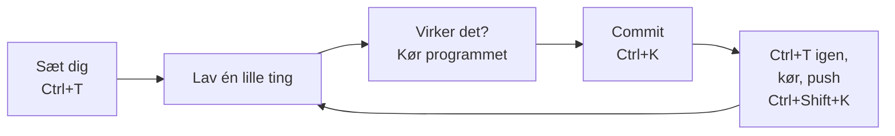

# 3. Gode vaner

[← Git i IntelliJ](README.md)

De fleste merge-konflikter skyldes ikke Git, men **måden, man arbejder på**. Med de her vaner får I
få konflikter – og de, I får, bliver små og nemme.

## Dagens rytme

1. **Når du sætter dig:** Update Project (<kbd>Ctrl</kbd>+<kbd>T</kbd>). Altid – også selvom du
   tror, ingen har pushet.
2. **Mens du arbejder:** commit, hver gang en lille ting virker.
3. **Før du pusher:** Update Project igen, kør programmet, *så* push.
4. **Før du går hjem:** commit og push. Kode, der kun ligger på din computer, kan de andre ikke
   bygge videre på – og den er væk, hvis computeren er det.

## De fem regler i gruppearbejde

Fra [Filmsamling](../../projekter/filmsamling/readme.md#gruppearbejde-og-git) – her med
begrundelserne:

| Regel | Hvorfor |
| --- | --- |
| **1. Pull, før I begynder** – hver gang. | Så bygger du videre på de andres kode i stedet for en gammel version. |
| **2. Én fil – én person ad gangen.** | Konflikter opstår kun, når to ændrer de samme linjer. Aftal, hvem der har hvilken klasse. |
| **3. Små commits**, der gør én ting. | En lille konflikt er nem at løse. En konflikt i 200 linjer er ikke. |
| **4. Push ofte** – mindst hver gang noget virker. | Jo længere tid mellem pull og push, jo mere kan de andre have ændret imens. |
| **5. Push aldrig kode, der ikke kompilerer.** | Resten af gruppen puller den – og så virker intet for nogen. |

## Flere gode vaner

* **Skriv gode commit-beskeder.** Sig, hvad commit'en gør: `Tilføj søgning på titel`. Ikke
  `fix`, `asdf` eller `ændringer`. Om en uge er historikken jeres eneste hukommelse.
* **Kig i commit-vinduet, før du committer.** Er der filer med, du ikke har rørt? Fjern
  fluebenet. Især `target/`, `out/` og `.idea/workspace.xml` skal aldrig med.
* **Formatér ikke hele filen**, som en anden arbejder i. <kbd>Ctrl</kbd>+<kbd>Alt</kbd>+<kbd>L</kbd>
  på en hel fil ændrer mange linjer på én gang – og giver konflikter med alle, der har rørt filen.
  Formatér kun din egen kode.
* **Sig til, før du omdøber eller flytter** en klasse eller fil. For Git ligner det, at filen er
  slettet og en ny er lavet.
* **Én person opretter projektet**, og de andre cloner det. Lav ikke hver jeres projekt og prøv at
  lægge dem sammen bagefter.
* **Tal sammen.** "Jeg går i gang med `Movie` nu" i gruppechatten sparer mange konflikter.
* **Stop, hvis du er i tvivl.** Klik hellere **Cancel** end en knap, du ikke forstår. Ingenting sker,
  før du selv trykker.

## Knapper, du ikke skal trykke på

| Knap | Hvorfor ikke |
| --- | --- |
| **Force Push** | Overskriver de andres commits på GitHub. Deres arbejde forsvinder. |
| **Rebase** (når IntelliJ spørger Merge/Rebase) | Ikke farlig i sig selv, men vi bruger **Merge** hele semesteret, så alle ser det samme. |
| **Reset Current Branch to Here…** | Kan smide commits væk. Brug den kun sammen med en underviser. |
| Slet mappen `.git` | Så er hele historikken væk. |

**Næste:** [4. Nødhjælp](noedhjaelp.md)
