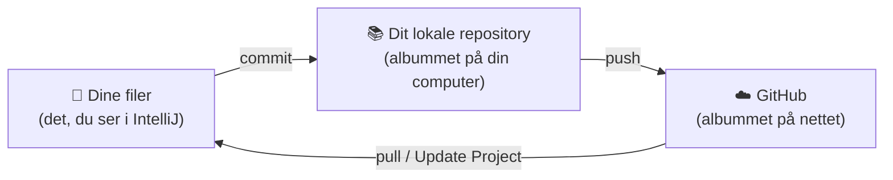
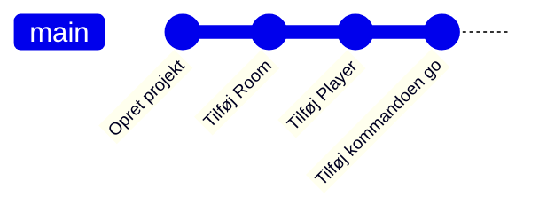
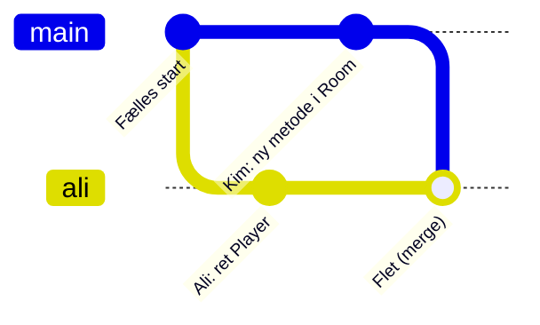

# 1. Hvad Git gør

[← Git i IntelliJ](README.md)

## Git er et fotoalbum over dit projekt

Hver gang du **committer**, tager Git et billede af hele projektmappen og lægger det i albummet.
Billedet får en besked ("Tilføj Room-klassen"), dit navn og tidspunktet. Du kan altid se de gamle
billeder igen og gå tilbage til dem.

Git gemmer **ikke** automatisk. Det, du ikke har committet, er kun gemt som almindelige filer på
din computer – præcis som før du kendte til Git.

## Tre steder, dine filer kan være

| Sted | Hvad er det? | Hvem kan se det? |
| --- | --- | --- |
| **Dine filer** | Mappen med dit projekt. Her skriver du kode. | Kun dig |
| **Dit lokale repository** | Albummet med alle commits. Ligger i en skjult mappe, `.git`, inde i projektet. | Kun dig |
| **GitHub** | En kopi af albummet på nettet. | Dig og dem, der har adgang |

De tre ord, du skal kunne:

* **commit** – tag et billede og læg det i *dit eget* album. Ingen andre kan se det endnu.
* **push** – send dine nye billeder op til GitHub.
* **pull** – hent de andres nye billeder ned fra GitHub og flet dem ind i dine filer. I IntelliJ
  hedder det **Update Project**.

Den mest almindelige misforståelse: *"Jeg har committet, så nu kan de andre se det."* Nej – først
når du har **pushet**.

**Git** er programmet på din computer. **GitHub** er en hjemmeside, der opbevarer repositories.
IntelliJ er bare knapper, der kalder Git for dig.

## Historikken er en kæde

Hver commit ved, hvilken commit der kom før. Derfor er historikken en kæde:

## Når to arbejder samtidig

Kim og Ali puller begge den samme commit. Kim tilføjer en metode i `Room`, Ali retter en metode i
`Player`. Kim pusher først. Når Ali vil pushe, siger GitHub nej: *der er en commit deroppe, som du
ikke har*. Ali skal først pulle Kims commit ned.

Så **fletter** Git de to ændringer sammen (på engelsk: *merge*). Kim ændrede i `Room`, Ali i `Player` –
de har rørt forskellige steder, så Git klarer det selv. Ali pusher, og alt er godt.

Ali har ikke lavet en branch – men så længe Alis commit kun ligger på Alis computer, er det i
praksis en lille sidevej, som flettes ind, når Ali puller.

## Hvad er en merge-konflikt?

Hvis Kim og Ali har ændret **de samme linjer** i den samme fil, kan Git ikke vide, hvem der har ret.
Så stopper Git og beder et menneske om at vælge. Det er en **merge-konflikt**.

En konflikt er **ikke en fejl**, og intet er gået i stykker. Git spørger bare. Du vælger den ene
version, den anden, eller skriver en blanding – og så committer og pusher du.

Jo **længere** tid der går mellem at pulle og pushe, og jo **flere** der arbejder i samme fil, jo
større er risikoen. Det er hele idéen bag [de gode vaner](gode-vaner.md).

## Ordliste

| Ord | Betyder |
| --- | --- |
| repository (repo) | Et projekt, som Git holder styr på – filerne plus hele historikken |
| commit | Et gemt billede af projektet, med en besked |
| push | Send dine commits til GitHub |
| pull | Hent andres commits fra GitHub og flet dem ind. I IntelliJ: **Update Project** |
| clone | Hent et repository fra GitHub ned på din computer første gang |
| merge | Flet to historikker sammen |
| konflikt | Git kan ikke flette selv, fordi de samme linjer er ændret to steder |
| branch | En sidevej i historikken. Vi arbejder på `main`, indtil vi lærer branches 19-11 |
| remote / origin | GitHub-kopien af jeres repository |
| `.gitignore` | En liste over filer, Git skal lade være med at gemme, fx `target/` |

**Næste:** [2. Git i IntelliJ – trin for trin](git-i-intellij.md)
