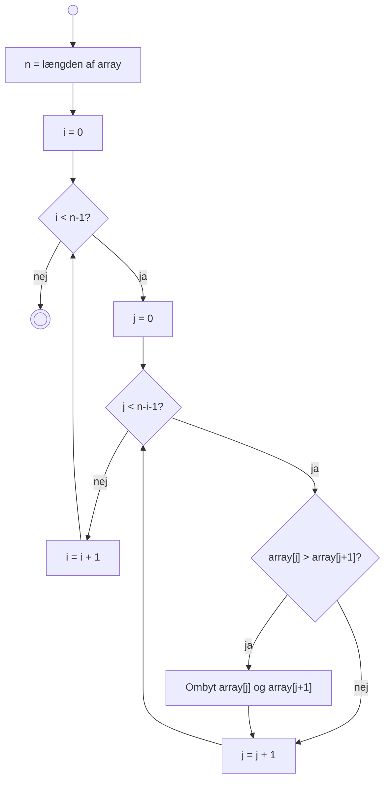

# Bubble Sort – Sorteringsalgoritme

## Hvad er Bubble Sort?

**Bubble Sort** er en enkel sorteringsalgoritme, der gentagne gange går gennem en liste, sammenligner naboer og bytter dem hvis de er i forkert rækkefølge. De større værdier "bobler" gradvist op til slutningen af listen.

Selvom algoritmen er let at forstå, er den ineffektiv for store lister, da tidskompleksiteten er **O(n²)**.

---

## Hvordan virker Bubble Sort?

### Trin-for-trin proces

```
Startliste: [5, 3, 8, 4, 2]

Pass 1 – Første gennemløb:
[5, 3, 8, 4, 2]  → sammenlign 5 og 3 → [3, 5, 8, 4, 2]  (3 < 5, ombyt)
[3, 5, 8, 4, 2]  → sammenlign 5 og 8 → [3, 5, 8, 4, 2]  (ok)
[3, 5, 8, 4, 2]  → sammenlign 8 og 4 → [3, 5, 4, 8, 2]  (4 < 8, ombyt)
[3, 5, 4, 8, 2]  → sammenlign 8 og 2 → [3, 5, 4, 2, 8]  (2 < 8, ombyt)
                                          ↑ 8 er nu på plads

Pass 2 – Anden gennemløb (uden sidste element):
[3, 5, 4, 2, 8]  → [3, 4, 5, 2, 8]  → [3, 4, 2, 5, 8]
                                          ↑ 5 er nu på plads

Pass 3 – Tredje gennemløb:
[3, 4, 2, 5, 8]  → [3, 2, 4, 5, 8]
                      ↑ 4 er nu på plads

Pass 4 – Sidste gennemløb:
[3, 2, 4, 5, 8]  → [2, 3, 4, 5, 8]  ✓ Færdig!
```

---

## Algoritmens struktur

### Pseudokode

```
BUBBLE_SORT(array):
  n = længden af array
  i = 0
  
  MENS i < n-1:
    j = 0
    MENS j < n-i-1:
      HVIS array[j] > array[j+1]:
        ombyt array[j] og array[j+1]
      j = j + 1
    i = i + 1
```

### Forklaring af loops

- **Ydre loop** (`i`): Går gennem hver pass. Vi behøver højst `n-1` passes for at sortere listen.
- **Indre loop** (`j`): Sammenligner naboer og ombytter dem. Efter hver pass placeres et element på sin rigtige position, så vi kan reducere område med `n-i`.

---

## Visualisering

### Diagram 1: Algoritmens logik (Flowchart)

Dette diagram viser hvordan bubble sort-algoritmen fungerer med dens indlejrede loops:



---

## Karakteristika

| Egenskab | Værdi |
|----------|-------|
| **Tidskompleksitet (dårligste)** | O(n²) |
| **Tidskompleksitet (bedste)** | O(n) |
| **Tidskompleksitet (gennemsnit)** | O(n²) |
| **Rumkompleksitet** | O(1) |
| **Stabil?** | Ja ✓ |
| **In-place?** | Ja ✓ |

### Hvad betyder det?

- **Stabil**: Hvis to elementer har samme værdi, forbliver deres oprindelige rækkefølge
- **In-place**: Algoritmen bruger kun konstant ekstra hukommelse (ikke afhængig af input-størrelse)

---

## Fordele og Ulemper

### ✅ Fordele
- Meget simpel at forstå og implementere
- Kræver ingen ekstra hukommelse (in-place)
- Egner sig godt til læring om algoritmer
- Fungerer med enhver type data (så længe der kan sammenlignes)

### ❌ Ulemper
- Meget langsom for store lister (O(n²))
- Ineffektiv sammenlignet med moderne sorteringsalgoritmer (QuickSort, MergeSort)
- Selv for næsten sorteret data er præstationen dårlig
- Praktisk set aldrig brugt i produktionskode

---

## Sammenligning med andre algoritmer

| Algoritme | Bedste | Gennemsnit | Dårligste | Rum | Stabil |
|-----------|--------|-----------|----------|-----|--------|
| **Bubble Sort** | O(n) | O(n²) | O(n²) | O(1) | Ja |
| Selection Sort | O(n²) | O(n²) | O(n²) | O(1) | Nej |
| Insertion Sort | O(n) | O(n²) | O(n²) | O(1) | Ja |
| Merge Sort | O(n log n) | O(n log n) | O(n log n) | O(n) | Ja |
| Quick Sort | O(n log n) | O(n log n) | O(n²) | O(log n) | Nej |

---

## Det vigtigste at tage med

1. **Bubble Sort** er en simpel, men ineffektiv sorteringsalgoritme
2. Den er **O(n²)** i værste tilfælde – ikke praktisk for store datasæt
3. Algoritmen er **stabil** og **in-place**
4. Den "bobler" større værdier til slutningen gennem gentagne sammenligninger
5. Den bruges primært til **undervisning** af algoritmekoncepeter
6. For produktion: Brug QuickSort, MergeSort eller andre moderne algoritmer

---

## Læs mere

- [Bubble Sort på Wikipedia](https://en.wikipedia.org/wiki/Bubble_sort)
- [Sorting Algorithms Visualizer](https://www.cs.usfca.edu/~galles/visualization/ComparisonSort.html)
- Bro Code Java kurset: Afsnit om sortering
