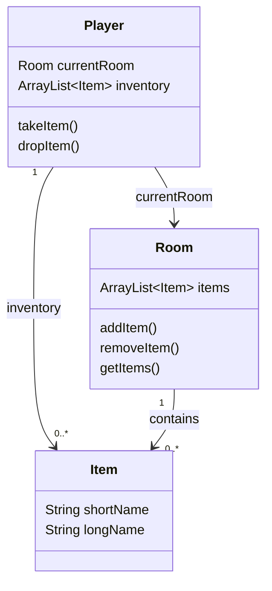
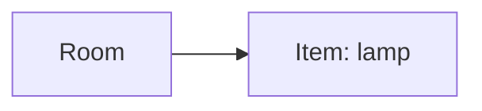
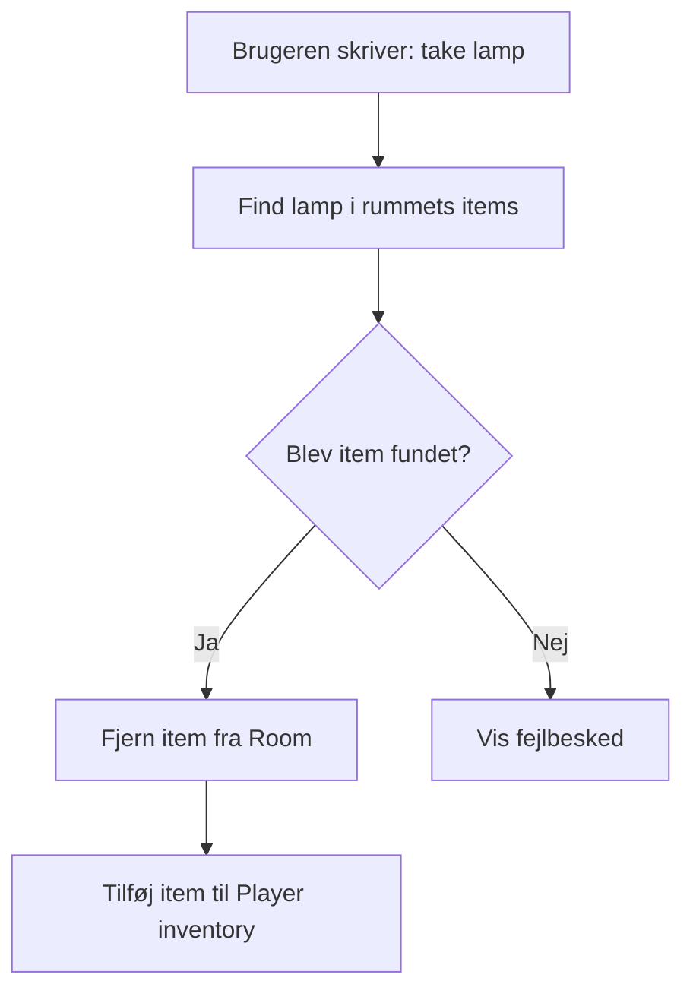
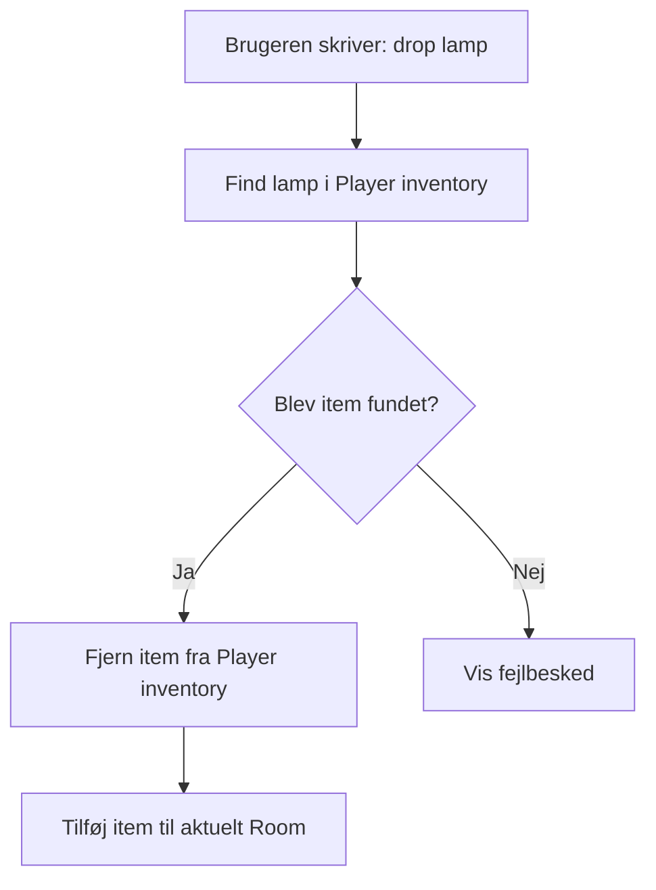

# Adventure del 2 – Items og inventory

I **Adventure del 1** byggede I grundstrukturen til jeres adventure-spil. Spilleren kunne bevæge sig rundt mellem rummene og undersøge den verden, I havde bygget.

Nu skal verden begynde at indeholde **ting**.

I denne del skal rummene kunne indeholde forskellige items, som spilleren kan samle op, bære rundt på og efterlade igen i et andet rum.

Start med det samme kort som i version 1. Når funktionaliteten virker, må I meget gerne udbygge spillet med nye rum, beskrivelser og interessante ting.

---

## Beskrivelse

Når denne del er færdig, skal spilleren kunne:

* se hvilke ting der ligger i et rum
* samle en bestemt ting op
* se hvilke ting spilleren bærer på
* efterlade en ting igen
* tage en ting med fra ét rum og lægge den i et andet

Samtidig skal programmet fortsat være opdelt i forskellige objekter med hvert deres ansvar.

## Læringsmål

Når du er færdig med denne dag, skal du kunne:

* bruge `ArrayList` til at holde en samling af objekter, der ændrer sig over tid
* tilføje og fjerne objekter fra en liste under kørsel
* skrive en søgemetode, der løber en liste igennem og finder et objekt ud fra en egenskab
* returnere `null` som "ikke fundet", og håndtere det hos kalderen
* flytte det samme objekt fra én samling til en anden uden at kopiere det

---
## Se disse videoer før undervisningen:

[Java Tutorial for Beginners - Object References](https://www.youtube.com/watch?v=ohCwnRScKU8)

## Læs nedenstående før undervisningen

**[del 2 – Items](../../projekter/adventure/del-2-items.md)**, inden du møder op. Du skal kende
opgaven, når vi starter.

Derudover: læs afsnittet nedenfor. Det er en uddybning af opgavebeskrivelsen med fokus på,
hvordan det samme `Item`-objekt flyttes mellem to `ArrayList`s. Genopfrisk evt.
[ArrayList-noterne fra 16-09](../../38/03_ons_2026-09-16/README.md) (`add`, `remove`, søgning
blandt objekter).

---

# Krav til spillet

## Items i rummene

Hvert `Room` skal kunne indeholde **0 eller flere items**.

Et rum kunne eksempelvis indeholde:

```text
Room: The old library

Dust covers the shelves and the smell of old books fills the room.

Items:
- a dusty old book
- a shiny brass lamp
```

> Formatet på udskrifterne er op til jer i gruppen – eksemplerne her og i opgaven er forslag.

Spilleren skal kunne samle disse ting op enkeltvis.

Når spilleren tager et item, skal det:

1. fjernes fra rummets liste af items
2. tilføjes til spillerens inventory

Hvis spilleren senere dropper det, sker det modsatte.

---

# Nye kommandoer

Brugerfladen skal udvides med tre nye kommandoer.

## `inventory`

Viser de ting spilleren bærer rundt på.

Eksempel:

```text
> inventory

You are carrying:
- a shiny brass lamp
- an old rusty key
```

Hvis spilleren ikke har noget:

```text
> inventory

Your inventory is empty.
```

I må gerne understøtte forkortelser som:

```text
inv
invent
```

Det er dog ikke et krav.

---

## `take`

Kommandoen efterfølges af navnet på den ting, spilleren ønsker at samle op.

Eksempel:

```text
> take lamp
```

Hvis der ligger en lampe i rummet, flyttes den fra rummets liste til spillerens inventory.

Efterfølgende skal:

```text
> inventory
```

for eksempel kunne vise:

```text
You are carrying:
- a shiny brass lamp
```

Hvis spilleren forsøger at tage noget, der ikke findes i rummet:

```text
> take sword
```

skal spillet eksempelvis svare:

```text
There is nothing like sword to take around here
```

---

## `drop`

Kommandoen efterfølges af navnet på den ting, spilleren ønsker at efterlade.

Eksempel:

```text
> drop lamp
```

Item'et fjernes nu fra spillerens inventory og placeres i det rum, spilleren befinder sig i.

Hvis spilleren forsøger at droppe noget, som ikke findes i spillerens inventory:

```text
> drop sword
```

skal spillet eksempelvis svare:

```text
You don't have anything like sword in your inventory
```

---

# Vis items i rummet

Når beskrivelsen af et rum vises, skal spillet også vise de items, der ligger i rummet.

Eksempel:

```text
The old library

Dust covers the shelves.

Items:
- a dusty old book
- a shiny brass lamp
```

Når spilleren skriver:

```text
take lamp
```

skal lampen ikke længere vises i rummet.

Hvis spilleren bevæger sig til et andet rum og skriver:

```text
drop lamp
```

skal lampen fremover ligge i **det nye rum**.

---

# Koden

Det er vigtigt, at I bygger videre på den objektorienterede struktur fra **[Adventure del 1 – refactor](../../projekter/adventure/del-1-refactor.md)**.

Programmet må derfor **ikke** implementeres som én stor `Main`-klasse.

I skal som minimum arbejde med:

```text
Room
Player
Item
```

samt de øvrige klasser, I allerede har fra del 1.

---

# Overblik over klasserne

Den nye struktur kan illustreres sådan:



Diagrammet viser blandt andet, at:

* `Player` kender det aktuelle `Room`
* `Player` har en liste af `Item`-objekter
* `Room` har en liste af `Item`-objekter
* et `Item` skal kun ligge ét sted ad gangen – enten i et rum eller i spillerens
  inventory. Det sikrer diagrammet ikke; det er `takeItem`/`dropItem`, der skal sørge for at fjerne
  fra den ene liste og tilføje til den anden.

---

# Item-klassen

Lav en klasse:

```java
Item
```

Et item skal som minimum have:

```java
private String shortName;
private String longName;
```

Eksempel:

```java
Item lamp = new Item(
        "lamp",
        "a shiny brass lamp"
);
```

Det korte navn bruges, når brugeren skriver kommandoer:

```text
take lamp
```

Det lange navn bruges, når spillet beskriver item'et:

```text
a shiny brass lamp
```

Det gør brugerfladen lettere at bruge. Spilleren behøver altså ikke skrive:

```text
take a shiny brass lamp
```

---

# Room og items

`Room` skal have en `ArrayList` med de items, der aktuelt ligger i rummet.

For eksempel:

```java
private ArrayList<Item> items;
```

`Room` skal have metoder, der gør det muligt at:

* tilføje et item
* fjerne et item
* hente listen af items

Metoderne kunne eksempelvis hedde:

```java
addItem(...)
removeItem(...)
getItems()
```

I bestemmer selv de præcise metodenavne.

---

# Player og inventory

`Player` skal tilsvarende have en `ArrayList<Item>`.

Denne liste repræsenterer spillerens **inventory**.

For eksempel:

```java
private ArrayList<Item> inventory;
```

`Player` skal derfor kunne:

* tilføje items til inventory
* fjerne items fra inventory
* returnere hele inventory-listen

---

# Det samme objekt flytter sig

Når spilleren samler en ting op, skal I **ikke oprette et nyt Item-objekt**.

Hvis en lampe ligger i et rum, har rummets liste en reference til lampe-objektet.

Før spilleren tager lampen:



Når spilleren skriver:

```text
take lamp
```

fjernes referencen fra rummets liste og tilføjes til spillerens inventory:


Der bliver altså ikke lavet en ny lampe.

Det er **det samme Item-objekt**, der flyttes fra én `ArrayList` til en anden.

Man kan tænke det sådan:

```text
FØR:

Room.items
    |
    +----> lamp


EFTER:

Player.inventory
    |
    +----> lamp
```

---

# `findItem`

Når brugeren skriver:

```text
take lamp
```

har programmet kun teksten:

```text
"lamp"
```

Programmet skal derfor finde det rigtige `Item`-objekt.

I får brug for en metode, der kan søge efter et item ud fra dets korte navn.

Metoden kan eksempelvis hedde:

```java
findItem(...)
```

Den skal:

1. modtage et kort navn, f.eks. `"lamp"`
2. gennemløbe en liste af `Item`-objekter
3. sammenligne navnet med hvert items `shortName`
4. returnere det `Item`, der matcher
5. returnere `null`, hvis der ikke findes et match

Eksempel:

```text
"lamp"
   |
   v
findItem(...)
   |
   +--> book
   |
   +--> key
   |
   +--> lamp  <-- match
          |
          v
      Item-objekt
```

Når I kalder metoden, skal I derfor huske at kontrollere, om resultatet er `null`.

---

# `takeItem`

`Player` skal have en metode, der kan udføre handlingen:

```java
takeItem(...)
```

Når brugeren eksempelvis skriver:

```text
take lamp
```

skal programmet:



Det betyder altså, at et item flyttes sådan:

```text
Room.items
     |
     | remove
     v
   Item
     |
     | add
     v
Player.inventory
```

Hvis `findItem` returnerer `null`, findes det ønskede item ikke i rummet.

---

# `dropItem`

`Player` skal også have en metode:

```java
dropItem(...)
```

Når brugeren eksempelvis skriver:

```text
drop lamp
```

skal programmet:



Et item flyttes altså den modsatte vej:

```text
Player.inventory
     |
     | remove
     v
   Item
     |
     | add
     v
Room.items
```

Husk, at `Player` allerede kender det rum, spilleren befinder sig i.

Det betyder, at `Player` selv kan finde det aktuelle rum, når et item skal tages eller droppes.

---

# Ansvarsfordeling

Tænk over **hvilket objekt der bør have ansvaret for hvad**.

En mulig fordeling er:

| Klasse       | Ansvar                                               |
| ------------ | ---------------------------------------------------- |
| `Item`       | Kender sit korte og lange navn                       |
| `Room`       | Kender sine naboer og de items, der ligger i rummet  |
| `Player`     | Kender det aktuelle rum og de items, spilleren bærer |
| Brugerfladen | Læser kommandoer og viser resultatet til brugeren    |

Prøv så vidt muligt at undgå, at brugerfladen selv begynder at flytte rundt på items i forskellige `ArrayList`s.

Når brugeren skriver:

```text
take lamp
```

bør brugerfladen fortælle `Player`, hvad spilleren ønsker at gøre, mens `Player` udfører handlingen.

---

# Forslag til arbejdsgang

Implementér ikke det hele på én gang.

## 1. Lav `Item`

Opret `Item`-klassen og lav et par objekter:

```java
Item lamp = new Item("lamp", "a shiny brass lamp");
Item key = new Item("key", "an old rusty key");
```

Kontrollér, at I kan udskrive deres navne.

---

## 2. Giv et Room items

Tilføj en:

```java
ArrayList<Item>
```

til `Room`.

Placér for eksempel lampen i ét af rummene.

Kontrollér, at I kan vise:

```text
Items:
- a shiny brass lamp
```

---

## 3. Lav `findItem`

Få først metoden til at kunne finde:

```text
lamp
```

i en liste med forskellige items.

Test også, hvad der sker, hvis I leder efter:

```text
sword
```

som ikke findes.

---

## 4. Lav inventory

Tilføj en:

```java
ArrayList<Item>
```

til `Player`.

Få kommandoen:

```text
inventory
```

til at vise indholdet.

---

## 5. Implementér `take`

Få:

```text
take lamp
```

til at:

* finde lampen
* fjerne den fra rummet
* lægge den i spillerens inventory

Kontrollér bagefter både rummet og inventory.

---

## 6. Implementér `drop`

Få:

```text
drop lamp
```

til at flytte lampen tilbage til det aktuelle rum.

---

## 7. Prøv at flytte et item mellem rum

Når ovenstående virker:

1. tag lampen i rum A
2. gå til rum B
3. drop lampen
4. gå væk
5. kom tilbage til rum B

Lampen skal stadig ligge i rum B.

Hvis det virker, har I fået jeres objekter til at udgøre en lille dynamisk verden.

---

# Når I er færdige

Kontrollér som minimum følgende:

* [ ] Et rum kan indeholde flere `Item`-objekter
* [ ] Items i det aktuelle rum vises sammen med rummets beskrivelse
* [ ] `inventory` viser spillerens items
* [ ] `take lamp` kan samle en lampe op
* [ ] Et item forsvinder fra rummet, når det samles op
* [ ] `drop lamp` kan efterlade lampen igen
* [ ] Et droppet item bliver liggende i det nye rum
* [ ] Programmet håndterer forsøg på at tage et item, der ikke findes
* [ ] Programmet håndterer forsøg på at droppe et item, spilleren ikke har
* [ ] `Item` har både et kort og et langt navn
* [ ] `Player` har sit eget inventory
* [ ] Både `Room` og `Player` benytter `ArrayList<Item>`
* [ ] `Player` har funktionalitet til `takeItem` og `dropItem`
* [ ] I har en `findItem`-metode, der kan finde et item ud fra det korte navn

---

# Hvis I bliver hurtigt færdige

Når alle krav ovenfor virker, kan I udvide spillet.

Eksempelvis:

* lav flere items
* lav nye rum
* lav skjulte eller interessante forbindelser mellem rummene
* lav mere detaljerede beskrivelser
* understøt flere måder at skrive kommandoerne på
* gør søgning efter items uafhængig af store og små bogstaver

Men få **først basisfunktionaliteten til at virke**.

## Aktiviteter i undervisningen

Arbejd med [Adventure del 2 – Items](../../projekter/adventure/del-2-items.md).

Følg [arbejdsgangen ovenfor](#forslag-til-arbejdsgang) – den svarer til den
[anbefalede procedure](../../projekter/adventure/del-2-items.md#anbefalet-procedure) i
opgavebeskrivelsen, blot opdelt i mindre skridt.


**Deadline for del 2: tirsdag 29-09 kl. 23:59.** I morgen reviewer og refaktorerer vi del 2 –
se [Adventure del 2 – Review / refaktorering](../02_tir_2026-09-29/README.md).
