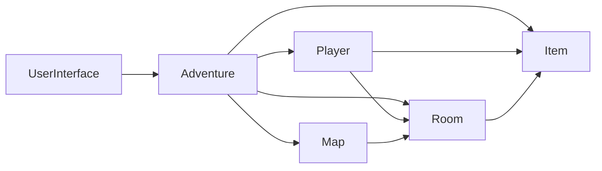
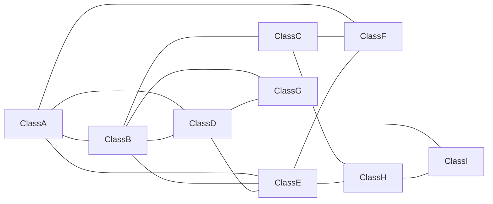
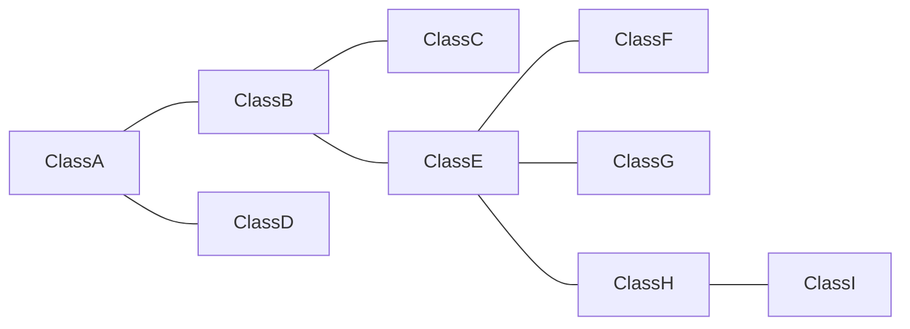
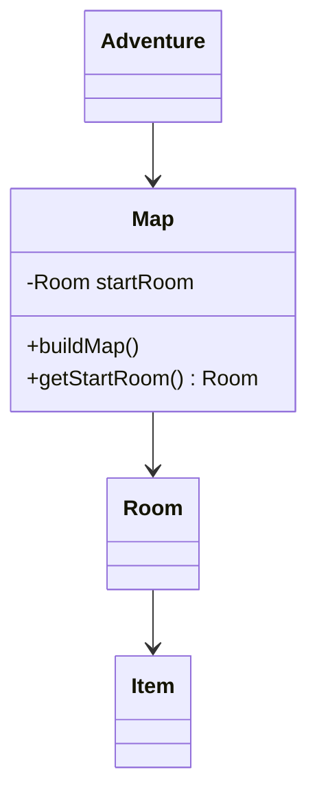
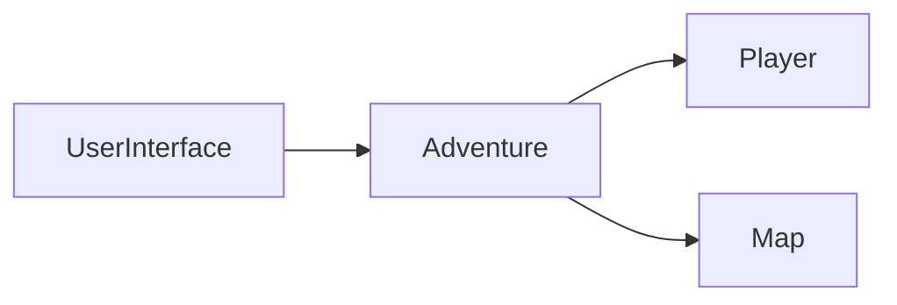
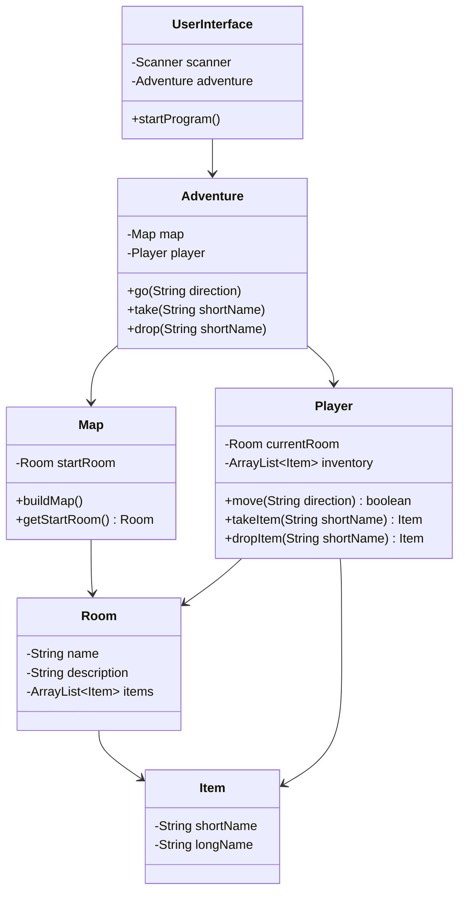
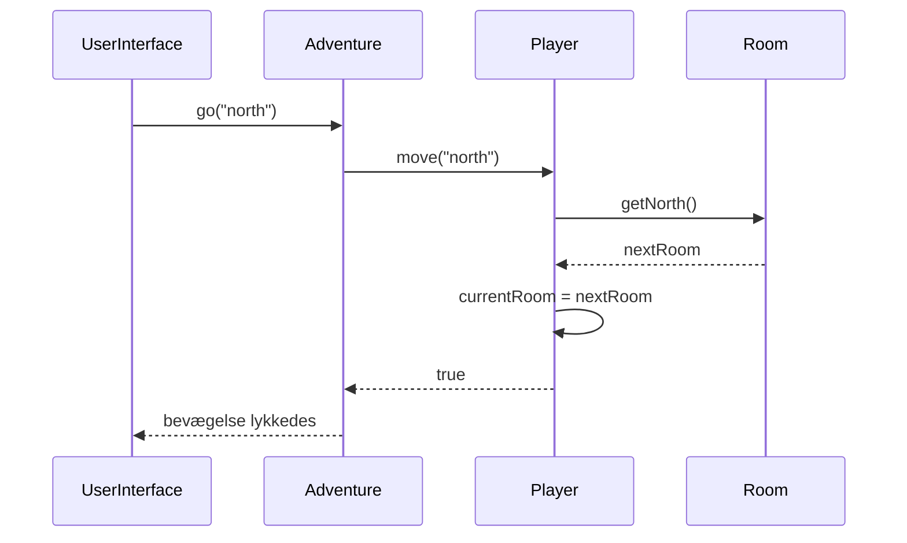
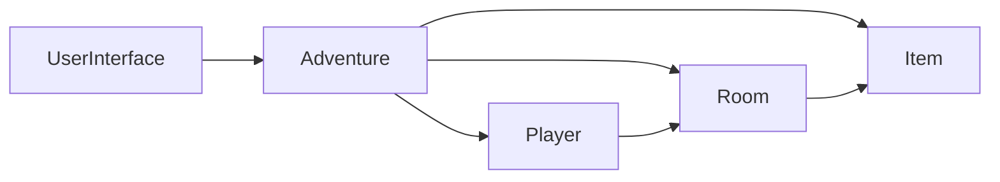
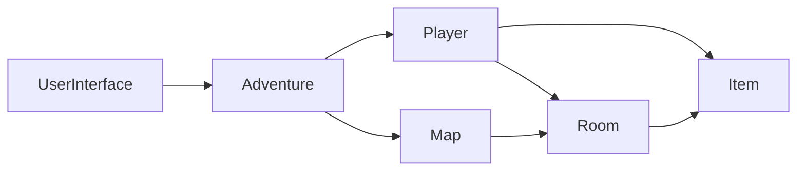

# Adventure del 2 – Review / refaktorering

I Adventure del 1 og 2 har I gradvist udbygget jeres spil med rum, navigation og items.

Når et program vokser, sker der ofte det, at klasser får flere og flere opgaver, og at klasserne bliver mere afhængige af hinanden (tættere koblet). Programmet virker måske stadig, men det bliver vanskeligere at forstå, ændre og teste.

Inden vi bygger yderligere funktionalitet på Adventure-spillet, skal vi derfor rydde op i designet.

## Formål

I denne opgave skal I **reviewe og refaktorere** jeres Adventure-spil.

Refaktorering betyder, at man ændrer strukturen i eksisterende kode **uden at ændre programmets funktionalitet**.

Målet er at gøre jeres program:

* lettere at forstå
* lettere at ændre
* lettere at teste
* mindre afhængigt af den konkrete implementering af andre klasser

I skal især arbejde med følgende objektorienterede designprincipper:

* Single Responsibility
* Creator
* Controller
* Information Expert
* Law of Demeter
* Low Coupling
* High Cohesion

---

# 1. Review af jeres nuværende løsning

Inden I ændrer koden, skal I kigge på jeres løsning fra Adventure del 2.

Diskuter blandt andet:

* Hvilke klasser har vi?
* Hvilket ansvar har de enkelte klasser?
* Er der klasser, som har fået for mange forskellige opgaver?
* Er der klasser, som ved meget om andre klassers interne struktur?
* Er der funktionalitet, som ligger i den forkerte klasse?
* Er der klasser, der er afhængige af flere andre klasser end nødvendigt?

Lav gerne et klassediagram over jeres nuværende løsning.

Et eksempel på en løsning med meget kobling kunne se sådan ud:



Her kender `Adventure` mange forskellige klasser direkte. Det kan være et tegn på, at klassen har fået for meget ansvar.

---

# 2. Lav kobling og høj samhørighed

Et godt objektorienteret design er blandt andet kendetegnet ved:

* **lav kobling – low coupling**
* **høj samhørighed – high cohesion**

## Lav kobling

Kobling beskriver, hvor afhængige klasser er af hinanden.

En klasse bør være så uafhængig som muligt og kun kende de klasser, som er nødvendige for, at den kan udføre sit ansvar.

Ved høj kobling kender mange klasser hinanden:



En ændring i én klasse kan derfor påvirke mange andre klasser.

Ved lav kobling er relationerne mere begrænsede:



## Høj samhørighed

Samhørighed handler om, hvor godt en klasses data og metoder hænger sammen.

En klasse har høj samhørighed, når dens metoder arbejder med det samme overordnede ansvar.

Eksempelvis hænger følgende naturligt sammen i en `Player`:

```text
currentRoom
inventory
move()
takeItem()
dropItem()
```

Derimod ville denne metode være mistænkelig i `Player`:

```java
public void buildMap()
```

At bygge spillets kort har ikke noget med spillerens ansvar at gøre.

En god tommelfingerregel er derfor:

> Klasser bør gøre få ting, der hænger tæt sammen, og kende så få andre klasser som muligt.

---

# 3. Single Responsibility

**Single Responsibility Principle** siger, at en klasse bør have ét klart ansvarsområde.

Det betyder ikke, at en klasse kun må have én metode. Flere metoder kan sagtens høre sammen, hvis de understøtter det samme ansvar.

Overvej eksempelvis en `Adventure`-klasse, som:

* opretter alle rum
* forbinder rummene
* opretter alle items
* holder styr på spillerens aktuelle rum
* flytter spilleren
* tager items op
* efterlader items
* håndterer brugerinput

Sådan så mange løsninger ud **før del 1 – refactor**. Her har én klasse fået mange forskellige typer ansvar.

Det gør klassen vanskeligere at forstå og vanskeligere at ændre.

## Opgave

Undersøg jeres klasser og spørg:

> Hvad er denne klasses primære ansvar?

Hvis svaret bliver en lang liste med meget forskellige ting, bør noget af ansvaret måske flyttes til andre klasser.

---

# 4. Creator

**Creator-princippet** handler om, hvem der bør have ansvaret for at oprette objekter.

Som udgangspunkt giver det ofte mening, at et objekt oprettes af den klasse, som:

* indeholder objektet
* bruger objektet tæt
* eller har den nødvendige information til at konfigurere objektet

I Adventure-spillet er det en særlig opgave at:

* oprette alle rum
* forbinde rummene
* oprette items
* placere items i rummene

Det er derfor oplagt at samle denne opgave i en klasse, som repræsenterer spillets kort.

## Opgave

I lavede `Map` i del 1 – refactor. Kontrollér, at den stadig er det eneste sted, hvor spillets verden bygges – også efter del 2:

* Oprettes alle `Item`-objekter i `Map` (sammen med rummene), eller er de sneget sig ind i `Adventure` eller `UserInterface`?
* Placeres items i rummene i `Map.buildMap()`?

`Adventure` og `UserInterface` må ikke indeholde `new Room(...)` eller `new Item(...)`. Findes det, så flyt det til `Map`.

En mulig struktur er:



`Map` bliver altså ansvarlig for at bygge spillets kort.

---

# 5. Controller

Et program har ofte brug for et objekt, der modtager handlinger fra brugergrænsefladen og koordinerer de øvrige objekter.

Dette kaldes en **Controller**.

I Adventure-programmet er `Adventure` en oplagt controller.

Strukturen kan tænkes sådan:



`UserInterface` skal hovedsageligt stå for kommunikationen med brugeren:

* læse input
* vise tekst

`Adventure` skal koordinere spillet.

Det betyder også, at `UserInterface` ikke behøver kende alle spillets objekter.

## Opgave

Gennemgå jeres `UserInterface`.

Ideelt skal den kun have brug for ganske få objekter, eksempelvis:

```java
private Scanner scanner;
private Adventure adventure;
```

Undgå, at `UserInterface` direkte manipulerer `Room`, `Item`, `Map` osv.

`Adventure` bliver dermed brugergrænsefladens indgang til selve spillet.

---

# 6. Player efter del 2

I del 2 fik `Player` et inventory og metoderne `takeItem` og `dropItem`. Kontrollér nu, at alt det spillerrelaterede faktisk ligger i `Player`, og ikke i `Adventure` eller `UserInterface`:

* hvor befinder spilleren sig? (`currentRoom`)
* kan spilleren gå mod nord? (`move`)
* hvilke ting har spilleren? (`inventory`)
* kan spilleren tage et bestemt item? (`takeItem`)
* kan spilleren efterlade et item? (`dropItem`)

Typiske ting, der skal flyttes: `findItem`-løkken, hvis den ligger i `UserInterface`; kode i `Adventure`, der selv henter `getItems()` fra rummet og fjerner/tilføjer; `System.out.println` i `Player` eller `Room`.

En mulig struktur efter denne refaktorering kunne være:



Diagrammet er et **forslag til ansvarsfordeling**, ikke nødvendigvis en facitliste.

Jeres konkrete løsning kan godt se anderledes ud, hvis I kan argumentere for jeres design.

---

# 7. Information Expert

**Information Expert** siger:

> Et ansvar bør placeres hos det objekt, som har den nødvendige information til at udføre opgaven.

Hvis `Player` kender:

```java
private Room currentRoom;
```

så er `Player` også et naturligt sted at afgøre, om spilleren kan bevæge sig til et andet rum.

Man kunne lade `Adventure` spørge `Player`:

```java
Room room = player.getCurrentRoom();
```

og derefter lade `Adventure` undersøge rummets udgange og ændre spillerens aktuelle rum.

Men så begynder `Adventure` at arbejde med detaljer, som `Player` allerede har den nødvendige information til at håndtere.

Bed i stedet `Player` om at udføre opgaven:

```java
player.move("north");
```

`Player` ved selv, hvilket rum spilleren står i, og kan derfor afgøre, om flytningen er mulig.

Det kan illustreres sådan:



Bemærk, at `Adventure` ikke behøver vide, hvordan `Player` udfører bevægelsen.

## Opgave

Find steder i jeres program, hvor én klasse:

1. henter data fra et andet objekt
2. foretager en beslutning på baggrund af dataene
3. ændrer objektet bagefter

Overvej, om operationen i stedet bør være en metode på det objekt, som allerede har informationen.

---

# 8. Law of Demeter

**Law of Demeter** kan lidt forsimplet beskrives som:

> Tal med dine nærmeste venner – ikke med venners venner.

Kode som denne kan være et faresignal:

```java
adventure.getPlayer().getCurrentRoom().getItems().remove(item);
```

Her skal den klasse, som udfører kaldet, kende meget til strukturen inde i flere andre objekter.

Hvis strukturen senere ændres, kan mange steder i programmet skulle ændres.

Bed hellere det relevante objekt om at udføre operationen:

```java
adventure.take(itemName);
```

som eksempelvis kan delegere videre:

```java
player.takeItem(itemName);
```

Sammenlign disse to situationer:

### Meget kendskab til andre objekter



### Mere delegation



I den sidste løsning behøver `Adventure` ikke kende detaljerne i `Room` og `Item`.

## Opgave

Find lange kæder af metodekald i jeres program:

```java
a.getB().getC().doSomething();
```

Overvej, om det første objekt i stedet kan sende en besked til det objekt, det allerede kender.

---

# 9. Refaktorér jeres Adventure-spil

Refaktorér nu jeres program.

I bør som minimum arbejde med følgende:

## Map

`Map` har ansvar for:

* at oprette rummene
* at forbinde rummene
* at oprette items
* at placere items
* at returnere start-rummet

## Adventure

`Adventure` har ansvar for:

* at fungere som controller
* at koordinere spillet
* at være indgangen til spillet fra `UserInterface`

## Player

`Player` har ansvar for:

* spillerens aktuelle rum
* spillerens inventory
* at flytte mellem rum
* at tage items
* at efterlade items

## UserInterface

`UserInterface` har ansvar for:

* at læse input fra brugeren
* at vise information til brugeren

Forsøg at undgå, at `UserInterface` selv udfører spillets logik.

---

# 10. Test efter refaktoreringen

Refaktorering skal som udgangspunkt ikke ændre programmets funktionalitet.

Afprøv derfor spillet løbende.

Test både situationer, hvor en handling lykkes, og situationer, hvor den ikke kan gennemføres.

## Navigation

Test eksempelvis:

* spilleren kan gå mod nord, hvis der findes en nordlig udgang
* spillerens aktuelle rum ændres efter en gyldig bevægelse
* spilleren kan ikke gå mod nord, hvis der ikke findes en nordlig udgang
* spillerens aktuelle rum ændres ikke efter en ugyldig bevægelse

## Items

Test eksempelvis:

* spilleren kan tage et item, som findes i rummet
* item fjernes fra rummet
* item tilføjes til spillerens inventory
* spilleren kan ikke tage et item, som ikke findes i rummet
* spilleren kan efterlade et item fra sit inventory
* item fjernes fra inventory
* item placeres i det aktuelle rum
* spilleren kan ikke efterlade et item, som spilleren ikke har

Husk, at **negative tests** er mindst lige så vigtige som de positive.

---

# 11. Review efter refaktoreringen

Når I er færdige, skal I igen kigge på jeres design.

Diskuter følgende spørgsmål i gruppen:

1. Hvilket ansvar har `UserInterface`?
2. Hvilket ansvar har `Adventure`?
3. Hvilket ansvar har `Map`?
4. Hvilket ansvar har `Player`?
5. Hvilket ansvar har `Room`?
6. Hvor har I anvendt **Single Responsibility**?
7. Hvor har I anvendt **Creator**?
8. Hvor har I anvendt **Controller**?
9. Hvor har I anvendt **Information Expert**?
10. Kan I finde et eksempel på **Law of Demeter** i jeres løsning?
11. Hvordan har I reduceret koblingen mellem klasserne?
12. Har klasserne fået højere samhørighed?

Lav gerne et nyt klassediagram efter refaktoreringen og sammenlign det med jeres første diagram.

---

## Aktiviteter i undervisningen

1. **Aflever del 2 først.** Deadline er i dag kl. 23:59 – sørg for at have en fungerende version
   pushet og linket afleveret i itslearning, **inden** I begynder at rykke rundt i koden.
   Se [del 2 – Items](../../projekter/adventure/del-2-items.md).
2. Review af jeres nuværende løsning (afsnit 1) – tegn klassediagrammet.
3. Refaktorér (afsnit 9) og test løbende (afsnit 10).
4. Review efter refaktoreringen (afsnit 11).

**Deadline for del 2: i dag, tirsdag 29-09 kl. 23:59.** I morgen starter [del 3 – arv](../03_ons_2026-09-30/README.md).

---

# Når I er færdige

Programmet skal stadig kunne det samme som Adventure del 2.

Forskellen er, at koden nu gerne skulle være bedre organiseret.

Det er vigtigt, fordi Adventure-spillet senere skal udbygges yderligere.

Hvis fundamentet er dårligt, bliver hver ny ændring vanskeligere.

Hvis fundamentet er godt, bliver det langt lettere at bygge videre på programmet.
