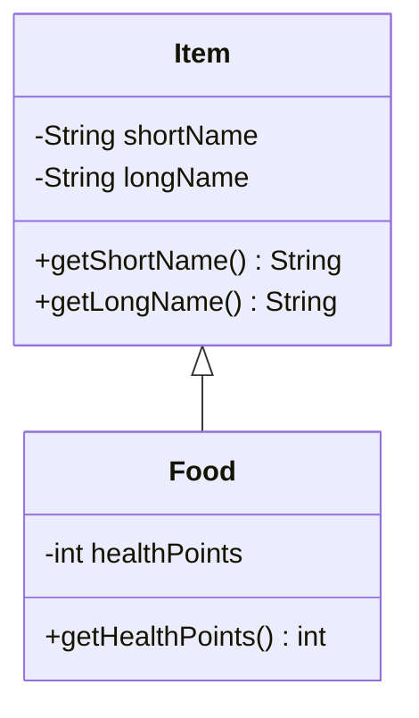
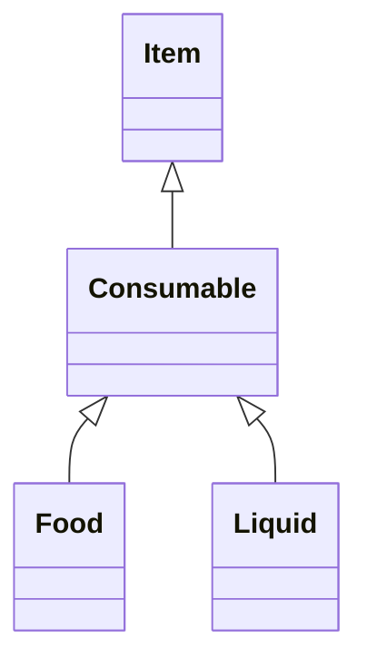

# Adventure del 3 – arv

## Beskrivelse

I dag lærer vi **arv** (*inheritance*) – en af de fire grundpiller i objektorienteret programmering.

Arv lader os sige, at én klasse **er en særlig slags** af en anden. En `Food` er et `Item` – bare
med den ekstra egenskab, at man kan spise det. Alt hvad et `Item` kan, kan en `Food` også: samles
op, bæres rundt, efterlades. Vi skal ikke skrive det igen.

Det er præcis dét, [Adventure del 3](../../projekter/adventure/del-3-food.md) beder om: mad, der
opfører sig som et helt almindeligt item – **uden at koden, der håndterer items, skal ændres det
mindste**.

## Læringsmål

Når du har arbejdet med dagens materiale, skal du kunne:

* forklare hvad arv er, og hvad en subklasse arver fra sin superklasse
* skrive `class Food extends Item`
* forklare **is-a**-relationen og kende forskel på den og **has-a**
* bruge `super(...)` til at kalde superklassens constructor
* bruge `super.metode()` til at kalde superklassens udgave af en metode
* **override** en metode, og bruge `@Override`
* forklare hvorfor en variabel af typen `Item` godt kan indeholde et `Food`-objekt
* tegne arv i et klassediagram med den åbne trekantpil
* forklare hvad `protected` betyder

## Se disse videoer før undervisningen:

* [inheritance](https://www.youtube.com/watch?v=xTtL8E4LzTQ&list=PLEeqf0uSZqXsz7oU2U-VAxhQZ021PRVnd&t=7h22m4s) (til: 07:31:09)
* [super](https://www.youtube.com/watch?v=xTtL8E4LzTQ&list=PLEeqf0uSZqXsz7oU2U-VAxhQZ021PRVnd&t=7h31m9s) (til: 07:41:37)
* [method overriding](https://www.youtube.com/watch?v=xTtL8E4LzTQ&list=PLEeqf0uSZqXsz7oU2U-VAxhQZ021PRVnd&t=7h41m37s) (til: 07:46:08)

## Læs nedenstående før undervisningen

---

### Problemet

Efter [del 2](../../projekter/adventure/del-2-items.md) har I en `Item`-klasse:

```java
public class Item {
    private String shortName;
    private String longName;

    public Item(String shortName, String longName) { ... }

    public String getShortName() { ... }
    public String getLongName() { ... }
}
```

Nu skal nogle items kunne **spises** og give health. Hvad gør vi?

**Mulighed 1: putte det ind i `Item`.**

```java
public class Item {
    private String longName;
    private int healthPoints;      // ← men lamper har ikke healthPoints
    private boolean isEdible;      // ← og nu skal alt tjekke denne
}
```

Nu har hver eneste ting i spillet felter, de fleste af dem ikke bruger. Og koden fyldes med
`if (item.isEdible())`. Når vi i næste uge tilføjer våben, kommer der endnu flere felter.

**Mulighed 2: en helt ny klasse `Food`, der ikke har noget med `Item` at gøre.**

Så skal `Room` have to lister – én til items og én til food. Og `Player` også. Og `take`-kommandoen
skal lede begge steder. Og `drop`. Alt bliver dobbelt.

**Mulighed 3: arv.** `Food` **er** et `Item` – bare med lidt ekstra.

---

### Sådan skriver man det

```java
public class Food extends Item {

    private int healthPoints;
}
```

Ordet `extends` siger: `Food` er en **subklasse** af `Item`, og `Item` er `Food`s **superklasse**.

`Food` arver nu alt, hvad `Item` har: `shortName`, `longName` og alle de metoder.
Uden at vi skriver en linje.

I et klassediagram tegnes arv med en **åben trekantpil**, der peger på superklassen:



> Læs pilen som: **"Food er et Item"**.

### is-a og has-a

Det er værd at holde de to fra hinanden:

| Relation | Betyder | Skrives som | Eksempel |
| --- | --- | --- | --- |
| **is-a** | er en særlig slags | `extends` | `Food` **er et** `Item` |
| **has-a** | indeholder / kender | en attribut | `Room` **har** `Item`s |

Test dig selv med sætningen: "En Food **er et** Item" – giver den mening? Ja. Så er det arv.

"Et Room **er et** Item"? Nej – et rum er ikke en ting, man kan samle op. Rummet **har** items. Det
er has-a, altså en attribut.

> **Fælde:** Arv skal bruges til *er-en*-relationer, ikke bare til at spare skrivearbejde. To
> klasser, der tilfældigvis har nogle af de samme felter, skal ikke nødvendigvis arve fra hinanden.

---

### `super(...)` – constructoren

Et `Food`-objekt skal jo også have et kort og et langt navn. Dem sætter `Item`s constructor. Så
`Food`s constructor skal kalde den:

```java
public class Food extends Item {

    private int healthPoints;

    public Food(String shortName, String longName, int healthPoints) {
        super(shortName, longName);        // kalder Item(...)
        this.healthPoints = healthPoints;
    }

    public int getHealthPoints() {
        return healthPoints;
    }
}
```

To regler om `super(...)`:

1. Den skal stå som **allerførste linje** i constructoren.
2. Har superklassen ingen constructor uden parametre, **skal** du kalde `super(...)` eksplicit.

Nu kan `Map` oprette mad:

```java
Item lamp = new Item("lamp", "a shiny brass lamp");
Food bread = new Food("bread", "a loaf of stale bread", 10);
Food mushroom = new Food("mushroom", "a pale glowing mushroom", -50);

room1.addItem(lamp);
room1.addItem(bread);
room5.addItem(mushroom);
```

Læg mærke til `addItem` – den tager et `Item`, og vi giver den et `Food`. **Det virker.** Fordi et
`Food` *er* et `Item`.

Det er hele pointen: `Room`, `Player`, `take`, `drop` og `inventory` skal **ikke ændres**.

---

### `private` og `protected`

Der er én ting, der overrasker: `Food` arver `longName`, men kan ikke tilgå den direkte:

```java
public class Food extends Item {

    // (constructor som ovenfor)

    public void printName() {
        System.out.println(longName);      // ← fejl! longName er private i Item
    }
}
```

`private` betyder "kun i denne klasse" – også over for subklasser.

Der er to løsninger:

**1. Brug getteren** (det normale):

```java
System.out.println(getLongName());
```

**2. Gør feltet `protected`** i superklassen:

```java
public class Item {
    protected String longName;
}
```

`protected` betyder: tilgængelig i klassen selv **og i alle subklasser**.

> Brug getteren, når der findes en. `protected` felter gør, at superklassen ikke længere selv har
> kontrol over sine data – brug det med måde.

---

### Override – lav om på en arvet metode

En subklasse må gerne **erstatte** en af superklassens metoder:

```java
public class Item {

    public String getLongName() {
        return longName;
    }
}
```

```java
public class Food extends Item {

    @Override
    public String getLongName() {
        return "something edible (" + healthPoints + " health)";
    }
}
```

Nu bruges `Food`s udgave, når man kalder `getLongName()` på et `Food`-objekt.

**`@Override` er ikke påkrævet, men skriv den altid.** Den fortæller compileren, at du *mener* at
overskrive noget – og så får du en fejl, hvis du staver metodenavnet forkert. Uden den har du bare
lavet en helt ny metode, som ingen kalder, og det kan tage lang tid at opdage.

Vil du **udvide** superklassens metode i stedet for at erstatte den, kan du kalde den med `super.`:

```java
@Override
public String getLongName() {
    return super.getLongName() + " (" + healthPoints + " health)";
}
```

Bemærk forskellen:

* `super(...)` i en constructor = kald superklassens **constructor**
* `super.metode()` = kald superklassens udgave af en **metode**

---

### En Item-variabel kan holde et Food

Dette er tilladt:

```java
Item something = new Food("bread", "a loaf of stale bread", 10);
```

Variablen har typen `Item`, men objektet er et `Food`.

Det betyder også, at når `Room` har en `ArrayList<Item>`, kan der ligge både `Item` og `Food` i den:

```java
ArrayList<Item> items = new ArrayList<>();

items.add(new Item("lamp", "a shiny brass lamp"));
items.add(new Food("bread", "a loaf of stale bread", 10));
```

Men pas på – variablens **type** bestemmer, hvad du må kalde:

```java
Item something = new Food("bread", "a loaf of stale bread", 10);

something.getLongName();        // OK – Item har den
something.getHealthPoints();    // ← fejl! Item har den ikke
```

Compileren kender kun typen `Item`. At objektet *tilfældigvis* er et `Food`, ved den ikke.

I `eat`-kommandoen får I brug for at finde ud af, om et item faktisk er spiseligt. Sådan kan
`Player.eat` se ud – den leder i både inventory og rummet og returnerer et `EatResult`, som
[del 3](../../projekter/adventure/del-3-food.md#food) beskriver:

```java
public EatResult eat(String shortName) {
    Item item = findItem(shortName);                // først i inventory
    if (item == null) {
        item = currentRoom.findItem(shortName);     // så i rummet
    }

    if (item == null) {
        return EatResult.NOT_FOUND;
    }
    if (!(item instanceof Food)) {
        return EatResult.NOT_FOOD;
    }

    Food food = (Food) item;
    health += food.getHealthPoints();
    removeItem(food);                               // maden forsvinder – fra inventory
    currentRoom.removeItem(food);                   // eller fra rummet
    return EatResult.EATEN;
}
```

`instanceof` spørger "er dette objekt et `Food`?", og `(Food)` er et **cast** – "behandl det som et
`Food`".

> **Bemærk:** Det er i orden her, hvor vi netop *skal* skelne. Men i
> [del 4](../../projekter/adventure/del-4-weapons.md) er det **eksplicit forbudt** at bruge
> `instanceof` til at finde ud af, hvilken **slags** våben et våben er. Der skal objektet selv
> fortælle, hvad det kan – og det hedder **polymorfi**, som I får på fredag.
>
> Læg mærke til forskellen allerede nu: `instanceof` er et tegn på, at man beder objektet om at
> afsløre sin type, i stedet for bare at bede det gøre noget.

---

### Java har kun enkelt arv

En klasse kan kun have **én** superklasse:

```java
public class Food extends Item, Consumable { }   // ← findes ikke i Java
```

Til gengæld kan man arve i flere led:



Et `Food` er et `Consumable`, som er et `Item`. Alt arves hele vejen ned.

Alle klasser i Java arver i øvrigt automatisk fra `Object` – også dem, du selv skriver uden
`extends`. Det er derfor, alle objekter har en `toString()`-metode.

---

### Sådan hænger det sammen med opgaven

| Det du lærte | Sådan bruges det i del 3 |
| --- | --- |
| `extends` | `class Food extends Item` |
| `super(...)` | `Food`s constructor sætter de to navne |
| is-a | et `Food` kan ligge i en `ArrayList<Item>` |
| `instanceof` og cast | `eat`-kommandoens tre udfald |
| Ingen ændringer i eksisterende kode | `take`, `drop`, `inventory` virker uændret |

---

## Det vigtigste at tage med

* `extends` = **is-a**; en attribut = **has-a**
* subklassen arver alt, men kan ikke se `private` felter – brug getteren eller `protected`
* `super(...)` skal være **første linje** i constructoren
* `super.metode()` kalder superklassens udgave
* `@Override` – skriv den altid, den fanger stavefejl
* en `Item`-variabel kan holde et `Food`-objekt
* variablens **type** bestemmer, hvilke metoder du må kalde
* `instanceof` + cast, når du *skal* skelne – men det er et signal om, at polymorfi måske er bedre
* Java har kun **enkelt** arv

## Aktiviteter i undervisningen

### 1. Arv-øvelsen

Klon [DAT24_InheritanceExercise](https://github.com/ETALATE/DAT24_InheritanceExercise).

Projektet består af klasserne `Konto`, `OpsparingsKonto`, `NemKonto` og `Main`. Udfyld klasserne
med kode ud fra dette klassediagram:


Klassediagrammet viser en *is-a*-relation, hvor `Konto` er superklasse, og både `OpsparingsKonto` og
`NemKonto` er subklasser.

* Står en attribut eller metode i subklassen og **ikke** i superklassen, hører den kun til
  subklassen og skal tilføjes der.
* Står den **både** i subklassen og superklassen, er der tale om et **override**.

Læs og forstå koden i rækkefølgen `Konto.java` → `NemKonto.java` → `OpsparingsKonto.java` →
`Main.java`. Der er kommentarer i koden, som guider dig.

### 2. Øvelse med abstrakte klasser

> Et forvarsel om næste uge.

En abstrakt klasse kan man ikke lave objekter af, og en abstrakt metode har ingen krop – subklasserne
skal selv implementere den (med `@Override`). Mere om det på mandag. Syntaksen ser sådan ud:

```java
public abstract class Animal {          // abstract: kan ikke oprettes med new
    public abstract void makeSound();   // ingen krop – subklasserne skal skrive den
}
```

Lav øvelsen i et lille selvstændigt IntelliJ-projekt `uge40-arv-polymorfi` (package
`dag3_abstrakte_klasser`) – vi bygger videre på den på mandag.

1. Lav en klasse `Animal`. Klassen skal være **abstrakt**.
2. En `Animal` har en alder i år.
3. Klassen skal have getter og setter til alder, og en constructor der sætter den.
4. Desuden skal den have en **abstrakt** metode `makeSound()`.
5. Lav klasserne `Dog` og `Cat`, som extender `Animal`.
6. De skal implementere `makeSound()` og skrive en passende lyd ud.
7. `Dog` skal også have en metode `dogYears()`, som skriver hundens alder ud i både år og hundeår
   (alder gange 7).

Prøv til sidst at skrive `new Animal(5)`. Hvad siger compileren?

### 3. Adventure del 3

Arbejd med [Adventure del 3 – Food](../../projekter/adventure/del-3-food.md).

Følg den [anbefalede procedure](../../projekter/adventure/del-3-food.md#anbefalet-procedure): start
med `health`-kommandoen, og tag så `Food`.

**Vær særligt opmærksom på de tre udfald af `eat`** – det er der, de fleste fejl opstår:

1. tingen findes slet ikke
2. tingen findes, men er ikke spiselig
3. tingen findes og er spiselig

**Deadline for del 3: torsdag 01-10 kl. 23:59.**

> Husk at del 2 skulle være afleveret i går. Er I bagud, så sig til – det er langt bedre at få hjælp
> nu end at hobe det op.
