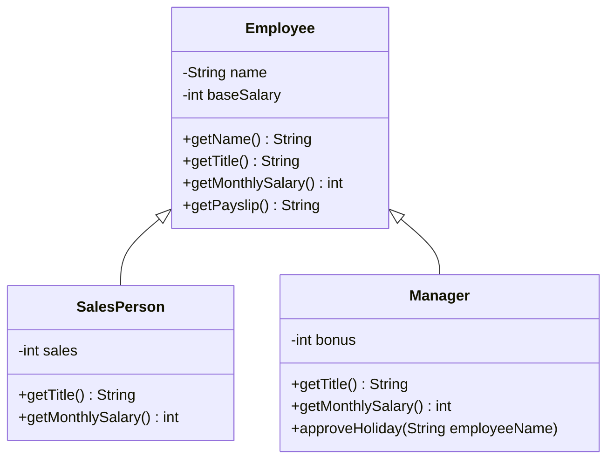

# Polymorfi

## Beskrivelse

I onsdags lærte I **arv**: at en `Food` **er et** `Item`, og at en `Item`-variabel godt kan
holde et `Food`-objekt. I dag tager vi det næste skridt og ser på, hvad der sker, når man **kalder
en metode** gennem sådan en variabel.

Svaret er **polymorfi** (græsk: *mange former*): det samme metodekald kan gøre forskellige ting,
alt efter hvilket objekt der står bag. Det er ikke variablens type, der bestemmer, hvilken kode der
kører – det er **objektet**.

Det lyder som en lille detalje, men det er den, der gør objektorienteret programmering stærk. Med
polymorfi kan man skrive ét loop, der behandler mange forskellige slags objekter, uden en eneste
`if (x instanceof ...)`. Og man kan tilføje en ny slags objekt uden at ændre det loop.

Det er præcis det, I får brug for på mandag i
[Adventure del 4](../../projekter/adventure/del-4-weapons.md), hvor sværd og revolvere skal
opføre sig forskelligt – og hvor `instanceof` på våben er **forbudt**.

## Læringsmål

Når du har arbejdet med dagens materiale, skal du kunne:

* forklare hvad polymorfi er, med dine egne ord
* skelne mellem **variablens type** og **objektets type**
* forklare hvorfor variablens type bestemmer, hvilke metoder du **må** kalde
* forklare hvorfor objektets type bestemmer, hvilken udgave af metoden der **kører** (dynamic
  dispatch)
* forudsige output af et program, der kalder overridede metoder gennem en superklasse-variabel
* skrive et loop over en `ArrayList` af superklassens type, der opfører sig forskelligt for hvert
  objekt
* erstatte en kæde af `if (x instanceof ...)` med en overridet metode
* forklare, hvorfor `toString()` og `equals()` også er eksempler på polymorfi
* forklare, hvorfor et cast kan få programmet til at crashe, og hvorfor du bør undgå det

## Se disse videoer før undervisningen:

* [polymorphism](https://www.youtube.com/watch?v=xTtL8E4LzTQ&list=PLEeqf0uSZqXsz7oU2U-VAxhQZ021PRVnd&t=8h7m44s) (til: 08:14:27)
* [runtime polymorphism](https://www.youtube.com/watch?v=xTtL8E4LzTQ&list=PLEeqf0uSZqXsz7oU2U-VAxhQZ021PRVnd&t=8h14m27s) (til: 08:19:35)

> **Bemærk:** Videoerne kan bruge `abstract` om superklassen. Det er ikke nødvendigt for polymorfi –
> det virker lige så godt med en almindelig superklasse, og det er det, vi bruger i dag. I så
> `abstract` kort i Animal-øvelsen i onsdags, og på mandag går vi i dybden med det.

Vil du genopfriske `toString()` fra 11-09, så ligger den
[her](https://www.youtube.com/watch?v=xTtL8E4LzTQ&list=PLEeqf0uSZqXsz7oU2U-VAxhQZ021PRVnd&t=7h46m08s)
(til: 07:51:58).

## Læs nedenstående før undervisningen

---

### Du har allerede brugt polymorfi

To ting fra de sidste uger, som I måske ikke tænkte over:

1. **I onsdags** lagde I `Food`-objekter i en `ArrayList<Item>`, og `take`, `drop` og
   `inventory` virkede uændret. Koden så kun `Item` – men objekterne var både `Item` og `Food`.
2. **Den 11-09** skrev I en `toString()`-metode, så `System.out.println(person)` skrev noget
   fornuftigt i stedet for `Person@6d06d69c`. `println` er skrevet af Javas udviklere for mange år
   siden. Den kender ikke jeres klasse – alligevel kalder den **jeres** `toString()`.

Begge dele er polymorfi. I dag finder vi ud af, hvordan det virker, og hvordan man bruger det med
vilje.

---

### Eksemplet: en lønkørsel

Vi bruger et eksempel uden for Adventure, så vi kan se mekanikken rent: et firma med forskellige
slags ansatte.

```java
public class Employee {

    private String name;
    private int baseSalary;

    public Employee(String name, int baseSalary) {
        this.name = name;
        this.baseSalary = baseSalary;
    }

    public String getName() {
        return name;
    }

    public String getTitle() {
        return "Medarbejder";
    }

    public int getMonthlySalary() {
        return baseSalary;
    }

    public String getPayslip() {
        return getName() + " (" + getTitle() + "): " + getMonthlySalary() + " kr.";
    }
}
```

En sælger får grundløn plus 5 % af sit salg. En leder får grundløn plus et fast tillæg – og kan
godkende ferie:

```java
public class SalesPerson extends Employee {

    private int sales;

    public SalesPerson(String name, int baseSalary, int sales) {
        super(name, baseSalary);
        this.sales = sales;
    }

    @Override
    public String getTitle() {
        return "Sælger";
    }

    @Override
    public int getMonthlySalary() {
        return super.getMonthlySalary() + sales * 5 / 100;   // 5 % provision
    }
}
```

```java
public class Manager extends Employee {

    private int bonus;

    public Manager(String name, int baseSalary, int bonus) {
        super(name, baseSalary);
        this.bonus = bonus;
    }

    @Override
    public String getTitle() {
        return "Leder";
    }

    @Override
    public int getMonthlySalary() {
        return super.getMonthlySalary() + bonus;
    }

    public void approveHoliday(String employeeName) {
        System.out.println(getName() + " godkender ferie til " + employeeName);
    }
}
```

Alt det her kender I fra onsdag: `extends`, `super(...)`, `@Override` og `super.metode()`.



Bemærk, at `Employee` **ikke** er en tom skal. Der findes almindelige medarbejdere, som bare får
deres grundløn. Superklassen har sin egen, fuldt brugbare udgave af hver metode – og subklasserne
overrider kun det, der skal være anderledes.

---

### To typer: variablens og objektets

Se på denne linje:

```java
Employee e = new Manager("Sofie", 42000, 8000);
```

Der er **to** typer i spil:

| | Type | Hvornår kendes den? |
| --- | --- | --- |
| **Variablen** `e` | `Employee` | når koden **kompileres** – det står i koden |
| **Objektet**, `e` peger på | `Manager` | når programmet **kører** – det er det, `new` lavede |

Og de to typer har hver sit job. Husk dem som **to spørgsmål**:

> 1. **Må jeg kalde metoden?** Det afgør **variablens type**. Compileren kigger kun på den.
> 2. **Hvilken udgave kører?** Det afgør **objektets type**. Java kigger på det, mens programmet
>    kører.

#### Spørgsmål 1: Må jeg kalde metoden?

```java
Employee e = new Manager("Sofie", 42000, 8000);

e.approveHoliday("Jonas");     // ← fejl!
```

```text
error: cannot find symbol
  symbol:   method approveHoliday(String)
  location: variable e of type Employee
```

Compileren siger: *variablen `e` er en `Employee`, og `Employee` har ingen `approveHoliday`*. At
objektet faktisk er en `Manager`, er ligegyldigt – compileren ser kun variablens type. Det så I også
i onsdags med `something.getHealthPoints()`.

#### Spørgsmål 2: Hvilken udgave kører?

```java
Employee e = new Manager("Sofie", 42000, 8000);

System.out.println(e.getMonthlySalary());
```

Må vi kalde `getMonthlySalary()`? Ja – `Employee` har den. Men **hvilken** af dem kører? Der er to:
`Employee`s (grundløn) og `Manager`s (grundløn + bonus).

```text
50000
```

`Manager`s udgave. Objektet er en `Manager`, så det er `Manager`s metode, der kører – selvom
variablen hedder `Employee`.

Det kaldes **dynamic dispatch** (eller *runtime polymorphism*): beslutningen om, hvilken metode der
kører, træffes først, mens programmet kører, ud fra hvad objektet **faktisk er**.

> **Tommelfingerregel:** Compileren spørger variablen. Java spørger objektet.

---

### Også inde i superklassen

Her er den del, der overrasker de fleste. Se igen på `getPayslip()` i `Employee`:

```java
public String getPayslip() {
    return getName() + " (" + getTitle() + "): " + getMonthlySalary() + " kr.";
}
```

`getPayslip()` findes kun i `Employee`. Men hvad sker der her?

```java
Employee e = new Manager("Sofie", 42000, 8000);

System.out.println(e.getPayslip());
```

```text
Sofie (Leder): 50000 kr.
```

`getPayslip()` er `Employee`s metode, men den kalder `getTitle()` og `getMonthlySalary()` – og de
kaldes på **det samme objekt**, som er en `Manager`. Så det er `Manager`s udgaver, der kører.

Et kald som `getTitle()` inde i en metode betyder egentlig `this.getTitle()`. Og `this` er altid
**objektet** – aldrig klassen, koden står i.

> Det er derfor, `Employee` kan skrive en fælles lønseddel **én gang**, og alligevel får hver
> slags ansat sin egen titel og løn på den.

---

### Én liste, mange former

Nu bliver det nyttigt. Lønkørslen:

```java
ArrayList<Employee> staff = new ArrayList<>();
staff.add(new Employee("Jonas", 32000));
staff.add(new SalesPerson("Mette", 28000, 150000));
staff.add(new Manager("Sofie", 42000, 8000));

int total = 0;

for (Employee employee : staff) {
    System.out.println(employee.getPayslip());
    total += employee.getMonthlySalary();
}

System.out.println("I alt: " + total + " kr.");
```

```text
Jonas (Medarbejder): 32000 kr.
Mette (Sælger): 35500 kr.
Sofie (Leder): 50000 kr.
I alt: 117500 kr.
```

Ét loop. Tre forskellige titler og tre forskellige lønberegninger. Og loopet **ved ikke**, at der
findes sælgere og ledere – det kender kun `Employee`.

Det samme gælder parametre. En metode, der tager en `Employee`, tager også imod alle subklasser:

```java
public static void printPayslip(Employee employee) {
    System.out.println("*** LØNSEDDEL ***");
    System.out.println(employee.getPayslip());
}
```

```java
printPayslip(new SalesPerson("Mette", 28000, 150000));
printPayslip(new Employee("Jonas", 32000));
```

```text
*** LØNSEDDEL ***
Mette (Sælger): 35500 kr.
*** LØNSEDDEL ***
Jonas (Medarbejder): 32000 kr.
```

---

### Uden polymorfi: if-kæden

Hvordan ville det se ud, hvis vi **ikke** overrider `getTitle()`, men i stedet spørger objektet,
hvad det er?

```java
// SÅDAN SKAL DET IKKE GØRES
public static String titleOf(Employee employee) {
    if (employee instanceof Manager) {
        return "Leder";
    }
    else if (employee instanceof SalesPerson) {
        return "Sælger";
    }
    else {
        return "Medarbejder";
    }
}
```

Det virker. Men nu skal firmaet have **praktikanter**. Med if-kæden skal vi:

* lave klassen `Intern`
* finde `titleOf` og tilføje en gren
* finde lønberegningen – hvis den også er skrevet som en if-kæde – og tilføje en gren der
* finde **alle andre** steder i programmet, hvor der står `instanceof Manager`, og overveje, om
  praktikanter også skal med

Glemmer vi ét sted, sker der ingen fejl. Praktikanten får bare titlen "Medarbejder" – og det opdager
vi måske først, når lønsedlerne er sendt ud.

Med polymorfi skal vi **kun** lave den nye klasse:

```java
public class Intern extends Employee {

    public Intern(String name) {
        super(name, 12000);
    }

    @Override
    public String getTitle() {
        return "Praktikant";
    }
}
```

```java
staff.add(new Intern("Ali"));
```

```text
Jonas (Medarbejder): 32000 kr.
Mette (Sælger): 35500 kr.
Sofie (Leder): 50000 kr.
Ali (Praktikant): 12000 kr.
I alt: 129500 kr.
```

Loopet er **ikke** ændret med et eneste tegn.

> **Viden om, hvad en praktikant er, ligger ét sted: i `Intern`.** Med if-kæden ligger den spredt
> ud over hele programmet. Det er den samme tanke som *Information Expert* fra refactor-fasen: den
> klasse, der har viden, skal have ansvaret.

Så når du er ved at skrive `instanceof`, så stop op og spørg:

> *Kunne jeg i stedet kalde en metode på objektet og lade det selv svare?*

---

### `toString()` og `equals()` – polymorfi, I allerede bruger

Alle klasser arver fra `Object`, og `Object` har bl.a. metoderne `toString()` og `equals()`.

**`toString()`** – `System.out.println` tager imod et hvilket som helst objekt og kalder dets
`toString()`. Uden override får man `Object`s udgave:

```java
System.out.println(new Employee("Jonas", 32000));
```

```text
Employee@27c170f0
```

(Tallet efter `@` kan være et andet hos dig.) Lægger vi en override i `Employee`:

```java
@Override
public String toString() {
    return getPayslip();
}
```

så gælder den for alle subklasser – og `getPayslip()` kalder stadig objektets egen `getTitle()`:

```java
Employee e = new Manager("Sofie", 42000, 8000);
System.out.println(e);
```

```text
Sofie (Leder): 50000 kr.
```

`println` ved intet om `Employee` eller `Manager`. Den kalder bare `toString()` – og objektet svarer.
Det er polymorfi skrevet af nogen, der aldrig har set jeres kode.

**`equals()`** – I har brugt `equals` på `String` i flere uger. Det virker, fordi `String`
**overrider** `Object`s `equals`, så den sammenligner bogstaverne. `Object`s egen udgave tjekker
bare, om det er **det samme objekt** – præcis som `==`:

```java
Employee f = new Employee("Jonas", 32000);
Employee g = new Employee("Jonas", 32000);

System.out.println(f.equals(g));    // false – to forskellige objekter

String a = new String("lamp");
String b = new String("lamp");

System.out.println(a.equals(b));    // true – String har sin egen equals
```

Man kan også skrive sin egen `equals`, men det kræver et cast (se nedenfor), og det venter vi med.

---

### Cast – en advarsel

I onsdags så I et **cast** i `eat`-kommandoen:

```java
if (item instanceof Food) {
    Food food = (Food) item;
    // ...
}
```

Et cast siger til compileren: *"stol på mig – det her objekt er en `Food`"*. Og compileren stoler
på dig. Men **hvis du tager fejl, crasher programmet**, mens det kører:

```java
Employee e = new SalesPerson("Mette", 28000, 150000);
Manager m = (Manager) e;            // compileren siger ok ...
m.approveHoliday("Jonas");          // ... men vi når aldrig herned
```

```text
Exception in thread "main" java.lang.ClassCastException: class SalesPerson cannot be cast to class Manager (SalesPerson and Manager are in unnamed module of loader 'app')
```

(I IntelliJ står package-navnet foran klassenavnene, fx `dag5_polymorfi.SalesPerson`.)

Et cast slår altså compilerens sikkerhedsnet fra. Derfor:

> * Et cast skal **altid** stå inde i en `if (x instanceof ...)`, der beskytter det.
> * Og hver gang du skriver `instanceof` + cast, så spørg, om en overridet metode kunne gøre det
>   samme. Oftest kan den.

I `eat` er det i orden – dér skal vi netop skelne mellem mad og ikke-mad, og
[del 3](../../projekter/adventure/del-3-food.md) beder om det. Men det er en undtagelse, ikke en
vane.

---

### Polymorfi i Adventure

#### Det, I allerede har

`Room` og `Player` har en `ArrayList<Item>`. Når `Food` ligger i den, er det polymorfi:
`take`, `drop` og `inventory` taler med alle ting gennem `Item`, og hver ting opfører sig som det,
den er.

#### Et lille eksempel, I kan prøve

Vil I have, at inventory viser, hvilke ting der kan spises? Så kunne man fristes til:

```java
// SÅDAN SKAL DET IKKE GØRES
if (item instanceof Food) {
    text = item.getLongName() + " (edible)";
}
```

Med polymorfi får `Item` en metode, som `Food` overrider:

```java
public class Item {

    // ... som før

    public String getInventoryText() {
        return longName;
    }
}
```

```java
public class Food extends Item {

    // ... som før

    @Override
    public String getInventoryText() {
        return getLongName() + " (edible)";
    }
}
```

Og brugerfladen kalder bare `getInventoryText()` på hver ting:

```java
for (Item item : inventory) {
    System.out.println(item.getInventoryText());
}
```

```text
a shiny brass lamp
a loaf of stale bread (edible)
a rusty key
```

Ingen `instanceof`. Og når der kommer våben, kan `Weapon` lave sin egen udgave.

#### På mandag: våben

I [del 4](../../projekter/adventure/del-4-weapons.md) kommer der to slags våben:

* et **sværd** (`MeleeWeapon`) kan bruges igen og igen
* en **revolver** (`RangedWeapon`) har et begrænset antal skud

`attack`-kommandoen skal altså opføre sig forskelligt – og opgaven siger ligeud, at der **ikke** må
stå `if (weapon instanceof RangedWeapon)` nogen steder. Kun `Map` må kende subklasserne.

Det kan I faktisk allerede nu: giv `Weapon` metoder, som hver slags våben overrider, og lad `Player`
kun kende `Weapon`. Men tænk over det her til mandag:

> **Hvad skal `Weapon`s *egen* udgave af metoderne gøre?** Et "våben i almindelighed" findes jo
> ikke i spillet – der findes kun sværd og revolvere. Det spørgsmål svarer vi på mandag.

---

### Sådan hænger det sammen

| Det du lærte | Hvor du ser det |
| --- | --- |
| Superklasse-variabel → subklasse-objekt | `Item item = new Food(...)` i onsdags |
| Variablens type: hvad må jeg kalde? | `item.getHealthPoints()` giver compilerfejl |
| Objektets type: hvilken udgave kører? | `getPayslip()` giver lederens titel |
| Polymorf liste | `ArrayList<Item>` i `Room` og `Player` |
| Override i stedet for `instanceof` | `getInventoryText()` nu, `Weapon` på mandag |
| `toString()` og `equals()` | `println(objekt)` og `String.equals` |

---

## Det vigtigste at tage med

* **polymorfi**: samme metodekald, forskellig opførsel – afhængigt af objektet
* **variablens type** bestemmer, hvad du **må** kalde (compileren)
* **objektets type** bestemmer, hvilken udgave der **kører** (dynamic dispatch)
* det gælder også kald **inde i** superklassens egne metoder – `this` er altid objektet
* en `ArrayList` af superklassens type kan holde alle subklasser, og ét loop klarer dem alle
* en ny subklasse kræver **ingen** ændringer i den kode, der kun kender superklassen
* `instanceof`-kæder spreder viden om typer ud i programmet – spørg hellere objektet
* et cast slår compilerens sikkerhedsnet fra og kan give `ClassCastException`

## Aktiviteter i undervisningen

Lav dagens opgaver i IntelliJ-projektet `uge40-arv-polymorfi` fra onsdag, i en ny package
`dag5_polymorfi`.

### 1. Forudsig output

Start med [opgaver.md](opgaver.md), **del A**. Skriv dit gæt ned, **før** du kører koden. Det er
ikke slemt at gætte forkert – det er sådan, man opdager, hvor ens forståelse halter.

Sammenlign med sidemanden. Hvor var I uenige, og hvem havde ret?

### 2. Opgaver

Fortsæt med [opgaver.md](opgaver.md):

* **del B** – biografbilletter (grundopgaver)
* **del C** – fjern en `instanceof`-kæde
* **udfordringer** – til dem, der vil videre

Der er [vejledende løsninger](loesninger.md), men prøv selv først.

### 3. Kig på jeres Adventure

Del 3 skulle være afleveret i går. Sæt jer i gruppen, og gå jeres kode igennem med dagens briller:

* Hvor står der `instanceof`? Er det nødvendigt (som i `eat`), eller kunne en overridet metode
  gøre det samme?
* Læs [del 4 – Weapons](../../projekter/adventure/del-4-weapons.md) igennem, og skitsér
  klassediagrammet. Hvilke metoder skal `Weapon` have, for at `Player` aldrig behøver vide, hvilken
  slags våben den har? (Se [udfordring 4](opgaver.md#udfordring-4--kig-frem-på-del-4).)

> Del 4 gennemgås og **afleveres på mandag** kl. 23:59. Det er en kort frist, så det betaler sig at
> have læst opgaven og tænkt designet igennem i dag.
