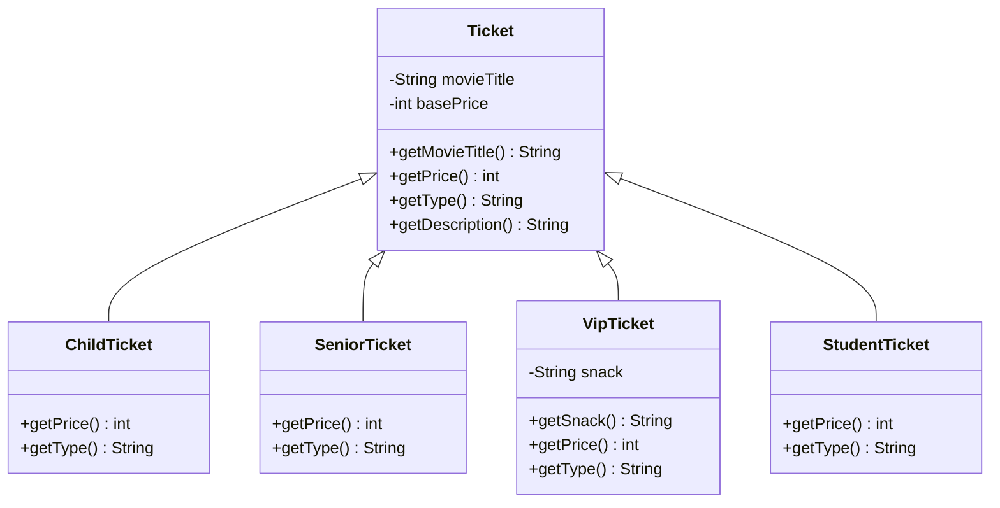

# Vejledende løsninger – Polymorfi

Her er vejledende løsninger til [opgaver.md](opgaver.md). Alle programmer er kørt, og outputtet er
det, de faktisk skriver.

> **Vejledende** betyder: din kode må gerne se anderledes ud. Det vigtige i dag er ikke den præcise
> kode, men at du kan forklare **hvorfor** outputtet bliver, som det gør.

---

# Del A – Forudsig output

Nøglen til alle opgaverne er de to spørgsmål fra README'en:

1. **Må jeg kalde metoden?** – det afgør **variablens** type (compileren).
2. **Hvilken udgave kører?** – det afgør **objektets** type (mens programmet kører).

## Opgave 1 – Opvarmning

```text
...
plingeling
Kazooen siger ...
Guitaren siger plingeling
```

Den sidste linje: `Guitar` har ingen egen `describe()`, så det er `Instrument`s, der kører. Men inde i den
står `play()`, og det betyder `this.play()`. `this` er guitar-objektet, så det er `Guitar`s
`play()`, der kører.

## Opgave 2 – Variablen siger Instrument

```text
bum bum
Trommen siger bum bum (højt!)
```

1. Variablen er en `Instrument`, men objektet er en `Drum` – så `Drum`s udgaver kører.
2. `Drum`s `describe()` kalder `super.describe()`, altså `Instrument`s. Men inde i den kaldes
   `play()` stadig på **trommen**, så det er `Drum`s `play()`. `super.` ændrer kun, hvilken
   `describe()` der kører – ikke, hvad objektet er.

## Opgave 3 – Tre led

```text
plingeling
Elguitaren siger plingeling
```

1. Se ovenfor.
2. Java leder **opad** fra objektets klasse: først i `ElectricGuitar` (ingen `play()`), så i
   `Guitar` (der er den). Den første, Java finder, er den, der kører. For `getName()` finder Java
   den allerede i `ElectricGuitar` – derfor `Elguitaren` og ikke `Guitaren`, selvom constructoren i
   `Guitar` sendte `"Guitaren"` videre til `Instrument`.

## Opgave 4 – Bandet

```text
Guitaren siger plingeling
Trommen siger bum bum (højt!)
Kazooen siger ...
Elguitaren siger plingeling
```

I loopet er der i spil:

* `describe()`: **to** udgaver (`Instrument`s og `Drum`s)
* `play()`: **tre** udgaver (`Instrument`s, `Guitar`s og `Drum`s)
* `getName()`: **to** udgaver (`Instrument`s og `ElectricGuitar`s)

Og loopet selv kender kun `Instrument`.

## Opgave 5 – Stavefejlen

```text
Fløjten siger ...
```

1. `Play()` med stort `P` er **ikke** det samme navn som `play()`. `Flute` har derfor fået en helt
   ny metode, som ingen kalder, og `describe()` bruger `Instrument`s `play()`.
2. Med `@Override` over `Play()` nægter compileren:

   ```text
   error: method does not override or implement a method from a supertype
       @Override
       ^
   ```

3. `@Override` er din forsikring mod netop den fejl. Uden den får du ingen fejlbesked – bare et
   program, der gør noget forkert. **Skriv den altid.**

## Opgave 6 – Kan det kompilere?

| # | Kode | Kompilerer? | Output / forklaring |
| --- | --- | --- | --- |
| 1 | `Instrument i1 = new Guitar();` | ja | En guitar **er et** instrument. |
| 2 | `Guitar g1 = new Instrument("Kazooen");` | **nej** | `incompatible types: Instrument cannot be converted to Guitar`. Et instrument er ikke nødvendigvis en guitar. |
| 3 | `Guitar g2 = new ElectricGuitar();` | ja | En elguitar er en guitar. |
| 4 | `i1.tune();` | **nej** | `cannot find symbol`. Variablen er en `Instrument`, og `Instrument` har ingen `tune()`. |
| 5 | `g2.tune();` | ja | Skriver `Guitaren bliver stemt` (teksten står fast i `Guitar`s `tune()`). |
| 6 | `Drum d = new Guitar();` | **nej** | `incompatible types: Guitar cannot be converted to Drum`. De er "søskende", ikke hinanden. |
| 7 | `Object o = new Drum();` | ja | Alt er et `Object`. |
| 8 | `o.play();` | **nej** | `cannot find symbol`. `Object` har ingen `play()`, selvom objektet har. |
| 9 | `System.out.println(o);` | ja | Skriver fx `Drum@6d06d69c` – `Object`s `toString()`, fordi `Drum` ikke har sin egen. Tallet varierer. |
| 10 | `ElectricGuitar e = new Guitar();` | **nej** | `incompatible types: Guitar cannot be converted to ElectricGuitar`. |

Mønstret: **opad** i arvehierarkiet er altid tilladt (subklasse-objekt i superklasse-variabel).
**Nedad** er aldrig tilladt uden et cast. **Til siden** (linje 6, mellem "søskende") hjælper ikke
engang et cast: `(Drum) new Guitar()` giver den samme compilerfejl.

## Opgave 7 – Cast

```text
Guitaren bliver stemt
Exception in thread "main" java.lang.ClassCastException: class Drum cannot be cast to class Guitar (Drum and Guitar are in unnamed module of loader 'app')
	at Opgave07.main(Opgave07.java:9)
```

(I IntelliJ står package-navnet foran klassenavnene.)

1. Ja. Compileren tillader et cast fra `Instrument` til `Guitar`, fordi et `Instrument` **kunne**
   være en `Guitar`.
2. Det første cast går godt – objektet *er* en guitar. Det andet crasher med en
   `ClassCastException`, fordi objektet er en tromme.
3. Compileren kender kun variablens type (`Instrument`), ikke hvad der ligger i den. Med et cast
   lover du compileren, at du ved bedre – og så tjekker den ikke.
4. Med `instanceof`:

   ```java
   if (j instanceof Guitar) {
       Guitar h = (Guitar) j;
       h.tune();
   }
   ```

   Men det bedre spørgsmål er: skal alle instrumenter kunne stemmes? I så fald hører `tune()`
   hjemme i `Instrument` (måske med en udgave, der ikke gør noget), og så forsvinder både castet og
   `instanceof`. Det er præcis den overvejelse, I skal gøre jer med våben i del 4.

---

# Del B – Biografbilletter

## Opgave 8 – Billet, børnebillet og pensionistbillet

```java
public class Ticket {

    private String movieTitle;
    private int basePrice;

    public Ticket(String movieTitle, int basePrice) {
        this.movieTitle = movieTitle;
        this.basePrice = basePrice;
    }

    public String getMovieTitle() {
        return movieTitle;
    }

    public int getPrice() {
        return basePrice;
    }

    public String getType() {
        return "Voksen";
    }

    public String getDescription() {
        return getType() + ": " + movieTitle + " – " + getPrice() + " kr.";
    }
}
```

```java
public class ChildTicket extends Ticket {

    public ChildTicket(String movieTitle, int basePrice) {
        super(movieTitle, basePrice);
    }

    @Override
    public int getPrice() {
        return super.getPrice() / 2;
    }

    @Override
    public String getType() {
        return "Barn";
    }
}
```

```java
public class SeniorTicket extends Ticket {

    public SeniorTicket(String movieTitle, int basePrice) {
        super(movieTitle, basePrice);
    }

    @Override
    public int getPrice() {
        return super.getPrice() * 80 / 100;     // 20 % rabat
    }

    @Override
    public String getType() {
        return "Pensionist";
    }
}
```

Output af `Opgave08`:

```text
120
60
96
```

Hvorfor `getType()` og `getPrice()` i `getDescription()` i stedet for attributterne? Fordi
`basePrice` er **grundprisen**. Skrev `getDescription()` `basePrice` direkte, ville børnebilletten
stå til 120 kr. Ved at kalde `getPrice()` får vi objektets **egen** udgave – det er hele pointen med
dagens emne.

## Opgave 9 – En bestilling

```java
import java.util.ArrayList;

public class Opgave09 {

    public static void main(String[] args) {

        ArrayList<Ticket> order = new ArrayList<>();
        order.add(new Ticket("Dune", 120));
        order.add(new Ticket("Dune", 120));
        order.add(new ChildTicket("Dune", 120));
        order.add(new SeniorTicket("Dune", 120));

        int total = 0;

        for (Ticket ticket : order) {
            System.out.println(ticket.getDescription());
            total += ticket.getPrice();
        }

        System.out.println("I alt: " + total + " kr.");
    }
}
```

```text
Voksen: Dune – 120 kr.
Voksen: Dune – 120 kr.
Barn: Dune – 60 kr.
Pensionist: Dune – 96 kr.
I alt: 396 kr.
```

1. `ChildTicket` arver `getDescription()` fra `Ticket`. Når den kører på et `ChildTicket`-objekt,
   kalder den `getType()` og `getPrice()` på **det objekt** – og så er det `ChildTicket`s udgaver.
2. Nul `if`-sætninger.

## Opgave 10 – VIP-billetten

```java
public class VipTicket extends Ticket {

    private String snack;

    public VipTicket(String movieTitle, int basePrice, String snack) {
        super(movieTitle, basePrice);
        this.snack = snack;
    }

    public String getSnack() {
        return snack;
    }

    @Override
    public int getPrice() {
        return super.getPrice() + 50;
    }

    @Override
    public String getType() {
        return "VIP";
    }
}
```

1. Compileren siger:

   ```text
   error: cannot find symbol
           System.out.println(vip.getSnack());
                                 ^
     symbol:   method getSnack()
     location: variable vip of type Ticket
   ```

   Variablen er en `Ticket`, og `Ticket` har ingen `getSnack()`.

2. Giv variablen den type, der har metoden:

   ```java
   VipTicket vip = new VipTicket("Dune", 120, "popcorn og cola");
   System.out.println(vip.getSnack());
   ```

   ```text
   popcorn og cola
   ```

   Et cast ville også virke, men det er unødvendigt – du ved jo selv, at det er en `VipTicket`, når
   du opretter den.

3. `VIP: Dune – 170 kr.`

> **Regel:** Brug superklassens type, når koden skal kunne håndtere **alle** slags (listen,
> kvitteringen). Brug subklassens type, når du har brug for noget, **kun** den har.

## Opgave 11 – Kvitteringen

```java
import java.util.ArrayList;

public class Opgave11 {

    public static void main(String[] args) {

        ArrayList<Ticket> order = new ArrayList<>();
        order.add(new Ticket("Dune", 120));
        order.add(new ChildTicket("Dune", 120));
        order.add(new VipTicket("Dune", 120, "popcorn og cola"));
        order.add(new StudentTicket("Dune", 120));

        printReceipt(order);
    }

    public static void printReceipt(ArrayList<Ticket> tickets) {

        int total = 0;

        System.out.println("===== KVITTERING =====");

        for (Ticket ticket : tickets) {
            System.out.println(ticket.getDescription());
            total += ticket.getPrice();
        }

        System.out.println("----------------------");
        System.out.println("I alt: " + total + " kr.");
        System.out.println("Antal billetter: " + tickets.size());
    }
}
```

```java
public class StudentTicket extends Ticket {

    public StudentTicket(String movieTitle, int basePrice) {
        super(movieTitle, basePrice);
    }

    @Override
    public int getPrice() {
        return super.getPrice() - 30;
    }

    @Override
    public String getType() {
        return "Studerende";
    }
}
```

```text
===== KVITTERING =====
Voksen: Dune – 120 kr.
Barn: Dune – 60 kr.
VIP: Dune – 170 kr.
Studerende: Dune – 90 kr.
----------------------
I alt: 440 kr.
Antal billetter: 4
```

**Antal ændrede linjer i `printReceipt`: nul.** Vi lavede én ny klasse og tilføjede én linje i
`main`, der opretter billetten.

## Opgave 12 – Klassediagram



`getDescription()` står **kun** i `Ticket`, fordi ingen subklasse overrider den. Man kan se på
diagrammet, at alle billettyper deler den samme beskrivelse, men hver har sin egen pris og type.

## Opgave 13 – `toString()`

I `Ticket`:

```java
@Override
public String toString() {
    return getDescription();
}
```

Med bestillingen fra opgave 11:

```text
Barn: Dune – 60 kr.
[Voksen: Dune – 120 kr., Barn: Dune – 60 kr., VIP: Dune – 170 kr., Studerende: Dune – 90 kr.]
```

`println` kalder `toString()` på det, den får. For `order.get(1)` er det billettens `toString()`.
For `order` er det `ArrayList`s `toString()`, som laver `[`, `]` og kommaer – og kalder
`toString()` på hvert element. Hverken `println` eller `ArrayList` kender `Ticket`, men de kalder
alligevel jeres kode. Det er polymorfi to lag dybt.

---

# Del C – Fjern if-kæden

## Opgave 14 – Kør det, som det er

1. **To** steder i `NotificationService` (`format` og `getCostInOre`) – og ikke i `SmsNotification`,
   hvor man ville lede.
2. Mindst **to** metoder i `NotificationService` plus den nye klasse. I et rigtigt system er der
   mange flere af den slags metoder.
3. **Nej.** Programmet kompilerer og kører. Den nye type falder bare ned i `else` og får standardteksten og prisen 0.
   Fejlen opdages måske først, når kunden klager.

## Opgave 15 – Refaktorér

```java
public class Notification {

    private String recipient;
    private String text;

    public Notification(String recipient, String text) {
        this.recipient = recipient;
        this.text = text;
    }

    public String getRecipient() {
        return recipient;
    }

    public String getText() {
        return text;
    }

    public String format() {
        return "Besked til " + getRecipient() + ": " + getText();
    }

    public int getCostInOre() {
        return 0;
    }
}
```

```java
public class EmailNotification extends Notification {

    public EmailNotification(String recipient, String text) {
        super(recipient, text);
    }

    @Override
    public String format() {
        return "E-mail til " + getRecipient() + ": " + getText();
    }
}
```

```java
public class SmsNotification extends Notification {

    public SmsNotification(String recipient, String text) {
        super(recipient, text);
    }

    @Override
    public String format() {
        String text = getText();
        if (text.length() > 20) {
            text = text.substring(0, 17) + "...";
        }
        return "SMS til " + getRecipient() + ": " + text;
    }

    @Override
    public int getCostInOre() {
        return 25;
    }
}
```

```java
public class PushNotification extends Notification {

    public PushNotification(String recipient, String text) {
        super(recipient, text);
    }

    @Override
    public String format() {
        return "[App] " + getText();
    }
}
```

```java
import java.util.ArrayList;

public class Opgave15 {

    public static void main(String[] args) {

        ArrayList<Notification> outbox = new ArrayList<>();
        outbox.add(new EmailNotification("kunde@example.com", "Din ordre er afsendt"));
        outbox.add(new SmsNotification("+4512345678", "Din pakke kan hentes i pakkeshoppen"));
        outbox.add(new PushNotification("app-bruger-17", "Nyt tilbud i appen"));

        int totalCost = 0;

        for (Notification notification : outbox) {
            System.out.println(notification.format());
            totalCost += notification.getCostInOre();
        }

        System.out.println("Pris i alt: " + totalCost + " øre");
    }
}
```

```text
E-mail til kunde@example.com: Din ordre er afsendt
SMS til +4512345678: Din pakke kan hen...
[App] Nyt tilbud i appen
Pris i alt: 25 øre
```

Samme output som før – så refaktoreringen er lykkedes. Læg mærke til:

* `EmailNotification` og `PushNotification` overrider **ikke** `getCostInOre()`. De er tilfredse
  med standarden (0), så de arver den.
* Alt, hvad der gælder for en SMS, står nu i `SmsNotification`. Vil man vide, hvad en SMS koster,
  ved man, hvor man skal kigge.
* `if` i `SmsNotification.format()` er helt i orden. Det handler ikke om **typen**, men om tekstens
  længde.

## Opgave 16 – En ny type

```java
public class LetterNotification extends Notification {

    public LetterNotification(String recipient, String text) {
        super(recipient, text);
    }

    @Override
    public String format() {
        return "Brev til " + getRecipient() + ": " + getText();
    }

    @Override
    public int getCostInOre() {
        return 1400;
    }
}
```

I `main`:

```java
outbox.add(new LetterNotification("Eksempelvej 1, 1234 Byen", "Årsopgørelse"));
```

```text
E-mail til kunde@example.com: Din ordre er afsendt
SMS til +4512345678: Din pakke kan hen...
[App] Nyt tilbud i appen
Brev til Eksempelvej 1, 1234 Byen: Årsopgørelse
Pris i alt: 1425 øre
```

**Antal ændrede eksisterende klasser: nul.** Én ny klasse og én linje i `main`, hvor objektet
oprettes. Med if-kæden skulle vi have rettet to metoder i `NotificationService` – og husket det.

> Læg mærke til, at `main` er det **eneste** sted, der nævner subklasserne. Det er præcis reglen i
> Adventure del 4: kun `Map` må kende `MeleeWeapon` og `RangedWeapon`.

---

# Udfordringer

## Udfordring 1 – `==` og `equals`

```text
false
false
true
true
false
true
```

1. `Ticket` har ingen `equals`, så den arver `Object`s. `Object`s `equals` gør det samme som `==`:
   den tjekker, om det er **det samme objekt**. `a` og `b` er to forskellige objekter, selvom de
   har samme indhold.
2. `String` overrider `equals`, så den sammenligner **bogstaverne**. `s2` er lavet med `new`, så
   det er et andet objekt end `s1` (derfor `false` med `==`), men bogstaverne er de samme.
3. `a.equals(b)` kalder `Object`s `equals`. `s1.equals(s2)` kalder `String`s. Samme metodenavn,
   forskellig opførsel, afhængigt af objektet – polymorfi.

Det er i øvrigt grunden til, at man **altid** skal bruge `equals` til tekst og aldrig `==`.

## Udfordring 2 – Er det virkelig arv?

1. Nej. En ledsagerbillet er ikke en børnebillet – ledsageren er en voksen. De har bare
   tilfældigvis samme pris.
2. Uden egen `getType()` arver den `ChildTicket`s:

   ```text
   Barn: Dune – 60 kr.
   ```

   Kvitteringen påstår, at ledsageren er et barn.
3. Ledsagerbilletten følger automatisk med – uanset om det var meningen. De to billettyper er nu
   bundet sammen af en regel, som ingen har besluttet.
4. Lad `CompanionTicket` arve direkte fra `Ticket` med sin egen `getType()` og `getPrice()`. Hvis
   det er en regel, at de **skal** koste det samme, kan begge regne prisen ud på samme måde – men
   det er en prisregel, ikke et *is-a*-forhold.

> Det er den samme fælde, som README'en fra onsdag advarede mod: arv skal bruges til **er-en**,
> ikke til at spare kode. Og det er grunden til, at `Enemy` i del 5 **ikke** skal arve fra `Item`.

## Udfordring 3 – Jagt på `instanceof` i jeres Adventure

Svaret afhænger af jeres kode. Typisk finder man:

* **`eat`**: `instanceof Food` – i orden. Del 3 beder om det, og vi skal netop skelne mellem noget,
  der kan spises, og noget, der ikke kan.
* **`inventory` eller rumbeskrivelsen**: hvis der står `instanceof Food` for at skrive noget
  særligt om mad, kan det erstattes af en metode som `getInventoryText()` (se README'en).

Løsningen på `getInventoryText()` står i README'en under *Polymorfi i Adventure*. Kørt med en lampe,
et brød og en nøgle giver den:

```text
a shiny brass lamp
a loaf of stale bread (edible)
a rusty key
```

Husk: det er `UserInterface`, der skriver ud. `Item` og `Food` returnerer bare teksten.

## Udfordring 4 – Kig frem på del 4

1. | Kommando | Sværd | Revolver |
   | --- | --- | --- |
   | `equip` | bliver det aktuelle våben | bliver det aktuelle våben |
   | `attack` | kan altid bruges | kan kun bruges, hvis der er skud tilbage; bruger ét skud |
   | `inventory` | vises som equipped | vises som equipped |

2. Det, der er forskelligt, er om våbenet **kan bruges**, og hvad der sker, når det **bliver
   brugt**. Altså to metoder, fx:

   * `canUse()` – sværdet svarer altid `true`, revolveren svarer `true`, hvis der er skud tilbage
   * `use()` – sværdet gør ingenting, revolveren bruger et skud

   Plus det, alle våben har til fælles, fx `getDamage()`.

3. ```text
   hvis intet våben er equipped:
       fortæl "du har intet våben"
   ellers hvis våbenet ikke kan bruges:
       fortæl "våbenet er tomt"
   ellers:
       brug våbenet
       fortæl "du angreb"
   ```

   Ingen af linjerne spørger, hvilken slags våben det er.

4. Det er det svære spørgsmål. Der findes ikke noget "våben i almindelighed" i spillet, så der er
   ikke noget fornuftigt svar på, hvad `Weapon`s egen `canUse()` skal returnere. Det kunne tyde på,
   at `Weapon` slet ikke burde have en egen udgave – og at der aldrig burde laves et `Weapon`-objekt.
   Det er præcis, hvad **abstrakte klasser** handler om på mandag.

## Udfordring 5 – Polymorfi i constructoren

```text
Start: en skridttæller med step 0
Færdig: en skridttæller med step 5
Til sidst: en skridttæller med step 5
```

1. `StepCounter`s. Også inde i en constructor gælder det, at `describe()` betyder `this.describe()`,
   og objektet er allerede en `StepCounter`, fra det øjeblik `new` bliver kaldt.
2. Rækkefølgen, når et `StepCounter`-objekt bliver lavet, er:
   1. `super()` – `Counter`s constructor kører
   2. **derefter** får `StepCounter`s attributter deres startværdier (`step = 5`)
   3. resten af `StepCounter`s constructor kører

   Da `Counter`s constructor kalder `describe()`, er `step` endnu ikke sat til 5 – den har stadig
   standardværdien for `int`, som er `0`.
3. At kalde en metode, der kan overrides, fra en constructor er risikabelt: subklassens udgave kan
   komme til at køre, før subklassen er færdig med at blive sat op. Lad være med det – eller vær
   meget sikker på, hvad du gør.
