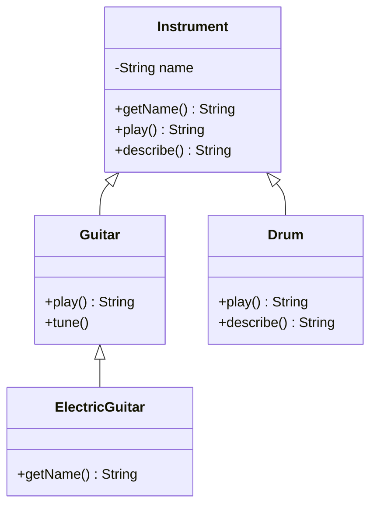

# Opgaver – Polymorfi

Dagens opgaver er delt op sådan:

* **Del A** – forudsig output. Ingen kode at skrive, kun at læse og tænke.
* **Del B** – biografbilletter. Grundopgaverne, hvor du selv bygger et lille klassehierarki.
* **Del C** – fjern en `instanceof`-kæde. Den vigtigste øvelse i forhold til Adventure del 4.
* **Udfordringer** – til dem, der vil videre.

Lav opgaverne i IntelliJ-projektet `uge40-arv-polymorfi`, i en ny package `dag5_polymorfi`. Fordi
hver del har sine egne klasser, er det en god idé at give hver del sin egen under-package, fx
`dag5_polymorfi.forudsig`, `dag5_polymorfi.billetter` og `dag5_polymorfi.beskeder`. Så støder
klassenavnene ikke sammen.

Der er [vejledende løsninger](loesninger.md) – men prøv selv først.

---

# Del A – Forudsig output

> **Skriv dit svar ned, før du kører koden.** Det er hele øvelsen. Hvis du bare kører koden, lærer
> du ingenting.

Alle opgaverne i del A bruger disse klasser. Skriv dem af (eller kopiér dem) ind i package
`dag5_polymorfi.forudsig`:

```java
public class Instrument {

    private String name;

    public Instrument(String name) {
        this.name = name;
    }

    public String getName() {
        return name;
    }

    public String play() {
        return "...";
    }

    public String describe() {
        return getName() + " siger " + play();
    }
}
```

```java
public class Guitar extends Instrument {

    public Guitar() {
        super("Guitaren");
    }

    @Override
    public String play() {
        return "plingeling";
    }

    public void tune() {
        System.out.println("Guitaren bliver stemt");
    }
}
```

```java
public class Drum extends Instrument {

    public Drum() {
        super("Trommen");
    }

    @Override
    public String play() {
        return "bum bum";
    }

    @Override
    public String describe() {
        return super.describe() + " (højt!)";
    }
}
```

```java
public class ElectricGuitar extends Guitar {

    @Override
    public String getName() {
        return "Elguitaren";
    }
}
```



## Opgave 1 – Opvarmning

Hvad skriver programmet?

```java
public class Opgave01 {

    public static void main(String[] args) {
        Instrument a = new Instrument("Kazooen");
        Guitar b = new Guitar();

        System.out.println(a.play());
        System.out.println(b.play());
        System.out.println(a.describe());
        System.out.println(b.describe());
    }
}
```

Den sidste linje er den interessante: `Guitar` har ingen `describe()` – den arver `Instrument`s. Hvordan ender
guitarens lyd i den?

## Opgave 2 – Variablen siger Instrument

```java
public class Opgave02 {

    public static void main(String[] args) {
        Instrument x = new Drum();

        System.out.println(x.play());
        System.out.println(x.describe());
    }
}
```

1. Hvad skriver programmet?
2. `Drum`s `describe()` kalder `super.describe()`. Hvilken `play()` bliver kaldt inde i
   `Instrument`s `describe()` – `Instrument`s eller `Drum`s?

## Opgave 3 – Tre led

`ElectricGuitar` overrider kun `getName()`. Den har hverken `play()` eller `describe()`.

```java
public class Opgave03 {

    public static void main(String[] args) {
        Instrument y = new ElectricGuitar();

        System.out.println(y.play());
        System.out.println(y.describe());
    }
}
```

1. Hvad skriver programmet?
2. Hvor finder Java `play()`, når `ElectricGuitar` ikke selv har den?

## Opgave 4 – Bandet

```java
import java.util.ArrayList;

public class Opgave04 {

    public static void main(String[] args) {
        ArrayList<Instrument> band = new ArrayList<>();
        band.add(new Guitar());
        band.add(new Drum());
        band.add(new Instrument("Kazooen"));
        band.add(new ElectricGuitar());

        for (Instrument instrument : band) {
            System.out.println(instrument.describe());
        }
    }
}
```

Hvad skriver programmet? Hvor mange forskellige udgaver af `describe()`, `play()` og `getName()`
er i spil i løbet af loopet?

## Opgave 5 – Stavefejlen

Nogen tilføjer en fløjte:

```java
public class Flute extends Instrument {

    public Flute() {
        super("Fløjten");
    }

    public String Play() {
        return "fiii";
    }
}
```

```java
public class Opgave05 {

    public static void main(String[] args) {
        Instrument f = new Flute();

        System.out.println(f.describe());
    }
}
```

1. Hvad skriver programmet? (Kig godt efter.)
2. Hvad sker der, hvis du skriver `@Override` over `Play()`?
3. Hvad lærer det dig om `@Override`?

## Opgave 6 – Kan det kompilere?

For hver linje: **kan den kompilere?** Hvis ja, og den skriver noget – hvad? Hvis nej – hvorfor
ikke? Hver linje skal ses for sig selv – bortset fra, at linje 4 bruger `i1` fra linje 1, linje 5
bruger `g2` fra linje 3, og linje 8 og 9 bruger `o` fra linje 7.

| # | Kode | Kompilerer? | Output / forklaring |
| --- | --- | --- | --- |
| 1 | `Instrument i1 = new Guitar();` | | |
| 2 | `Guitar g1 = new Instrument("Kazooen");` | | |
| 3 | `Guitar g2 = new ElectricGuitar();` | | |
| 4 | `i1.tune();` | | |
| 5 | `g2.tune();` | | |
| 6 | `Drum d = new Guitar();` | | |
| 7 | `Object o = new Drum();` | | |
| 8 | `o.play();` | | |
| 9 | `System.out.println(o);` | | |
| 10 | `ElectricGuitar e = new Guitar();` | | |

Tjek dine svar ved at skrive linjerne ind i en `main`-metode én ad gangen og se, hvad IntelliJ
siger.

> **Hjælp:** Brug de to spørgsmål fra README'en. *Må jeg kalde metoden?* – det afgør variablens
> type. *Hvilken udgave kører?* – det afgør objektets type.

## Opgave 7 – Cast

```java
public class Opgave07 {

    public static void main(String[] args) {
        Instrument i = new Guitar();
        Guitar g = (Guitar) i;
        g.tune();

        Instrument j = new Drum();
        Guitar h = (Guitar) j;
        h.tune();
    }
}
```

1. Kan programmet kompilere?
2. Hvad sker der, når det kører?
3. Hvorfor opdager compileren ikke problemet?
4. Hvordan kunne man beskytte castet? (Og: har `Instrument` brug for en `tune()`-metode, så man
   helt slap for castet?)

---

# Del B – Biografbilletter

En biograf sælger forskellige slags billetter. Alle billetter er til en bestemt film og har en
**grundpris**, men prisen, kunden betaler, afhænger af billettypen.

Lav klasserne i package `dag5_polymorfi.billetter`. Brug `int` til priser (hele kroner).

## Opgave 8 – Billet, børnebillet og pensionistbillet

Lav klassen `Ticket`:

* attributterne `movieTitle` (`String`) og `basePrice` (`int`), sat i constructoren
* `getMovieTitle()`
* `getPrice()` – returnerer grundprisen
* `getType()` – returnerer `"Voksen"`
* `getDescription()` – returnerer fx `Voksen: Dune – 120 kr.`. Brug `getType()` og `getPrice()`
  inde i metoden – **ikke** attributterne direkte.

Lav derefter to subklasser:

| Klasse | `getType()` | `getPrice()` |
| --- | --- | --- |
| `ChildTicket` | `"Barn"` | halv pris |
| `SeniorTicket` | `"Pensionist"` | 20 % rabat |

Brug `super.getPrice()` i subklasserne, så grundprisen kun står ét sted.

Test med:

```java
public class Opgave08 {

    public static void main(String[] args) {

        Ticket adult = new Ticket("Dune", 120);
        Ticket child = new ChildTicket("Dune", 120);
        Ticket senior = new SeniorTicket("Dune", 120);

        System.out.println(adult.getPrice());
        System.out.println(child.getPrice());
        System.out.println(senior.getPrice());
    }
}
```

Forventet output:

```text
120
60
96
```

Bemærk, at alle tre variable har typen `Ticket`.

> **Tip til 20 %:** `basePrice * 80 / 100` giver et helt tal. Gang først, og divider bagefter –
> skriver du `basePrice * (80 / 100)`, giver heltalsdivisionen `80 / 100` nemlig `0`.

## Opgave 9 – En bestilling

Lav en `ArrayList<Ticket>` med en bestilling til en familie: to voksne, et barn og en pensionist.
Løb listen igennem, udskriv hver billets beskrivelse, og læg prisen sammen.

Forventet output:

```text
Voksen: Dune – 120 kr.
Voksen: Dune – 120 kr.
Barn: Dune – 60 kr.
Pensionist: Dune – 96 kr.
I alt: 396 kr.
```

Svar på:

1. Du har ikke skrevet `getDescription()` i `ChildTicket`. Hvordan kan der så stå `Barn` og `60`?
2. Hvor mange `if`-sætninger har du brugt? (Svaret burde være nul.)

## Opgave 10 – VIP-billetten

Lav `VipTicket`:

* `getType()` returnerer `"VIP"`
* prisen er grundprisen **plus** 50 kr.
* en ekstra attribut `snack` (`String`, fx `"popcorn og cola"`), sat i constructoren, med en getter
  `getSnack()`

Prøv så:

```java
Ticket vip = new VipTicket("Dune", 120, "popcorn og cola");
System.out.println(vip.getSnack());
```

1. Hvad siger compileren? Hvorfor?
2. Ret det, så det virker – **uden** et cast.
3. Hvad skriver `vip.getDescription()`?

## Opgave 11 – Kvitteringen

Skriv en `static` metode i din main-klasse:

```java
public static void printReceipt(ArrayList<Ticket> tickets)
```

Den skal udskrive en kvittering med alle billetterne, en streg, totalen og antallet af billetter.
Test med en voksen-, en børne- og en VIP-billet.

Tilføj derefter en fjerde type, `StudentTicket` (`"Studerende"`, 30 kr. billigere end grundprisen),
og læg én i bestillingen.

**Hvor mange linjer skulle du ændre i `printReceipt` for at få studenterbilletten med?**

## Opgave 12 – Klassediagram

Tegn klassediagrammet over dine billetklasser – på papir, i [draw.io](https://app.diagrams.net/)
eller i Mermaid.

* Husk den åbne trekantpil fra subklasse til superklasse.
* Skriv kun de metoder i en subklasse, som den **selv** har (overrider eller tilføjer).

## Opgave 13 – `toString()`

Tilføj en `toString()` i `Ticket`, der returnerer `getDescription()`. Kun i `Ticket` – ikke i
subklasserne.

**Forudsig først**, hvad disse to linjer skriver, og kør dem så:

```java
System.out.println(order.get(1));    // order er bestillingen fra opgave 11
System.out.println(order);
```

Hvorfor virker det også for hele listen? (Tip: `ArrayList` har også en `toString()`.)

---

# Del C – Fjern if-kæden

> Det her er den øvelse, der ligner Adventure del 4 mest. Tag jer god tid til den.

Et system sender beskeder til kunder som e-mail, SMS eller push-besked i en app. Nogen har skrevet
det sådan her. Lav klasserne i package `dag5_polymorfi.beskeder`:

```java
public class Notification {

    private String recipient;
    private String text;

    public Notification(String recipient, String text) {
        this.recipient = recipient;
        this.text = text;
    }

    public String getRecipient() {
        return recipient;
    }

    public String getText() {
        return text;
    }
}
```

```java
public class EmailNotification extends Notification {

    public EmailNotification(String recipient, String text) {
        super(recipient, text);
    }
}
```

```java
public class SmsNotification extends Notification {

    public SmsNotification(String recipient, String text) {
        super(recipient, text);
    }
}
```

```java
public class PushNotification extends Notification {

    public PushNotification(String recipient, String text) {
        super(recipient, text);
    }
}
```

```java
public class NotificationService {

    public static String format(Notification notification) {

        if (notification instanceof EmailNotification) {
            return "E-mail til " + notification.getRecipient() + ": " + notification.getText();
        }
        else if (notification instanceof SmsNotification) {
            String text = notification.getText();
            if (text.length() > 20) {
                text = text.substring(0, 17) + "...";
            }
            return "SMS til " + notification.getRecipient() + ": " + text;
        }
        else if (notification instanceof PushNotification) {
            return "[App] " + notification.getText();
        }
        else {
            return "Besked til " + notification.getRecipient() + ": " + notification.getText();
        }
    }

    public static int getCostInOre(Notification notification) {

        if (notification instanceof SmsNotification) {
            return 25;
        }
        else {
            return 0;
        }
    }
}
```

## Opgave 14 – Kør det, som det er

```java
import java.util.ArrayList;

public class Opgave14 {

    public static void main(String[] args) {

        ArrayList<Notification> outbox = new ArrayList<>();
        outbox.add(new EmailNotification("kunde@example.com", "Din ordre er afsendt"));
        outbox.add(new SmsNotification("+4512345678", "Din pakke kan hentes i pakkeshoppen"));
        outbox.add(new PushNotification("app-bruger-17", "Nyt tilbud i appen"));

        int totalCost = 0;

        for (Notification notification : outbox) {
            System.out.println(NotificationService.format(notification));
            totalCost += NotificationService.getCostInOre(notification);
        }

        System.out.println("Pris i alt: " + totalCost + " øre");
    }
}
```

Output:

```text
E-mail til kunde@example.com: Din ordre er afsendt
SMS til +4512345678: Din pakke kan hen...
[App] Nyt tilbud i appen
Pris i alt: 25 øre
```

Det virker. Men svar på:

1. Hvor mange steder i koden står der noget om, hvad en SMS er?
2. Hvis der skal en fjerde type til – hvor mange steder skal du så ændre?
3. Hvad sker der, hvis du laver en ny type og glemmer at tilføje den i `format`? Får du en fejl?

## Opgave 15 – Refaktorér

Flyt viden om hver type ind i den klasse, den handler om:

1. Giv `Notification` metoderne `format()` og `getCostInOre()` (uden parametre). De skal gøre det,
   som `else`-grenene gør i dag.
2. Override dem i subklasserne – kun der, hvor typen gør noget andet end standarden.
3. Ret `main`, så den kalder `notification.format()` og `notification.getCostInOre()`.
4. Slet `NotificationService`.

**Krav:**

* Outputtet skal være **præcis det samme** som i opgave 14. (Det er det, der gør det til en
  refaktorering – strukturen ændres, opførslen gør ikke.)
* Der må ikke stå `instanceof` nogen steder.
* Der må ikke stå `System.out.println` i beskedklasserne – de returnerer tekst, og `main` skriver den
  ud. Det er samme regel som i Adventure.

## Opgave 16 – En ny type

Tilføj `LetterNotification` – et fysisk brev:

* format: `Brev til <modtager>: <tekst>`
* pris: 1400 øre

Læg et brev i `outbox`, og kør programmet.

**Hvor mange eksisterende klasser skulle du ændre?** Sammenlign med dit svar i opgave 14.2.

---

# Udfordringer

## Udfordring 1 – `==` og `equals`

Brug `Ticket` fra del B. **Forudsig** først, og kør bagefter:

```java
Ticket a = new Ticket("Dune", 120);
Ticket b = new Ticket("Dune", 120);
Ticket c = a;

System.out.println(a == b);
System.out.println(a.equals(b));
System.out.println(a == c);
System.out.println(a.equals(c));

String s1 = a.getMovieTitle();
String s2 = new String("Dune");

System.out.println(s1 == s2);
System.out.println(s1.equals(s2));
```

1. Hvorfor giver `a.equals(b)` det samme som `a == b`?
2. Hvorfor giver `s1.equals(s2)` noget andet end `s1 == s2`?
3. Hvilken klasses `equals` bliver kaldt i hver af de to tilfælde?

## Udfordring 2 – Er det virkelig arv?

Biografen vil have en **ledsagerbillet** til den, der følger en kørestolsbruger, og den skal
koste det samme som en børnebillet. En kollega foreslår:

```java
public class CompanionTicket extends ChildTicket { ... }
```

Det virker jo – prisen bliver den samme. Men:

1. Prøv sætningen *"en ledsagerbillet **er en** børnebillet"*. Holder den?
2. Hvad står der på kvitteringen, hvis `CompanionTicket` ikke overrider `getType()`?
3. Hvad sker der med ledsagerbilletten, hvis biografen næste år sætter prisen på børnebilletten
   ned?
4. Hvordan ville du hellere gøre?

## Udfordring 3 – Jagt på `instanceof` i jeres Adventure

Søg efter `instanceof` i jeres Adventure-projekt (<kbd>Ctrl</kbd>+<kbd>Shift</kbd>+<kbd>F</kbd>, på
Mac <kbd>Cmd</kbd>+<kbd>Shift</kbd>+<kbd>F</kbd>).

For hvert sted:

1. Er det nødvendigt? (`eat` skal kunne skelne mad fra ikke-mad – det er i orden.)
2. Eller kunne en metode i `Item`, som `Food` overrider, gøre det samme?

Prøv derefter at give `Item` en metode `getInventoryText()`, som `Food` overrider, så `inventory`
viser `(edible)` efter mad – som i README'en. Test, at `take`, `drop` og `eat` stadig virker.

## Udfordring 4 – Kig frem på del 4

Læs kravene i [Adventure del 4 – Weapons](../../projekter/adventure/del-4-weapons.md).

Uden at skrive kode – på papir:

1. Skriv de tre kommandoer `equip`, `attack` og `inventory` op, og notér, hvad der skal ske for et
   **sværd** og for en **revolver**.
2. Hvilke metoder skal `Weapon` have, så `Player.attack()` **aldrig** behøver vide, hvilken slags
   våben den har?
3. Skriv `attack()` i pseudokode, hvor du kun bruger de metoder.
4. Hvad skal `Weapon`s **egen** udgave af de metoder returnere? Findes der et fornuftigt svar?

Gem dine noter til mandag – de passer lige ind i gennemgangen af abstrakte klasser.

## Udfordring 5 – Polymorfi i constructoren

En svær en. **Forudsig** output, før du kører:

```java
public class Counter {

    public Counter() {
        System.out.println("Start: " + describe());
    }

    public String describe() {
        return "en tæller";
    }
}
```

```java
public class StepCounter extends Counter {

    private int step = 5;

    public StepCounter() {
        super();
        System.out.println("Færdig: " + describe());
    }

    @Override
    public String describe() {
        return "en skridttæller med step " + step;
    }
}
```

```java
public class Udfordring5 {

    public static void main(String[] args) {
        Counter counter = new StepCounter();
        System.out.println("Til sidst: " + counter.describe());
    }
}
```

1. Hvilken `describe()` bliver kaldt i `Counter`s constructor?
2. Hvorfor står der ikke `5` i den første linje?
3. Hvad lærer det dig om at kalde metoder, der kan overrides, fra en constructor?

> Tip: Sæt et breakpoint i `StepCounter`s constructor, og følg `step` med <kbd>F7</kbd> og
> <kbd>F8</kbd> i debuggeren.
