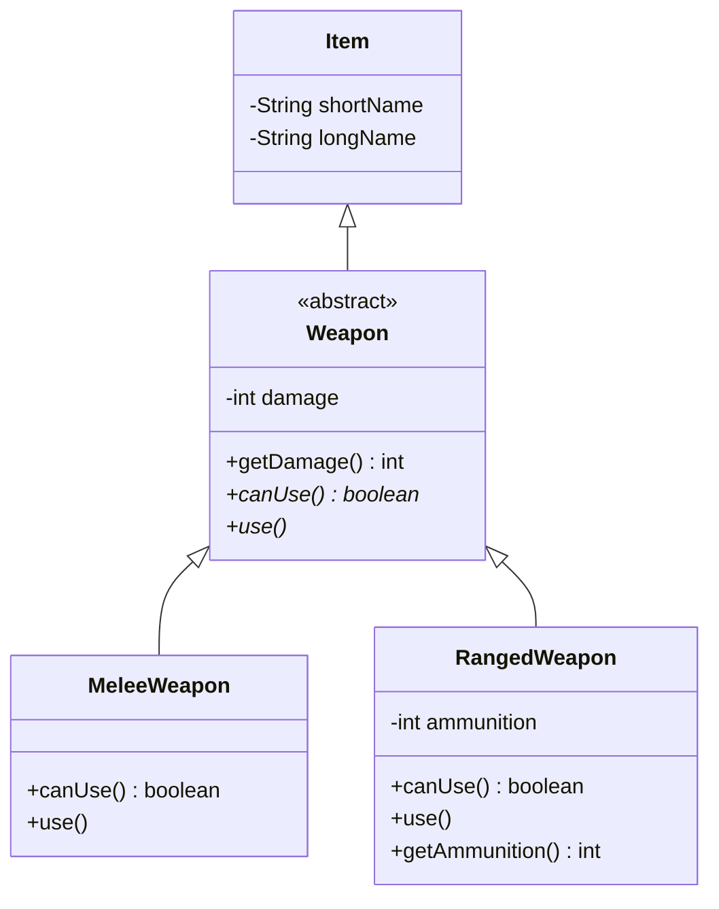

# Adventure del 4 – abstrakte klasser

## Beskrivelse

I fredags lærte I **polymorfi**: at det samme metodekald kan gøre forskellige ting, alt efter
hvilket objekt der står bag.

I dag sætter vi det i system med **abstrakte klasser**. En abstrakt klasse er en klasse, man aldrig
kan lave et objekt af – den findes kun for at give sine subklasser en fælles form.

Det er præcis, hvad [Adventure del 4](../../projekter/adventure/del-4-weapons.md) har brug for:
`Weapon` beskriver, hvad **alle** våben kan, mens `MeleeWeapon` og `RangedWeapon` bestemmer,
**hvordan** de gør det. Og resten af programmet kender kun `Weapon`.

Den regel er hård og eksplicit i opgaven: **der må ikke stå
`if (weapon instanceof RangedWeapon)` nogen steder.** I dag lærer vi, hvorfor det er et krav – og
hvordan man undgår det.

## Læringsmål

Når du har arbejdet med dagens materiale, skal du kunne:

* skrive en `abstract` klasse og forklare, hvorfor den ikke kan instantieres
* skrive en `abstract` metode uden krop
* forklare hvorfor en subklasse **skal** implementere alle abstrakte metoder
* forklare hvad polymorfi giver os i praksis
* skrive kode, der kun kender superklassens type, men opfører sig forskelligt
* forklare hvorfor `instanceof` er et **designproblem**, ikke bare en dårlig vane
* kende forskel på en **abstrakt klasse** og et **interface**

## Se disse videoer før undervisningen:

* [abstraction](https://www.youtube.com/watch?v=xTtL8E4LzTQ&list=PLEeqf0uSZqXsz7oU2U-VAxhQZ021PRVnd&t=7h51m58s) (til: 08:01:30)

Til genopfriskning – de samme to videoer som i fredags:

* [polymorphism](https://www.youtube.com/watch?v=xTtL8E4LzTQ&list=PLEeqf0uSZqXsz7oU2U-VAxhQZ021PRVnd&t=8h7m44s) (til: 08:14:27)
* [runtime polymorphism](https://www.youtube.com/watch?v=xTtL8E4LzTQ&list=PLEeqf0uSZqXsz7oU2U-VAxhQZ021PRVnd&t=8h14m27s) (til: 08:19:35)

## Læs nedenstående før undervisningen

---

### Problemet med instanceof

Forestil dig, at vi laver våben uden abstrakte klasser. `Player.attack()` kunne se sådan ud:

```java
public void attack() {

    if (equipped instanceof RangedWeapon) {
        RangedWeapon ranged = (RangedWeapon) equipped;

        if (ranged.getAmmunition() > 0) {
            ranged.setAmmunition(ranged.getAmmunition() - 1);
            // ...
        }
        else {
            // "The weapon is empty"
        }
    }
    else if (equipped instanceof MeleeWeapon) {
        // ...
    }
}
```

Det virker. Men se, hvad der sker, når vi vil tilføje et **tredje** våben – f.eks. en tryllestav,
der genoplader sig selv over tid.

Vi skal finde **hvert eneste sted** i programmet, hvor der står `instanceof`, og tilføje en gren.
Glemmer vi ét, opfører tryllestaven sig som et slagvåben, og der kommer ingen fejl – programmet
gør bare noget forkert.

> **Det er derfor `instanceof` er et designproblem.** Ikke fordi det er grimt, men fordi det spreder
> viden om typerne ud over hele programmet. Hver ny type tvinger dig til at ændre kode mange steder.

Løsningen er at vende det om: i stedet for at spørge objektet, *hvad det er*, beder vi det om at
**gøre noget**, og lader det selv finde ud af hvordan.

---

### Abstrakte klasser

En **abstrakt klasse** er en klasse, man ikke kan lave objekter af:

```java
public abstract class Weapon extends Item {

    private int damage;

    public Weapon(String shortName, String longName, int damage) {
        super(shortName, longName);
        this.damage = damage;
    }

    public int getDamage() {
        return damage;
    }

    public abstract boolean canUse();

    public abstract void use();
}
```

Prøver du:

```java
Weapon w = new Weapon("weapon", "a weapon", 10);
```

siger compileren:

```text
Weapon is abstract; cannot be instantiated
```

Og det er meningen. Hvad *er* et generisk våben? Der findes ikke sådan et i spillet. Der findes
sværd og revolvere.

> Opgaven siger det direkte: *"Weapon selv skal til gengæld aldrig instantieres, der må ikke stå
> `new Weapon()` et eneste sted i koden."* Ved at gøre klassen `abstract` gør vi det **umuligt** at
> bryde reglen ved et uheld. Compileren håndhæver den for os.

### Abstrakte metoder

Læg mærke til de to nederste:

```java
public abstract boolean canUse();
public abstract void use();
```

De har **ingen krop** – kun et semikolon. De siger: *"alle våben kan det her, men jeg ved ikke
hvordan – det må subklasserne bestemme."*

To regler:

1. En klasse med mindst én abstrakt metode **skal** selv være `abstract`.
2. En subklasse **skal** implementere alle arvede abstrakte metoder – ellers skal den også være
   abstrakt.

Punkt 2 er guld værd: compileren minder dig om det, du har glemt.

### Subklasserne

```java
public class MeleeWeapon extends Weapon {

    public MeleeWeapon(String shortName, String longName, int damage) {
        super(shortName, longName, damage);
    }

    @Override
    public boolean canUse() {
        return true;                    // et sværd løber aldrig tør
    }

    @Override
    public void use() {
        // ingenting – sværdet slides ikke
    }
}
```

```java
public class RangedWeapon extends Weapon {

    private int ammunition;

    public RangedWeapon(String shortName, String longName, int damage, int ammunition) {
        super(shortName, longName, damage);
        this.ammunition = ammunition;
    }

    @Override
    public boolean canUse() {
        return ammunition > 0;
    }

    @Override
    public void use() {
        ammunition--;
    }

    public int getAmmunition() {
        return ammunition;
    }
}
```



Det er det samme diagram som i opgaven – navne og returtyper er i øvrigt op til jer, det afgørende
er, at metoderne er erklæret i `Weapon`.

---

### Og nu bliver attack simpel

```java
public void attack() {

    if (equipped == null) {
        // "You have no weapon equipped"
        return;
    }

    if (!equipped.canUse()) {
        // "Your weapon is out of ammunition"
        return;
    }

    equipped.use();

    // ramte noget med equipped.getDamage()
}
```

Ingen `instanceof`. Ingen cast. Ingen viden om, hvilke slags våben der findes.

Og det bedste: **når vi tilføjer tryllestaven, skal denne metode ikke ændres.**

```java
public class MagicWand extends Weapon {

    private int charges;
    private int turnsSinceUse;

    public MagicWand(String shortName, String longName, int damage, int charges) {
        super(shortName, longName, damage);
        this.charges = charges;
    }

    @Override
    public boolean canUse() {
        return charges > 0;
    }

    @Override
    public void use() {
        charges--;
        turnsSinceUse = 0;
    }
}
```

Færdig. `attack()` virker med det samme.

> Det er det, polymorfi køber os: **du kan tilføje en ny type uden at ændre den kode, der bruger
> den.** Det princip har et navn – *Open/Closed Principle*: åben for udvidelse, lukket for ændring.

---

### Hvad sker der egentlig?

Når Java kører

```java
equipped.canUse()
```

kigger den **ikke** på, hvad variablen er erklæret som (`Weapon`). Den kigger på, hvad objektet
**faktisk er** – og kalder den udgave.

Det kaldes **dynamic dispatch** eller *runtime polymorphism*. Beslutningen tages, mens programmet
kører – ikke da det blev kompileret.

Derfor kan du gøre sådan her:

```java
Weapon[] weapons = {
    new MeleeWeapon("sword", "a rusty sword", 12),
    new RangedWeapon("revolver", "an old revolver", 25, 6),
    new MagicWand("wand", "a gnarled wand", 40, 3)
};

for (Weapon weapon : weapons) {
    System.out.println(weapon.getLongName() + ": " + weapon.canUse());
}
```

Ét loop. Tre forskellige opførsler. Loopet ved ikke, hvilke typer der findes.

---

### Hvornår er en klasse abstrakt?

Spørg: **giver det mening at lave et objekt af den?**

| Klasse | Abstrakt? | Hvorfor |
| --- | --- | --- |
| `Weapon` | ja | "et våben" er ikke noget konkret |
| `MeleeWeapon` | nej | et sværd er et konkret våben |
| `Animal` | ja | man møder ikke "et dyr" – man møder en hund |
| `Dog` | nej | konkret |
| `Item` | nej* | en lampe er bare et item, uden at være noget mere |

\* I Adventure er `Item` **ikke** abstrakt, fordi der findes ting, som kun er ting.

---

### Abstrakt klasse eller interface?

I får begge dele senere; her er den korte forskel:

| | Abstrakt klasse | Interface |
| --- | --- | --- |
| Kan have attributter | ja | nej (kun konstanter) |
| Kan have færdig kode | ja | ja (default-metoder), men sjældent |
| Hvor mange kan man arve | **én** | mange |
| Udtrykker | "er en slags" | "kan noget" |

Tommelfingerregel: **abstrakt klasse** når typerne deler både data og opførsel og hører til samme
familie. **Interface** når helt forskellige klasser skal kunne det samme.

`Weapon` er en abstrakt klasse, fordi alle våben har `damage` – altså fælles data.

> I møder interfaces rigtigt i uge 43–45, når vi skal sortere i filmsamlingen.

> Vil du prøve at *bruge* et interface allerede nu, så se den frivillige vejledning
> [Lav dit eget tekstspil](../../00_vejledninger/tekstspil/README.md) – der skriver du to klasser med `implements`.

---

### Sådan hænger det sammen med opgaven

| Det du lærte | Sådan bruges det i del 4 |
| --- | --- |
| `abstract class` | `Weapon` kan ikke instantieres |
| `abstract` metode | `canUse()` og `use()` |
| Override i subklasser | `MeleeWeapon` og `RangedWeapon` |
| Kun superklassens type udadtil | `Player` kender kun `Weapon` |
| Intet `instanceof` | `attack()` uden typetjek |

---

## Det vigtigste at tage med

* en `abstract` klasse kan **ikke** instantieres – det er en fordel, ikke en begrænsning
* en `abstract` metode har ingen krop; subklassen **skal** implementere den
* har en klasse en abstrakt metode, skal klassen selv være abstrakt
* polymorfi: Java kalder objektets **faktiske** udgave, ikke variablens type
* `instanceof` spreder viden om typer ud i hele programmet – undgå det
* skriv kode, der kun kender superklassen, så nye typer kan tilføjes uden ændringer
* abstrakt klasse = "er en slags"; interface = "kan noget"

## Aktiviteter i undervisningen

### 1. Opsamling på Animal

Vi tager fat i `Animal`-øvelsen fra i onsdags:

* Hvad sagde compileren, da I skrev `new Animal(5)`?
* Hvad ville der ske, hvis `Dog` ikke implementerede `makeSound()`?
* Lav et array af `Animal`, læg både `Dog` og `Cat` i det, og løb det igennem med et loop, der
  kalder `makeSound()`. Hvad sker der?

### 2. Polymorfi-øvelsen

Klon [Dat24v2_PolymorfiExercise](https://github.com/ETALATE/Dat24v2_PolymorfiExercise).

Projektet består af `Shape`, `Circle`, `Rectangle` og `Geometry`. Det meste af koden er fyldt ud i
`Shape`, `Circle` og `Rectangle`, men `Geometry`-klassen, som holder på `main()`, er ufuldstændig –
det er der, du kommer til at skrive mest.

Læs koden i rækkefølgen `Shape.java` → `Circle.java` → `Rectangle.java` → `Geometry.java`, og dan
dig et overblik over deres indbyrdes forhold.

### 3. Adventure del 4

Arbejd med [Adventure del 4 – Weapons](../../projekter/adventure/del-4-weapons.md).

Følg den [anbefalede procedure](../../projekter/adventure/del-4-weapons.md#anbefalet-procedure).

**Den vigtigste øvelse i dag:** hver gang du er ved at skrive `instanceof`, så stop og spørg:

> *Hvilken metode kunne jeg lægge på `Weapon`, så jeg slap for at vide, hvilken slags våben det er?*

Det er den ene vane, der gør forskellen på at bruge arv og at bruge det **rigtigt**.

**Deadline for del 4: i dag kl. 23:59.**

I morgen går vi i gang med [del 5 – Enemies](../../projekter/adventure/del-5-enemies.md), som er
den endelige aflevering.
