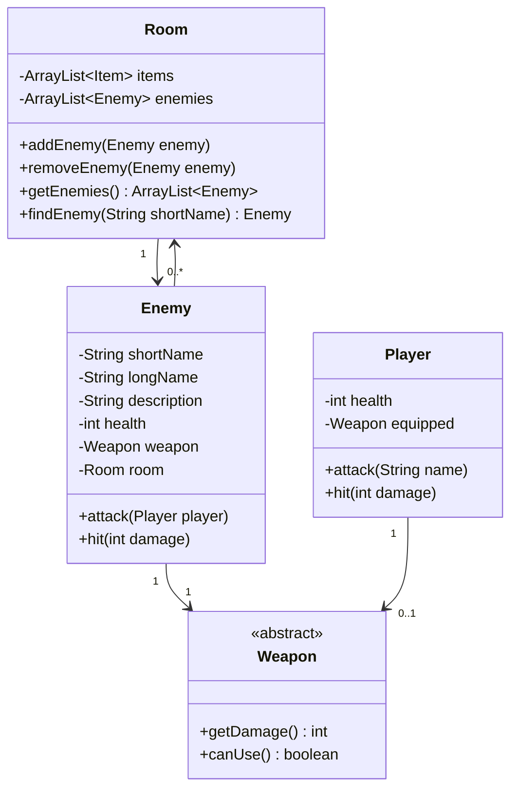

# Adventure del 5 – Enemies

## Beskrivelse

Sidste fase. I dag tilføjer vi **fjender**, som spilleren kan angribe – og som slår igen.

Der er ikke meget ny teori i dag. Alt det tekniske har I: arv, polymorfi, abstrakte klasser,
lister, referencer. Det nye er, at **attack-sekvensen er den mest komplicerede ting, I har kodet
indtil nu**. Der er mange udfald, og de skal alle håndteres.

Derfor gør vi noget, der kan føles bagvendt: **vi tegner, før vi koder.** I bruger den første del
af dagen på et aktivitetsdiagram, og først derefter går I i gang med koden.

Det er også i dag, dokumentationskravet træder i kraft. Den endelige aflevering er en
**gruppeaflevering** og skal indeholde både klassediagram og aktivitetsdiagram.

## Læringsmål

Når du har arbejdet med dagens materiale, skal du kunne:

* designe et samspil mellem objekter, hvor hvert objekt har sit eget ansvar
* tegne et aktivitetsdiagram for et forløb med mange udfald – **før** du koder
* placere ansvaret for at dø, droppe våben og forsvinde hos det objekt, det angår
* tegne et komplet klassediagram over dit eget færdige program
* forklare, hvorfor `Enemy` **ikke** skal arve fra `Item`
* forberede og gennemføre en kort præsentation af jeres eget projekt

## Se disse videoer før undervisningen:

Ingen ny video i dag. **Læs i stedet
[Adventure del 5 – Enemies](../../projekter/adventure/del-5-enemies.md) helt igennem**, især
afsnittet om attack-sekvensen.

Genlæs desuden dine egne noter om aktivitetsdiagrammer fra
[14-09](../../38/01_man_2026-09-14/README.md) – du får brug for dem i dag.

## Læs nedenstående før undervisningen

---

### Enemy er ikke et Item

Første designbeslutning, og opgaven er skarp på den:

> `Enemy` skal være en klasse **helt for sig selv**, og altså **ikke** arve fra `Item`.

Hvorfor ikke? Prøv sætningen: *"En fjende **er en** ting, man kan samle op og bære rundt på."*

Nej. En fjende kan ikke tages, droppes eller lægges i inventory. Den deler ingen opførsel med items
ud over at befinde sig i et rum – og det er ikke nok til at retfærdiggøre arv.

Derfor får `Room` en **særskilt liste** med sine egne add- og get-metoder:

```java
public class Room {
    private ArrayList<Item> items;
    private ArrayList<Enemy> enemies;
}
```

> Det er en god påmindelse om, at arv ikke er en genvej til genbrug. Arv er en **udtalelse om, hvad
> noget er**. Det er den samme fejl, man laver, hvis man lader `Room` arve fra `Item`, fordi begge
> har et navn og en beskrivelse.

### Hvad Enemy skal kunne

En enemy har et kort og et langt navn (som `Item`), en beskrivelse, et health-niveau og **ét**
weapon. Til forskel fra `Player` har den altid sit eneste våben equipped og kan ikke skifte.

Enemyens våben er et ganske almindeligt `Weapon`-objekt, som spilleren kan overtage, når enemyen
dør – så det skal kunne droppes i rummet.

`Enemy` skal, ligesom `Player`, have `attack`- og `hit`-metoder:

* **`attack`** – angrib player med sit våben
* **`hit`** – bliv angrebet af players våben

Og – det her er den vigtige del:

> `Enemy` skal **selv** opdage, om den er død, droppe sit weapon, og forsvinde fra rummets liste
> over enemies, samt eventuelt efterlade et item.

Det er Information Expert igen. `Enemy` er den eneste, der kender sin egen health. Så det er også
`Enemy`, der skal opdage, at den er nået til nul – ikke `Player`, og ikke `Adventure`. For at kunne
fjerne sig selv fra rummet skal `Enemy` kende det rum, den står i – deraf `Room`-attributten i
diagrammet.



---

### Hvorfor tegne først?

Læs attack-sekvensen i opgaven, og prøv at tælle, hvor mange spørgsmål der skal besvares undervejs:

* har spilleren overhovedet et våben equipped?
* kan våbenet bruges – har det skud tilbage?
* blev der angivet et navn på en fjende?
* findes den fjende i rummet?
* er der overhovedet fjender i rummet?
* døde fjenden af angrebet?
* slog fjenden igen?
* døde spilleren?

Otte spørgsmål. Hver med to udfald. Det er for meget at holde i hovedet, mens man skriver kode – og
det er præcis den slags, hvor man opdager tre glemte tilfælde tre dage senere.

Et aktivitetsdiagram lader dig se **alle veje igennem på én gang**. Og det er langt hurtigere at
rette en pil end at omskrive en metode.

> Opgaven siger det ligeud: *"Der er meget at tage hensyn til – så tegn og diskutér **før** I
> koder!"* Aktivitetsdiagrammet må gerne tegnes på papir.

### Husk reglen om Weapon

Når du tegner, skal du huske kravet fra [del 4](../../projekter/adventure/del-4-weapons.md), som
[del 5](../../projekter/adventure/del-5-enemies.md) gentager i den anbefalede procedure:

> **Ingen test på, om det er et `RangedWeapon`.** `Weapon`-objektet skal selv fortælle, om det
> stadig kan bruges.

Så i dit diagram skal decisionen hedde *"kan våbenet bruges?"* – ikke *"er det et skydevåben, og har
det skud tilbage?"*.

### Tænk også på beskederne

En stor del af attack-sekvensen handler ikke om regler, men om **hvad spilleren får at vide**:

* om der overhovedet er et våben
* om våbenet stadig er brugbart
* om det var det sidste skud, der blev brugt
* om man ramte en fjende eller det tomme rum
* hvordan fjenden reagerer
* hvad der sker, hvis fjenden dør
* hvad der sker, hvis man selv bliver ramt

Alle disse skal komme fra `UserInterface` – ikke fra `Player` eller `Enemy`. Det er stadig den
regel, I satte op i [refactor-fasen](../../projekter/adventure/del-1-refactor.md).

---

### Dokumentationen

Til den endelige aflevering skal der afleveres en **pdf** med:

* **Forside** med spillets navn, et cover-billede, link til jeres GitHub-repository (både klikbart og
  udskrevet), og navne + GitHub-brugernavne på alle gruppemedlemmer
* **Klassediagram** over alle klasser, associationer og arveforhold
* **Aktivitetsdiagram** over attack-sekvensen

To ting at være opmærksom på:

* **Klassediagrammet skal være det gældende** for det færdige produkt. Det er dokumentation af det,
  I byggede.
* **Aktivitetsdiagrammet er et designdokument.** Det behøver ikke afspejle senere ændringer i koden.
  Det viser, hvordan I tænkte, før I kodede.

> **Afleveringen er en gruppeaflevering.** Én i gruppen afleverer pdf'en og linket på hele gruppens
> vegne – men alle i gruppen skal kunne stå inde for og forklare både koden og diagrammerne.

---

## Det vigtigste at tage med

* `Enemy` arver **ikke** fra `Item` – en fjende *er ikke* en ting, man kan samle op
* `Room` får en særskilt liste til enemies
* `Enemy` opdager **selv**, at den er død, dropper sit våben og fjerner sig selv fra rummet
* attack-sekvensen har mange udfald – **tegn før du koder**
* ingen `instanceof` på våben; spørg `canUse()`
* alle beskeder til spilleren skal gå gennem `UserInterface`
* den endelige aflevering er en **gruppeaflevering** og skal indeholde klassediagram og aktivitetsdiagram

## Aktiviteter i undervisningen

### 1. Tegn attack-sekvensen (formiddag)

**Kod ikke endnu.** Sæt jer sammen i gruppen med papir eller [draw.io](https://app.diagrams.net/) og
tegn aktivitetsdiagrammet for attack-sekvensen.

Krav – de samme som i [14-09](../../38/01_man_2026-09-14/README.md):

* hver decision har præcis to udfald
* ingen krydsende linjer
* så få gentagne actions som muligt

Når I tror, I er færdige, så **byt diagram med en anden gruppe**. Kan de finde et tilfælde, I ikke
har håndteret? Det plejer at kunne lade sig gøre.

Gem diagrammet – det skal med i afleveringen.

### 2. Kod attack-sekvensen

Arbejd med [Adventure del 5 – Enemies](../../projekter/adventure/del-5-enemies.md).

Rækkefølge, der plejer at virke:

1. Lav `Enemy`-klassen med navn, beskrivelse, health og weapon
2. Giv `Room` sin liste over enemies, og læg nogle fjender ud i `Map`
3. Udvid `UserInterface`, så rumbeskrivelsen også nævner fjender
4. Kod `attack` **efter jeres diagram** – én gren ad gangen
5. Til sidst: at fjenden dør, dropper sit våben og forsvinder

Test efter hvert trin.

### 3. Klassediagrammet

Tegn klassediagrammet over jeres færdige program. **Tegn det selv** – ikke autogenereret fra
IntelliJ.

Det skal vise alle klasser, arveforhold og associationer med multiplicitet.

---

## Resten af ugen

| Dag | |
| --- | --- |
| **ons 07-10** | UDVIKLINGSDAG DIGITAL – tjek TimeEdit/itslearning for, om der er undervisning |
| **tor 08-10** | Arbejde med Adventure-projektet. **Endelig aflevering kl. 23:59** |
| **fre 09-10** | Præsentation af færdige projekter |

### Forbered præsentationen

På fredag skal hver gruppe præsentere. I har **10 minutter**:

* kør programmet – vis f.eks. en sjov feature (maks. 2 minutter)
* præsentér noget kode, I er særligt stolte over
* tag spørgsmål fra holdet (maks. 4 minutter)

Lidt inspiration til, hvad I kan vælge:

* demo af programmet og interessante features
* en kodedel, der løser et specifikt problem – f.eks. `eat` eller `attack`
* særlige elementer i jeres løsning: arv, polymorfi, enum
* programmets overordnede design og ansvarsfordelingen mellem klasserne

> Vælg noget, I selv synes var svært at få til at virke. Det er næsten altid det mest interessante
> for de andre at høre om.
