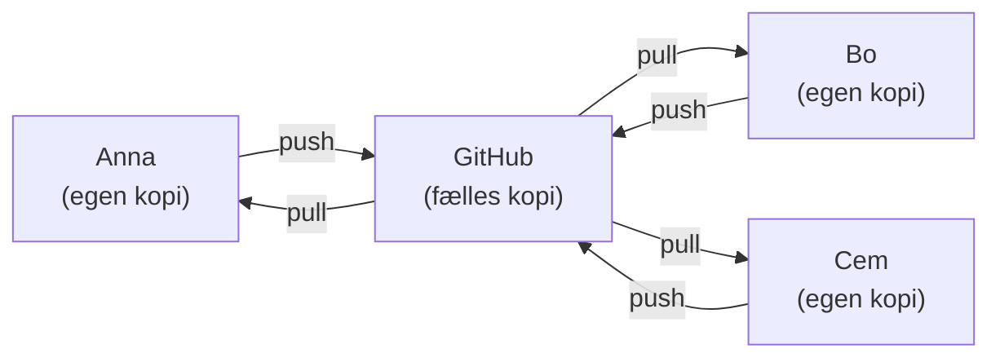
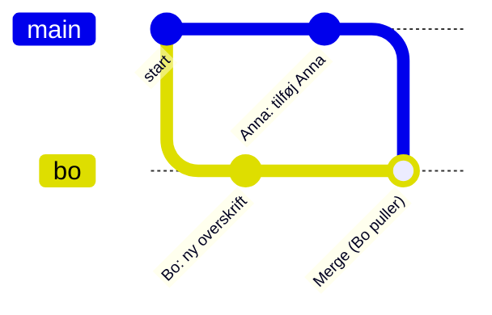

# GitHub i grupper

## Beskrivelse

I dag starter [Filmsamling](../../projekter/filmsamling/readme.md) – projektet, der fylder de næste
tre uger. Det er et gruppeprojekt i **ét fælles GitHub-repository**, og det er nyt.

I uge 39 lærte I Git **alene**: `commit`, `push` og `pull` til jeres eget repository. I Adventure
sad I som regel sammen ved én computer. I filmsamlingen skal I **arbejde parallelt**: én skriver
`Movie`, en anden `UserInterface` – og alle pusher til det samme repository.

Så snart to personer arbejder i det samme repository, sker der noget nyt: GitHub kan have commits,
som **du** ikke har. Git skal så **flette** jeres arbejde sammen – og nogle gange kan Git ikke
afgøre, hvordan. Det kaldes en **merge-konflikt**.

Konflikter er ikke farlige, men de er forvirrende første gang. Derfor laver I dem **med vilje** i
dag – mens der ikke står noget på spil – så I ved, hvad I skal gøre, når de dukker op midt i
projektet.

Dagen har to dele:

1. [Filmsamling del 0 – Fælles repository](../../projekter/filmsamling/del-0-github.md): gruppens
   repository, et Maven-projekt, collaborators og jeres første konflikt.
2. [Dagens opgaver](opgaver.md): en række konfliktøvelser i et øve-repository, fra den nemme til
   den lumske.

## Læringsmål

Når du har arbejdet med dagens materiale, skal du kunne:

* forklare, hvorfor GitHub **afviser** et push, når en anden har pushet før dig
* forklare, hvad `pull` gør: henter de andres commits og **merger** dem ind i dine
* forudsige, hvornår Git selv kan flette to ændringer, og hvornår der opstår en **konflikt**
* læse konfliktmarkeringerne `<<<<<<<`, `=======` og `>>>>>>>`
* løse en konflikt i IntelliJ og i en teksteditor – og afslutte med en merge-commit
* forklare, hvorfor en merge **uden** konflikt stadig kan give kode, der ikke kompilerer
* arbejde efter de fem regler for gruppearbejde på `main`

## Se disse videoer før undervisningen:

* [IntelliJ IDEA: Resolving Merge Conflicts in Git](https://www.youtube.com/watch?v=WgipWkaU2MM)
  (JetBrains, 5:34) – viser konfliktvinduet i IntelliJ.

> **Bemærk:** I videoen opstår konflikten, fordi en **branch** merges ind i `main`. Branches kommer
> vi først til i november. Hos jer opstår konflikten, når I **puller** – men vinduet og knapperne
> er præcis de samme.

Er Git fra uge 39 ved at være glemt, så kig
[Git og GitHub – introduktion](../../39/01_man_2026-09-21/README.md) igennem igen, især afsnittet
*Arbejdsflowet: Fra lokalt til GitHub*.

## Læs nedenstående før undervisningen

---

### Hver har sin egen kopi

Når tre personer har clonet det samme repository, er der **fire** kopier af historikken: én på
GitHub og én på hver computer. De er ikke automatisk ens. Din commit ligger kun på din computer,
indtil du pusher den, og de andres commits kommer først til dig, når du puller.



Anna og Bo taler **aldrig** direkte med hinanden – alt går gennem GitHub.

### Når dit push bliver afvist

Forestil dig, at Anna og Bo begge har pullet i morges og nu har lavet hver sin commit. Anna pusher
først. Det går fint. Så pusher Bo:

```text
 ! [rejected]        main -> main (fetch first)
error: failed to push some refs to 'https://github.com/...'
hint: Updates were rejected because the remote contains work that you do
hint: not have locally.
```

GitHub **nægter** at tage imod Bos commit. Hvorfor? Fordi GitHub har Annas commit, som Bo ikke har.
Tog GitHub imod Bos commit, ville Annas arbejde forsvinde.

Løsningen er altid den samme: Bo skal **pulle** først – hente Annas commit og flette den sammen med
sin egen – og **derefter** pushe.

> **Et afvist push er ikke en fejl.** Det er GitHub, der passer på de andres arbejde.

### Hvad pull egentlig gør

`pull` gør to ting:

1. **Henter** de nye commits fra GitHub (det hedder `fetch`).
2. **Merger** dem ind i dine egne.

Har du ikke selv lavet nogen commits, siden du sidst pullede, er det nemt: dine filer bliver bare
opdateret. Har du **og** en anden lavet commits, er historikken gået i to spor, og Git laver en
**merge-commit**, der samler dem:



(Diagrammet tegner Bos spor som en gren, så man kan se, hvor historikken deler sig. I laver ikke
selv branches – Git gør det her helt af sig selv, når I puller.)

Merge-commit'en er helt normal. Den står i historikken som `Merge branch 'main' of https://...`.
Når Bo har pushet den, har GitHub både Annas og Bos arbejde.

### Hvornår kan Git selv flette?

Git fletter **linje for linje**. Det afgørende er, om I har ændret de **samme linjer**:

| Anna ændrer | Bo ændrer | Hvad sker der? |
|---|---|---|
| `Movie.java` | `UserInterface.java` | Git fletter selv – ingen konflikt |
| øverst i `README.md` | nederst i `README.md` | Git fletter selv – ingen konflikt |
| linje 3 i `Main.java` | **den samme** linje 3 | **Konflikt** |
| tilføjer en linje sidst i en tabel | tilføjer **også** en linje sidst i tabellen | **Konflikt** – begge har skrevet det samme sted |

Den sidste række overrasker de fleste. To nye linjer det samme sted er en konflikt, fordi Git ikke
kan vide, hvilken linje der skal stå først – eller om begge skal med.

Det er derfor, [regel nummer to](../../projekter/filmsamling/readme.md#gruppearbejde-og-git) i
projektet er **én fil – én person ad gangen**. Så rammer I næsten aldrig de samme linjer.

### Sådan ser en konflikt ud

Når Git ikke kan flette, skriver den **begge** udgaver ind i filen med markeringer omkring:

```text
public class Main {
    public static void main(String[] args) {
<<<<<<< HEAD
        System.out.println("Velkommen til Filmarkivet!");
=======
        System.out.println("Velkommen til Annas filmhylde!");
>>>>>>> f9472589715c3dc3aa5de57155537cd52f835fff
    }
}
```

| Del | Betyder |
|---|---|
| `<<<<<<< HEAD` | Herfra og ned til `=======` står **din** udgave |
| `=======` | Skillelinjen |
| `>>>>>>> f947258...` | Ovenfor, op til `=======`, står udgaven fra **GitHub** (den lange kode er commit'ens id) |

Filen kompilerer ikke, så længe markeringerne står der. At **løse** konflikten er at bestemme, hvad
der skal stå – den ene udgave, den anden, begge eller noget helt tredje – og fjerne markeringerne.

### Løs konflikten i IntelliJ

IntelliJ viser ikke markeringerne direkte. Når du puller og der er en konflikt, åbner vinduet
**Conflicts** med en liste over filerne. Du har tre valg:

| Knap | Betyder |
|---|---|
| **Accept Yours** | Behold din udgave af hele filen – de andres ændringer i filen forsvinder |
| **Accept Theirs** | Brug GitHubs udgave af hele filen – dine ændringer i filen forsvinder |
| **Merge...** | Åbn filen og afgør konflikten linje for linje – **brug den** |

**Merge...** (i nyere versioner af IntelliJ hedder knappen **Resolve Manually**) viser tre kolonner: din udgave til venstre, **resultatet** i midten og GitHubs udgave
til højre. De ændringer, Git kunne flette selv, er allerede lagt ind. Konflikterne er røde. Klik på
pilene (`>>` eller `<<`) for at tage en side med, på krydset for at afvise den – eller skriv
direkte i midten. Klik **Apply**, når midten ser rigtig ud.

Den nøjagtige fremgangsmåde står i [del 0, trin 6](../../projekter/filmsamling/del-0-github.md#6-lav-en-merge-konflikt-med-vilje).

> **Accept Yours og Accept Theirs er farlige,** fordi de gælder **hele** filen. Har Anna ændret ti
> linjer og Bo én, og Bo trykker **Accept Yours**, er Annas ti ændringer væk – uden advarsel.
> Brug **Merge...**, så du ser, hvad du vælger.

### Løs konflikten i terminalen

I Git Bash (eller Terminal på Mac) sker det samme, bare uden vinduer. Første gang, du puller
i et repository, hvor du og en anden begge har lavet commits, kan Git stoppe med beskeden:

```text
fatal: Need to specify how to reconcile divergent branches.
```

Git vil vide, om den skal **merge** eller **rebase**. Vi bruger merge. Sig det til Git én gang for
alle – så kommer beskeden ikke igen:

```bash
git config --global pull.rebase false
```

(IntelliJ spørger selv, når det er nødvendigt – vælg **Merge**.)

En konflikt i terminalen ser sådan ud:

```text
Auto-merging Main.java
CONFLICT (content): Merge conflict in Main.java
Automatic merge failed; fix conflicts and then commit the result.
```

Nu:

1. Åbn filen i en editor (fx IntelliJ), find markeringerne, og ret filen, så den ser rigtig ud.
   **Fjern alle tre markeringslinjer.**
2. Kompilér og kør – virker det?
3. Fortæl Git, at konflikten er løst, og lav merge-commit'en:

   ```bash
   git add Main.java
   git commit --no-edit
   git push
   ```

`--no-edit` betyder: brug den færdige besked `Merge branch 'main' of ...`. Skriver du bare
`git commit`, åbner Git en editor, så du kan rette beskeden. I Git Bash er det tit editoren *Vim* –
kommer du ind i den, så skriv `:wq` og tryk Enter for at gemme og lukke.

Fortryder du midt i det hele, kan du altid gå tilbage til, hvordan det var før `pull`:

```bash
git merge --abort
```

`git status` fortæller undervejs, hvilke filer der stadig har konflikter (`both modified`).

### Ingen konflikt – men koden virker ikke

Git kender ikke Java. Den ser kun **linjer**. Derfor kan en merge gå helt glat og alligevel give
kode, der ikke kompilerer.

Eksempel: Anna omdøber metoden `printWelcome()` i klassen `Greeter` til `showWelcome()` og retter
kaldet i `Main`. Samtidig laver Bo en ny klasse, `Menu`, der kalder `greeter.printWelcome()`. De
har rørt **forskellige** linjer, så Git merger uden at klage. Men bagefter:

```text
Menu.java:4: error: cannot find symbol
        greeter.printWelcome();
               ^
  symbol:   method printWelcome()
  location: variable greeter of type Greeter
```

Annas kode virkede. Bos kode virkede. Den flettede kode virker ikke.

> **Kompilér og kør altid efter en pull – især efter en merge.** Og når I først har tests (fra
> onsdag), så kør dem også. Det er derfor, projektets femte regel er: **push aldrig kode, der ikke
> kompilerer.**

### Ændringer, du ikke har committet

Puller du, mens du har **ikke-committede** ændringer i en fil, som de andre også har ændret, nægter
Git at røre filen:

```text
error: Your local changes to the following files would be overwritten by merge:
	Menu.java
Please commit your changes or stash them before you merge.
Aborting
```

Git passer på dit arbejde. Den nemmeste vej: **commit først**, og pull så. Så er det en helt
almindelig merge – med eller uden konflikt. (IntelliJ kan i samme situation tilbyde at gemme dine
ændringer midlertidigt og lægge dem tilbage efter pull. Det virker, men commit-først er lettere at
gennemskue.)

### Reglerne, der gør det hele lettere

Filmsamlingen har fem regler for gruppearbejde på `main` – læs dem i
[projektbeskrivelsen](../../projekter/filmsamling/readme.md#gruppearbejde-og-git). Kort:

1. **Pull**, før du begynder – hver gang.
2. **Én fil – én person ad gangen.**
3. **Små commits**, der hver gør én ting.
4. **Push ofte.**
5. **Push aldrig kode, der ikke kompilerer.**

De to første gør konflikter sjældne. De tre sidste gør dem små, når de alligevel kommer. En konflikt
i én linje er løst på et minut. En konflikt i tre dages arbejde er en dårlig eftermiddag.

### Collaborators – ikke forks

Alle i gruppen skal kunne pushe til det **samme** repository. Det gør ejeren af repositoriet
muligt ved at tilføje de andre som **collaborators** (på GitHub: **Settings → Collaborators**).
Invitationen skal **accepteres**, før man kan pushe. Se [del 0, trin 3](../../projekter/filmsamling/del-0-github.md#3-giv-de-andre-adgang).

En **fork** er noget andet: en kopi af repositoriet på din egen GitHub-konto. Den bruger vi ikke i
dette projekt – så arbejder I jo hver i jeres kopi.

---

## Det vigtigste at tage med

* hver i gruppen har sin egen kopi af historikken – alt går gennem GitHub
* et **afvist push** betyder: GitHub har commits, du ikke har → **pull**, og push så igen
* `pull` = hent + merge; en **merge-commit** er helt normal
* Git fletter selv, når I har ændret **forskellige linjer** – en **konflikt** opstår, når I har
  ændret de samme linjer (eller skrevet det samme sted)
* en konflikt løses ved at bestemme, hvad der skal stå, fjerne markeringerne og committe
* brug **Merge...** i IntelliJ – ikke **Accept Yours/Theirs** i blinde
* en merge uden konflikt kan stadig give kode, der ikke kompilerer: **kompilér og kør efter hver
  pull**
* pull før du begynder, én fil – én person, små commits, push ofte

## Aktiviteter i undervisningen

### 1. Grupperne dannes

Projektet laves i grupper på 2–3 personer. Grupperne dannes i starten af dagen. Find sammen, og
sørg for, at alle har en GitHub-konto, er logget ind i IntelliJ og kender hinandens
GitHub-brugernavne.

### 2. Filmsamling del 0

Arbejd med [del 0 – Fælles repository](../../projekter/filmsamling/del-0-github.md), og følg den
[anbefalede procedure](../../projekter/filmsamling/del-0-github.md#anbefalet-procedure) trin for
trin. Del 0 er **fundamentet** for resten af projektet: I skal være færdige med den i dag.

Tjek til sidst [kravene](../../projekter/filmsamling/del-0-github.md#krav) af – især at der er en
commit fra **hvert** gruppemedlem, og at der ikke er nogen `target`-mappe på GitHub.

### 3. Konfliktøvelser

Lav [dagens opgaver](opgaver.md) i et separat øve-repository, så gruppens rigtige repository ikke
bliver rodet til. Opgaverne går fra en konflikt, der løser sig selv, til en merge, der ser fin ud
men ikke kompilerer.

### 4. Forbered i morgen

I morgen går I i gang med [del 1–4 – CRUD](../../projekter/filmsamling/del-1-4-crud.md). Læs user
stories og klassediagrammet igennem hjemme, så I kan gå direkte i gang med skelettet i morgen.
