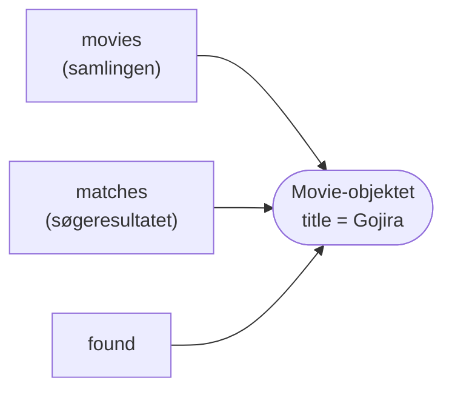

# Filmsamling del 1–4 – CRUD og user stories

## Beskrivelse

I går lavede I fundamentet: et fælles repository, som alle kan pushe til. I dag bygger I selve
filmsamlingen – et program, hvor man kan **oprette**, **se**, **søge i**, **rette** og **slette**
film.

De fire operationer har et navn: **CRUD** – *Create, Read, Update, Delete*. Næsten alle de
programmer, I kommer til at skrive på uddannelsen, har CRUD i bunden, og I kan det meste i forvejen:
`ArrayList` fra Bogsamling og opdelingen i `UserInterface`, controller og domæneklasser fra
Adventure.

Det nye i dag er **ikke** Java. Det nye er, at I er flere om den samme kode på samme tid. Det kræver
to ting:

* at alle er enige om **klassernes navne og metoder**, før I går hver til sit – så I kan kalde
  hinandens kode, før den er skrevet
* at I omsætter **user stories** til kode på samme måde, så det, I laver hver for sig, passer
  sammen bagefter

Hele opgaven står i [Filmsamling del 1–4](../../projekter/filmsamling/del-1-4-crud.md). Denne side
forklarer idéerne bag – og de fælder, de fleste grupper falder i.

## Læringsmål

Når du har arbejdet med dagens materiale, skal du kunne:

* forklare, hvad **CRUD** står for, og finde de fire operationer i et program
* omsætte en user story og dens **acceptkriterier** til metoder og testtilfælde
* forklare, hvorfor et fælles **skelet** af klasserne gør det muligt at arbejde parallelt
* skrive en søgemetode, der returnerer en **liste** – også når der er nul eller mange resultater
* forklare, hvorfor en ændring af et objekt fra en søgning også ændrer det i samlingen
* bruge `ArrayList`'s `contains` og `remove` og forklare, hvad de returnerer
* oversætte mellem brugerens nummer (fra 1) og listens index (fra 0)

## Se disse videoer før undervisningen:

Til genopfriskning – I har haft begge dele:

* [arraylists](https://www.youtube.com/watch?v=xTtL8E4LzTQ&t=8h55m51s) (til: 09:05:29)
* [enhanced switches](https://www.youtube.com/watch?v=xTtL8E4LzTQ&t=2h49m05s) (til: 02:57:42)

Læs derudover **hele** [Filmsamling del 1–4](../../projekter/filmsamling/del-1-4-crud.md) – især
user stories og klassediagrammet. I skal bruge dem fra første minut.

## Læs nedenstående før undervisningen

---

### CRUD – skelettet i næsten alle programmer

| | Filmsamlingen | En webshop | Et bookingsystem |
|---|---|---|---|
| **C**reate | opret en film | læg en vare i kurven | book en tid |
| **R**ead | vis alle, søg | se varer, søg | se ledige tider |
| **U**pdate | ret en film | ret antal i kurven | flyt en tid |
| **D**elete | slet en film | fjern en vare | aflys en tid |

Når I kan bygge filmsamlingen ordentligt, kan I bygge skelettet i alle tre. Forskellen er detaljer:
hvad der gemmes, og hvilke regler der gælder. Og netop reglerne – test, robusthed, filer – er det,
de næste to uger handler om.

---

### Fra user story til kode

I uge 39 skrev I selv user stories til bogsamlingen. Nu får I dem – og skal **læse** dem præcist.
Tag US4:

> Som filmentusiast vil jeg kunne søge efter film på titel, så jeg hurtigt kan finde en bestemt
> film.
>
> * Jeg kan søge på **en del af titlen**: søgningen `god` finder både *The Godfather* og *Godzilla*.
> * Søgningen er **ligeglad med store og små bogstaver**.
> * **Givet** at flere film matcher, **så** vises **alle** de film, der matcher.
> * **Givet** at ingen film matcher, **så** får jeg en besked om det.

Hvert acceptkriterium er en **beslutning om koden**:

| Acceptkriterium | Betyder i koden |
|---|---|
| en del af titlen | `contains`, ikke `equals` |
| ligeglad med store og små bogstaver | lav **både** titlen og søgeteksten om med `toLowerCase()` |
| **alle** der matcher | metoden returnerer en `ArrayList<Movie>` – ikke én `Movie` |
| ingen matcher → en besked | listen er **tom**; det er `UserInterface`, der skriver beskeden |

Og hvert acceptkriterium er også et **testtilfælde**. Når I tester US4 ved at køre programmet, skal
I prøve alle fire: en del af en titel, store bogstaver, flere match og ingen match. På fredag
skriver I de samme tilfælde som automatiske tests.

> **En user story er først færdig, når *alle* dens acceptkriterier er opfyldt.** "Søgningen virker"
> er ikke nok, hvis den kun virker med små bogstaver.

---

### Aftal kontrakten først: skelettet

I Adventure kunne I vente på hinanden. I dag skal tre personer skrive tre klasser **samtidig**. Men
`UserInterface` kalder `Controller`, som kalder `MovieCollection` – hvordan kan B skrive
`UserInterface`, før A har skrevet `MovieCollection`?

Svaret er at blive enige om **kontrakten**: klassernes navne, metodernes navne, parametre og
returtyper. Det er præcis, hvad klassediagrammet i del 1–4 giver jer. Én person skriver skelettet –
alle klasser med **tomme** metoder – og pusher det:

```java
import java.util.ArrayList;

public class MovieCollection {
    private ArrayList<Movie> movies;

    public MovieCollection() {
        movies = new ArrayList<>();
    }

    public void addMovie(String title, String director, int yearCreated, boolean inColor,
                         int lengthInMinutes, String genre) {
        // TODO US1
    }

    public ArrayList<Movie> getMovies() {
        return null;   // TODO US3
    }

    public int getNumberOfMovies() {
        return 0;      // TODO
    }

    public ArrayList<Movie> searchMovies(String searchText) {
        return null;   // TODO US4
    }

    public boolean editMovie(Movie movie, String title, String director, int yearCreated,
                             boolean inColor, int lengthInMinutes, String genre) {
        return false;  // TODO US5
    }

    public boolean deleteMovie(Movie movie) {
        return false;  // TODO US6
    }
}
```

Det kompilerer, men gør ingenting. Til gengæld kan B nu skrive
`controller.searchMovies(searchText)` i `UserInterface` – koden kompilerer, og når A pusher den
rigtige `searchMovies`, virker B's kode også.

> **Ændr ikke kontrakten uden at sige det.** Omdøber A `searchMovies` til `findMovies`, holder B's
> kode op med at kompilere, næste gang B puller – det så I i går i
> [konfliktøvelserne](../01_man_2026-10-19/opgaver.md#opgave-7--ingen-konflikt-men-den-kompilerer-ikke).
> Skal en metode ændres, så aftal det i gruppen.

---

### Søgning, der returnerer en liste

I Bogsamling returnerede `findBookByTitle` én bog – eller `null`, hvis den ikke fandtes. Det duer
ikke til US4, for der kan være **flere** match. Derfor returnerer `searchMovies` en liste:

| Antal match | `findBookByTitle` (Bogsamling) | `searchMovies` (Filmsamling) |
|---|---|---|
| 0 | `null` | en **tom** liste |
| 1 | bogen | en liste med én film |
| flere | kun den første | en liste med **alle** |

Den tomme liste er vigtigere, end den ser ud. Med `null` skal den, der kalder, **huske** at tjekke
for `null` – ellers går programmet ned med en `NullPointerException`. En tom liste kan man trygt
løbe igennem med en `for`-løkke; der sker bare ingenting. Tjekket bliver et spørgsmål om, hvad
brugeren skal se:

```java
ArrayList<Movie> matches = controller.searchMovies(searchText);
if (matches.isEmpty()) {
    System.out.println("Ingen film matcher \"" + searchText + "\".");
}
```

Selve `searchMovies` står i [del 1–4](../../projekter/filmsamling/del-1-4-crud.md#moviecollection).

---

### Det er det samme objekt

Redigér og slet starter begge med en søgning. Brugeren vælger en film fra søgeresultatet, og den
film sendes til `editMovie` eller `deleteMovie`. Men søgeresultatet er jo en **ny** liste – er
filmen i den ikke en kopi?

Nej. `searchMovies` lægger ikke nye film i `matches` – den lægger **referencer** til de samme
`Movie`-objekter, som ligger i samlingen. Der findes kun ét objekt; to lister peger på det:

```java
MovieCollection collection = new MovieCollection();
collection.addMovie("Godzilla", "Ishirō Honda", 1954, false, 96, "Sci-fi");

ArrayList<Movie> matches = collection.searchMovies("godz");
Movie found = matches.get(0);      // det SAMME objekt, som ligger i samlingen
found.setTitle("Gojira");

System.out.println(collection.getMovies().get(0).getTitle());
```

```text
Gojira
```



Det er derfor, `editMovie(Movie movie, ...)` kan nøjes med at kalde setterne på `movie`: ændringen
ses i samlingen med det samme. Og det er derfor, `deleteMovie(Movie movie)` kan finde filmen i
samlingen med `movies.remove(movie)`.

---

### contains og remove

`ArrayList` har selv de metoder, `editMovie` og `deleteMovie` skal bruge:

* `movies.contains(movie)` – `true`, hvis objektet er i listen.
* `movies.remove(movie)` – fjerner objektet og returnerer `true`, hvis det var der, ellers `false`.

Pas på: `remove` findes i **to** udgaver, der returnerer noget forskelligt:

```java
ArrayList<String> titles = new ArrayList<>();
titles.add("Jaws");
titles.add("Psycho");

boolean removed = titles.remove("Jaws");     // remove(Object): returnerer true/false
System.out.println(removed);
boolean again = titles.remove("Jaws");       // findes ikke længere
System.out.println(again);
String first = titles.remove(0);             // remove(int): returnerer det fjernede element
System.out.println(first);
```

```text
true
false
Psycho
```

`deleteMovie` returnerer `false`, hvis filmen ikke er i samlingen. Det kan virke overflødigt – hvordan
skulle brugeren kunne vælge en film, der ikke findes? Men metoden ved ikke, hvem der kalder den. På
fredag er det en **test**, og den vil netop prøve at slette en film, der ikke er der.

---

### Brugeren tæller fra 1

Søgeresultatet vises med et nummer foran, så brugeren kan vælge:

```text
1. The Godfather (1972)
2. Godzilla (1954)
Vælg nummer: 2
```

Listen tæller fra **0**, brugeren fra **1**. Så `matches.get(number - 1)` – og `(i + 1) + ". "`,
når listen vises. Glemmer man `- 1` ét af stederne, vælger man den forkerte film – eller får en
`IndexOutOfBoundsException` ved den sidste.

Lav **én** metode i `UserInterface`, der søger, viser listen og lader brugeren vælge – og brug den
både fra redigér og slet. Så er der kun ét sted at lave fejlen (og ét sted at rette den).

Skriver brugeren `7`, når der kun er to film at vælge imellem, går programmet ned i dag. Det er i
orden – det retter I i [del 6](../../projekter/filmsamling/del-6-exceptions.md). Det samme gælder
bogstaver, hvor der skal stå et tal.

---

### Små ting, der vælter en user story

* **`true` i udskriften.** US3 siger, at der ikke må stå `true`, `false` eller `null`. En film er
  "farver" eller "sort-hvid". Oversæt i `UserInterface`, lige før den vises.
* **`nextInt()` og `nextLine()` blandet.** Læs **alt** med `nextLine()`, og lav tal med
  `Integer.parseInt(...)` – se tippet i
  [del 1–4](../../projekter/filmsamling/del-1-4-crud.md#userinterface).
* **Tom samling.** "Vis alle film" på en tom samling skal give en besked – ikke ingenting.
* **Menuvalg som tekst.** Læs valget som en `String`, og brug `switch` på teksten. Så går programmet
  ikke ned, når brugeren skriver `hej`.

---

## Det vigtigste at tage med

* **CRUD** = Create, Read, Update, Delete – skelettet i næsten alle programmer
* hvert **acceptkriterium** er både en beslutning om koden og et testtilfælde
* aftal **kontrakten** (navne, parametre, returtyper), skriv et **skelet**, push det – så kan I
  arbejde parallelt
* en søgning returnerer en **liste**, der kan være **tom** – aldrig `null`
* søgeresultatet indeholder **de samme objekter** som samlingen – ret dem, og samlingen er rettet
* `remove(Object)` returnerer `true`/`false`; `remove(int)` returnerer elementet
* listen tæller fra 0, brugeren fra 1
* `System.out` og `Scanner` findes kun i `UserInterface`

## Aktiviteter i undervisningen

### 1. Skelettet sammen

Følg [trin 1 i den anbefalede procedure](../../projekter/filmsamling/del-1-4-crud.md#1-sammen-skelettet-ca-30-minutter):
læs user stories og klassediagrammet sammen, og lad én person skrive skelettet. Det kompilerer,
bliver pushet – og alle puller, **før** I deler jer.

### 2. Hver sin klasse

Fordel klasserne (se [forslaget](../../projekter/filmsamling/del-1-4-crud.md#2-hver-for-sig-én-klasse-pr-person)),
og tag én user story ad gangen: pull – få den til at virke – prøv **alle** acceptkriterier – commit
med user storyens nummer – push.

Undervejs:

* Hvor mange acceptkriterier har I prøvet af for hver user story? Alle?
* Står der `System.out` et andet sted end i `UserInterface`?

### 3. Ryd op

Når alle seks user stories virker, så gennemgå koden sammen ved én skærm – se
[trin 4](../../projekter/filmsamling/del-1-4-crud.md#4-ryd-op-før-i-går-videre).

### 4. Klar til onsdag

I morgen lærer I at skrive **unit tests**, og fredag tester I `MovieCollection`. Del 1–4 **bør
være færdig inden fredag 23-10**, og alt, der virker, skal være **pushet**, så hele gruppen har det.
