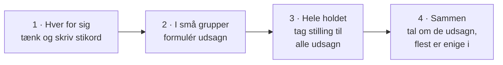

# Delfi-evaluering

## Beskrivelse

I dag evaluerer vi **undervisningen** sammen – de første syv uger af semestret, fra introdagene i
uge 35 til Adventure i uge 41.

Vi bruger en **Delfi-evaluering** (også kaldet *Delphi*). Det er en metode, hvor alle først tænker
selv, derefter formulerer udsagn i små grupper, og til sidst ser, hvilke udsagn **hele holdet** er
enige i. Resultatet er ikke én persons mening, men et billede af, hvad holdet som helhed synes
virker – og hvad der bør ændres.

Evalueringen handler om **undervisningen**, ikke om jer. Der er ingen karakterer, ingen rigtige svar
og intet, der bliver skrevet ned om den enkelte.

## Læringsmål

Dagen har ikke faglige læringsmål i Java. Når I har været igennem evalueringen, skal I kunne:

* forklare, hvordan en Delfi-evaluering foregår, og hvorfor den bruges
* formulere **konkrete** udsagn om, hvad der virker og ikke virker i undervisningen
* tage stilling til andres udsagn og se, hvor holdet er enigt og uenigt
* komme med **forslag** til forbedringer – ikke kun kritik

## Se disse videoer før undervisningen:

Ingen videoer i dag. Læs i stedet nedenstående, og brug ti minutter på at tænke semestret igennem
(se [Forbered dig](#forbered-dig)).

## Læs nedenstående før undervisningen

---

### Hvorfor evaluere nu?

Vi er halvvejs gennem semestret. Det er tidligt nok til, at jeres svar kan **ændre noget** for jer
selv – i resten af filmsamlingen, i Delfinen og i forberedelsen til eksamen – og sent nok til, at I
har oplevet det meste af, hvordan undervisningen er bygget op: dagssider, videoer, opgaver,
projekter, afleveringer og vejledning.

Et spørgeskema kan fortælle, at 60 % er "delvist enige". En Delfi-evaluering fortæller **hvad** I
mener, med jeres egne ord – og hvor mange der deler det.

### Sådan foregår det

Underviseren forklarer den præcise fremgangsmåde på dagen. Typisk ser en Delfi-evaluering sådan ud:

1. **Hver for sig.** Du skriver stikord ned: hvad har hjulpet dig med at lære, og hvad har gjort det
   sværere? Ingen ser dine stikord.
2. **I små grupper.** Gruppen samler stikordene og formulerer et antal **udsagn** – typisk nogle
   om det, der virker godt, og nogle om det, der bør ændres. Et udsagn skal gruppen kunne stå inde
   for; det behøver ikke være alles mening.
3. **Hele holdet tager stilling.** Udsagnene går rundt (på papir, på tavlen eller digitalt), og
   hver enkelt markerer de udsagn, han eller hun er **enig** i. I den klassiske udgave markerer man
   kun enighed – er man uenig, gør man ingenting.
4. **Opsamling.** Markeringerne tælles. De udsagn, flest er enige i, er dem, holdet står samlet om.
   Dem taler vi om i fællesskab: Hvad ligger bag? Hvad kunne gøres anderledes?

Det smarte ved metoden er trin 3: et udsagn fra én gruppe kan vise sig at være noget, **hele**
holdet mener – eller noget, kun få deler. Det er svært at se i en almindelig diskussion, hvor de
mest snakkesalige fylder mest.

### Gode udsagn

Et udsagn er en kort, klar sætning, som andre kan være enige eller uenige i. Jo mere **konkret**, jo
mere kan det bruges:

| Svært at bruge | Til at handle på |
|---|---|
| "Undervisningen er god." | "Kodeeksemplerne på dagssiderne gør det nemt at komme i gang med opgaverne." |
| "Det går for stærkt." | "Vi når ikke at blive færdige med projektdelene, før den næste starter." |
| "Videoerne er dårlige." | "Videoerne er for lange – korte videoer til hvert emne ville hjælpe mere." |
| "Git er svært." | "Vi har brug for mere tid til at øve Git, før vi skal bruge det i et projekt." |

Tre tommelfingerregler:

* **Én ting pr. udsagn.** "Opgaverne er gode, men der er for mange" er to udsagn.
* **Beskriv, hvad der sker – ikke hvem.** Udsagn handler om undervisningen, materialet og
  forløbet, aldrig om enkeltpersoner.
* **Kom gerne med et forslag.** "... – det ville hjælpe, hvis ..." gør et udsagn til noget, man kan
  gøre noget ved.

### Hvad kan I evaluere?

Alt, der har med undervisningen at gøre. For eksempel:

* **Dagssiderne:** læsestoffet, kodeeksemplerne, diagrammerne – for meget, for lidt, for svært?
* **Videoerne:** hjælper de? Ser I dem?
* **Opgaverne:** sværhedsgrad, mængde, de vejledende løsninger.
* **Projekterne:** Bogsamling og Adventure – opdelingen i dele, tempoet, deadlines, gruppearbejdet.
* **Undervisningsdagene:** fordelingen mellem gennemgang og tid til at arbejde, hjælpen undervejs.
* **Afleveringerne og feedback:** er det tydeligt, hvad der kræves? Får I noget ud af det?
* **Rammerne:** itslearning, GitHub, planen – kan I finde det, I skal bruge?

### Forbered dig

Brug ti minutter før undervisningen på at bladre semestret igennem i
[lektionsplanen](../../README.md). Uge for uge:

| Uge | Emner |
|---|---|
| 35 | Introdage, installation, variable, betingelser, Scanner |
| 36 | Løkker, arrays, strings |
| 37 | Objekter og klasser, enum og switch, metoder, Bogsamling |
| 38 | Aktivitetsdiagram og debugger, klassediagrammer, ArrayList, Bogsamling færdig |
| 39 | Git og GitHub, user stories og design, Adventure del 1 |
| 40 | Adventure del 2–3, arv, polymorfi |
| 41 | Abstrakte klasser, Adventure del 4–5, præsentationer |

Skriv tre ting ned, der har hjulpet dig med at lære, og tre ting, du gerne ville have anderledes. Så
er du klar til trin 1.

### Hvad sker der med resultatet?

Underviserne får de udsagn, holdet har samlet sig om, og bruger dem til at justere resten af
semestret – så vidt det kan lade sig gøre. Ikke alt kan ændres (eksamensdatoen flytter sig ikke),
men meget kan: tempoet, opgavernes form, hvordan dagene er skruet sammen. Spørg gerne senere, hvad
der er kommet ud af det.

---

## Det vigtigste at tage med

* evalueringen handler om **undervisningen** – ikke om jer, og ingen enkeltpersoner nævnes
* Delfi: typisk først hver for sig, så i grupper, så hele holdet – og til sidst taler vi om det,
  flest er enige i
* underviseren forklarer den præcise fremgangsmåde på dagen
* gode udsagn er **konkrete**, handler om **én ting** og kommer gerne med et **forslag**
* både det, der virker, og det, der ikke gør, er lige vigtigt at få med
* forbered dig ved at bladre uge 35–41 igennem og skrive tre plusser og tre minusser ned

## Aktiviteter i undervisningen

### 1. Delfi-evaluering

Underviseren leder evalueringen og forklarer fremgangsmåden. Tag dine stikord fra
[Forbered dig](#forbered-dig) med.

### 2. Filmsamlingen

Er der tid tilbage, så arbejd videre i jeres gruppe med filmsamlingen. I morgen skriver I tests af
`MovieCollection` ([del 5](../../projekter/filmsamling/del-5-test.md#fredag-23-10)), så sørg for, at:

* [del 1–4](../../projekter/filmsamling/del-1-4-crud.md) virker – alle seks user stories, alle
  acceptkriterier
* JUnit er sat op i gruppens `pom.xml`, og `MovieTest` kører grønt hos **alle** i gruppen
* alt er **pushet**
