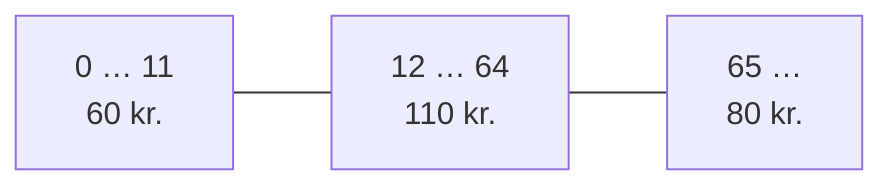

# Filmsamling del 5 – test af samlingen

## Beskrivelse

I onsdags skrev I jeres første unit tests – af et klippekort, en spilleliste og `Movie`. I dag
tester I det, der betyder mest i filmsamlingen: `MovieCollection`, klassen med **alle** CRUD-
operationerne.

Det svære ved at teste er ikke at skrive `assertEquals`. Det svære er at vælge, **hvad** der skal
testes. En test af det, der virker, er let at skrive – og finder ingen fejl. Fejlene gemmer sig i
**kanterne**: den tomme samling, søgningen uden resultat, filmen, der ikke er i samlingen, ordet med
store bogstaver.

I dag lærer I at finde kanterne systematisk – ud fra user stories, ud fra metodens parametre og
ud fra grænserne – og at tjekke, om jeres tests faktisk ville **fange** en fejl.

Opgaven står i [Filmsamling del 5](../../projekter/filmsamling/del-5-test.md#tests-af-moviecollection-fredag-23-10).

## Læringsmål

Når du har arbejdet med dagens materiale, skal du kunne:

* omsætte acceptkriterierne i en user story til testtilfælde
* dele en metodes input op i grupper, der opfører sig ens, og vælge én test fra hver
* finde **grænseværdierne** og teste på begge sider af dem
* teste både en metodes **returværdi** og den **tilstand**, den efterlader samlingen i
* forklare, hvorfor en film med de samme oplysninger ikke er "den samme" film
* køre tests **med coverage** og forklare, hvad dækning kan og ikke kan fortælle
* afprøve jeres tests ved at lave fejl i koden med vilje

## Se disse videoer før undervisningen:

* [Unit Testing with JUnit and IntelliJ – 02 – Additional Annotations](https://www.youtube.com/watch?v=gQ9qRxCVo08)
  (6:49) – `@BeforeEach` m.fl., hvis du ikke så den til onsdag

Og genlæs [onsdagens læsestof](../03_ons_2026-10-21/README.md), især *@BeforeEach* og *Hvilke
tilfælde skal testes?* – i dag bygger vi videre på det.

## Læs nedenstående før undervisningen

---

### Hvor kommer testtilfældene fra?

Tre kilder, som supplerer hinanden:

1. **User stories** – hvert acceptkriterium er et testtilfælde.
2. **Inputtet** – del metodens mulige parametre op i grupper, og test én fra hver.
3. **Grænserne** – der hvor én gruppe slutter og den næste begynder.

### 1. Fra acceptkriterier

Tag US4 – søg efter film – fra [del 1–4](../../projekter/filmsamling/del-1-4-crud.md#del-3--søg):

| Acceptkriterium | Testtilfælde | Forventet |
|---|---|---|
| en del af titlen | søg `"god"` i en samling med *The Godfather* og *Godzilla* | 2 film |
| ligeglad med store og små bogstaver | søg `"CASA"` | *Casablanca* |
| alle, der matcher | (samme som første) | 2 film |
| ingen matcher | søg `"Titanic"` | en **tom** liste – ikke `null` |

Og US6 – slet en film:

| Acceptkriterium | Testtilfælde | Forventet |
|---|---|---|
| bagefter er filmen væk | slet *Casablanca* | `true`, 2 film tilbage, søgning efter den giver ingenting |
| *(ikke i user storyen, men i metoden)* | slet en film, der ikke er i samlingen | `false`, stadig 3 film |

Den sidste række er vigtig. User stories beskriver, hvad **brugeren** kan gøre. Men metoden
`deleteMovie` ved ikke, at den bliver kaldt fra en menu – den skal opføre sig fornuftigt uanset
hvad. Det tester man også.

### 2. Grupper af input

De fleste metoder har uendeligt mange mulige input. Man kan ikke teste dem alle – men man kan dele
dem op i **grupper**, hvor metoden opfører sig ens. Så er én test pr. gruppe nok.

For `searchMovies(String searchText)` kunne grupperne være:

| Gruppe | Eksempel |
|---|---|
| tekst, der matcher præcis én titel | `"casablanca"` |
| tekst, der matcher flere titler | `"god"` |
| tekst, der ikke matcher noget | `"titanic"` |
| tekst med andre store/små bogstaver end titlen | `"CASA"` |
| tekst midt inde i en titel | `"father"` |
| den **tomme** tekst | `""` |

Den sidste er interessant. Hvad **skal** der ske, når man søger på ingenting? Med `contains` finder
man **alle** film, fordi den tomme tekst findes i enhver tekst. Er det en fejl eller en feature?
Det bestemmer I – men skriv en test, så beslutningen står sort på hvidt.

### 3. Grænseværdier

Hvor et tal skifter fra én gruppe til en anden, sker fejlene. Det er her, `<` og `<=` bliver byttet
om, og her et `- 1` bliver glemt.

Et eksempel: en biografbillet koster 60 kr. for børn **under** 12 år, 110 kr. fra 12 **til og med**
64 år og 80 kr. fra 65 år. Grænserne ligger mellem 11 og 12 og mellem 64 og 65:



De vigtigste tests er **begge sider** af hver grænse: 11 og 12, 64 og 65. En test med 7, 30 og 90
finder ikke en fejl som `age <= 12`.

I filmsamlingen er der ingen tal-grænser i `MovieCollection` endnu – men de kommer: på mandag skal
I finde film, der ikke er set i **mere end** et antal dage, og i del 6 skal årstal ligge fra 1888.
Så er grænsen det vigtigste testtilfælde.

---

### Test både svaret og tilstanden

`editMovie` og `deleteMovie` **gør** noget og **returnerer** noget. En god test tjekker begge dele:

```java
@Test
void deleteMovieNotInCollectionReturnsFalse() {
    Movie jaws = new Movie("Jaws", "Steven Spielberg", 1975, true, 124, "Thriller");

    boolean deleted = collection.deleteMovie(jaws);

    assertFalse(deleted);                              // svaret
    assertEquals(3, collection.getNumberOfMovies());   // tilstanden: intet er fjernet
}
```

Tjekker testen kun `assertFalse(deleted)`, opdager den ikke en `deleteMovie`, der svarer `false`
men alligevel fjerner en tilfældig film.

Det samme gælder `editMovie`: tjek, at den returnerer `true`, **og** at filmen faktisk er ændret.
Og tjek **alle** felterne – ikke kun ét. En `editMovie`, der glemmer at kalde `setDirector`, består
en test, der kun tjekker titlen. (I kommer til at prøve det i dagens opgaver.)

### "Den samme film"

Testen ovenfor opretter en **ny** `Movie` med `new`. Den er ikke i samlingen – heller ikke hvis den
havde præcis de samme oplysninger som en film, der er:

```java
Movie casablanca = new Movie("Casablanca", "Michael Curtiz", 1942, false, 102, "Drama");
collection.deleteMovie(casablanca);   // false – det er et ANDET objekt end det i samlingen
```

`ArrayList.remove` og `contains` leder efter **objektet**, og `Movie` har ikke sin egen `equals`.
Vil en test slette en film, der **er** i samlingen, skal den hente objektet fra samlingen – fx med
`collection.searchMovies("Casablanca").get(0)`. Det er præcis det, brugerfladen også gør.

### Hver test sin egen samling

Del 5 viser en `setUp` med `@BeforeEach`, der bygger en samling med tre film før hver test. Det
betyder, at en test, der sletter *Casablanca*, ikke ødelægger en test, der søger efter den. Brug
den – og vær forsigtig med at ændre den, når testene er skrevet: alle tests, der regner med "tre
film", afhænger af den.

---

### Coverage: hvor meget af koden er kørt?

IntelliJ kan vise, hvilke linjer testene har kørt. Højreklik på `src/test/java` → **More Run/Debug
→ Run 'All Tests' with Coverage**. Bagefter vises en procent pr. klasse, og i koden er linjerne
markeret i margenen: **grøn** er kørt, **rød** er aldrig kørt.

Røde linjer i `MovieCollection` er et tydeligt tegn på et manglende testtilfælde – fx
`return false;` i `editMovie`, hvis ingen test prøver at redigere en film, der ikke er i samlingen.

Men pas på med at læse for meget ind i det:

> **100 % coverage betyder, at hver linje er kørt – ikke at den er testet.** En test uden en eneste
> assertion kan køre alle linjer og aldrig opdage noget. Coverage viser, hvad I **mangler**; den
> beviser ikke, at resten er i orden.

Se [Code coverage](https://www.jetbrains.com/help/idea/code-coverage.html) hos JetBrains.

### Fanger testene overhovedet noget?

Den bedste måde at tjekke sine tests på er at lave en fejl **med vilje** og se, om en test bliver rød.
Fjern `toLowerCase()` et sted, byt `contains` ud med `equals`, slet en linje i `editMovie` – kør
testene. Bliver ingen rød, har I fundet et hul. (Det hedder *mutation testing*, og der findes
værktøjer, der gør det automatisk. I dag gør I det i hånden.)

---

### Det tester vi ikke

* **`UserInterface`** – den læser fra tastaturet og skriver på skærmen. Den tester I ved at køre
  programmet.
* **`Controller`** – lige nu sender den bare videre til `MovieCollection`. Den kan testes på samme
  måde, men det giver ikke meget endnu. (Det er en frivillig udvidelse i del 5.)
* **Gettere og settere uden logik** – getterne dækkes af constructortesten af `Movie`, setterne af
  testene af `editMovie`.

### Git: én testklasse, flere personer

`MovieCollectionTest` er **én** fil. Skriver tre personer i den samtidig, får I konflikter. Følg
fordelingen i [del 5, fredag](../../projekter/filmsamling/del-5-test.md#fredag-23-10): den første
skriver `setUp` og de første tests og pusher; den næste puller og fortsætter. Den, der venter,
læser koden, der skal testes – eller finder testtilfælde på papir (se opgaverne).

---

## Det vigtigste at tage med

* testtilfælde kommer fra **acceptkriterierne**, fra **grupper af input** og fra **grænserne**
* test **begge sider** af en grænse – det er der, `<` og `<=` bliver byttet om
* test både **svaret** (`true`/`false`, listen) og **tilstanden** bagefter (antal, felter)
* en ny `Movie` med samme oplysninger er **ikke** filmen i samlingen – hent den fra samlingen
* hver test sin egen, friske samling via `@BeforeEach`
* coverage viser, hvad der **mangler** – ikke at resten virker
* lav en fejl med vilje: bliver en test rød? Ellers mangler der en test

## Aktiviteter i undervisningen

### 1. Status

Kører `MovieTest` grønt hos **alle** i gruppen? Hvis ikke, så start der: pull, tjek JUnit i
`pom.xml`, og klik **Load Maven Changes**.

### 2. Find testtilfældene

Lav [del A i dagens opgaver](opgaver.md#del-a--find-testtilfældene): testtilfælde for nogle metoder,
I ikke har skrevet – på papir, sammen i gruppen.

### 3. Test MovieCollection

Skriv `MovieCollectionTest` efter [del 5](../../projekter/filmsamling/del-5-test.md#tests-af-moviecollection-fredag-23-10)
– mindst de elleve tilfælde i tabellen. Fordel arbejdet som beskrevet i
[den anbefalede procedure](../../projekter/filmsamling/del-5-test.md#fredag-23-10).

### 4. Test testene

Når alle tests er grønne: lav [del B i opgaverne](opgaver.md#del-b--test-testene) – sabotér jeres
egen `MovieCollection` én fejl ad gangen, og se, om testene opdager det. Kør til sidst med coverage.

Del 5 **bør være færdig inden mandag 26-10**: alle tests grønne og pushet.
