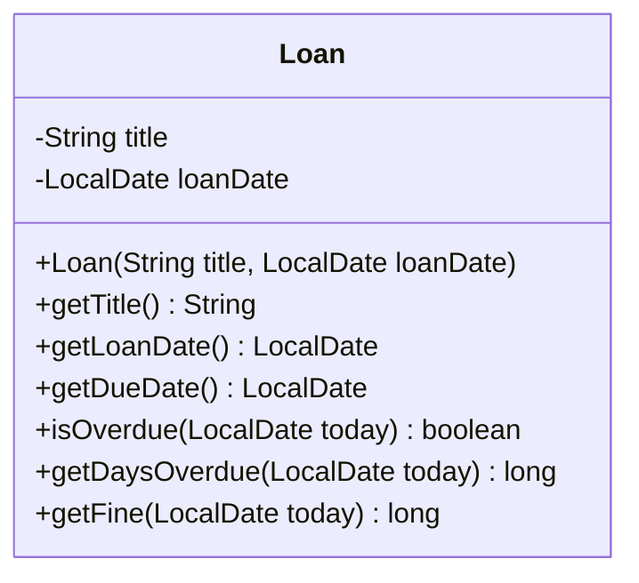

# Opgaver – FURPS, datoer og design-review

Dagens opgaver er delt op sådan:

* **Del A** – FURPS: sortér krav, og gør vage krav konkrete. Sammen i gruppen.
* **Del B** – `LocalDate`: forudsig output, regn med datoer og byg et udlån på et bibliotek med
  tests.
* **Del C** – design-review af en klasse, der trænger til det.
* **Udfordringer**.

Del B laves i jeres `junit-oevelse`-projekt fra onsdag (så har I JUnit).

Der er [vejledende løsninger](loesninger.md) – men prøv selv først.

---

# Del A – FURPS

## Opgave 1 – Hvilket bogstav?

Her er tolv krav til et bookingsystem for en frisør. Skriv ud for hvert, om det er **F**, **U**,
**R**, **P** eller **S**.

1. Kunden kan se ledige tider for de næste 14 dage.
2. Kunden kan aflyse en tid op til to timer før.
3. En tid kan aldrig blive booket af to kunder på samme tid.
4. Siden med ledige tider vises på under to sekunder.
5. Kunden kan booke en tid med højst fire klik fra forsiden.
6. Alle beregninger af priser er dækket af unit tests.
7. Frisøren kan se dagens bookinger som en liste.
8. Hvis serveren går ned, er ingen bookinger tabt.
9. Alle beskeder til kunden er på dansk, og fejlbeskeder siger, hvad kunden skal gøre.
10. Systemet kan håndtere 500 kunder, der booker på samme tid.
11. Klassen, der sender sms'er, kan skiftes ud uden at ændre resten af programmet.
12. Kunden får en sms dagen før sin tid.

## Opgave 2 – Gør kravet konkret

Omskriv hvert krav, så det kan **afprøves** – med en test eller ved at prøve programmet. Skriv også,
hvilket FURPS-bogstav det hører til.

1. Filmsamlingen skal være nem at bruge.
2. Filmsamlingen skal være stabil.
3. Filmsamlingen skal starte hurtigt.
4. Koden skal være let at ændre.
5. Søgningen skal virke godt.

## Opgave 3 – Jeres egen liste

Skriv `docs/furps.md` til jeres filmsamling efter
[del 5½](../../projekter/filmsamling/del-5-datoer.md#krav-docsfurpsmd): mindst ét konkret krav pr.
bogstav, og for hvert krav: er det opfyldt, og hvor?

---

# Del B – LocalDate

## Opgave 4 – Forudsig output

**Skriv dit svar ned, før du kører koden.**

```java
LocalDate date = LocalDate.of(2026, 10, 26);
date.plusDays(10);
System.out.println(date);

LocalDate later = date.plusDays(10);
System.out.println(later);

System.out.println(later.getDayOfWeek());
System.out.println(date.isBefore(later));
System.out.println(ChronoUnit.DAYS.between(later, date));
System.out.println(LocalDate.of(2026, 3, 31).minusMonths(1));
System.out.println(LocalDate.of(2027, 12, 31).plusDays(1).getYear());
```

## Opgave 5 – Dagens dato på dansk

Skriv et lille program, der udskriver dagens dato på formen `26-10-2026` – og derefter, hvor mange
dage der er til den 04-11-2026 (Filmsamlingens deadline). Brug `LocalDate.now()`,
`DateTimeFormatter` og `ChronoUnit.DAYS.between`.

Ret mønstret til `"dd-mm-yyyy"`, og kør igen. Hvad sker der? Hvorfor?

## Opgave 6 – Dage til juleaften

Lav en klasse `DateTools` med metoden:

```java
// Antal dage fra today til næste juleaften (24. december). Er det juleaften i dag, er svaret 0.
public long daysUntilChristmasEve(LocalDate today)
```

Læg mærke til, at **dagens dato er en parameter**. Så kan metoden testes. Skriv tests med disse
datoer – og regn selv efter, hvad svaret skal være:

* 26-10-2026
* 24-12-2026
* 25-12-2026 (hov – hvilken juleaften er den **næste**?)

## Opgave 7 – Hvor gammel?

Tilføj en metode til `DateTools`:

```java
// Alder i hele år på dagen today
public long getAge(LocalDate birthDate, LocalDate today)
```

Test mindst: på selve fødselsdagen, dagen **før** fødselsdagen, og en person født den 29. februar
2008 – hvor gammel er hun den 28. februar 2026 og den 1. marts 2026?

## Opgave 8 – Et udlån på biblioteket

Biblioteket låner bøger ud i **30 dage**. Afleveres bogen for sent, koster det **5 kr. pr. dag** –
men højst **200 kr.** Lav klassen `Loan`:



* `getDueDate()` – den sidste dag, bogen kan afleveres: 30 dage efter udlånet.
* `isOverdue(today)` – `true`, hvis `today` er **efter** afleveringsdatoen. På selve dagen er det
  **ikke** for sent.
* `getDaysOverdue(today)` – antal dage for sent; `0`, hvis det ikke er for sent.
* `getFine(today)` – bøden i kroner.

Brug konstanter for 30, 5 og 200 (`private static final int ...`) – ikke magiske tal.

Skriv `LoanTest` – gerne **før** metoderne. Brug et udlån fra den 1. oktober 2026 i en
`@BeforeEach`. Find selv tilfældene, men få mindst disse med:

* afleveringsdatoen, også når udlånet krydser et års- eller månedsskifte
* dagen før, **på** og dagen efter afleveringsdatoen
* bøden, når man er 3 dage for sent
* bøden **præcis** ved loftet på 200 kr. – hvor mange dage for sent er det?
* bøden, når man er langt over loftet

---

# Del C – Design-review

## Opgave 9 – Review af MovieList

En gruppe har skrevet denne klasse. Den kompilerer, og den virker – nogenlunde.

```java
import java.util.ArrayList;
import java.util.Scanner;

public class MovieList {
    public ArrayList<Movie> list2 = new ArrayList<>();

    public void search(String s) {
        for (int i = 0; i < list2.size(); i++) {
            Movie m = list2.get(i);
            if (m.getTitle().contains(s)) {
                System.out.println(m.getTitle() + " (" + m.getYearCreated() + ")");
            }
        }
    }

    public boolean delete(String title) {
        Scanner sc = new Scanner(System.in);
        for (Movie m : list2) {
            if (m.getTitle().equals(title)) {
                System.out.print("Er du sikker? ");
                if (sc.nextLine().equals("ja")) {
                    list2.remove(m);
                    return true;
                }
            }
        }
        return false;
    }

    public int x() {
        int temp = 0;
        for (Movie m : list2) {
            if (m.getLengthInMinutes() > 120) {
                temp++;
            }
        }
        return temp;
    }
}
```

1. Gå klassen igennem med [tjeklisten i del 5½](../../projekter/filmsamling/del-5-datoer.md#3-design-review-af-jeres-egen-kode)
   og tabellen over *code smells* i [læsestoffet](README.md#sådan-ser-problemerne-ud). Skriv
   **alle** de problemer ned, I kan finde – mindst seks.
2. Hvilke af metoderne kan **ikke** unit-testes, som de er skrevet? Hvorfor?
3. Hvilket acceptkriterium fra US4 (søg efter film) bryder `search`?
4. Skriv feedbacken til gruppen: tre konkrete punkter, formuleret venligt – og ét, der er godt.
5. Skriv klassen om, så problemerne er væk. (Hvor skal "Er du sikker?" hen?)

## Opgave 10 – Jeres egen kode

Gennemgå jeres **egen** filmsamling efter tjeklisten i del 5½ – ved én skærm, hele gruppen. Skriv
fundene ned, ret dem, og commit hver rettelse for sig.

---

# Udfordringer

## Udfordring 1 – Aflevering

Udvid `Loan` med en afleveringsdato:

* `returnBook(LocalDate date)` – bogen er afleveret på `date`.
* `isReturned()` – `true`, når bogen er afleveret. (Hvad er afleveringsdatoen, før bogen er
  afleveret?)
* `getFineWhenReturnedOrToday(LocalDate today)` – er bogen afleveret, beregnes bøden ud fra
  afleveringsdagen; ellers ud fra `today`. En bog, der blev afleveret to dage for sent, skal ikke
  koste mere, bare fordi der går en måned.

Skriv tests først.

## Udfordring 2 – Ugedag på dansk

`getDayOfWeek()` giver `MONDAY`. Find ud af, hvordan man får `mandag`. (Søg efter `getDisplayName`,
`TextStyle` og `Locale` – eller mønstret `EEEE` i `DateTimeFormatter`.)

## Udfordring 3 – 31. februar

Prøv `LocalDate.parse("31-02-2026", DateTimeFormatter.ofPattern("dd-MM-yyyy"))`. Hvad får du? Er
det det, du havde forventet? (Den kommer igen i del 6.)
