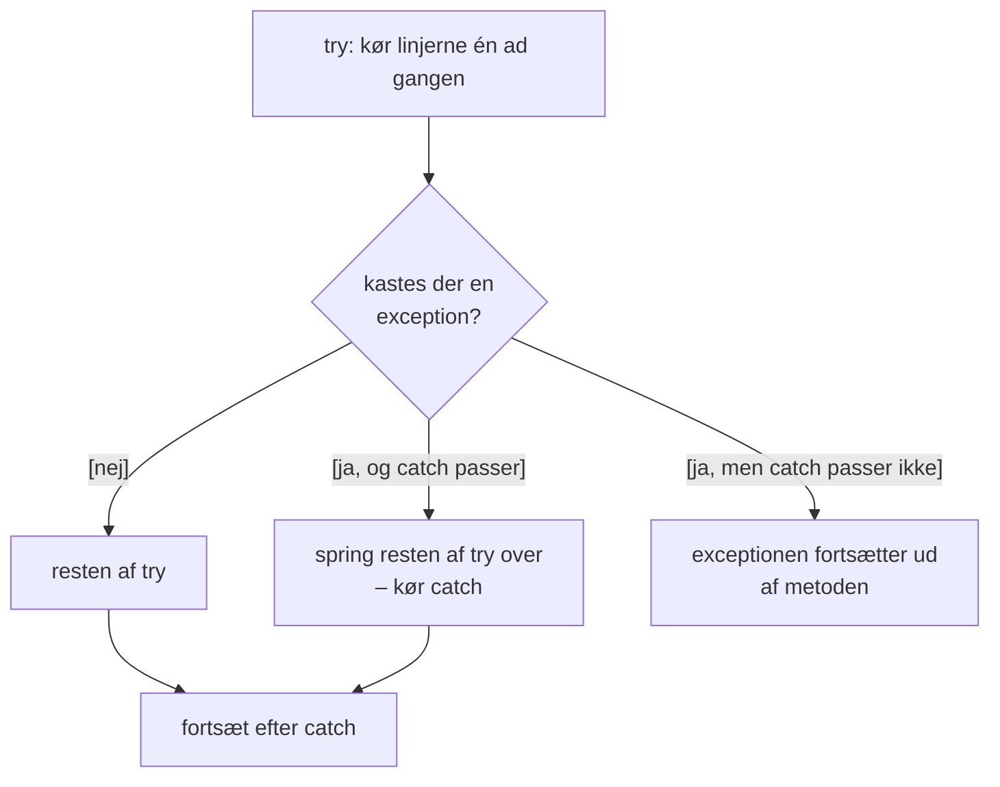
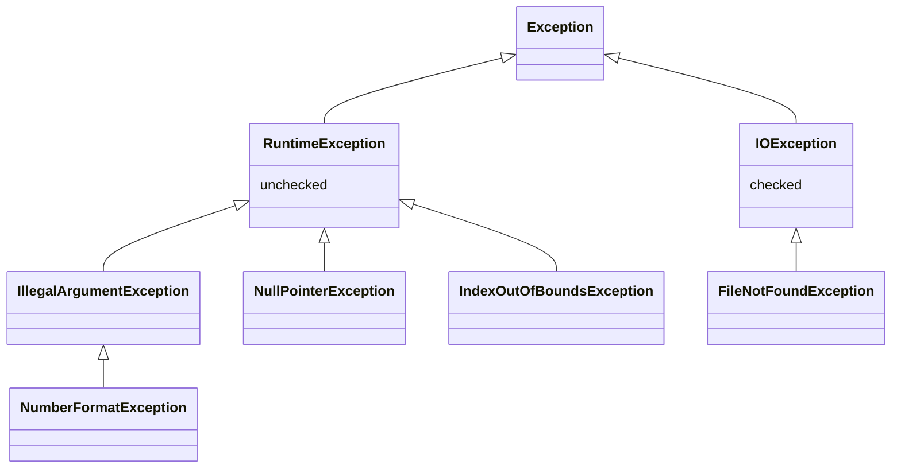

# Exceptions – når noget går galt

## Beskrivelse

Start jeres filmsamling, vælg "Opret en film", og skriv `sytten`, når programmet spørger om
årstallet. Programmet går ned med en lang rød tekst – og alle filmene er væk.

Den røde tekst er en **exception**: Javas måde at sige, at noget er gået galt, som den nuværende
kode ikke ved, hvordan den skal håndtere. Indtil nu har I mest set exceptions som noget, der
**sker** for jer. I dag lærer I at **læse** dem, at **fange** dem, så programmet kan fortsætte, og
at **kaste** dem selv, når en metode får en værdi, den ikke kan bruge.

Det er **R**'et i FURPS fra i går: *Reliability*. Et program, der går ned, fordi brugeren taster
forkert, kan man ikke stole på.

I projektet er det [Filmsamling del 6](../../projekter/filmsamling/del-6-exceptions.md): i dag
**fanger** I exceptions, så programmet overlever forkert input (US10). I morgen **kaster** I dem, så
`Movie` selv kan afvise ugyldige værdier (US11 og US12) – den del af læsestoffet står til sidst på
denne side, og i morgen går vi i dybden med den.

## Læringsmål

Når du har arbejdet med dagens materiale, skal du kunne:

* forklare, hvad en **exception** er, og hvad der sker, når ingen fanger den
* læse en **stack trace**: typen, beskeden og linjen i din egen kode
* genkende de almindeligste exceptions og deres årsag
* fange en exception med `try`/`catch` og forudsige, hvilke linjer der bliver kørt
* skrive en løkke, der spørger igen, indtil brugeren har skrevet noget gyldigt
* vælge mellem at **tjekke først** (`if`) og at **fange bagefter** (`catch`)
* **kaste** en `IllegalArgumentException` med en forklarende besked
* teste med `assertThrows`, at en metode kaster en exception
* forklare forskellen på **checked** og **unchecked** exceptions i grove træk

## Se disse videoer før undervisningen:

* [exception handling](https://www.youtube.com/watch?v=xTtL8E4LzTQ&t=9h5m29s) (til: 09:13:28)
* [Exception Handling in Java Tutorial](https://www.youtube.com/watch?v=1XAfapkBQjk) (Coding with
  John, 13:20) – `try`, `catch` og `finally` i ro og mag

## Læs nedenstående før undervisningen

---

### Hvad er en exception?

En **exception** (på dansk: en *undtagelse*) er et **objekt**, der beskriver en fejl. Når noget går
galt – en tekst kan ikke laves om til et tal, et index er uden for listen – laver Java sådan et
objekt og **kaster** det (på engelsk *throw*).

Så sker der én af to ting:

* **Nogen fanger den** (*catch*). Så kan programmet reagere – fx bede brugeren prøve igen – og
  fortsætte.
* **Ingen fanger den.** Så stopper programmet, og Java skriver den røde tekst.

Her er et program, der ikke fanger noget:

```java
import java.util.Scanner;

public class YearReader {
    public static void main(String[] args) {
        Scanner scanner = new Scanner(System.in);
        System.out.print("Årstal: ");
        int year = Integer.parseInt(scanner.nextLine().trim());
        System.out.println("Filmen er " + (2026 - year) + " år gammel.");
    }
}
```

Skriver brugeren `sytten`:

```text
Årstal: sytten
Exception in thread "main" java.lang.NumberFormatException: For input string: "sytten"
	at java.base/java.lang.NumberFormatException.forInputString(NumberFormatException.java:67)
	at java.base/java.lang.Integer.parseInt(Integer.java:662)
	at java.base/java.lang.Integer.parseInt(Integer.java:778)
	at YearReader.main(YearReader.java:7)
```

Den sidste `println` bliver aldrig kørt.

### Læs den røde tekst

Den røde tekst kaldes en **stack trace**. Den ser skræmmende ud, men den er den bedste hjælp, I kan
få – den fortæller præcis, hvad der gik galt, og hvor:

| Del | Her | Betyder |
|---|---|---|
| Typen | `java.lang.NumberFormatException` | **hvad** der gik galt: en tekst, der ikke er et tal |
| Beskeden | `For input string: "sytten"` | **detaljen**: hvilken tekst |
| Linjerne med `at` | `at YearReader.main(YearReader.java:7)` | **hvor**: hvilke metoder der var i gang, den inderste øverst |

Læs linjerne med `at` oppefra, og **spring Javas egne linjer over** (dem, der starter med `java.`
eller `java.base/`). Den første linje med **jeres** klasse er stedet, I skal kigge: her linje 7 i
`YearReader.java`. I IntelliJ er den blå og kan klikkes på.

### De almindeligste exceptions

| Exception | Typisk årsag | Eksempel |
|---|---|---|
| `NumberFormatException` | en tekst, der ikke er et tal, skal laves om til et tal | `Integer.parseInt("sytten")` |
| `InputMismatchException` | `scanner.nextInt()` møder noget, der ikke er et tal | brugeren skriver `abc` |
| `IndexOutOfBoundsException` | et index uden for en `ArrayList` | `titles.get(1)`, når listen har ét element |
| `ArrayIndexOutOfBoundsException` | et index uden for et array | `numbers[3]` i et array med længde 3 |
| `NullPointerException` | en metode kaldes på `null` | `title.length()`, når `title` er `null` |
| `ArithmeticException` | heltalsdivision med 0 | `10 / 0` |
| `DateTimeParseException` | en tekst, der ikke er en dato | `LocalDate.parse("i går")` |

Beskeden hjælper tit mere end typen. Moderne Java skriver fx:

```text
java.lang.NullPointerException: Cannot invoke "String.length()" because "title" is null
```

---

### Fang den: try og catch

Man fanger en exception ved at lægge koden, der kan gå galt, i en `try`-blok og skrive, hvad der
skal ske, i en `catch`-blok:

```java
public class TryCatchFlow {
    public static void main(String[] args) {
        String input = "sytten";
        try {
            System.out.println("A");
            int year = Integer.parseInt(input);
            System.out.println("B: " + year);
        } catch (NumberFormatException e) {
            System.out.println("C: " + e.getMessage());
        }
        System.out.println("D");
    }
}
```

```text
A
C: For input string: "sytten"
D
```

Læg mærke til, hvad der **ikke** bliver skrevet: `B`. Når `parseInt` kaster, springer Java **med
det samme** til `catch` – resten af `try`-blokken bliver aldrig kørt. Efter `catch` fortsætter
programmet helt normalt med `D`.

Havde `input` været `"1975"`, var der ingen exception: `A`, `B: 1975`, `D` – og `catch` bliver
sprunget over.



* `catch (NumberFormatException e)` fanger **kun** den type (og dens undertyper). Kommer der en
  anden exception, flyver den videre, som om der ikke var nogen `try`.
* `e` er exception-objektet. `e.getMessage()` giver beskeden.

### Spørg igen, indtil svaret er gyldigt

Det rigtige svar på forkert input er som regel: sig, hvad der er galt, og spørg igen. Det er en
løkke med en `try` indeni:

```java
import java.util.Scanner;

public class AgeReader {
    private Scanner scanner = new Scanner(System.in);

    // Spørger igen og igen, indtil brugeren skriver et helt tal
    public int readInt(String prompt) {
        while (true) {
            System.out.print(prompt);
            String input = scanner.nextLine().trim();
            try {
                return Integer.parseInt(input);
            } catch (NumberFormatException e) {
                System.out.println("\"" + input + "\" er ikke et helt tal. Prøv igen.");
            }
        }
    }

    public static void main(String[] args) {
        AgeReader reader = new AgeReader();
        int age = reader.readInt("Hvor gammel er du? ");
        System.out.println("Om ti år er du " + (age + 10) + ".");
    }
}
```

```text
Hvor gammel er du? tyve
"tyve" er ikke et helt tal. Prøv igen.
Hvor gammel er du? 20 år
"20 år" er ikke et helt tal. Prøv igen.
Hvor gammel er du? 20
Om ti år er du 30.
```

`while (true)` ser farligt ud, men løkken har en udgang: `return`. Går `parseInt` godt, returnerer
metoden med tallet. Går det galt, skriver `catch` beskeden, og løkken tager en tur mere.

Det er præcis den `readInt`, filmsamlingen skal have – se
[del 6](../../projekter/filmsamling/del-6-exceptions.md#spørg-igen-indtil-svaret-er-gyldigt). Har
I samlet al indlæsning af tal i én metode, skal den kun rettes ét sted.

> **Bruger du `nextInt()`?** Så hedder exceptionen `InputMismatchException`, og den forkerte tekst
> bliver **liggende** i `Scanner`. Du **skal** læse den væk med `scanner.nextLine()` i `catch` –
> ellers prøver `nextInt()` den samme tekst igen og igen i en uendelig løkke:
>
> ```java
> try {
>     number = scanner.nextInt();
>     done = true;
> } catch (InputMismatchException e) {
>     System.out.println("Det var ikke et tal.");
>     scanner.nextLine();   // VIGTIGT: læs den forkerte linje væk
> }
> ```
>
> Det er en af grundene til, at vi læser alt med `nextLine()`.

### Tjek først – eller fang bagefter?

Ikke alle fejl skal fanges. Der er to måder at undgå, at programmet går ned:

| | Tjek først (`if`) | Fang bagefter (`catch`) |
|---|---|---|
| Brug det, når | du **kan** se problemet på forhånd | du **ikke** kan se det på forhånd |
| Eksempel | nummeret er uden for listen: `number < 1 \|\| number > matches.size()` | er `"sytten"` et tal? Det finder man nemmest ud af ved at prøve |
| Eksempel | filmen er `null`: `movie == null` | en dato, brugeren har skrevet |

> **Tjek, hvis du kan. Fang, hvis du må.** Fanger du en `IndexOutOfBoundsException` eller en
> `NullPointerException`, skjuler du næsten altid en fejl i koden, som en `if` burde have forhindret.
> De exceptions er tegn på en **programmeringsfejl** – ikke på dårligt input.

### Fang det rigtige – og gør noget ved det

To fælder:

```java
// SÅDAN SKAL DET IKKE GØRES
try {
    year = Integer.parseInt(input);
} catch (Exception e) {
    // ingenting
}
```

* **`catch (Exception e)`** fanger **alt** – også de fejl, I slet ikke havde tænkt på, som en
  `NullPointerException` fra en fejl i koden. Fang den type, I forventer: `NumberFormatException`.
* **En tom `catch`** "sluger" fejlen. Programmet går ikke ned, men `year` er stadig 0, og ingen får
  at vide, hvorfor. Gør altid **noget**: skriv en besked, spørg igen, brug en standardværdi med
  vilje.

---

### Kast selv: throw

Indtil nu er exceptions kommet fra Java. Men I kan også kaste dem selv – når en metode får en
værdi, den ikke kan bruge.

Tag klippekortet fra i onsdags. Hvad skal der ske ved `card.addClips(-5)`? Kortet kunne bare lægge
-5 til – så har det pludselig 5 klip. Det er forkert. Kortet kunne skrive "Ugyldigt antal" – men
en domæneklasse må ikke skrive til brugeren. Løsningen er at **nægte**:

```java
public void addClips(int clips) {
    if (clips <= 0) {
        throw new IllegalArgumentException("Der skal tilføjes mindst ét klip.");
    }
    clipsLeft += clips;
}
```

* `new IllegalArgumentException("...")` laver exception-objektet med en besked.
* `throw` kaster det. Metoden stopper **med det samme** – linjen `clipsLeft += clips;` bliver aldrig
  kørt, så kortet er uændret.
* `IllegalArgumentException` er Javas standard-exception for "du gav mig et ugyldigt argument".

Den, der kalder metoden, kan så fange den og vise beskeden til brugeren:

```java
CoffeeCard card = new CoffeeCard(10);
try {
    card.addClips(-5);
    System.out.println("Klippene er tilføjet.");
} catch (IllegalArgumentException e) {
    System.out.println("Det gik ikke: " + e.getMessage());
}
System.out.println("Klip tilbage: " + card.getClipsLeft());
```

```text
Det gik ikke: Der skal tilføjes mindst ét klip.
Klip tilbage: 10
```

Klassen ved, **hvad** der er galt (og skriver det i beskeden). Den, der fanger, bestemmer, **hvordan**
det vises. I filmsamlingen er det `Movie`, der kaster, og `UserInterface`, der fanger – det er
morgendagens emne.

### Test, at der bliver kastet: assertThrows

At en metode **afviser** en ugyldig værdi, er noget, man kan – og skal – teste. Det gør
`assertThrows`:

```java
@Test
void addingZeroClipsIsRejected() {
    assertThrows(IllegalArgumentException.class, () -> card.addClips(0));
}

@Test
void rejectedAddChangesNothing() {
    assertThrows(IllegalArgumentException.class, () -> card.addClips(-5));

    assertEquals(10, card.getClipsLeft());
}
```

`assertThrows` får to ting: den **type** exception, der forventes, og den **kode**, der skal køres.
`() -> card.addClips(0)` er en **lambda** – et stykke kode, man giver videre i stedet for at køre
det selv. Læs pilen som "den kode, der skal køres". `assertThrows` kører koden og er grøn, hvis den
kaster den rigtige type. Kaster den ikke, er testen rød:

```text
Expected java.lang.IllegalArgumentException to be thrown, but nothing was thrown.
```

Den anden test tjekker også, at kortet er **uændret** bagefter – en afvist ændring må ikke ændre
halvdelen.

---

### Checked og unchecked – kort

Alle de exceptions, I har set i dag, er **unchecked**: compileren tvinger jer ikke til at fange dem.
De skyldes som regel noget, der kunne være undgået – forkert input eller en fejl i koden.

Der findes også **checked** exceptions, som compileren **kræver**, at I tager stilling til. Den
vigtigste for jer er `FileNotFoundException`: en fil kan forsvinde, uanset hvor god koden er. Den
møder I på fredag med filer.



Læg mærke til, at exceptions er klasser med **arv** – præcis som `Item` og `Weapon` i Adventure.
`NumberFormatException` **er en** `IllegalArgumentException`. Derfor fanger
`catch (IllegalArgumentException e)` også en `NumberFormatException`.

---

## Det vigtigste at tage med

* en exception er et objekt, der beskriver en fejl; fanges den ikke, stopper programmet
* stack trace: **typen**, **beskeden** og den første linje med **din** klasse
* `try`/`catch`: når en linje kaster, springes **resten af `try`** over, og `catch` kører
* spørg igen i en løkke: `while (true)` med `return` i `try`
* **tjek, hvis du kan – fang, hvis du må**; fang aldrig `NullPointerException` for at skjule en fejl
* fang den **rigtige** type, og lad aldrig en `catch` være tom
* `throw new IllegalArgumentException("besked")` stopper metoden og siger, hvad der er galt
* `assertThrows(Type.class, () -> kode)` tester, at koden kaster

## Aktiviteter i undervisningen

### 1. Find stederne, der kan gå ned

Start [del 6, tirsdag](../../projekter/filmsamling/del-6-exceptions.md#tirsdag-27-10-fang-exceptions)
sammen i gruppen: gå `UserInterface` igennem, og lav listen over hver linje, der kan få programmet
til at gå ned. Prøv hvert punkt af, så I **ser** exceptionen – og læs stack trace'en.

### 2. Opgaver

Lav [dagens opgaver](opgaver.md): forudsig, hvad `try`/`catch` gør, læs stack traces, byg robust
indlæsning og kast jeres første exception.

### 3. Filmsamling – US10

Gør jeres filmsamling robust efter [del 6, tirsdag](../../projekter/filmsamling/del-6-exceptions.md#tirsdag-27-10-fang-exceptions):
`readInt` i en løkke, ja/nej, der spørger igen, og valg fra en liste med `0` for at fortryde.
Den ene retter indlæsningen; de andre prøver imens at få programmet til at gå ned.

Til sidst: prøv at vælte **en anden gruppes** program. Lykkes det?
