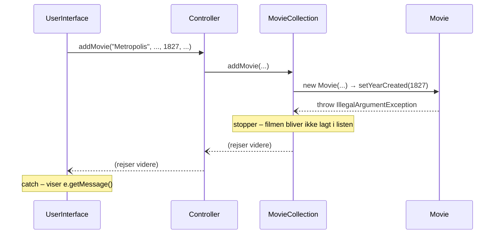

# Exceptions – kast, send videre og fang det rigtige sted

## Beskrivelse

I går lærte I at **fange** exceptions, så filmsamlingen overlever, at brugeren skriver `sytten` i
stedet for et årstal. Men hvad med `1827`? Det **er** et tal – og `readInt` sender det glad videre.
Den ældste bevarede film er fra 1888, så en film fra 1827 er en fejl i samlingen.

Hvem skal opdage det? Ikke `UserInterface` alene – så gælder reglen kun, når brugeren taster. Det er
`Movie`, der ved, hvad en gyldig film er. Men `Movie` må ikke skrive til brugeren. Løsningen er den,
I så til sidst i går: `Movie` **kaster** en exception, og `UserInterface` **fanger** den.

I dag går vi i dybden med, hvad der sker **imellem**: hvordan en exception bevæger sig op gennem
kaldene, fra `Movie` til `UserInterface`. Og vi ser på de værktøjer, der gør exceptions til en del af
designet: flere `catch`-blokke, `finally`, egne exception-klasser og tests af beskeden.

I projektet er det [Filmsamling del 6, onsdag](../../projekter/filmsamling/del-6-exceptions.md#onsdag-28-10-kast-exceptions):
US11 (kun gyldige film) og US12 (angiv datoen, jeg så filmen).

## Læringsmål

Når du har arbejdet med dagens materiale, skal du kunne:

* forklare, hvordan en exception bevæger sig op gennem **kaldstakken**, indtil nogen fanger den
* læse en stack trace med flere lag og finde både stedet, hvor den blev kastet, og vejen dertil
* afgøre, **hvor** en exception skal kastes, og **hvor** den skal fanges
* skrive flere `catch`-blokke i den rigtige rækkefølge
* forklare, hvad `finally` gør, og hvornår den kører
* skrive en metode, der er **alt eller intet**: enten lykkes den helt, eller også ændrer den ingenting
* lave en egen exception-klasse og forklare forskellen på at arve fra `RuntimeException` og
  `Exception`
* teste både, **at** der kastes, og **hvilken besked** der følger med

## Se disse videoer før undervisningen:

* [Unit Testing with JUnit and IntelliJ – 03 – Invalid input testing](https://www.youtube.com/watch?v=u2Cj-zkbcao)
  (11:39) – tests af ugyldigt input

Genopfrisk gerne gårsdagens [exception handling](https://www.youtube.com/watch?v=xTtL8E4LzTQ&t=9h5m29s)
(til: 09:13:28) og læs [gårsdagens side](../02_tir_2026-10-27/README.md), især *Kast selv* og
*assertThrows*.

## Læs nedenstående før undervisningen

---

### En exception rejser op gennem kaldene

Når en metode kaster en exception, og den **ikke** selv fanger den, stopper metoden – og exceptionen
dukker op der, hvor metoden blev kaldt. Fanger den heller ikke, stopper den også, og så fremdeles.
Exceptionen rejser op gennem kaldene, indtil den møder en `catch`, der passer – eller forlader
`main`, og programmet går ned.

```java
public class Propagation {
    public static void main(String[] args) {
        System.out.println("main: før");
        try {
            outer("1827");
            System.out.println("main: efter outer");
        } catch (IllegalArgumentException e) {
            System.out.println("main: fanget – " + e.getMessage());
        }
        System.out.println("main: slut");
    }

    static void outer(String text) {
        System.out.println("outer: før");
        inner(Integer.parseInt(text));
        System.out.println("outer: efter");
    }

    static void inner(int year) {
        System.out.println("inner: før");
        if (year < 1888) {
            throw new IllegalArgumentException("Årstallet " + year + " er for tidligt.");
        }
        System.out.println("inner: efter");
    }
}
```

```text
main: før
outer: før
inner: før
main: fanget – Årstallet 1827 er for tidligt.
main: slut
```

Ingen af linjerne med `efter` bliver skrevet. `inner` stopper ved `throw`, `outer` stopper, hvor den
kaldte `inner`, og `main` springer fra kaldet af `outer` direkte til `catch`.

### Sådan ser det ud i filmsamlingen

I filmsamlingen er der fire lag mellem brugeren og reglen:



`Controller` og `MovieCollection` skal **ingenting** gøre. De fanger ikke exceptionen – de lader
den rejse forbi. Og fordi `new Movie(...)` kastede, nåede `MovieCollection` aldrig til
`movies.add(movie)`. Den ugyldige film kom aldrig ind i samlingen.

Fanger ingen den, ser stack trace'en sådan ud (her kaldt fra et lille testprogram, `TraceMain`):

```text
Exception in thread "main" java.lang.IllegalArgumentException: Årstallet skal være mellem 1888 og 2027.
	at Movie.setYearCreated(Movie.java:69)
	at Movie.<init>(Movie.java:22)
	at MovieCollection.addMovie(MovieCollection.java:13)
	at Controller.addMovie(Controller.java:13)
	at TraceMain.main(TraceMain.java:4)
```

Læs den som en **kaldstak**: øverst er det sted, exceptionen blev kastet (`setYearCreated`), og hver
linje derunder er den metode, der kaldte linjen over. `Movie.<init>` er Javas navn for
**constructoren**. Nederst er den metode, der startede det hele.

> **To spørgsmål, når en stack trace dukker op:** *Hvor blev den kastet?* (øverst blandt jeres egne
> klasser) og *hvor burde den være blevet fanget?* (et sted længere nede – der, hvor man ved, hvad
> brugeren skal have at vide).

### Hvem kaster, og hvem fanger?

| | Hvem | Hvorfor |
|---|---|---|
| **Kaster** | den klasse, der **kender reglen** – her `Movie` | *Information Expert*: den ved, hvad en gyldig film er |
| **Sender videre** | klasserne imellem – `MovieCollection`, `Controller` | de kan ikke gøre noget fornuftigt ved det |
| **Fanger** | den, der **kan gøre noget** ved det – her `UserInterface` | den er den eneste, der må tale med brugeren |

Den klassiske fejl er at fange for tidligt:

```java
// SÅDAN SKAL DET IKKE GØRES – i MovieCollection
public void addMovie(String title, ...) {
    try {
        movies.add(new Movie(title, ...));
    } catch (IllegalArgumentException e) {
        System.out.println("Ugyldig film");   // System.out uden for UserInterface!
    }
}
```

Nu ved `UserInterface` ikke, at det gik galt – den skriver "Jaws er tilføjet til samlingen". Og
`MovieCollection` skriver til brugeren. **Fang kun, hvis du kan gøre noget fornuftigt ved det.**

---

### Flere catch-blokke

En `try` kan have flere `catch`-blokke. Java prøver dem **oppefra** og bruger den **første**, der
passer:

```java
public class CatchWhich {
    public static void main(String[] args) {
        String[] inputs = {"sytten", "1827", "1975"};
        for (String input : inputs) {
            try {
                int year = Integer.parseInt(input);
                if (year < 1888) {
                    throw new IllegalArgumentException("for tidligt");
                }
                System.out.println(input + ": ok");
            } catch (NumberFormatException e) {
                System.out.println(input + ": ikke et tal");
            } catch (IllegalArgumentException e) {
                System.out.println(input + ": " + e.getMessage());
            }
        }
    }
}
```

```text
sytten: ikke et tal
1827: for tidligt
1975: ok
```

Husk arven fra i går: `NumberFormatException` **er en** `IllegalArgumentException`. Står
`IllegalArgumentException` først, fanger den **begge** – og compileren siger fra, fordi den anden
blok aldrig kan nås:

```text
CatchWhich.java:13: error: exception NumberFormatException has already been caught
            } catch (NumberFormatException e) {
              ^
```

**Den mest specifikke type først.**

### finally – kører altid

En `try` kan have en `finally`-blok. Den kører **altid** – hvad enten `try` gik godt, der blev
kastet og fanget, eller metoden returnerede midt i det hele:

```java
public class FinallyDemo {
    public static void main(String[] args) {
        System.out.println(parse("42"));
        System.out.println(parse("fyrre"));
    }

    static int parse(String text) {
        try {
            System.out.println("try");
            return Integer.parseInt(text);
        } catch (NumberFormatException e) {
            System.out.println("catch");
            return -1;
        } finally {
            System.out.println("finally");
        }
    }
}
```

```text
try
finally
42
try
catch
finally
-1
```

Læg mærke til, at `finally` kører **før** metoden faktisk returnerer – også når `return` står i
`try`.

`finally` bruges til **oprydning**: noget, der skal ske, uanset hvordan det gik. Det typiske
eksempel er at lukke en fil igen, når man er færdig med den. Filer møder I på fredag.

---

### Alt eller intet

En metode, der ændrer flere ting, skal passe på: hvad hvis den første ændring lykkes, og den anden
kaster? Så er objektet **halvt ændret** – og brugeren får at vide, at intet skete.

Filmsamlingens `editMovie` har netop det problem: den kalder seks settere efter hinanden. Er titlen
fin og årstallet ugyldigt, har `setTitle` allerede ændret titlen, når `setYearCreated` kaster.

Reglen er: **tjek alt, før du ændrer noget.** I filmsamlingen gøres det ved at oprette en
midlertidig `Movie` med de nye værdier – den kaster, hvis bare én af dem er ugyldig, før den rigtige
film røres. Se [del 6, *Redigering: alt eller intet*](../../projekter/filmsamling/del-6-exceptions.md#redigering-alt-eller-intet).

Det samme gælder en bankoverførsel: tjek modtageren og beløbet, **før** pengene trækkes fra kontoen.
Det prøver I i dagens opgaver.

Og test det: efter en afvist ændring skal **alt** være, som det var.

```java
@Test
void transferTooMuchChangesNothing() {
    assertThrows(InsufficientFundsException.class, () -> salary.transferTo(savings, 5000));

    assertEquals(1000, salary.getBalance());
    assertEquals(0, savings.getBalance());
}
```

### Test beskeden

`assertThrows` **returnerer** den exception, den fangede. Så kan man også tjekke beskeden:

```java
@Test
void withdrawMoreThanBalanceIsRejected() {
    InsufficientFundsException e = assertThrows(InsufficientFundsException.class,
            () -> salary.withdraw(1001));

    assertEquals("Der er kun 1000 kr. på Løn.", e.getMessage());
    assertEquals(1000, salary.getBalance());
}
```

Det er især nyttigt, når samme metode kan kaste af **flere** grunde – så ved man, at det var den
rigtige grund.

---

### Egne exception-klasser

`IllegalArgumentException` passer til det meste. Men nogle gange vil man gerne kunne skelne en
bestemt slags fejl fra alle andre – fx "der er ikke penge nok" fra "beløbet er negativt". Så kan man
lave sin egen exception-klasse. Den er helt almindelig arv:

```java
// Kastes, når der hæves flere penge, end der er på kontoen
public class InsufficientFundsException extends RuntimeException {

    public InsufficientFundsException(String message) {
        super(message);
    }
}
```

`super(message)` giver beskeden videre til superklassen – så virker `getMessage()`. Og nu kan den,
der fanger, skelne:

```java
} catch (InsufficientFundsException e) {
    System.out.println("Ikke dækning: " + e.getMessage());
} catch (IllegalArgumentException e) {
    System.out.println("Det gik ikke: " + e.getMessage());
}
```

**Hvad man arver fra, betyder noget:**

| Arver fra | Slags | Betyder |
|---|---|---|
| `RuntimeException` | **unchecked** | compileren blander sig ikke – som `IllegalArgumentException` |
| `Exception` | **checked** | compileren **kræver**, at alle, der kalder metoden, fanger den eller skriver `throws` |

Retter man `InsufficientFundsException` til at arve fra `Exception`, kompilerer `withdraw` ikke
længere, før den har fået `throws InsufficientFundsException` – og så skal alle, der kalder
`withdraw`, også tage stilling til den:

```text
BankAccount.java:32: error: unreported exception InsufficientFundsException; must be caught or declared to be thrown
            throw new InsufficientFundsException(
            ^
```

Checked exceptions er til fejl, som den, der kalder, **skal** forholde sig til – fx at en fil ikke
findes. Dem kommer vi til på fredag. Til regler om gyldige værdier bruger man som regel unchecked.

I filmsamlingen er en egen exception en **frivillig udvidelse** i
[del 6](../../projekter/filmsamling/del-6-exceptions.md#egen-exception-type).
`IllegalArgumentException` er helt i orden.

---

### En menuløkke, der ikke kan væltes

Samler man det hele, bliver et robust konsolprogram bygget sådan:

1. **Menuvalget læses som tekst**, og en `switch` med `default` tager sig af ukendte valg.
2. **Tal læses med en løkke**, der spørger igen ved `NumberFormatException` (`readInt`).
3. **Valg fra en liste tjekkes med `if`** – ingen exception nødvendig.
4. **Domæneklasserne kaster** `IllegalArgumentException` (eller egne typer) ved ugyldige værdier.
5. **`UserInterface` fanger dem** og viser `e.getMessage()` – så programmet fortsætter.

Punkt 5 kan man gøre i hver metode (som filmsamlingen gør i `createMovie`, `editMovie` og
`markAsWatched`) – eller ét sted, rundt om `switch`'en i menuløkken:

```java
try {
    switch (choice) {
        case "1" -> deposit();
        case "2" -> withdraw();
        case "3" -> transfer();
        case "0" -> running = false;
        default -> System.out.println("Ukendt valg: " + choice);
    }
} catch (InsufficientFundsException e) {
    System.out.println("Ikke dækning: " + e.getMessage());
} catch (IllegalArgumentException e) {
    System.out.println("Det gik ikke: " + e.getMessage());
}
```

Begge dele er i orden. Det ene sted er kortere; i hver metode kan beskeden tilpasses ("Filmen blev
**ikke oprettet**: ..."). Men fang de **bestemte** typer – ikke `Exception`. En
`NullPointerException` er en fejl i koden, og den skal I **se**, ikke gemme.

---

## Det vigtigste at tage med

* en exception, der ikke fanges, rejser op gennem kaldene – hver metode på vejen stopper
* stack trace'en er kaldstakken: øverst hvor den blev kastet, nedenunder vejen dertil
* **kast**, hvor reglen er (`Movie`); **fang**, hvor man kan gøre noget ved det (`UserInterface`)
* flere `catch`: den **mest specifikke** type først
* `finally` kører **altid** – til oprydning
* **alt eller intet**: tjek alt, før du ændrer noget – og test, at intet er ændret efter en afvisning
* `assertThrows` returnerer exceptionen – tjek også beskeden
* egen exception: `extends RuntimeException` (unchecked) eller `extends Exception` (checked)

## Aktiviteter i undervisningen

### 1. Forudsig

Lav [del A i opgaverne](opgaver.md#del-a--forudsig-output) – hvilke linjer bliver kørt, når en
exception rejser gennem tre metoder?

### 2. Bankkontoen

Lav [del B og C i opgaverne](opgaver.md#del-b--bankkontoen): en bankkonto, der afviser ugyldige
beløb, en overførsel, der er alt eller intet, og en egen exception – med tests.

### 3. Filmsamling – US11 og US12

Arbejd med [del 6, onsdag](../../projekter/filmsamling/del-6-exceptions.md#onsdag-28-10-kast-exceptions),
og fordel arbejdet som i den [anbefalede procedure](../../projekter/filmsamling/del-6-exceptions.md#onsdag):
reglerne i `Movie` med tests, "alt eller intet" i `editMovie`, og `readDate` og fangsten i
`UserInterface`.

Opdatér til sidst `docs/furps.md`: flyt R-kravene fra "Nej – del 6" til "Ja". Del 6 **bør være
færdig inden fredag 30-10**.
