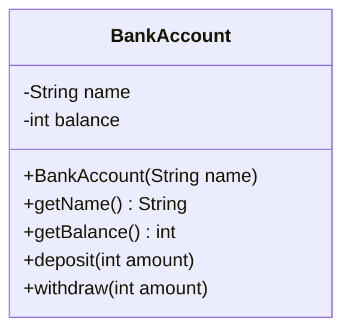

# Opgaver – Kast, send videre og fang det rigtige sted

Dagens opgaver er delt op sådan:

* **Del A** – forudsig output: exceptions gennem flere metoder, flere `catch` og `finally`.
* **Del B** – bankkontoen: regler, der kaster, en overførsel, der er alt eller intet, og tests.
* **Del C** – en egen exception og en menu, der ikke kan væltes.
* **Del D** – filmsamlingen: US11 og US12.
* **Udfordringer**.

Lav del B og C i jeres `junit-oevelse`-projekt.

Der er [vejledende løsninger](loesninger.md) – men prøv selv først.

---

# Del A – Forudsig output

> **Skriv dit svar ned, før du kører koden.**

## Opgave 1 – Tre metoder

Tag `Propagation` fra [læsestoffet](README.md#en-exception-rejser-op-gennem-kaldene). Hvad bliver
skrevet ud, hvis `main` kalder:

1. `outer("1975")`?
2. `outer("nitten")`? (Pas på: hvilken exception bliver kastet – og fanger `catch` den?)

## Opgave 2 – finally

Hvad skriver `FinallyDemo` fra [læsestoffet](README.md#finally--kører-altid)? Dæk outputtet til, og
skriv dit eget svar først.

## Opgave 3 – finally uden catch

```java
public class FinallyNoCatch {
    public static void main(String[] args) {
        try {
            risky();
            System.out.println("D");
        } catch (NumberFormatException e) {
            System.out.println("E");
        }
        System.out.println("F");
    }

    static void risky() {
        try {
            System.out.println("A");
            Integer.parseInt("x");
            System.out.println("B");
        } finally {
            System.out.println("C");
        }
    }
}
```

## Opgave 4 – Rækkefølgen

Byt om på de to `catch`-blokke i `CatchWhich` fra [læsestoffet](README.md#flere-catch-blokke), så
`IllegalArgumentException` står først. Hvad sker der? Slet så `catch (NumberFormatException e)`
helt. Hvad skriver programmet nu?

---

# Del B – Bankkontoen

## Opgave 5 – Indsæt og hæv

Lav klassen `BankAccount`:



Reglerne – brud på dem giver en `IllegalArgumentException` med en dansk besked:

* En konto skal have et navn, der ikke er tomt. En ny konto har 0 kr.
* `deposit` og `withdraw` skal have et beløb på mindst 1 kr.
* `withdraw` må ikke hæve mere, end der er på kontoen. (I opgave 8 får den sin egen exception.)
* En afvist `deposit` eller `withdraw` ændrer **ikke** saldoen.

Skriv `BankAccountTest` med en `@BeforeEach`, der opretter kontoen `Løn` med 1000 kr. Test mindst:

* at indsætte og hæve i det normale tilfælde
* grænserne: hæv **præcis** hele saldoen (må man), hæv 1 kr. mere (må man ikke)
* at beløb på 0 og negative beløb afvises
* at saldoen er uændret efter hver afvisning
* at et tomt navn afvises

## Opgave 6 – Overførslen

En kollega har skrevet en metode, der overfører penge til en anden konto. Tilføj den til
`BankAccount`:

```java
// Flytter amount fra denne konto til en anden
public void transferTo(BankAccount other, int amount) {
    withdraw(amount);
    other.deposit(amount);
}
```

Opret i `setUp` også kontoen `Opsparing` med 0 kr. Skriv tests af:

1. en almindelig overførsel af 300 kr. – begge saldi skal passe bagefter
2. en overførsel af mere, end der er på kontoen
3. en overførsel til `null`
4. en overførsel til **samme** konto (`salary.transferTo(salary, 300)`)

For 2–4 gælder: overførslen skal **afvises** med en exception, og **ingen** saldo må være ændret.

Hvilke tests er røde? Hvor bliver pengene af i test 3? Ret `transferTo`, så den er **alt eller
intet**, og så alle fire tests er grønne.

## Opgave 7 – Test beskeden

`withdraw` kan nu afvise af to grunde: beløbet er ugyldigt, eller der er ikke penge nok. Skriv en
test, der tjekker, at **beskeden** ved for stor en hævning siger, hvor mange penge der er – fx
`Der er kun 1000 kr. på Løn.` Brug, at `assertThrows` returnerer exceptionen.

---

# Del C – Egen exception og en robust menu

## Opgave 8 – InsufficientFundsException

Lav klassen `InsufficientFundsException`, der arver fra `RuntimeException`, og lad `withdraw` kaste
den (i stedet for `IllegalArgumentException`), når der ikke er penge nok. Ret testene.

* Hvilke af testene fra del B skal rettes – og hvorfor kun dem?
* Hvad sker der med en `catch (IllegalArgumentException e)`, der før fangede "ikke penge nok"?

## Opgave 9 – Bankmenuen

Lav klassen `BankApp` med en `main`, to konti (`Løn` og `Opsparing`) og en menu:

```text
Løn: 1000 kr. | Opsparing: 0 kr.
1. Indsæt på Løn
2. Hæv fra Løn
3. Overfør fra Løn til Opsparing
0. Afslut
Vælg:
```

Krav:

* Programmet må **ikke** kunne væltes – hverken af bogstaver, forkerte menuvalg, negative beløb eller
  for store hævninger.
* Menuvalget læses som tekst og bruges i en `switch`.
* Beløb læses med en `readInt`, der spørger igen.
* Reglerne står **kun** i `BankAccount`. `BankApp` fanger exceptions og viser beskeden. "Ikke penge
  nok" skal vises anderledes end de andre fejl.

En kørsel kunne se sådan ud:

```text
Vælg: 1
Beløb: tusind
"tusind" er ikke et helt tal. Prøv igen.
Beløb: 1000
1000 kr. er indsat.
...
Vælg: 2
Beløb: 5000
Ikke dækning: Der er kun 1000 kr. på Løn.
...
Vælg: 3
Beløb: -50
Det gik ikke: Beløbet skal være mindst 1 kr.
```

Byt med sidemanden, og prøv at vælte den andens bank.

---

# Del D – Filmsamlingen

## Opgave 10 – US11 og US12

Lav [del 6, onsdag](../../projekter/filmsamling/del-6-exceptions.md#onsdag-28-10-kast-exceptions).
Brug det, I har øvet i dag:

* Reglerne i `Movie`'s settere, og constructoren bruger setterne (som `deposit` og `withdraw`).
* `editMovie` er alt eller intet (som `transferTo`).
* Tests af begge grænser og af, at en afvist redigering ikke ændrer noget.
* `UserInterface` fanger og viser `e.getMessage()`.

---

# Udfordringer

## Udfordring 1 – Checked

Ret `InsufficientFundsException` til at arve fra `Exception` i stedet for `RuntimeException`. Hvor
mange steder skal koden rettes, før den kompilerer igen? Hvad synes I – bliver koden bedre eller
værre?

## Udfordring 2 – Dato, der ikke findes

Skriv `LocalDate.parse("31-02-2026", DateTimeFormatter.ofPattern("dd-MM-yyyy"))`. Der kommer ingen
exception – hvad kommer der? Find ud af, hvordan man får en `DateTimeFormatter` til at afvise
datoen. (Søg efter `ResolverStyle.STRICT`, og find ud af, hvorfor man så skal skrive `uuuu` i stedet
for `yyyy`.)

## Udfordring 3 – Kvittering med finally

Giv `BankApp` en tæller for, hvor mange handlinger brugeren har **forsøgt** – lykkedes eller ej. Brug
`finally` til at tælle. Skriv tælleren ud, når programmet slutter.
