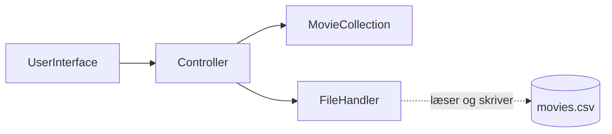

# Filer – gem og indlæs

## Beskrivelse

I to uger har I tastet film ind i filmsamlingen – og hver gang, programmet sluttede, var de væk.
Alt, hvad et program har i sine variable og lister, ligger i computerens **hukommelse**, og den
bliver tømt, når programmet stopper.

Skal data **overleve** programmet, skal de gemmes et sted, der bliver ved med at eksistere: en
**fil** på disken. Det hedder at **persistere** data. I dag lærer I at skrive tekst til en fil og
læse den igen – og at gemme objekter som linjer i en **CSV-fil**, så en hel filmsamling kan gemmes
og hentes tilbage.

Undervejs møder I en ny slags exception: en **checked exception**. Java vil ikke engang kompilere
koden, før I har taget stilling til, hvad der skal ske, hvis filen ikke findes.

I projektet er det [Filmsamling del 7](../../projekter/filmsamling/del-7-filer.md): `movies.csv`,
som gemmes, når programmet slutter, og indlæses, når det starter.

## Læringsmål

Når du har arbejdet med dagens materiale, skal du kunne:

* skrive tekst til en fil med `PrintStream` og læse den igen med `Scanner`
* forklare, hvor en fil med et **relativt** filnavn havner, når programmet køres fra IntelliJ
* forklare forskellen på **checked** og **unchecked** exceptions og hvorfor filer giver checked
* vælge mellem at **fange** en exception (`try`/`catch`) og **sende den videre** (`throws`)
* gemme objekter som linjer i en CSV-fil og lave linjerne om til objekter igen med `split`
* forklare, hvad **tegnkodning** er, hvorfor vi bruger **UTF-8**, og hvad der sker, når en fil har
  en anden kodning
* samle al filhåndtering i én klasse, så resten af programmet ikke ved, at der er en fil
* teste kode, der læser og skriver filer, med en testfil, der slettes bagefter

## Se disse videoer før undervisningen:

* [write files](https://www.youtube.com/watch?v=xTtL8E4LzTQ&t=9h13m28s) (til: 09:21:58)
* [read files](https://www.youtube.com/watch?v=xTtL8E4LzTQ&t=9h21m58s) (til: 09:28:50)
* [Checked vs. Unchecked Exceptions in Java Tutorial](https://www.youtube.com/watch?v=bCPClyGsVhc)
  (Coding with John, 10:14)

> **Bemærk:** Videoerne bruger andre klasser til at skrive og læse end dem, vi bruger. Vi bruger
> `PrintStream` og `Scanner`, som I kender i forvejen fra `System.out` og tastaturet. Princippet er
> det samme: åbn filen, skriv eller læs, luk den igen.

## Læs nedenstående før undervisningen

---

### I kender det allerede

I har skrevet til skærmen og læst fra tastaturet siden uge 35:

```java
System.out.println("Hej");                   // System.out er en PrintStream
Scanner scanner = new Scanner(System.in);    // en Scanner, der læser fra tastaturet
```

At skrive til en fil og læse fra den er **de samme to klasser** – de peger bare et andet sted hen:

| | Skærm og tastatur | Fil |
|---|---|---|
| Skriv | `System.out.println(...)` | `PrintStream output = new PrintStream(new File("film.txt"));`<br/>`output.println(...)` |
| Læs | `new Scanner(System.in)` | `new Scanner(new File("film.txt"))` |

`File` (fra `java.io`) er et objekt, der **peger på** en fil – det er ikke selve filen, og filen
behøver ikke findes endnu.

### Skriv og læs en fil

```java
import java.io.File;
import java.io.FileNotFoundException;
import java.io.PrintStream;
import java.util.Scanner;

public class FirstFile {
    public static void main(String[] args) throws FileNotFoundException {
        // Skriv
        PrintStream output = new PrintStream(new File("film.txt"));
        output.println("Jaws");
        output.println("Adams æbler");
        output.println("Psycho");
        output.close();

        // Læs
        Scanner fileScanner = new Scanner(new File("film.txt"));
        int number = 1;
        while (fileScanner.hasNextLine()) {
            String line = fileScanner.nextLine();
            System.out.println(number + ": " + line);
            number++;
        }
        fileScanner.close();

        System.out.println("Filen ligger her: " + new File("film.txt").getAbsolutePath());
    }
}
```

```text
1: Jaws
2: Adams æbler
3: Psycho
Filen ligger her: /Users/.../IdeaProjects/fil-oevelse/film.txt
```

* `new PrintStream(new File(...))` **opretter** filen – eller **overskriver** den, hvis den findes.
* `hasNextLine()` er `true`, så længe der er flere linjer. Det er den løkke, man næsten altid
  bruger til at læse en fil.
* `throws FileNotFoundException` på `main` forklares om lidt.

### Luk filen

`close()` fortæller Java, at I er færdige med filen. Det er vigtigt af to grunde:

* **Data kan gå tabt.** Mange måder at skrive på gemmer teksten i en buffer og skriver den først til
  disken, når filen lukkes. Glemmer man `close()`, kan filen ende tom. (`PrintStream` er ret
  tilgivende – men vær ikke afhængig af det.)
* **Filen bliver holdt åben.** Især på Windows kan en åben fil ikke slettes eller skrives af andre,
  før programmet slutter.

Luk altid det, I åbner – også en `Scanner` på en fil.

### Hvor ligger filen?

`"film.txt"` er et **relativt** filnavn: det er relativt til den mappe, programmet kører i. Når I
kører fra IntelliJ, er det **projektets rodmappe** – den mappe, hvor `pom.xml` ligger (eller `src`
i et almindeligt projekt). **Ikke** i `src` og ikke i `target`.

Kan I ikke finde filen, så udskriv `new File("film.txt").getAbsolutePath()`, som i eksemplet.

---

### Checked exceptions

Fjern `throws FileNotFoundException` fra `main` i eksemplet, og IntelliJ markerer to linjer med
rødt:

```text
FirstFile.java:9: error: unreported exception FileNotFoundException; must be caught or declared to be thrown
        PrintStream output = new PrintStream(new File("film.txt"));
                             ^
FirstFile.java:16: error: unreported exception FileNotFoundException; must be caught or declared to be thrown
        Scanner fileScanner = new Scanner(new File("film.txt"));
                              ^
```

Også `PrintStream` kan kaste den – fx hvis mappen ikke findes, eller filen er skrivebeskyttet.

Koden **kompilerer ikke**. Det er nyt – `NumberFormatException` og `IllegalArgumentException` fra
tirsdag og onsdag kunne I fange, hvis I ville, men compileren blandede sig ikke.

Forskellen er, at `FileNotFoundException` er en **checked exception**:

| | Unchecked | Checked |
|---|---|---|
| Arver fra | `RuntimeException` | `Exception` (men ikke `RuntimeException`) |
| Eksempler | `NumberFormatException`, `IllegalArgumentException`, `NullPointerException` | `FileNotFoundException`, `IOException` |
| Skyldes typisk | forkert input eller en fejl i koden – kan undgås | noget uden for programmet – kan **ikke** undgås |
| Compileren | blander sig ikke | **kræver**, at I fanger den eller skriver `throws` |

Hvorfor? Fordi en fil kan være slettet, flyttet eller låst, **uanset hvor god koden er**. Java
tvinger jer til at tage stilling til det, før programmet overhovedet kan køre.

### Fang den – eller send den videre

Der er to måder at tage stilling på:

**Fang den**, hvis metoden ved, hvad der skal ske:

```java
try {
    Scanner fileScanner = new Scanner(new File("findes-ikke.txt"));
    System.out.println("Filen er åbnet.");
    fileScanner.close();
} catch (FileNotFoundException e) {
    System.out.println("Kunne ikke åbne filen: " + e.getMessage());
}
```

```text
Kunne ikke åbne filen: findes-ikke.txt (No such file or directory)
```

(På Windows står der *The system cannot find the file specified*.)

**Send den videre** med `throws`, hvis det er den, der kalder, der ved, hvad der skal ske:

```java
public ArrayList<Movie> loadMovies() throws FileNotFoundException {
    Scanner fileScanner = new Scanner(new File(fileName));
    // ...
}
```

`throws` i metodens hoved betyder: *denne metode kan kaste en `FileNotFoundException` – den, der
kalder mig, må tage stilling*. Og så gælder kravet **for den, der kalder** – den skal selv fange
eller skrive `throws`.

**Hvem skal fange?** Den samme regel som onsdag: **den, der kan gøre noget fornuftigt ved det.** I
filmsamlingen er det `UserInterface` – den ved, at brugeren skal have at vide, at der ikke er nogen
gemt samling endnu. Derfor sender `FileHandler` og `Controller` den videre med `throws`, og
`UserInterface` fanger den. Se [del 7, *Checked exceptions*](../../projekter/filmsamling/del-7-filer.md#checked-exceptions).

> **Aldrig en tom `catch`** – heller ikke her. En samling, der ikke blev gemt, uden at brugeren fik
> det at vide, er værre end et program, der går ned.

---

### CSV: objekter som linjer

En fil er bare tekst. For at gemme et objekt skal det laves om til en linje tekst – og for at få
objektet tilbage skal linjen laves om til et objekt igen.

Det almindeligste format er **CSV** (*comma-separated values*): én linje pr. objekt, med felterne
adskilt af et tegn. Første linje er ofte en **overskrift**, der fortæller, hvad felterne er:

```text
title;director;yearCreated;inColor;lengthInMinutes;genre;lastWatched
Jaws;Steven Spielberg;1975;true;124;Thriller;2025-10-30
Adams æbler;Anders Thomas Jensen;2005;true;94;Komedie;
```

Trods navnet bruger vi **semikolon**: titler indeholder tit komma (*Crouching Tiger, Hidden
Dragon*), og så ville et komma i titlen blive læst som et nyt felt. (Dansk Excel bruger i øvrigt
også semikolon i CSV-filer.)

**Fra objekt til linje** er bare at sætte felterne sammen med `;` imellem – se `toCsvLine` i
[del 7](../../projekter/filmsamling/del-7-filer.md#filehandler).

**Fra linje til objekt** starter med `split`, der deler en tekst op ved et tegn og giver et array:

```java
String line = "Adams æbler;Anders Thomas Jensen;2005;true;94;Komedie;";

String[] fields = line.split(";");
System.out.println(fields.length);          // 6 – det tomme felt til sidst er væk!

String[] allFields = line.split(";", -1);
System.out.println(allFields.length);       // 7
System.out.println("[" + allFields[6] + "]");   // [] – det tomme felt

int year = Integer.parseInt(allFields[2]);
boolean inColor = Boolean.parseBoolean(allFields[3]);
System.out.println(year + 1);               // 2006
System.out.println(inColor);                // true
```

* Alle felter kommer ud som **tekst**. Tal laves om med `Integer.parseInt`, sandt/falsk med
  `Boolean.parseBoolean`, datoer med `LocalDate.parse` – det hele fra de sidste to uger.
* **`split(";", -1)`**: uden `-1` smider `split` tomme felter i **slutningen** væk. En film, der aldrig
  er set, har et tomt felt til sidst – og så ville `fields[6]` gå ned med en
  `ArrayIndexOutOfBoundsException`.
* `Boolean.parseBoolean` giver `true` for `"true"` (uanset store og små bogstaver) og `false` for
  **alt andet** – også `"ja"`.

### Ødelagte linjer

En fil kan være rettet i hånden, halvt skrevet eller bare forkert. Hvad skal der ske med linjen
`Psycho;Alfred Hitchcock;nitten-tres;false;109;Horror;`?

Ikke at hele programmet går ned – så mister brugeren alle de **andre** film. Den bedste løsning er
at **springe linjen over** og tælle den, så brugeren kan få en advarsel. Og her kommer tirsdagens og
onsdagens arbejde til nytte:

* `Integer.parseInt("nitten-tres")` kaster `NumberFormatException`.
* `new Movie(...)` med et ugyldigt årstal kaster `IllegalArgumentException` – reglerne fra del 6
  beskytter nu også mod en rettet fil.
* `LocalDate.parse(...)` kaster `DateTimeParseException`.

Alle tre fanges **pr. linje** – `try` inde i løkken, ikke uden om den (husk opgave 2 og 3 fra
tirsdag). Se `parseMovie` i [del 7](../../projekter/filmsamling/del-7-filer.md#filehandler).

---

### Tegnkodning: æ, ø og å

En fil består af **bytes** – tal fra 0 til 255. At et bestemt tal betyder `A` og et andet `æ`, er en
aftale. Sådan en aftale hedder en **tegnkodning** (*character encoding*), og der findes flere:

| Kodning | Bruges | `æ` bliver til |
|---|---|---|
| **UTF-8** | næsten overalt i dag; standard i Java 18+, IntelliJ og på nettet | 2 bytes |
| ISO-8859-1 / Windows-1252 | ældre filer, især fra Windows og ældre Excel | 1 byte |

Almindelige bogstaver (a–z) er ens i begge. Det er æ, ø, å – og alt andet uden for engelsk – der
bliver forskelligt.

**Med JDK 21 skriver og læser `PrintStream` og `Scanner` UTF-8**, uanset om I sidder på Windows eller
Mac. Så længe jeres program selv skriver filen, og IntelliJ viser den, er alt i orden: æ, ø og å
kommer sikkert igennem.

Problemet opstår, når filen kommer **udefra** i en anden kodning. Læser en `Scanner` en
ISO-8859-1-fil som UTF-8, sker der noget lumsk: den **stopper**, så snart den møder et tegn, den
ikke kan læse – typisk allerede i starten af filen. `hasNextLine()` bliver `false`, og der kommer
ingen exception – bare en tom (eller halv) samling. Man kan give `Scanner` den rigtige kodning:

```java
Scanner fileScanner = new Scanner(new File("latin1.txt"), StandardCharsets.ISO_8859_1);
```

(Den constructor kaster `IOException` i stedet for `FileNotFoundException` – `FileNotFoundException`
er en undertype af `IOException`.)

I IntelliJ står filens kodning nederst til højre i statuslinjen, når filen er åben. Viser den en fil
med mærkelige tegn som `æ` eller `�` i stedet for `æ`, er kodningen forkert. Brug **File → File Properties →
File Encoding** til at genindlæse (*Reload*) den med en anden kodning – og vælg **ikke** *Convert*,
medmindre du vil ændre selve filen.

> **Kort sagt:** brug UTF-8 overalt. Får I en fil udefra, der ser mærkelig ud, så tjek kodningen,
> før I leder efter fejl i koden.

---

### Én klasse har ansvaret: FileHandler

Resten af programmet skal **ikke** vide, at der er en fil. `MovieCollection` skal ikke åbne filer,
og `UserInterface` skal ikke kende CSV-formatet. Al filhåndtering samles i én klasse, `FileHandler`,
som får og giver en `ArrayList<Movie>`:



Det er **Single Responsibility** og **lav kobling** fra uge 39: skifter I en dag filen ud med en
database, er det kun `FileHandler`, der skal ændres. `Controller` bestemmer, **hvornår** der gemmes
og indlæses.

`FileHandler` får **filnavnet i constructoren**. Programmet bruger `movies.csv`, testene deres egen
`test-movies.csv` – så en test kan aldrig komme til at slette jeres rigtige samling.

### Test af filer

Tests af filer skal rydde op efter sig. `@AfterEach` er det modsatte af `@BeforeEach`: den kører
**efter** hver test – også når testen fejler:

```java
private static final String TEST_FILE = "test-movies.csv";

@AfterEach
void deleteTestFile() {
    new File(TEST_FILE).delete();
}
```

En testmetode, der kalder en metode med `throws FileNotFoundException`, skal selv tage stilling. I en
test er det nemmest at skrive `throws FileNotFoundException` på testmetoden: bliver den kastet, er
testen rød – og det er præcis det, vi vil. Og at en manglende fil **skal** give en exception, tester
man med `assertThrows(FileNotFoundException.class, ...)`, som onsdag.

Den vigtigste test er **gem og indlæs igen**: gem nogle film, indlæs dem, og tjek, at **alle** felter
er kommet rigtigt tilbage – også æ, ø og å og en film uden dato.

### Husk .gitignore

`movies.csv` er **jeres egen** samling på **jeres egen** computer. Kommer den med i Git, får I en
merge-konflikt, hver gang to i gruppen har kørt programmet (husk mandag i uge 43). Tilføj den – og
testfilen – til `.gitignore`. Se [del 7](../../projekter/filmsamling/del-7-filer.md#gitignore).

---

## Det vigtigste at tage med

* data i variable forsvinder, når programmet slutter – en **fil** overlever
* skriv med `PrintStream(new File(...))`, læs med `Scanner(new File(...))` og en
  `hasNextLine()`-løkke – og **luk** filen bagefter
* et relativt filnavn ligger i **projektets rodmappe**, når I kører fra IntelliJ
* `FileNotFoundException` er **checked**: fang den, eller skriv `throws` – ellers kompilerer koden
  ikke
* fang, hvor man kan gøre noget ved det – i filmsamlingen `UserInterface`
* CSV: én linje pr. objekt, felter adskilt af `;`, en overskrift øverst; `split(";", -1)`
* spring ødelagte linjer over (`try` inde i løkken), og tæl dem
* brug **UTF-8**; en fil i en anden kodning kan give mærkelige tegn – eller ingen linjer
* al filhåndtering i **én** klasse; testene bruger deres egen fil og sletter den i `@AfterEach`

## Aktiviteter i undervisningen

### 1. Opgaver

Lav [dagens opgaver](opgaver.md): skriv og læs den første fil, en navneliste, der husker, en
CSV-fil med løbeture – med tests – og en fil i en forkert kodning.

### 2. Filmsamling del 7

Følg [den anbefalede procedure i del 7](../../projekter/filmsamling/del-7-filer.md#anbefalet-procedure):
start med at skrive en `movies.csv` med tre film i hånden i IntelliJ, så I har noget at indlæse, før
gem-delen virker. Fordel derefter `FileHandler`, `Controller` og `UserInterface`.

Til sidst: start, opret, afslut, start igen. Er alt der? Åbn `movies.csv` i IntelliJ og se efter.
Ret en linje i hånden, så den er ødelagt – får I en advarsel, og bliver resten indlæst?

Del 7 **bør være færdig inden mandag 02-11**. Husk: afleveringen er **onsdag 04-11 kl. 23:59**.
