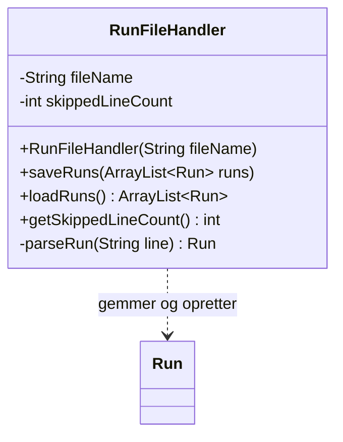

# Opgaver – Filer

Dagens opgaver er delt op sådan:

* **Del A** – den første fil: skriv, find og læs den.
* **Del B** – en navneliste, der husker navnene til næste gang.
* **Del C** – løbeture i en CSV-fil – med en `FileHandler`-klasse og tests.
* **Del D** – tegnkodning: en fil, der ikke er UTF-8.
* **Del E** – filmsamlingen: del 7.
* **Udfordringer**.

Lav del A, B og D i et nyt, almindeligt IntelliJ-projekt, fx `fil-oevelse`. Del C laves i jeres
`junit-oevelse`-projekt, hvor I har JUnit.

Der er [vejledende løsninger](loesninger.md) – men prøv selv først.

---

# Del A – Den første fil

## Opgave 1 – Skriv

Skriv et program, der med en `PrintStream` skriver tre linjer til filen `film.txt` – tre film, du
kan lide, og mindst én med æ, ø eller å i titlen. Husk `close()`.

* Kør programmet. Find filen i IntelliJ's projektvindue. Hvilken mappe ligger den i?
* Åbn den i IntelliJ. Står æ, ø og å rigtigt?
* Kør programmet igen. Er der nu seks linjer i filen – eller tre? Hvorfor?

## Opgave 2 – Læs

Udvid programmet, så det bagefter læser filen med en `Scanner` og skriver hver linje ud med et
nummer foran:

```text
1: Jaws
2: Adams æbler
3: Psycho
```

## Opgave 3 – Filen findes ikke

Ret filnavnet i læse-delen til `flim.txt` (en stavefejl). Hvad sker der?

Fjern så `throws FileNotFoundException` fra `main`. Hvad siger IntelliJ? Brug <kbd>Alt</kbd>+<kbd>Enter</kbd>
på den røde linje: IntelliJ tilbyder både **Add exception to method signature** og **Surround with
try/catch**. Vælg try/catch, og skriv en ordentlig besked til brugeren i `catch` – ikke bare
`e.printStackTrace()`.

---

# Del B – Navnelisten

## Opgave 4 – Husk navnene

Skriv et program, `NameList`, der:

1. Ved start læser navnene fra `names.txt` ind i en `ArrayList<String>` og viser dem. Findes filen
   ikke, får brugeren at vide, at listen er tom – programmet går **ikke** ned.
2. Lader brugeren skrive nye navne, ét pr. linje, indtil hun trykker Enter på en tom linje.
3. Gemmer **alle** navnene – de gamle og de nye – i `names.txt` og skriver, hvor mange der er gemt.

Lav indlæsning og gem som to metoder, `loadNames()` og `saveNames()`, der hver fanger
`FileNotFoundException` selv.

Første og anden kørsel skal se nogenlunde sådan ud:

```text
Ingen gemt liste endnu – du starter med en tom liste.
Navne på listen: []
Skriv nye navne. Tom linje = færdig.
Navn: Øjvind
Navn: Bo
Navn:
2 navne er gemt.
```

```text
Navne på listen: [Øjvind, Bo]
Skriv nye navne. Tom linje = færdig.
Navn: Åse
Navn:
3 navne er gemt.
```

## Opgave 5 – throws i stedet

Omskriv `loadNames` og `saveNames`, så de **ikke** fanger exceptionen, men sender den videre med
`throws FileNotFoundException`. Hvor skal den så fanges? Hvad skal der ske, hvis `saveNames` fejler –
er det det samme, som når `loadNames` fejler?

---

# Del C – Løbeture i en CSV-fil

Du vil holde styr på dine løbeture. Hver tur har en dato, en distance i kilometer og en tid i
minutter. Lav klassen `Run`:

```java
import java.time.LocalDate;

// En løbetur: hvornår, hvor langt og hvor længe
public class Run {
    private LocalDate date;
    private double kilometers;
    private int minutes;

    public Run(LocalDate date, double kilometers, int minutes) {
        if (kilometers <= 0) {
            throw new IllegalArgumentException("Distancen skal være større end 0.");
        }
        if (minutes <= 0) {
            throw new IllegalArgumentException("Tiden skal være mindst 1 minut.");
        }
        this.date = date;
        this.kilometers = kilometers;
        this.minutes = minutes;
    }

    public LocalDate getDate() {
        return date;
    }

    public double getKilometers() {
        return kilometers;
    }

    public int getMinutes() {
        return minutes;
    }
}
```

Turene skal gemmes i en CSV-fil med semikolon og en overskrift:

```text
date;kilometers;minutes
2026-10-25;5.2;31
2026-10-28;10.0;58
```

## Opgave 6 – RunFileHandler

Lav klassen `RunFileHandler`:



* `saveRuns` skriver overskriften og én linje pr. tur. Datoen skrives, som `LocalDate` selv skriver
  den (`2026-10-25`).
* `loadRuns` springer overskriften over og laver hver linje om til en `Run`.
* `parseRun` returnerer `null`, hvis linjen ikke kan læses: forkert antal felter, en dato, der ikke
  er en dato, et tal, der ikke er et tal – eller en tur, som `Run` afviser.
* Linjer, der ikke kan læses, springes over og tælles i `skippedLineCount`.
* `saveRuns` og `loadRuns` sender `FileNotFoundException` videre med `throws`.

## Opgave 7 – Tests

Skriv `RunFileHandlerTest`. Testene bruger filen `test-runs.csv`, som slettes i en `@AfterEach`.
Mindst:

1. **Gem og indlæs igen:** gem to ture, indlæs dem, og tjek **alle** felter. (Husk `assertEquals`
   med en tolerance for `double`.)
2. **Tom liste:** gem en tom liste – indlæsning giver en tom liste.
3. **Filen findes ikke:** `assertThrows(FileNotFoundException.class, ...)`.
4. **Ødelagte linjer:** testen skriver selv en fil med `PrintStream` med to gode linjer og tre
   ødelagte – et forkert datoformat, et tal skrevet med bogstaver og en linje med for få felter.
   Der skal indlæses to ture, og `getSkippedLineCount()` skal være 3.
5. **Ugyldig tur:** en linje med 0 km springes over.

Tjek bagefter i projektmappen: ligger `test-runs.csv` der stadig? Det må den ikke.

## Opgave 8 – Løbedagbogen

Skriv et lille program med en menu, der kan: tilføje en tur, vise alle ture med gennemsnitsfart
(km/t) og afslutte. Turene indlæses fra `runs.csv` ved start og gemmes ved afslutning. Brug
`readInt` og en `readDate` fra del 6 – programmet må ikke kunne væltes.

---

# Del D – Tegnkodning

## Opgave 9 – En fil fra en anden verden

Kør dette program. Det skriver en fil i den gamle kodning ISO-8859-1 – som om den kom fra en ældre
Windows-computer eller et gammelt Excel-ark:

```java
import java.io.File;
import java.io.IOException;
import java.io.PrintStream;
import java.nio.charset.StandardCharsets;

public class MakeLatin1File {
    public static void main(String[] args) throws IOException {
        PrintStream output = new PrintStream(new File("latin1.txt"), StandardCharsets.ISO_8859_1);
        output.println("Adams æbler");
        output.println("Blå mænd");
        output.close();
    }
}
```

1. Åbn `latin1.txt` i IntelliJ. Hvordan ser æ, ø og å ud? Hvad står der nederst til højre i
   statuslinjen?
2. Læs filen med en almindelig `Scanner(new File("latin1.txt"))`, og skriv linjerne ud. Hvor mange
   linjer bliver læst? Kommer der en exception?
3. Læs den nu med `new Scanner(new File("latin1.txt"), StandardCharsets.ISO_8859_1)`. Hvad sker der?
   Og hvorfor skal `catch` (eller `throws`) nu være `IOException` og ikke `FileNotFoundException`?
4. Få IntelliJ til at vise filen rigtigt: **File → File Properties → File Encoding**, vælg
   ISO-8859-1, og vælg **Reload** – ikke *Convert*.

---

# Del E – Filmsamlingen

## Opgave 10 – Del 7

Lav [Filmsamling del 7](../../projekter/filmsamling/del-7-filer.md) efter den
[anbefalede procedure](../../projekter/filmsamling/del-7-filer.md#anbefalet-procedure). Løbeturene i
del C er den samme opgave i det små: `FileHandler` svarer til `RunFileHandler`, og `FileHandlerTest`
til `RunFileHandlerTest`.

Husk `movies.csv` og `test-movies.csv` i `.gitignore`.

---

# Udfordringer

## Udfordring 1 – Semikolon i titlen

Hvad sker der i filmsamlingen, hvis en titel indeholder et semikolon – fx `Kærlighed; og andre
katastrofer`? Opret filmen, afslut, og start igen. Find en løsning (del 7 har to forslag under
*Frivillige udvidelser*).

## Udfordring 2 – Ordtæller

Skriv et program, der læser en tekstfil og skriver ud, hvor mange linjer, ord og tegn den har. (Hint:
`line.split(" ")` – men hvad med flere mellemrum efter hinanden?)

## Udfordring 3 – try-with-resources

Java har en særlig `try`, der **selv** lukker filen – også hvis der bliver kastet en exception
undervejs:

```java
try (Scanner fileScanner = new Scanner(new File(fileName))) {
    while (fileScanner.hasNextLine()) {
        // ...
    }
}
```

Omskriv `loadRuns` med den. Hvad bliver bedre? (Den er ikke et krav i filmsamlingen.)
