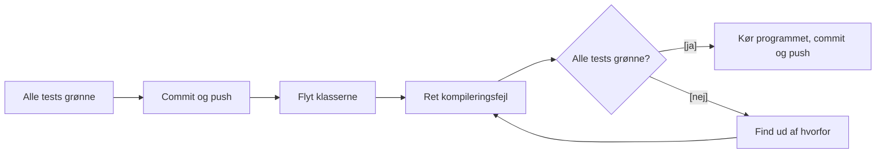

# Kode review og refaktorering

## Beskrivelse

Filmsamlingen er vokset i to uger: CRUD, tests, datoer, exceptions og filer. Hver del har lagt et
lag oven på det forrige – og nu skal der ryddes op, før den sidste del i morgen, og før en anden
gruppe skal læse jeres kode på fredag.

Dagen har to dele, som begge står i
[Filmsamling del 8 – Code review og packages](../../projekter/filmsamling/del-8-refaktorering.md):

1. **Code review** – to grupper sætter sig sammen, **hele gruppe mod hele gruppe**, og gennemgår
   hinandens kode efter [review-skemaet](../../projekter/filmsamling/kode-review.md). Det er en
   øvelse til det store review fredag 06-11.
2. **Refaktorering** – I retter det, reviewet fandt, og deler koden op i tre **packages**: `ui`,
   `domainmodel` og `datasource`.

I har refaktoreret før, i [Adventure](../../39/05_fre_2026-09-25/README.md). Forskellen er, at I nu
har **tests**. De fortæller jer med det samme, hvis en oprydning kom til at ændre, hvad programmet
gør.

## Læringsmål

Når du har arbejdet med dagens materiale, skal du kunne:

* gennemføre et code review efter et skema og give **konkret** og **saglig** feedback
* modtage feedback på din kode og vælge, hvad der skal rettes
* forklare, hvad en **package** er, og hvorfor man deler et program i **lag**
* skrive `package`- og `import`-linjer og forklare, hvorfor `java.lang` ikke skal importeres
* forklare forskellen på `public`, `protected`, `private` og **ingenting** – også på tværs af
  packages
* aflæse og rette fejlen `... is not public in ...; cannot be accessed from outside package`
* flytte klasser mellem packages i IntelliJ uden at ødelægge programmet – og bruge testene til at
  vise det

## Se disse videoer før undervisningen:

Der er ingen video i kursusrækken om packages og code review. Læs i stedet:

* [Filmsamling del 8](../../projekter/filmsamling/del-8-refaktorering.md) – hele delen
* [Review-skemaet](../../projekter/filmsamling/kode-review.md) – skim det, så I ved, hvad I skal
  kigge efter
* [Creating and Using Packages](https://docs.oracle.com/javase/tutorial/java/package/packages.html)
  (Oracle) – kun hvis du vil vide mere end det, der står herunder
* [Controlling Access to Members of a Class](https://docs.oracle.com/javase/tutorial/java/javaOO/accesscontrol.html)
  (Oracle) – tabellen over synlighed

## Læs nedenstående før undervisningen

---

### Hvorfor code review?

Et **code review** er, at en anden udvikler læser din kode, før den bliver en del af det fælles
program. I næsten alle softwarefirmaer sker det ved hver eneste ændring – ingen kode kommer ind,
uden at mindst én anden har læst den.

Det er ikke for at finde syndere. Det er fordi:

* **Den, der har skrevet koden, er blind for den.** Du ved, hvad `doIt()` gør, fordi du lige har
  skrevet den. Det gør den næste ikke.
* **Man lærer af at læse andres kode.** I har alle løst de samme user stories – men ikke ens. Den
  anden gruppe har måske en elegant løsning på noget, I kæmpede med.
* **Fejl er billigst at rette tidligt.** Et navn, der snyder, er let at rette i dag. Om tre uger er
  det brugt 40 steder.

Reviewet handler om **S**'et i FURPS – *supportability*: hvor let er koden at læse, forstå og ændre
for en anden udvikler? Menuens udseende er **ikke** det, I kigger på.

---

### Hvad kigger man efter?

Skemaet er langt, og i dag skal I kun bruge en del af det (se
[del 8](../../projekter/filmsamling/del-8-refaktorering.md#1-code-review-med-en-anden-gruppe)):

* **GitHub** – hele afsnittet
* **Klasser** – for `Movie` og `UserInterface`
* **Tests** – hele afsnittet

Spørgsmål med 💣 er **dårlige tegn** – dem vil man helst svare **nej** til. Her er nogle af de
typiske fund, så I ved, hvordan de ser ud i koden:

**En metode, der gør to ting.** Den finder filmene **og** skriver dem ud:

```java
// 💣 Gør to ting: finder filmene OG skriver dem ud
public void findMovies(String searchText) {
    for (Movie movie : movies) {
        if (movie.getTitle().toLowerCase().contains(searchText.toLowerCase())) {
            System.out.println(movie.getTitle());
        }
    }
}
```

Den kan ikke testes (hvad skal `assertEquals` sammenligne med?), og den bruger `System.out` uden
for `UserInterface`. Bedre:

```java
// Finder filmene og returnerer dem – UserInterface bestemmer, hvordan de vises
public ArrayList<Movie> searchMovies(String searchText) {
    ArrayList<Movie> result = new ArrayList<>();
    for (Movie movie : movies) {
        if (movie.getTitle().toLowerCase().contains(searchText.toLowerCase())) {
            result.add(movie);
        }
    }
    return result;
}
```

**En tom `catch`.** Fejlen forsvinder, og programmet kører videre med en forkert værdi:

```java
int year = 0;
// 💣 Tom catch: fejlen forsvinder, og year er bare 0
try {
    year = Integer.parseInt(input);
} catch (NumberFormatException e) {
}
```

Skriver brugeren `sytten`, bliver filmen gemt med årstallet `0` – uden at nogen får det at vide.

**Andre klassikere** fra skemaet:

| Fund | Hvorfor er det et problem? |
| --- | --- |
| Metoden hedder `doStuff`, `handle` eller `process` | Man kan ikke se, hvad den gør, uden at læse den |
| Attributter uden `private` | Alle kan ændre dem udenom reglerne i setterne |
| `get`-metoder, som ingen kalder | Død kode, som alligevel skal læses og vedligeholdes |
| Udkommenteret kode | Git husker den gamle version – slet den |
| En test uden `assert...` | Den er altid grøn og tester ingenting |
| `target`-mappen eller `movies.csv` på GitHub | Filer, som hver computer selv laver, hører ikke til i repoet |

---

### Sådan giver I god feedback

Det kender I fra [Adventure-præsentationen](../../41/05_fre_2026-10-09/README.md#sådan-giver-i-god-feedback),
men det er værd at gentage:

* **Vær konkret.** *"`doStuff()` i `Controller` linje 42 fortæller ikke, hvad den gør"* kan
  bruges. *"Navnene er lidt dårlige"* kan ikke.
* **Tal om koden, ikke om personen.** *"Metoden er lang"* – ikke *"I skriver lange metoder"*.
* **Spørg, før I dømmer.** *"Hvorfor er `title` ikke `private`?"* åbner en samtale. Der kan være en
  grund, I ikke kender.
* **Sig det, der er godt.** Ros er også feedback – så ved gruppen, hvad de skal blive ved med.

**Når I modtager feedback:** lyt, spørg ind, og skriv det ned. I behøver ikke være enige i alt, men
tænk over det, før I afviser det. Og husk: det er **koden**, der bliver reviewet – ikke jer.

---

### Packages

En **package** er en mappe med klasser, der hører sammen. I har brugt dem hele semestret – én
package pr. undervisningsdag – og Java selv er fuld af dem:

| Package | Indeholder bl.a. |
| --- | --- |
| `java.lang` | `String`, `Math`, `Integer`, `System` |
| `java.util` | `Scanner`, `ArrayList`, `Random` |
| `java.io` | `File`, `PrintStream`, `FileNotFoundException` |
| `java.time` | `LocalDate` |

I Filmsamlingen skal packages bruges til noget mere: at dele programmet i **lag**, hvor hvert lag
har sit ansvar. Se diagrammet i
[del 8](../../projekter/filmsamling/del-8-refaktorering.md#hvad-er-en-package):

| Package | Klasser | Ved noget om |
| --- | --- | --- |
| `ui` | `UserInterface` | tastatur og skærm |
| `domainmodel` | `Controller`, `MovieCollection`, `Movie` | film og reglerne for dem |
| `datasource` | `FileHandler` | filen |

Det er den samme tanke som **Single Responsibility** fra Adventure – bare ét niveau højere. Før
havde hver **klasse** ét ansvar. Nu har hver **package** det. Skal filmene en dag gemmes i en
database i stedet for en fil, er det kun `datasource`, der skal skiftes ud.

#### package-linjen

Den første linje i filen siger, hvilken package klassen ligger i. Den skal passe med mappen:
`src/main/java/domainmodel/Movie.java` starter med

```java
package domainmodel;
```

IntelliJ skriver linjen selv, når I opretter eller flytter en klasse.

#### import

En klasse kan uden videre bruge de andre klasser i **sin egen** package. Skal den bruge en klasse
fra en **anden** package, skal den importeres:

```java
package ui;

import domainmodel.Movie;

public class UserInterface {

    public void showMovie(Movie movie) {
        System.out.println(movie.getTitle() + " (" + movie.getYearCreated() + ")");
    }
}
```

Glemmer I importen, siger compileren, at den ikke kender klassen:

```text
error: cannot find symbol
  symbol:   class Movie
  location: class UserInterface
```

To ting at vide om `import`:

* **`java.lang` importeres automatisk.** Derfor har I aldrig skrevet `import java.lang.String;`.
* **En import er bare en forkortelse.** I kan også skrive det fulde navn hver gang –
  `java.util.Scanner scanner = new java.util.Scanner(System.in);` – men det gør ingen frivilligt.

`Main` bliver liggende **uden** package direkte i `src/main/java` og importerer `ui.UserInterface`.
Det går kun den vej: en klasse uden package kan ikke importeres fra en package. Det passer fint –
ingen skal kende `Main`.

---

### Synlighed på tværs af packages

Så længe alle klasser lå i samme mappe, var det lige meget, om en metode havde `public` foran eller
ej. Det er det ikke længere. Java har **fire** niveauer:

| Skrives | Kan bruges fra | Typisk til |
| --- | --- | --- |
| `private` | kun klassen selv | **alle attributter**, hjælpemetoder |
| *(ingenting)* | klassen og **resten af dens package** | sjældent med vilje – oftest glemt |
| `protected` | som *ingenting* **plus** subklasser i andre packages | se [arv](../../40/03_ons_2026-09-30/README.md#private-og-protected) – brug det med måde |
| `public` | alle klasser, i alle packages | klasser, constructorer og de metoder, andre skal kalde |

Det midterste niveau – **ingenting** – kaldes *package-private*. Se på `Movie`:

```java
package domainmodel;

public class Movie {

    private String title;
    private int yearCreated;

    public Movie(String title, int yearCreated) {
        this.title = title;
        this.yearCreated = yearCreated;
    }

    public String getTitle() {
        return title;
    }

    int getYearCreated() {          // ingen public – kun synlig i domainmodel
        return yearCreated;
    }
}
```

`MovieCollection` ligger i den **samme** package, så den må godt kalde `movie.getYearCreated()`.
Men `UserInterface` ligger i `ui`, og så siger compileren:

```text
error: getYearCreated() is not public in Movie; cannot be accessed from outside package
```

Glemmer I `public` foran selve **klassen**, bliver det endnu tydeligere – så kan klassen slet ikke
ses udefra:

```text
error: Movie is not public in domainmodel; cannot be accessed from outside package
```

> **Fejlen er god.** Den dukker op, fordi I har glemt at tage stilling til, hvem der må kalde
> metoden. Ret den ved at skrive `public` – **hvis** metoden skal bruges udefra. Er det en
> hjælpemetode, som kun klassen selv bruger, så gør den `private` i stedet.

Typisk kommer der 2–5 af den slags fejl, når Filmsamlingen deles op. Det er helt normalt.

---

### Refaktorering med et sikkerhedsnet

At flytte klasser er en **refaktorering**: strukturen ændres, opførslen må ikke. I Adventure kunne
I kun tjekke det ved at spille spillet igennem igen. Nu har I tests:



Er testene grønne før **og** efter, har I ikke ødelagt logikken. Testene flyttes med: de skal ligge
i en package med **samme navn** som den klasse, de tester – `src/test/java/domainmodel/MovieTest.java`
tester `src/main/java/domainmodel/Movie.java`.

> **Kun én person flytter.** At flytte klasser ændrer første linje og imports i **alle** filer på
> én gang. Retter en anden i `UserInterface` imens, får I en stor merge-konflikt. Følg
> [proceduren i del 8](../../projekter/filmsamling/del-8-refaktorering.md#flyt-klasser-uden-at-få-konflikter).

I IntelliJ flytter man en klasse ved at trække den over i den nye package i projektvinduet – eller
markere den og trykke <kbd>F6</kbd> (**Refactor → Move**). IntelliJ retter selv `package`-linjen og
alle `import`s. Se [Move refactorings](https://www.jetbrains.com/help/idea/move-refactorings.html).

---

## Det vigtigste at tage med

* et code review handler om **koden**, ikke om personerne – og ros er også feedback
* god feedback er **konkret**: klasse, metode, gerne linjenummer – og et forslag
* en **package** er en mappe med klasser; `package`-linjen skal passe med mappen
* lag: `ui` kender `domainmodel`, men `domainmodel` kender ikke `ui`
* klasser fra andre packages skal **importeres** – undtagen `java.lang`
* **ingenting** foran en metode betyder "kun i denne package" – det er som regel en glemt `public`
* attributter er stadig **altid** `private`
* grønne tests før og efter en refaktorering viser, at opførslen ikke er ændret

## Aktiviteter i undervisningen

### 1. Kort om dagen

Underviseren gennemgår reviewet og packages og **parrer grupperne**. Har I ikke pushet alt fra del 7,
så gør det nu – den anden gruppe skal kunne clone jeres nyeste kode.

### 2. Code review: runde 1 og 2

De to grupper sidder sammen og følger
[del 8, afsnit 1](../../projekter/filmsamling/del-8-refaktorering.md#1-code-review-med-en-anden-gruppe):

* ca. **45 minutter pr. runde**: først reviewer den ene gruppe den andens projekt, så byttes der
* én fra reviewer-gruppen har projektet åbent på en skærm, en anden skriver i skemaet
* programmørerne forklarer, når der bliver spurgt "hvorfor gjorde I sådan?"
* afslut hver runde med **det, der er særlig godt**, og **de tre vigtigste ting at rette**

Giv skemaet til den anden gruppe som et issue i deres repository – se
[Aflevering af reviewet](../../projekter/filmsamling/kode-review.md#aflevering-af-reviewet).

### 3. Ret det, reviewet fandt

Læs jeres eget review sammen. Lav en liste, og ret de vigtigste ting **før** I flytter noget i
packages. Commit hver rettelse for sig, fx `Review: getYear omdøbt til getYearCreated`. Det, I ikke
når, skrives under "Kendte mangler" i `README.md`.

### 4. Packages (US15)

Følg den [anbefalede procedure i del 8](../../projekter/filmsamling/del-8-refaktorering.md#anbefalet-procedure).
Mens én person flytter, læser de andre op på [del 9 – Sortering](../../projekter/filmsamling/del-9-sortering.md)
til i morgen – eller sidder med ved skærmen.

Tjek bagefter:

* Kør **alle** tests – er de grønne?
* Kør programmet, og prøv hvert menuvalg. Bliver `movies.csv` stadig indlæst?
* Søg efter `import ui.` i hele projektet (<kbd>Ctrl</kbd>+<kbd>Shift</kbd>+<kbd>F</kbd>, på Mac
  <kbd>Cmd</kbd>+<kbd>Shift</kbd>+<kbd>F</kbd>). Dukker den op i `domainmodel` eller `datasource`,
  går en pil den forkerte vej.
* Opdatér `docs/klassediagram.md`, så det viser de tre packages.

> **Del 8 bør være færdig inden i morgen.** Tirsdag kommer den sidste del – sortering – og onsdag
> kl. 23:59 er der [aflevering](../../projekter/filmsamling/readme.md#aflevering).
