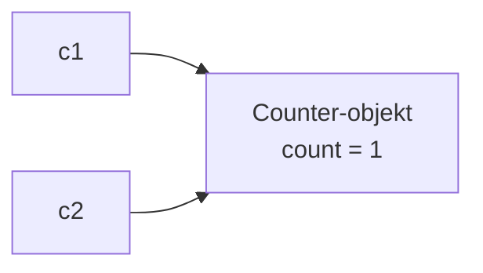
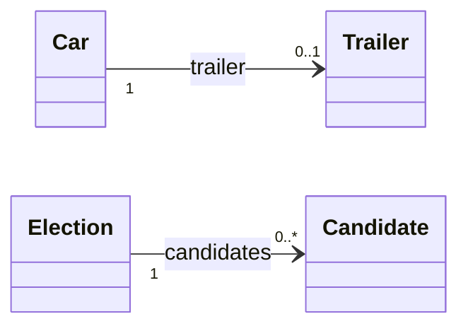

# Repetition 2: Objektorienteret programmering

## Beskrivelse

I går samlede vi op på det grundlæggende. I dag gælder det **objekterne**: klasser, referencer,
`ArrayList`, arv, polymorfi, abstrakte klasser og interfaces.

Det er det, der bærer både Adventure og Filmsamlingen – og det, Delfinen kommer til at stå på. I
Delfinen er der medlemmer, der er forskellige slags (junior, senior, motionist, konkurrencesvømmer),
et kontingent, der afhænger af typen, og lister af resultater. Hvis `ArrayList` af objekter og
polymorfi sidder godt i dag, har I et langt bedre udgangspunkt på mandag.

| Dag | Emne |
| --- | --- |
| [man 09-11](../01_man_2026-11-09/README.md) | Grundlæggende |
| **tir 10-11** | **Objektorienteret** |
| [ons 11-11](../03_ons_2026-11-11/README.md) | Robust og persistent – og blandede opgaver |

## Læringsmål

Når du har arbejdet med dagens materiale, skal du kunne:

* skrive en klasse med `private` attributter, constructor, getters og `toString`
* forklare forskellen på en **klasse** og et **objekt** – og på en **variabel** og en **reference**
* forudsige, hvad der sker, når to variable peger på det samme objekt, og når en reference er `null`
* bruge en `ArrayList` af objekter: tilføje, finde, fjerne og løbe igennem
* lade et objekt indeholde andre objekter – enkeltvis, i en liste eller i et array
* bruge arv med `extends`, `super` og `@Override`
* forklare polymorfi: variablens type bestemmer, hvad man **må** kalde; objektets type, hvad der
  **kører**
* vælge mellem en abstrakt klasse og et interface

## Se disse videoer før undervisningen:

Se kun de videoer, hvor du er usikker på emnet – brug [selvtjekket](#selvtjek).

* [object-oriented programming](https://www.youtube.com/watch?v=xTtL8E4LzTQ&list=PLEeqf0uSZqXsz7oU2U-VAxhQZ021PRVnd&t=6h41m47s) (til: 06:51:38)
* [constructors](https://www.youtube.com/watch?v=xTtL8E4LzTQ&list=PLEeqf0uSZqXsz7oU2U-VAxhQZ021PRVnd&t=6h51m38s) (til: 07:01:45)
* [inheritance](https://www.youtube.com/watch?v=xTtL8E4LzTQ&list=PLEeqf0uSZqXsz7oU2U-VAxhQZ021PRVnd&t=7h22m4s) (til: 07:31:09)
* [abstraction](https://www.youtube.com/watch?v=xTtL8E4LzTQ&list=PLEeqf0uSZqXsz7oU2U-VAxhQZ021PRVnd&t=7h51m58s) (til: 08:01:30)
* [interfaces](https://www.youtube.com/watch?v=xTtL8E4LzTQ&list=PLEeqf0uSZqXsz7oU2U-VAxhQZ021PRVnd&t=8h1m30s) (til: 08:07:44)
* [polymorphism](https://www.youtube.com/watch?v=xTtL8E4LzTQ&list=PLEeqf0uSZqXsz7oU2U-VAxhQZ021PRVnd&t=8h7m44s) (til: 08:14:27)
* [arraylists](https://www.youtube.com/watch?v=xTtL8E4LzTQ&list=PLEeqf0uSZqXsz7oU2U-VAxhQZ021PRVnd&t=8h55m51s) (til: 09:05:29)

## Læs nedenstående før undervisningen

---

### Klasse, objekt og reference

En **klasse** er en skabelon. Et **objekt** er én ting lavet ud fra skabelonen med `new`. En
**variabel** af en klassetype indeholder ikke objektet – den indeholder en **reference**: en pil
hen til objektet.

```java
Counter c1 = new Counter();
Counter c2 = c1;          // to pile til det SAMME objekt
c2.increment();
System.out.println(c1.getCount());    // 1
```



Det forklarer tre ting, der ellers virker mystiske:

* **Ændrer man objektet gennem den ene variabel, kan det ses gennem den anden.** Det er det, der
  sker, når `Controller` og `UserInterface` arbejder på den samme `Movie`.
* **`==` sammenligner pile**, ikke indhold. To forskellige objekter med samme indhold er ikke `==`.
  Derfor bruges `equals` på `String`.
* **`null` betyder "ingen pil".** Kalder man en metode på `null`, får man en
  `NullPointerException`:

```text
Exception in thread "main" java.lang.NullPointerException: Cannot invoke "Room.getName()" because the return value of "Room.getNorth()" is null
```

Læs beskeden: den siger præcis, **hvilket** kald der gav `null`. (I IntelliJ står
package-navnet foran klassenavnene.)

---

### En god klasse

```java
public class Candidate {

    private String name;
    private String party;
    private int numberOfVotes;

    public Candidate(String name, String party, int numberOfVotes) {
        this.name = name;
        this.party = party;
        this.numberOfVotes = numberOfVotes;
    }

    public String getName() {
        return name;
    }

    public String getParty() {
        return party;
    }

    public int getNumberOfVotes() {
        return numberOfVotes;
    }

    @Override
    public String toString() {
        return name + " (" + party + "): " + numberOfVotes;
    }
}
```

* Attributterne er **`private`** – kun klassen selv må røre dem.
* **Constructoren** sætter startværdierne. `this.name` er attributten; `name` alene er parameteren.
* **Getters** kun til det, andre har brug for. **Setters** kun, hvis værdien må ændres – og gerne
  med regler, som i `Movie` i [Filmsamling del 6](../../projekter/filmsamling/del-6-exceptions.md).
* **`toString`** bestemmer, hvad `System.out.println(candidate)` skriver.

---

### Objekter i objekter

En klasse kan have attributter, der er andre objekter – det har I gjort siden
[klassediagrammerne 15-09](../../38/02_tir_2026-09-15/README.md):

| Hvor mange | Attribut | Eksempel |
| --- | --- | --- |
| 0..1 | én reference, `null` = ingen | `Car` har måske en `Trailer` |
| 0..* | `ArrayList` | `Election` har mange `Candidate` |
| fast antal | array, `null` = ledig plads | et bundkort har 4 porte |



Den klasse, der har listen, får metoderne, der arbejder på listen – `getTotalVotes()` hører til i
`Election`, ikke i `Main`. Det er **Information Expert** fra
[Adventure-refactor](../../39/05_fre_2026-09-25/README.md#information-expert--hvem-har-data).

---

### ArrayList

| Metode | Gør | Bemærk |
| --- | --- | --- |
| `add(x)` | lægger `x` sidst | |
| `get(i)` | elementet på index `i` | `IndexOutOfBoundsException` ved forkert index |
| `size()` | antal elementer | ikke `length` |
| `contains(x)` | er `x` i listen? | bruger `equals` |
| `remove(i)` / `remove(x)` | fjerner på index / fjerner objektet | pas på med `ArrayList<Integer>` |
| `isEmpty()` | er listen tom? | |

**Fjern ikke fra en liste, mens du løber den igennem med for-each.** Som regel opdager Java det og
stopper – og gør den ikke (fx når det er det næstsidste element, der fjernes), springer loopet
stille et element over:

```java
// SÅDAN SKAL DET IKKE GØRES
for (String name : names) {
    if (name.equals("Anna")) {
        names.remove(name);
    }
}
```

```text
Exception in thread "main" java.util.ConcurrentModificationException
```

Brug i stedet et almindeligt `for`-loop **baglæns** – så rykker de elementer, du mangler, ikke:

```java
for (int i = names.size() - 1; i >= 0; i--) {
    if (names.get(i).equals("Anna")) {
        names.remove(i);
    }
}
```

---

### Arv, polymorfi, abstrakte klasser og interfaces

| Begreb | I én sætning | Hvor I lærte det |
| --- | --- | --- |
| **Arv** | `class Food extends Item` – `Food` **er et** `Item` og får alt, hvad det har | [30-09](../../40/03_ons_2026-09-30/README.md) |
| **`super`** | `super(...)` kalder superklassens constructor; `super.metode()` dens udgave af metoden | [30-09](../../40/03_ons_2026-09-30/README.md) |
| **Override** | subklassen laver sin egen udgave af en arvet metode – skriv altid `@Override` | [30-09](../../40/03_ons_2026-09-30/README.md) |
| **Polymorfi** | samme kald, forskellig opførsel – objektets type bestemmer, hvad der kører | [02-10](../../40/05_fre_2026-10-02/README.md) |
| **Abstrakt klasse** | kan ikke instantieres; subklasser **skal** implementere de abstrakte metoder | [05-10](../../41/01_man_2026-10-05/README.md) |
| **Interface** | et løfte om metoder; `implements`; mange pr. klasse | [03-11](../../45/02_tir_2026-11-03/README.md) |

Husk de **to spørgsmål** fra polymorfi-dagen:

> 1. **Må jeg kalde metoden?** Det afgør **variablens type**.
> 2. **Hvilken udgave kører?** Det afgør **objektets type**.

Og valget mellem abstrakt klasse og interface:

> **Abstrakt klasse**, når typerne deler **data** og hører til samme familie – alle medier har et
> navn og en varighed. **Interface**, når helt forskellige klasser skal **kunne** det samme – en
> billet og en T-shirt har begge en pris.

**`instanceof` er et faresignal.** Står du og skriver `if (x instanceof Video)`, så spørg: *kunne en
metode, som hver subklasse overrider, gøre det samme?* Svaret er som regel ja.

---

### De klassiske fælder

| Fælde | Hvad sker der | I stedet |
| --- | --- | --- |
| `name = name;` i en setter eller constructor | parameteren tildeles sig selv; attributten forbliver `null` | `this.name = name;` |
| En attribut, der aldrig får et `new` | `NullPointerException` første gang, den bruges | `private ArrayList<Item> items = new ArrayList<>();` |
| `==` på objekter | sammenligner pile, ikke indhold | `equals` – eller sammenlign attributterne |
| `remove` i for-each | `ConcurrentModificationException` | baglæns `for` med index |
| `list.remove(1)` på en `ArrayList<Integer>` | fjerner **index** 1, ikke tallet 1 | `list.remove(Integer.valueOf(1))` |
| `Play()` i stedet for `play()` uden `@Override` | en ny metode, som ingen kalder | skriv altid `@Override` |
| `static` på en attribut, der hører til objektet | alle objekter deler én værdi | `static` kun til det, der er fælles – fx en tæller |
| Et cast uden `instanceof` | `ClassCastException` | undgå castet – brug polymorfi |

---

### Selvtjek

| Emne | Kan du ...? | Dag |
| --- | --- | --- |
| Klasser og objekter | skrive en klasse med constructor, getters og `toString` | [07-09](../../37/01_man_2026-09-07/README.md), [08-09](../../37/02_tir_2026-09-08/README.md) |
| Enum | lave en enum og bruge den i en `switch` | [09-09](../../37/03_ons_2026-09-09/README.md) |
| `static` og ansvar | forklare, hvornår en metode skal være `static` | [11-09](../../37/05_fre_2026-09-11/README.md) |
| Objekter i objekter | tegne et klassediagram med multiplicitet | [15-09](../../38/02_tir_2026-09-15/README.md) |
| ArrayList | søge i og fjerne fra en liste af objekter | [16-09](../../38/03_ons_2026-09-16/README.md), [18-09](../../38/05_fre_2026-09-18/README.md) |
| Ansvar | forklare, hvor en metode hører hjemme, og hvorfor | [22-09](../../39/02_tir_2026-09-22/README.md), [25-09](../../39/05_fre_2026-09-25/README.md) |
| Arv | skrive en subklasse, der kalder `super(...)` | [30-09](../../40/03_ons_2026-09-30/README.md) |
| Polymorfi | forudsige output, når en superklasse-variabel peger på et subklasse-objekt | [02-10](../../40/05_fre_2026-10-02/README.md) |
| Abstrakte klasser | forklare, hvorfor `new Weapon()` ikke kompilerer | [05-10](../../41/01_man_2026-10-05/README.md) |
| Interfaces | skrive et interface og to klasser, der implementerer det | [03-11](../../45/02_tir_2026-11-03/README.md) |

---

## Det vigtigste at tage med

* en variabel af en klassetype holder en **reference** – to variable kan pege på det samme objekt
* `null` er "ingen pil"; læs `NullPointerException`-beskeden – den siger, hvad der var `null`
* attributter er `private`; `this.name = name` i constructoren
* den klasse, der har listen, har metoderne, der arbejder på den
* fjern aldrig fra en liste i en for-each
* variablens type: hvad du **må** kalde – objektets type: hvad der **kører**
* abstrakt klasse = fælles data og familie; interface = fælles evne
* `instanceof` er et faresignal – brug hellere en overridet metode

## Aktiviteter i undervisningen

### 1. Forudsig output

Start med [opgaver.md](opgaver.md), **del A**, alene. Skriv dit gæt ned, før du kører koden – og
sammenlign med sidemanden.

### 2. Opgaver

Fortsæt med [opgaver.md](opgaver.md) i dit eget tempo:

* **del B** ★ – én eller to klasser
* **del C** ★★ – en klasse, der holder på andre objekter
* **del D** ★★★ – arv, abstrakte klasser og interfaces

Der er [vejledende løsninger](loesninger.md), men prøv selv først.

### 3. Tegn før du koder

Vælg én opgave fra del C eller D, og tegn **klassediagrammet**, før du skriver koden – med
multiplicitet og arvepile. Byt med sidemanden: kan sidemanden skrive klasserne ud fra din tegning? Det er
præcis den arbejdsgang, I skal bruge i Delfinen.
