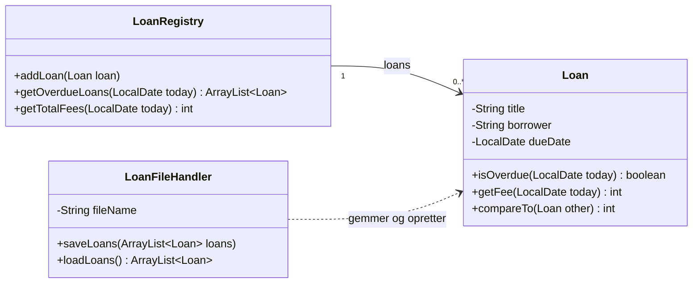

# Vejledende løsninger – Repetition 3: Robust og persistent

Her er vejledende løsninger til [opgaver.md](opgaver.md). Alle programmer er kørt, og alle tests er
grønne (19 tests).

> **Vejledende** betyder: din kode må gerne se anderledes ud. Det vigtige er, at programmet ikke
> vælter, at data overlever en tur gennem filen, og at testene tester grænserne.

`package`-linjen er udeladt herunder. Hver opgave ligger i sin egen under-package af
`dag3_robust_persistent` – testene i den tilsvarende package under `src/test/java`.

---

# Del A – Forudsig output

## Opgave A1 – try og catch

```text
ok: 12
ikke et tal: tolv
ok: 7
19
```

For `"tolv"` kaster `parseInt`, **før** `sum` ændres og før `"ok"` skrives. Loopet fortsætter med
næste tekst.

## Opgave A2 – Hvilken exception?

| # | Kode | Resultat |
| --- | --- | --- |
| 1 | `Integer.parseInt("3.5")` | `NumberFormatException` – `parseInt` kan kun hele tal |
| 2 | `"abc".charAt(5)` | `StringIndexOutOfBoundsException` |
| 3 | `new ArrayList<String>().get(0)` | `IndexOutOfBoundsException` – listen er tom |
| 4 | `String s = null; s.length();` | `NullPointerException` |
| 5 | `int[] a = new int[3]; a[3] = 1;` | `ArrayIndexOutOfBoundsException` – sidste index er 2 |
| 6 | `System.out.println(10 / 0);` | `ArithmeticException: / by zero` |
| 7 | `LocalDate.of(2026, 2, 30)` | `DateTimeException: Invalid date 'FEBRUARY 30'` |
| 8 | `LocalDate.parse("30-02-2026")` | `DateTimeParseException` – uden formatter forventer `parse` formen `2026-02-30` |
| 9 | `LocalDate.parse("31-11-2026", ...ofPattern("dd-MM-yyyy"))` | **ingen** – Java retter stille datoen til 30-11-2026 |
| 10 | `System.out.println(10.0 / 0);` | **ingen** – den skriver `Infinity` |

Nr. 2–6 skyldes fejl i koden, som en `if` burde have forhindret. Nr. 1, 7 og 8 kan skyldes input
fra brugeren eller en fil – dér er `catch` rigtig. Nr. 9 og 10 er de lumske: ingen exception, bare
et forkert resultat. (Nr. 9 er nævnt som frivillig udvidelse i
[Filmsamling del 6](../../projekter/filmsamling/del-6-exceptions.md#31-02-2026).)

## Opgave A3 – throw

```text
før
fanget: Alder kan ikke være negativ: -4
slut
```

`throw` afbryder `checkAge` med det samme – `"alder ok"` bliver aldrig skrevet. Exceptionen
fortsætter ud til `main`, hvor resten af `try`-blokken også springes over (`"efter"`). `catch`
fanger den, og programmet fortsætter efter `catch`.

## Opgave A4 – Fortegn

```text
true
0
false
true
```

`B` kommer efter `A`. To ens tal giver `0`. `"anna".compareTo("Bo")` er **positiv**, fordi små
bogstaver har højere numre end store – derfor `false`. Med `compareToIgnoreCase` kommer `anna` før
`Bo`.

## Opgave A5 – Datoer

```text
2026-11-11
2026-12-11
true
43
```

`start.plusDays(1)` laver en ny dato, men den bliver ikke gemt – `LocalDate` kan ikke ændres, ligesom
`String`. Der er 19 dage tilbage af november og 24 i december: 43.

---

# Del B ★ – Exceptions, én fil, én testklasse

## Opgave 1 – Spørg igen

```java
import java.util.Scanner;

public class Opgave01 {

    public static void main(String[] args) {
        // En Scanner, der læser fra en tekst i stedet for tastaturet – så kan vi afprøve
        // forkert input uden at taste det hver gang. \n er et tryk på Enter.
        Scanner scanner = new Scanner("sytten\n\n-3\n17\n");

        int age = readInt(scanner, "Alder: ", 0, 120);
        System.out.println("Du er " + age + " år.");
    }

    // Spørger igen, indtil brugeren skriver et helt tal mellem min og max
    public static int readInt(Scanner scanner, String prompt, int min, int max) {
        while (true) {
            System.out.print(prompt);
            String input = scanner.nextLine().trim();
            System.out.println(input);   // kun fordi input ikke kommer fra tastaturet
            try {
                int number = Integer.parseInt(input);
                if (number >= min && number <= max) {
                    return number;
                }
                System.out.println("Tallet skal være mellem " + min + " og " + max + ".");
            } catch (NumberFormatException e) {
                System.out.println("\"" + input + "\" er ikke et helt tal. Prøv igen.");
            }
        }
    }
}
```

```text
Alder: sytten
"sytten" er ikke et helt tal. Prøv igen.
Alder: 
"" er ikke et helt tal. Prøv igen.
Alder: -3
Tallet skal være mellem 0 og 120.
Alder: 17
Du er 17 år.
```

`return` inde i `try` afslutter både løkken og metoden. Et tal uden for grænserne er **ikke** en
exception – det tjekkes med en `if`. Med `System.in` i stedet for teksten virker metoden præcis
ens (så fjerner man bare linjen, der skriver `input` ud).

## Opgave 2 – Bankkonto

```java
public class BankAccount {

    private String owner;
    private int balance;

    public BankAccount(String owner) {
        this.owner = owner;
    }

    public int getBalance() {
        return balance;
    }

    public void deposit(int amount) {
        if (amount <= 0) {
            throw new IllegalArgumentException("Beløbet skal være positivt: " + amount);
        }
        balance += amount;
    }

    public void withdraw(int amount) {
        if (amount <= 0) {
            throw new IllegalArgumentException("Beløbet skal være positivt: " + amount);
        }
        if (amount > balance) {
            throw new IllegalArgumentException("Der er kun " + balance + " kr. på kontoen");
        }
        balance -= amount;
    }

    @Override
    public String toString() {
        return owner + ": " + balance + " kr.";
    }
}
```

```java
public class Opgave02 {

    public static void main(String[] args) {
        BankAccount account = new BankAccount("Sara");
        account.deposit(500);

        int[] withdrawals = {200, -50, 400, 300};
        for (int amount : withdrawals) {
            try {
                account.withdraw(amount);
                System.out.println("Hævet " + amount + " kr. " + account);
            } catch (IllegalArgumentException e) {
                System.out.println("Afvist: " + e.getMessage());
            }
        }
    }
}
```

```text
Hævet 200 kr. Sara: 300 kr.
Afvist: Beløbet skal være positivt: -50
Afvist: Der er kun 300 kr. på kontoen
Hævet 300 kr. Sara: 0 kr.
```

```java
import org.junit.jupiter.api.BeforeEach;
import org.junit.jupiter.api.Test;

import static org.junit.jupiter.api.Assertions.assertEquals;
import static org.junit.jupiter.api.Assertions.assertThrows;

class BankAccountTest {

    private BankAccount account;

    @BeforeEach
    void setUp() {
        account = new BankAccount("Sara");
        account.deposit(500);
    }

    @Test
    void withdrawReducesBalance() {
        account.withdraw(200);

        assertEquals(300, account.getBalance());
    }

    @Test
    void withdrawEverythingIsAllowed() {
        account.withdraw(500);

        assertEquals(0, account.getBalance());
    }

    @Test
    void withdrawMoreThanBalanceIsRejected() {
        assertThrows(IllegalArgumentException.class, () -> account.withdraw(501));
    }

    @Test
    void rejectedWithdrawDoesNotChangeBalance() {
        assertThrows(IllegalArgumentException.class, () -> account.withdraw(501));

        assertEquals(500, account.getBalance());
    }

    @Test
    void negativeDepositIsRejected() {
        assertThrows(IllegalArgumentException.class, () -> account.deposit(-1));
    }

    @Test
    void zeroDepositIsRejected() {
        assertThrows(IllegalArgumentException.class, () -> account.deposit(0));
    }
}
```

Alle seks tests er grønne. `rejectedWithdrawDoesNotChangeBalance` er den vigtigste: den tjekker,
at en afvist hævning ikke **halvt** er gennemført. Det er derfor, alle tjek står **før**
`balance -= amount`.

## Opgave 3 – Gem og indlæs linjer

```java
import java.io.File;
import java.io.FileNotFoundException;
import java.io.PrintStream;
import java.util.ArrayList;
import java.util.Scanner;

public class Opgave03 {

    public static void main(String[] args) {
        ArrayList<String> todo = new ArrayList<>();
        todo.add("Køb mælk");
        todo.add("Aflevér Filmsamling");
        todo.add("Læs op på interfaces");

        try {
            saveLines(todo, "todo.txt");
            ArrayList<String> loaded = loadLines("todo.txt");
            System.out.println("Indlæst " + loaded.size() + " linjer:");
            for (String line : loaded) {
                System.out.println("- " + line);
            }
            loadLines("findes-ikke.txt");
        } catch (FileNotFoundException e) {
            System.out.println("Filen findes ikke: " + e.getMessage());
        }
    }

    public static void saveLines(ArrayList<String> lines, String fileName) throws FileNotFoundException {
        PrintStream output = new PrintStream(new File(fileName));
        for (String line : lines) {
            output.println(line);
        }
        output.close();
    }

    public static ArrayList<String> loadLines(String fileName) throws FileNotFoundException {
        ArrayList<String> lines = new ArrayList<>();
        Scanner fileScanner = new Scanner(new File(fileName));
        while (fileScanner.hasNextLine()) {
            lines.add(fileScanner.nextLine());
        }
        fileScanner.close();
        return lines;
    }
}
```

```text
Indlæst 3 linjer:
- Køb mælk
- Aflevér Filmsamling
- Læs op på interfaces
Filen findes ikke: findes-ikke.txt (No such file or directory)
```

`main` fanger `FileNotFoundException` **ét** sted, selvom den kan komme fra tre kald. Når
`loadLines("findes-ikke.txt")` kaster, springer Java direkte til `catch`.

---

# Del C ★★ – Datoer, sortering, CSV og tests

## Opgave 4 – Drømmedagbog

```java
import java.time.LocalDate;

public class Dream implements Comparable<Dream> {

    private LocalDate date;
    private int durationInMinutes;
    private DreamType type;

    public Dream(LocalDate date, int durationInMinutes, DreamType type) {
        if (durationInMinutes <= 0) {
            throw new IllegalArgumentException("Varigheden skal være mindst 1 minut");
        }
        this.date = date;
        this.durationInMinutes = durationInMinutes;
        this.type = type;
    }

    public LocalDate getDate() {
        return date;
    }

    public int getDurationInMinutes() {
        return durationInMinutes;
    }

    public DreamType getType() {
        return type;
    }

    // Et mareridt er aldrig behageligt. En problemløsende drøm kun, hvis den er kortere
    // end 10 minutter. En neutral drøm kun, hvis den er længere end 10 minutter.
    public boolean isPleasant() {
        return switch (type) {
            case NIGHTMARE -> false;
            case PROBLEM_SOLVING -> durationInMinutes < 10;
            case NEUTRAL -> durationInMinutes > 10;
        };
    }

    // Naturlig rækkefølge: ældste dato først
    @Override
    public int compareTo(Dream other) {
        return date.compareTo(other.date);
    }

    @Override
    public String toString() {
        return date + " " + type + " " + durationInMinutes + " min";
    }
}
```

```java
import java.util.Comparator;

public class DurationComparator implements Comparator<Dream> {

    @Override
    public int compare(Dream dream1, Dream dream2) {
        return Integer.compare(dream1.getDurationInMinutes(), dream2.getDurationInMinutes());
    }
}
```

```text
--- Efter dato ---
2026-10-28 PROBLEM_SOLVING 4 min – behagelig
2026-11-01 NEUTRAL 10 min
2026-11-03 NEUTRAL 12 min – behagelig
2026-11-09 NIGHTMARE 7 min
--- Efter varighed ---
2026-10-28 PROBLEM_SOLVING 4 min
2026-11-09 NIGHTMARE 7 min
2026-11-01 NEUTRAL 10 min
2026-11-03 NEUTRAL 12 min
Afvist: Varigheden skal være mindst 1 minut
```

* `switch` på en enum med `->` dækker alle tre typer – så kræver Java ingen `default`.
* `LocalDate` er selv `Comparable`, så `compareTo` kan bare spørge datoerne.

```java
import org.junit.jupiter.api.Test;

import java.time.LocalDate;

import static org.junit.jupiter.api.Assertions.assertFalse;
import static org.junit.jupiter.api.Assertions.assertThrows;
import static org.junit.jupiter.api.Assertions.assertTrue;

class DreamTest {

    private static final LocalDate DATE = LocalDate.of(2026, 11, 11);

    @Test
    void nightmareIsNeverPleasant() {
        assertFalse(new Dream(DATE, 1, DreamType.NIGHTMARE).isPleasant());
    }

    @Test
    void shortProblemSolvingDreamIsPleasant() {
        assertTrue(new Dream(DATE, 9, DreamType.PROBLEM_SOLVING).isPleasant());
    }

    @Test
    void problemSolvingDreamOfExactlyTenMinutesIsNotPleasant() {
        assertFalse(new Dream(DATE, 10, DreamType.PROBLEM_SOLVING).isPleasant());
    }

    @Test
    void neutralDreamOfExactlyTenMinutesIsNotPleasant() {
        assertFalse(new Dream(DATE, 10, DreamType.NEUTRAL).isPleasant());
    }

    @Test
    void longNeutralDreamIsPleasant() {
        assertTrue(new Dream(DATE, 11, DreamType.NEUTRAL).isPleasant());
    }

    @Test
    void olderDreamComesFirst() {
        Dream older = new Dream(DATE.minusDays(1), 5, DreamType.NEUTRAL);
        Dream newer = new Dream(DATE, 5, DreamType.NEUTRAL);

        assertTrue(older.compareTo(newer) < 0);
        assertTrue(newer.compareTo(older) > 0);
    }

    @Test
    void zeroMinutesIsRejected() {
        assertThrows(IllegalArgumentException.class, () -> new Dream(DATE, 0, DreamType.NEUTRAL));
    }
}
```

De to tests med **præcis 10 minutter** er dem, der fanger fejlen, hvis nogen skriver `<=` i
stedet for `<`. Test altid tallet **på** grænsen og ét på hver side.

## Opgave 5 – Lagerfil

```java
public class Product {

    private String name;
    private int price;
    private int stock;

    public Product(String name, int price, int stock) {
        if (name.isEmpty()) {
            throw new IllegalArgumentException("Navnet må ikke være tomt");
        }
        if (price < 0 || stock < 0) {
            throw new IllegalArgumentException("Pris og lager kan ikke være negative");
        }
        this.name = name;
        this.price = price;
        this.stock = stock;
    }

    public int getStockValue() {
        return price * stock;
    }

    @Override
    public String toString() {
        return name + ": " + stock + " stk. à " + price + " kr.";
    }
}
```

```java
import java.io.File;
import java.io.FileNotFoundException;
import java.util.ArrayList;
import java.util.Scanner;

public class ProductFileHandler {

    private int skippedLineCount;

    public ArrayList<Product> loadProducts(String fileName) throws FileNotFoundException {
        ArrayList<Product> products = new ArrayList<>();
        skippedLineCount = 0;
        Scanner fileScanner = new Scanner(new File(fileName));
        if (fileScanner.hasNextLine()) {
            fileScanner.nextLine();                 // spring overskriften over
        }
        while (fileScanner.hasNextLine()) {
            Product product = parseProduct(fileScanner.nextLine());
            if (product == null) {
                skippedLineCount++;
            } else {
                products.add(product);
            }
        }
        fileScanner.close();
        return products;
    }

    public int getSkippedLineCount() {
        return skippedLineCount;
    }

    // Returnerer null, hvis linjen ikke er et gyldigt produkt
    private Product parseProduct(String line) {
        String[] fields = line.split(";", -1);
        if (fields.length != 3) {
            return null;
        }
        try {
            int price = Integer.parseInt(fields[1]);
            int stock = Integer.parseInt(fields[2]);
            return new Product(fields[0], price, stock);
        } catch (IllegalArgumentException e) {   // også NumberFormatException
            return null;
        }
    }
}
```

```text
Kaffe: 12 stk. à 45 kr.
Kakao: 4 stk. à 35 kr.
Lagerværdi: 680 kr.
Sprunget over: 4 linjer
```

| Linje | Hvorfor sprunget over |
| --- | --- |
| `Te;30;fem` | `parseInt("fem")` kaster `NumberFormatException` |
| `Småkager;25` | kun 2 felter |
| `;20;3` | tomt navn – `Product` kaster `IllegalArgumentException` |
| `Chai;40;-2` | negativt lager – `Product` kaster `IllegalArgumentException` |

`NumberFormatException` arver fra `IllegalArgumentException`, så én `catch` fanger begge – som i
`FileHandler` i Filmsamlingen. Reglerne ligger i `Product`, så de gælder, uanset om data kommer fra
brugeren eller fra en fil.

## Opgave 6 – Medier til fil

```java
import dag2_objektorienteret.medier.Audio;
import dag2_objektorienteret.medier.Media;
import dag2_objektorienteret.medier.Video;

import java.io.File;
import java.io.FileNotFoundException;
import java.io.PrintStream;
import java.util.ArrayList;

public class Opgave06 {

    public static void main(String[] args) {
        ArrayList<Media> library = new ArrayList<>();
        library.add(new Audio("Podcast: Java på 10 minutter", 605, -16.0));
        library.add(new Video("Introfilm", 94, "16:9"));
        library.add(new Audio("Jingle", 7, -10.4));
        library.add(new Video("Gammel reklame", 30, "4:3"));

        try {
            saveMediaInfo(library, "mediainfo.txt");
            System.out.println("Gemt " + library.size() + " medier i mediainfo.txt");
        } catch (FileNotFoundException e) {
            System.out.println("Kunne ikke skrive filen: " + e.getMessage());
        }
    }

    public static void saveMediaInfo(ArrayList<Media> library, String fileName) throws FileNotFoundException {
        PrintStream output = new PrintStream(new File(fileName));
        for (Media media : library) {
            output.println(media.getInfo());
        }
        output.close();
    }
}
```

For at `import` virker på tværs af packages, skal `Media`, `Audio` og `Video` være `public` – og
det samme skal deres constructorer og `getInfo()`. Det var de allerede i går. Se
[synlighed på tværs af packages](../../45/01_man_2026-11-02/README.md#synlighed-på-tværs-af-packages).

---

# Del D ★★★ – Blandede eksamensopgaver

## Opgave 7 – Biblioteket



`Loan` har reglen om gebyret (Information Expert – den har datoen). `LoanRegistry` har listen.
`LoanFileHandler` er den eneste, der ved noget om filen.

```java
import java.time.LocalDate;
import java.time.temporal.ChronoUnit;

public class Loan implements Comparable<Loan> {

    private static final int FEE_PER_DAY = 5;
    private static final int MAX_FEE = 100;

    private String title;
    private String borrower;
    private LocalDate dueDate;

    public Loan(String title, String borrower, LocalDate dueDate) {
        if (title.isEmpty() || borrower.isEmpty()) {
            throw new IllegalArgumentException("Titel og låner skal udfyldes");
        }
        this.title = title;
        this.borrower = borrower;
        this.dueDate = dueDate;
    }

    public String getTitle() {
        return title;
    }

    public String getBorrower() {
        return borrower;
    }

    public LocalDate getDueDate() {
        return dueDate;
    }

    // Datoen er en parameter, så testene ikke afhænger af dagens dato
    public boolean isOverdue(LocalDate today) {
        return today.isAfter(dueDate);
    }

    public int getFee(LocalDate today) {
        if (!isOverdue(today)) {
            return 0;
        }
        int daysOverdue = (int) ChronoUnit.DAYS.between(dueDate, today);
        int fee = daysOverdue * FEE_PER_DAY;
        if (fee > MAX_FEE) {
            return MAX_FEE;
        }
        return fee;
    }

    // Naturlig rækkefølge: den, der skulle have været afleveret først, står først
    @Override
    public int compareTo(Loan other) {
        return dueDate.compareTo(other.dueDate);
    }

    @Override
    public String toString() {
        return title + " (" + borrower + "), afleveres " + dueDate;
    }
}
```

```java
import java.time.LocalDate;
import java.util.ArrayList;
import java.util.Collections;

public class LoanRegistry {

    private ArrayList<Loan> loans = new ArrayList<>();

    public void addLoan(Loan loan) {
        loans.add(loan);
    }

    public ArrayList<Loan> getLoans() {
        return loans;
    }

    // Overskredne lån, den ældste først – som en sorteret kopi
    public ArrayList<Loan> getOverdueLoans(LocalDate today) {
        ArrayList<Loan> overdue = new ArrayList<>();
        for (Loan loan : loans) {
            if (loan.isOverdue(today)) {
                overdue.add(loan);
            }
        }
        Collections.sort(overdue);
        return overdue;
    }

    public int getTotalFees(LocalDate today) {
        int total = 0;
        for (Loan loan : loans) {
            total += loan.getFee(today);
        }
        return total;
    }
}
```

```java
import java.io.File;
import java.io.FileNotFoundException;
import java.io.PrintStream;
import java.time.LocalDate;
import java.time.format.DateTimeParseException;
import java.util.ArrayList;
import java.util.Scanner;

public class LoanFileHandler {

    private String fileName;

    public LoanFileHandler(String fileName) {
        this.fileName = fileName;
    }

    public void saveLoans(ArrayList<Loan> loans) throws FileNotFoundException {
        PrintStream output = new PrintStream(new File(fileName));
        for (Loan loan : loans) {
            output.println(loan.getTitle() + ";" + loan.getBorrower() + ";" + loan.getDueDate());
        }
        output.close();
    }

    public ArrayList<Loan> loadLoans() throws FileNotFoundException {
        ArrayList<Loan> loans = new ArrayList<>();
        Scanner fileScanner = new Scanner(new File(fileName));
        while (fileScanner.hasNextLine()) {
            String[] fields = fileScanner.nextLine().split(";", -1);
            if (fields.length == 3) {
                try {
                    loans.add(new Loan(fields[0], fields[1], LocalDate.parse(fields[2])));
                } catch (IllegalArgumentException e) {
                    // tom titel eller låner – spring linjen over
                } catch (DateTimeParseException e) {
                    // ødelagt dato – spring linjen over
                }
            }
        }
        fileScanner.close();
        return loans;
    }
}
```

```java
import java.io.FileNotFoundException;
import java.time.LocalDate;

public class Opgave07 {

    public static void main(String[] args) {
        LocalDate today = LocalDate.of(2026, 11, 11);   // i et rigtigt program: LocalDate.now()

        LoanRegistry registry = new LoanRegistry();
        registry.addLoan(new Loan("Kaptajn Klo", "Ida", LocalDate.of(2026, 11, 20)));
        registry.addLoan(new Loan("Java for begyndere", "Omar", LocalDate.of(2026, 11, 4)));
        registry.addLoan(new Loan("Ternet Ninja", "Sara", LocalDate.of(2026, 10, 1)));
        registry.addLoan(new Loan("Stuart Little", "Ida", LocalDate.of(2026, 11, 11)));

        System.out.println("Overskredne lån:");
        for (Loan loan : registry.getOverdueLoans(today)) {
            System.out.println(loan + " – gebyr " + loan.getFee(today) + " kr.");
        }
        System.out.println("Gebyrer i alt: " + registry.getTotalFees(today) + " kr.");

        LoanFileHandler fileHandler = new LoanFileHandler("loans.csv");
        try {
            fileHandler.saveLoans(registry.getLoans());
            System.out.println("Indlæst igen: " + fileHandler.loadLoans().size() + " lån");
        } catch (FileNotFoundException e) {
            System.out.println("Filen kunne ikke gemmes eller læses: " + e.getMessage());
        }
    }
}
```

```text
Overskredne lån:
Ternet Ninja (Sara), afleveres 2026-10-01 – gebyr 100 kr.
Java for begyndere (Omar), afleveres 2026-11-04 – gebyr 35 kr.
Gebyrer i alt: 135 kr.
Indlæst igen: 4 lån
```

*Stuart Little* skal afleveres **i dag** og er ikke overskredet – `isAfter` er falsk, når datoerne
er ens. *Ternet Ninja* er 41 dage for sent, men gebyret stopper ved 100 kr.

`getOverdueLoans` samler først de overskredne i en **ny** liste og sorterer den. Registrets egen
liste bliver ikke ændret.

```java
import org.junit.jupiter.api.Test;

import java.time.LocalDate;

import static org.junit.jupiter.api.Assertions.assertEquals;
import static org.junit.jupiter.api.Assertions.assertFalse;
import static org.junit.jupiter.api.Assertions.assertThrows;
import static org.junit.jupiter.api.Assertions.assertTrue;

class LoanTest {

    private static final LocalDate DUE = LocalDate.of(2026, 11, 11);

    private final Loan loan = new Loan("Kaptajn Klo", "Ida", DUE);

    @Test
    void notOverdueOnDueDate() {
        assertFalse(loan.isOverdue(DUE));
        assertEquals(0, loan.getFee(DUE));
    }

    @Test
    void overdueDayAfterDueDate() {
        assertTrue(loan.isOverdue(DUE.plusDays(1)));
        assertEquals(5, loan.getFee(DUE.plusDays(1)));
    }

    @Test
    void feeReachesMaximumAfterTwentyDays() {
        assertEquals(95, loan.getFee(DUE.plusDays(19)));
        assertEquals(100, loan.getFee(DUE.plusDays(20)));
        assertEquals(100, loan.getFee(DUE.plusDays(21)));
    }

    @Test
    void noFeeBeforeDueDate() {
        assertEquals(0, loan.getFee(DUE.minusDays(3)));
    }

    @Test
    void emptyTitleIsRejected() {
        assertThrows(IllegalArgumentException.class, () -> new Loan("", "Ida", DUE));
    }
}
```

```java
import org.junit.jupiter.api.AfterEach;
import org.junit.jupiter.api.Test;

import java.io.File;
import java.io.FileNotFoundException;
import java.time.LocalDate;
import java.util.ArrayList;

import static org.junit.jupiter.api.Assertions.assertEquals;

class LoanFileHandlerTest {

    private static final String TEST_FILE = "test-loans.csv";

    private final LoanFileHandler fileHandler = new LoanFileHandler(TEST_FILE);

    @AfterEach
    void deleteTestFile() {
        new File(TEST_FILE).delete();
    }

    @Test
    void savedLoansCanBeLoadedAgain() throws FileNotFoundException {
        ArrayList<Loan> loans = new ArrayList<>();
        loans.add(new Loan("Ternet Ninja", "Sara", LocalDate.of(2026, 10, 1)));
        loans.add(new Loan("Æblet og ørnen", "Åse", LocalDate.of(2026, 12, 24)));

        fileHandler.saveLoans(loans);
        ArrayList<Loan> loaded = fileHandler.loadLoans();

        assertEquals(2, loaded.size());
        assertEquals("Æblet og ørnen", loaded.get(1).getTitle());
        assertEquals("Åse", loaded.get(1).getBorrower());
        assertEquals(LocalDate.of(2026, 12, 24), loaded.get(1).getDueDate());
    }
}
```

Testen bruger `test-loans.csv` og sletter den i `@AfterEach` – så kan den aldrig komme til at
overskrive bibliotekets rigtige fil. Den tjekker æ, ø og å og datoen, fordi det er dér, en fil
typisk går i stykker.

---

# Udfordring – Din egen checked exception

```java
// Checked: arver fra Exception, så compileren tvinger kalderen til at tage stilling
public class InsufficientFundsException extends Exception {

    public InsufficientFundsException(String message) {
        super(message);
    }
}
```

```java
public class Account {

    private int balance;

    public Account(int balance) {
        this.balance = balance;
    }

    public int getBalance() {
        return balance;
    }

    public void withdraw(int amount) throws InsufficientFundsException {
        if (amount <= 0) {
            throw new IllegalArgumentException("Beløbet skal være positivt: " + amount);
        }
        if (amount > balance) {
            throw new InsufficientFundsException("Mangler " + (amount - balance) + " kr.");
        }
        balance -= amount;
    }
}
```

1. Uden `try`/`catch` og uden `throws` kompilerer koden ikke:

   ```text
   error: unreported exception InsufficientFundsException; must be caught or declared to be thrown
   ```

2. `main` fanger den:

```java
public class Udfordring {

    public static void main(String[] args) {
        Account account = new Account(300);
        try {
            account.withdraw(100);
            account.withdraw(250);
            System.out.println("Nåede ikke hertil");
        } catch (InsufficientFundsException e) {
            System.out.println("Afvist: " + e.getMessage());
        }
        System.out.println("Saldo: " + account.getBalance());
    }
}
```

```text
Afvist: Mangler 50 kr.
Saldo: 200
```

3. En **checked** exception giver mening, når kalderen **altid** skal tage stilling – noget, der
   kan ske, selvom koden er rigtig. "Der er ikke penge nok" er et godt eksempel: det er ikke en
   programfejl, men noget, brugeren skal have at vide. Et negativt beløb er derimod en fejl hos
   den, der kalder – derfor er det stadig en unchecked `IllegalArgumentException`.
