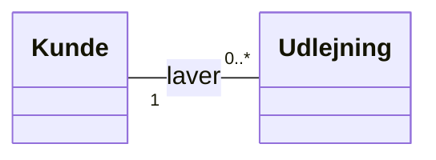
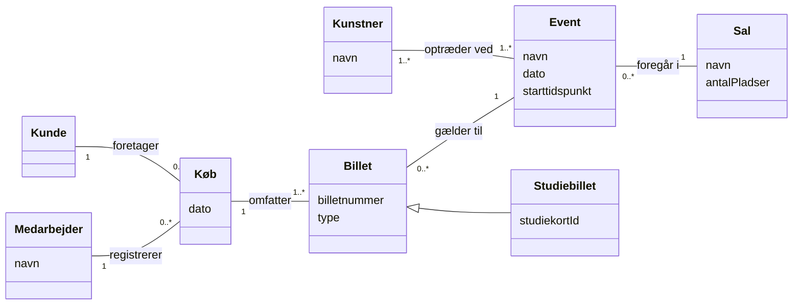
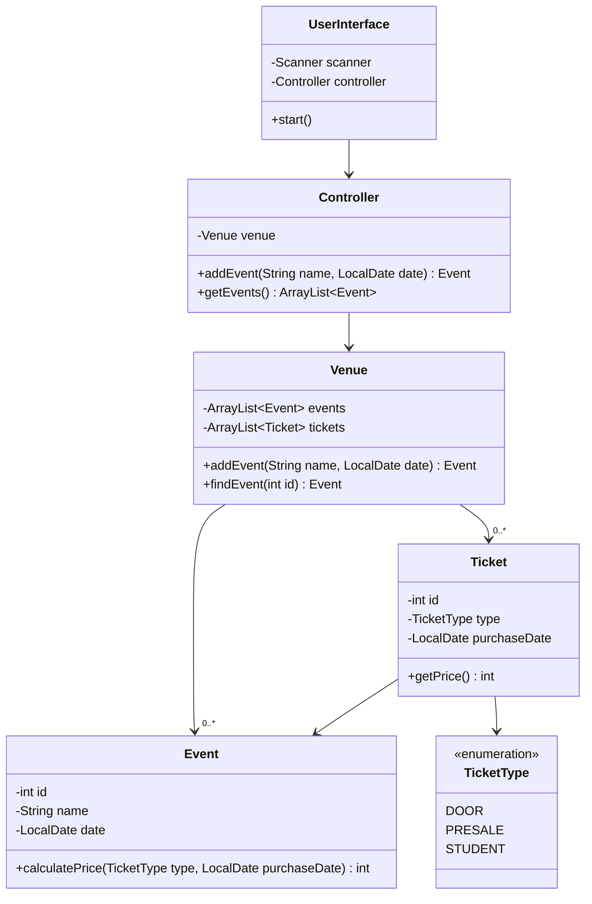
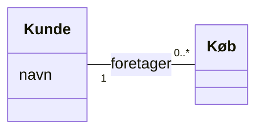

# Projektopstart: Delfinen og domænemodel

## Beskrivelse

I dag starter semestrets sidste og største projekt: [Delfinen](../../projekter/delfinen/readme.md),
en svømmeklub, der skal have et administrativt system. I er fire i gruppen, I har tre uger, og
**det er semestrets eksamensprojekt**.

I Adventure og Filmsamling fik I opgaven skåret ud i dele: *lav del 1, så del 2*. Det gør I ikke
her. I får en **kunde med et problem**, beskrevet med kundens egne ord. Første skridt er derfor ikke
at kode, men at **forstå kundens verden**. Det værktøj, vi bruger til det, er **domænemodellen**:
en tegning af de begreber, kunden taler om, og hvordan de hænger sammen.

Dagen har to dele:

1. **Projektopstart:** grupper, Team Canvas og repo, som beskrevet i
   [Kom i gang med Delfinen](../../projekter/delfinen/kom-i-gang.md).
2. **Domænemodel:** hvad det er, hvordan man laver den, og hvordan den adskiller sig fra de
   klassediagrammer, I har tegnet indtil nu. I øver metoden på små cases og laver så første
   udgave af Delfinens domænemodel.

## Læringsmål

Når du har arbejdet med dagens materiale, skal du kunne:

* forklare, hvad en **domænemodel** er, og hvad den bruges til
* finde **begreber**, **attributter** og **relationer** i en tekst skrevet af en kunde
* sætte **multipliciteter** på en relation og læse dem højt i begge retninger
* afgøre, om noget er et begreb for sig eller en attribut ved et andet begreb
* tegne en domænemodel som UML-klassediagram **uden metoder og uden datatyper**
* forklare forskellen på en **domænemodel** og et **designklassediagram**
* bruge kundens egne ord i modellen, og det samme ord om den samme ting

## Se disse videoer før undervisningen:

* [UML Class Diagram Tutorial](https://www.youtube.com/watch?v=UI6lqHOVHic) (Lucid Software).
  Videoen handler om klassediagrammer til kode, med metoder og datatyper. Se især afsnittene om
  **relationer** og **multiplicitet**. En domænemodel bruger den samme tegneform, men uden metoder
  og datatyper – det kommer vi til nedenfor.
* [Team canvas](https://www.youtube.com/watch?v=EiAuIPCHNf0) (Board of Innovation) – kort intro
  til det værktøj, I starter gruppen med.

## Læs nedenstående før undervisningen

* [Projekt: Delfinen](../../projekter/delfinen/readme.md) – læs **casen** mindst to gange, og
  resten af projektbeskrivelsen én gang.
* [Kom i gang med Delfinen](../../projekter/delfinen/kom-i-gang.md) – især afsnittet
  *Domænemodel*, hvor metoden er vist på en cykeludlejning.

---

### Hvorfor ikke bare begynde at kode?

Læs Delfinens case igen, og prøv at svare på det her uden at kigge:

* Hvor mange slags medlemmer er der?
* Hvad er forskellen på et træningsresultat og et stævneresultat?
* Hvem har brug for at se hvad?

Er I fire personer, får I sandsynligvis fire lidt forskellige svar. Det er helt normalt, og det er
netop problemet. Begynder I at kode nu, bygger hver af jer sin egen forståelse ind i koden, og I
opdager først uenigheden, når koden skal sættes sammen.

> **Domænemodellen er gruppens fælles forståelse af kundens verden, tegnet op.** Når I tegner den
> sammen, bliver uenighederne synlige, mens de stadig er billige at rette: det koster et viskelæder,
> ikke tre dages omskrivning.

---

### Hvad er en domænemodel?

Et **domæne** er det område, programmet skal bruges i: en svømmeklub, et kulturhus, en
cykeludlejning. En **domænemodel** er et billede af de vigtige **begreber** i domænet og
**hvordan de hænger sammen**.

Den handler om **den virkelige verden**, ikke om jeres program. Derfor er der ingen
`UserInterface`, ingen `FileHandler` og ingen `ArrayList` i den. Kunden har aldrig set en
`FileHandler`.

Domænemodellen tegnes som et UML-klassediagram, men med færre ting:

| Med i domænemodellen | Ikke med |
|---|---|
| **Begreber** (tegnes som klasser) | metoder |
| **Attributter**, altså oplysninger om et begreb | datatyper (`String`, `int`) og synlighed (`-`, `+`) |
| **Relationer** mellem begreberne | tekniske klasser (`UserInterface`, `Controller`, `FileHandler`) |
| **Multipliciteter** på relationerne | lister og id'er, der kun findes for programmets skyld |

De tre byggesten:

* Et **begreb** er en ting, en person, en rolle eller en hændelse, som kunden taler om, og som vi
  vil vide noget om: *kunde*, *cykel*, *udlejning*.
* En **attribut** er en oplysning, der beskriver et begreb: kundens *navn*, cyklens *stelnummer*.
* En **relation** (association) er en forbindelse mellem to begreber, som betyder noget for kunden:
  en kunde *laver* en udlejning.

---

### Multipliciteter

En multiplicitet siger, **hvor mange** af det ene der hører til **ét** af det andet.

| Notation | Betyder |
|---|---|
| `1` | præcis én |
| `0..1` | ingen eller én |
| `0..*` | ingen, én eller mange |
| `1..*` | mindst én |
| `2..4` | et bestemt interval, her 2, 3 eller 4 |

Den svære del er at læse dem rigtigt. Tallet står **ved det begreb, der tælles**:



Læs relationen i **begge retninger**, og start altid med "én":

* **Én** kunde laver **0..\*** udlejninger. (Tallet ved *Udlejning*.)
* **Én** udlejning er lavet af **1** kunde. (Tallet ved *Kunde*.)

> **Tip:** Sig begge sætninger højt, hver gang I sætter en multiplicitet. Lyder en af dem forkert
> ("en udlejning er lavet af mange kunder?"), står tallet i den forkerte ende.

Hvorfor er det `0..*` og ikke `1..*`? Fordi en ny kunde, der lige er oprettet, endnu ikke har lejet
noget. Multipliciteter handler tit om netop den slags: **kan det være nul?**

---

### Metoden i fire trin

I [Kom i gang](../../projekter/delfinen/kom-i-gang.md#metoden-i-fire-trin--vist-på-et-andet-eksempel)
er metoden vist på en cykeludlejning. Her gennemgår vi den igen på en lidt større case, med de
overvejelser, man typisk løber ind i undervejs.

> *Kulturhuset holder koncerter, foredrag og stand-up. Hvert **event** har et navn, en dato og et
> starttidspunkt, og det foregår i en af husets to **sale**. En sal har et navn og et antal pladser.
> Til et event optræder en eller flere **kunstnere**, og en kunstner kan godt optræde ved flere
> events.*
>
> *Billetter kan købes i døren på dagen, i forsalg eller i forsalg med studierabat. En **billet**
> gælder til ét event og har et billetnummer. Købes en billet med studierabat, skrives kundens
> studiekort-id på billetten, så det kan tjekkes ved indgangen.*
>
> *En **kunde** kan købe flere billetter på én gang. Et **køb** har en dato. Det er en
> **medarbejder** i billetlugen, der registrerer købet.*

#### Trin 1 – Find begreberne

Gå teksten igennem, og skriv alle **navneord** ned. Det er kandidaterne:

*kulturhus, koncert, foredrag, stand-up, event, navn, dato, starttidspunkt, sal, pladser, kunstner,
billet, dør, forsalg, studierabat, billetnummer, kunde, studiekort-id, indgang, køb, medarbejder,
billetlugen*

Ryd så op. For hvert ord, spørg:

| Spørgsmål | Eksempel | Resultat |
|---|---|---|
| Er det en **oplysning om** noget andet? | *navn, dato, billetnummer, pladser* | attribut |
| Er det **det samme** som et andet ord? | *koncert, foredrag, stand-up* er alle events | ét begreb: **Event** (evt. med en attribut `type`) |
| Er der kun **én** af den, og fortæller den intet nyt? | *kulturhus, billetlugen, indgang* | udelades |
| Er det en **måde** at gøre noget på? | *dør, forsalg, studierabat* | billettens type eller et underbegreb (se trin 2) |
| Vil vi **vide noget om** det? | *sal* (navn, pladser), *køb* (dato) | begreb |

Tilbage er: **Event**, **Sal**, **Kunstner**, **Billet**, **Kunde**, **Køb** og **Medarbejder**.

Læg mærke til **Køb**. Det er ikke en fysisk ting, men en **hændelse**. Hændelser bliver ofte
begreber, fordi der er noget at vide om dem (hvornår, hvem, hvad), og fordi de binder andre
begreber sammen. Det er det samme som *Udlejning* i cykeleksemplet.

#### Trin 2 – Tilføj attributter

| Begreb | Attributter |
|---|---|
| Event | navn, dato, starttidspunkt |
| Sal | navn, antal pladser |
| Kunstner | navn |
| Billet | billetnummer, type (dør eller forsalg) |
| Kunde | (teksten siger ingenting – det er i orden) |
| Køb | dato |
| Medarbejder | navn |

Hvad med **studiekort-id**? Det står kun på *nogle* billetter. Der er to måder at tegne det på:

1. Som en attribut på **Billet**, der bare er tom for de andre billetter.
2. Som et **underbegreb**: en *Studiebillet* er en slags *Billet*, som også har et studiekort-id.

Tommelfingerreglen er: **brug et underbegreb, når nogle af tingene har attributter eller relationer,
som de andre ikke har.** Er forskellen kun et navn eller en pris, er en attribut nok. Her har
studiebilletten sin egen oplysning, så vi vælger et underbegreb. Studierabat gives kun i forsalg,
så en studiebillet er en forsalgsbillet med et studiekort-id, og typen på **Billet** er derfor kun
*dør* eller *forsalg*. Skriv ikke det samme to steder: med underbegrebet skal "studie" ikke også være
en type. Men begge tegninger er forsvarlige, og det vigtige er, at I kan forklare jeres valg.

> Arv i en domænemodel betyder *"er en slags"*, præcis som `extends` i Adventure. Men i
> domænemodellen er det et udsagn om **virkeligheden**. Om det også bliver til `extends` i koden,
> beslutter I først, når I designer programmet.

#### Trin 3 – Find relationerne

Kig efter **udsagnsord og forholdsord**, der forbinder to begreber:

* et event *foregår i* en sal
* en kunstner *optræder ved* et event
* en billet *gælder til* et event
* et køb *omfatter* billetter
* en kunde *foretager* et køb
* en medarbejder *registrerer* et køb

Giv relationen et kort navn, et udsagnsord. Det gør diagrammet meget lettere at læse.

#### Trin 4 – Sæt multipliciteter på

Kig efter **mængdeord og talord**: *én, en eller flere, flere, to, hver*. Og brug så sund fornuft
og spørg: **kan det være nul?**

* *"Til et event optræder en eller flere kunstnere"* → `1..*` ved Kunstner.
* *"en kunstner kan godt optræde ved flere events"* → `1..*` ved Event. (En kunstner, der aldrig
  optræder, har huset ikke noget med at gøre.)
* *"En billet gælder til ét event"* → `1` ved Event. Et event kan have solgt nul eller mange
  billetter → `0..*` ved Billet.
* *"En kunde kan købe flere billetter på én gang"* → et køb omfatter `1..*` billetter. Et køb
  uden billetter giver ingen mening.
* Husets **to** sale: et event foregår i `1` sal. En sal kan have `0..*` events.

#### Resultatet



Tjek den med reglerne:

* Ingen metoder, ingen datatyper, ingen tekniske klasser.
* Alle navne kommer fra kundens tekst.
* Hver relation har et navn og en multiplicitet i **begge** ender.
* Pilen med den hule trekant (`<|--`) er arv: *en studiebillet er en slags billet*.

> **Der er ikke ét rigtigt svar.** To grupper kan lave to forskellige, gode domænemodeller af den
> samme tekst. Det, der skal være i orden, er, at modellen **passer med teksten**, og at I kan
> **begrunde** jeres valg.

---

### Typiske fejl

| Fejl | Hvorfor er det et problem? | Gør i stedet |
|---|---|---|
| Metoder som `beregnPris()` | Domænemodellen beskriver *hvad der er*, ikke hvad programmet gør | Udelad dem. De kommer i designet |
| Datatyper som `navn: String` | Kunden tænker ikke i `String` | Bare `navn` |
| `UserInterface`, `FileHandler`, `Menu` | Findes ikke i kundens verden | Udelad dem |
| En attribut `billetter` på Køb | Det er en relation, tegnet som en liste | Tegn en streg fra Køb til Billet med `1..*` |
| Både *kunde* og *køber* om det samme | Læseren tror, det er to ting | Vælg ét ord og brug det overalt |
| Alt er et begreb, også *navn* og *dato* | Diagrammet drukner i kasser | Oplysninger om noget er attributter |
| Multipliciteten i den forkerte ende | Modellen siger noget andet end teksten | Læs begge sætninger højt |

---

### Domænemodel eller designklassediagram?

De klassediagrammer, I har tegnet i Adventure og Filmsamling, er **designklassediagrammer**: de
beskriver **programmet**, med klassenavne fra koden, datatyper og metoder.

Her er et designklassediagram over en del af et program, der sælger billetter til kulturhuset. Det
er et af mange mulige designs:



Sammenlign med domænemodellen ovenfor:

|  | Domænemodel | Designklassediagram |
|---|---|---|
| Beskriver | kulturhuset, som det er | programmet, som det er bygget |
| Hvornår | i starten, før koden | løbende og til sidst, efter koden |
| Navne | kundens ord, gerne dansk | klassenavne fra koden, engelsk |
| Metoder og datatyper | nej | ja |
| Tekniske klasser | nej | ja: `UserInterface`, `Controller`, `Venue` |

Læg mærke til, hvad der skete med begreberne på vejen fra model til kode:

* **Event** og **Billet** blev til klasserne `Event` og `Ticket`.
* **Billettens type** blev til en enum, `TicketType`. I dette design blev *Studiebillet* altså
  **ikke** til en subklasse, men til en tredje værdi i enum'en, `STUDENT`, fordi programmet (endnu)
  ikke bruger studiekort-id'et til noget. Det er et designvalg, og domænemodellen er stadig rigtig.
* **Sal**, **Kunstner**, **Kunde**, **Køb** og **Medarbejder** er ikke med, fordi programmet (endnu)
  ikke har user stories, der har brug for dem.
* `Venue`, `Controller` og `UserInterface` findes **kun** i programmet.

> **Domænemodellen er udgangspunktet for jeres klasser, ikke en tegning af dem.** Nogle begreber
> bliver til klasser, nogle til en enum eller en attribut, nogle bliver slet ikke til kode, og nogle
> klasser findes kun i programmet. I Delfinen skal I aflevere **begge** diagrammer: domænemodellen
> nu, designklassediagrammet til sidst.

---

### Sådan arbejder I med modellen i gruppen

1. **Hver for sig** (10 min): læs casen og skriv kandidat-begreber ned.
2. **Sammen, på papir eller tavle:** læg jeres lister sammen, og ryd op med spørgsmålene fra
   trin 1. Tegn kasserne med god plads imellem.
3. **Relationer og multipliciteter:** én siger sætningerne højt, de andre siger stop, når noget
   lyder forkert.
4. **Skriv tvivlen ned.** Er I i tvivl om, hvad casen betyder, så se efter i
   [Reglerne gjort præcise](../../projekter/delfinen/readme.md#reglerne-gjort-præcise). Står det
   ikke der, så træf en beslutning, skriv den ned, og tag den med til check-in onsdag.
5. **Tegn den rent** i draw.io eller Mermaid, og læg den i `docs/` i repoet.

Papir først. Et tegneprogram gør det besværligt at flytte rundt, og så holder man op med at
diskutere.

Vil I bruge Mermaid, kan I skrive diagrammet direkte i en Markdown-fil, fx
`docs/domaenemodel.md`. GitHub tegner det, når filen vises. Kig på kildeteksten til diagrammerne på
denne side for at se, hvordan det skrives. Relationer skrives sådan:

````markdown

````

---

## Det vigtigste at tage med

* en **domænemodel** er et billede af **kundens verden**: begreber, attributter, relationer og
  multipliciteter
* den tegnes som et klassediagram **uden metoder, datatyper og tekniske klasser**
* **navneord** giver begreber og attributter, **udsagnsord** giver relationer, **mængdeord** giver
  multipliciteter
* en oplysning **om** noget er en attribut; noget, vi vil vide flere ting om, er et begreb
* hændelser (et køb, en udlejning, et resultat) bliver ofte til begreber
* læs hver multiplicitet højt **i begge retninger**, og spørg: kan det være nul?
* domænemodellen er **udgangspunktet** for klasserne, ikke en tegning af koden
* der er ikke ét rigtigt svar, men I skal kunne begrunde jeres

## Aktiviteter i undervisningen

### 1. Kickoff: Delfinen

Vi gennemgår projektet sammen: casen, kravene, forløbet de næste fire uger, afleveringen og
samarbejdet med IT- og Forretningsudvikling. Læs
[projektbeskrivelsen](../../projekter/delfinen/readme.md) igen bagefter, og skriv jeres spørgsmål
ned.

### 2. Gruppen og repoet

Følg punkt 1–3 i [Kom i gang med Delfinen](../../projekter/delfinen/kom-i-gang.md#mandag-16-11):

1. Udfyld **Team Canvas**, og vælg Scrum Master til sprint 1.
2. Opret **repoet**, invitér de tre andre, og sørg for, at alle fire har pushet en commit.
3. Opret **boardet** (se [Scrum i Delfinen → Boardet](../../projekter/delfinen/scrum.md#boardet)).

Brug ikke mere end en time på det. Resten kan gøres færdigt i morgen.

### 3. Øvelser i domænemodel

Arbejd med [opgaverne](opgaver.md) **to og to**, ikke hele gruppen på én gang. Så får alle
tegnet selv. Tag mindst opgave 1–4. Der er [vejledende løsninger](loesninger.md), men prøv selv
først.

### 4. Delfinens domænemodel

Saml gruppen, og lav første udgave af Delfinens domænemodel efter
[Kom i gang → Nu er det jeres tur](../../projekter/delfinen/kom-i-gang.md#nu-er-det-jeres-tur-delfinen).
Den skal ligge i `docs/` inden onsdag, hvor I viser den ved check-in.

> **Første udgave behøver ikke være perfekt.** I retter den, når I bliver klogere. Det er meningen.
