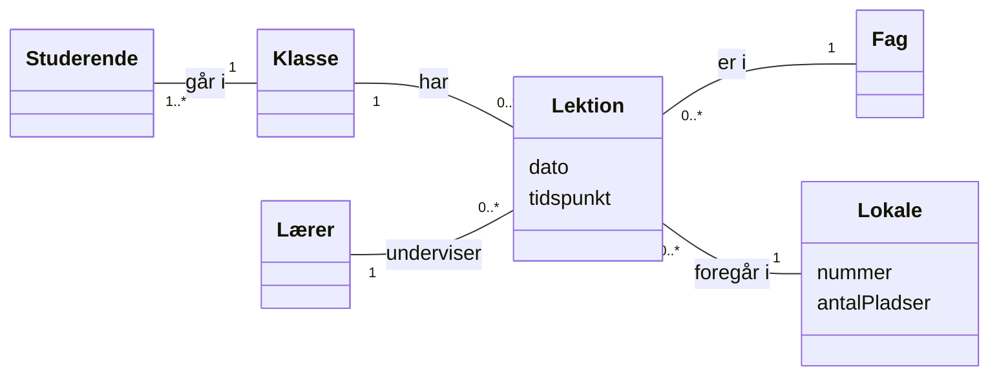
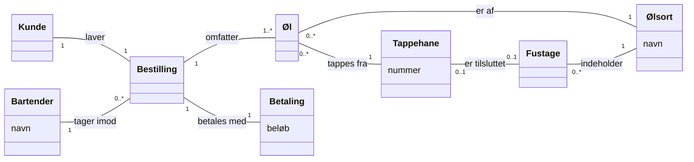
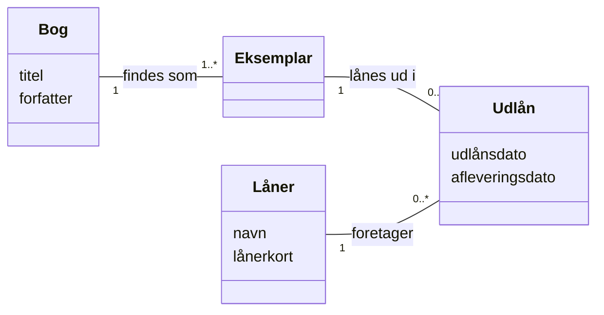
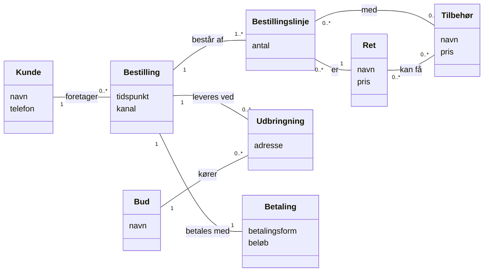
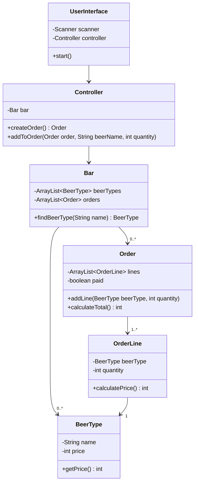
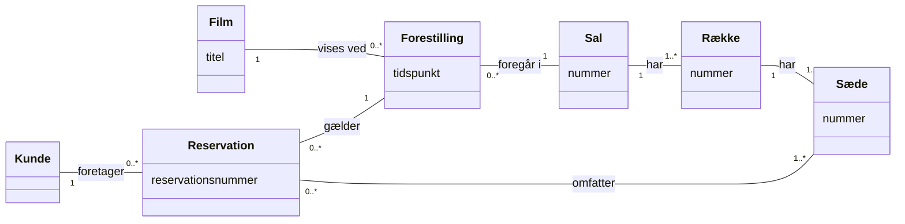

# Vejledende løsninger – Domænemodel

Her er vejledende løsninger til [opgaverne](opgaver.md).

> **Vejledende** betyder: jeres model må gerne se anderledes ud. En domænemodel er ikke rigtig
> eller forkert som et regnestykke. Den er **god**, når den passer med teksten, følger reglerne
> (ingen metoder, datatyper eller tekniske klasser), bruger kundens ord, og når I kan begrunde
> jeres valg. Er jeres model anderledes end den her, så spørg: *siger teksten noget, der
> afgør det?* Hvis ikke, er begge svar i orden.

---

## Opgave 1 – Læs en model

| Relation | Sætning 1 | Sætning 2 |
|---|---|---|
| Studerende – Hold | Én studerende går på **1** hold. | Ét hold har **1..\*** studerende. |
| Hold – Fag | Ét hold har **1..\*** fag. | Ét fag er på **0..\*** hold. |
| Underviser – Fag | Én underviser underviser i **0..\*** fag. | Ét fag undervises af **1..\*** undervisere. |

1. **Nej.** Et hold har `1..*` studerende, altså mindst én.
2. **Nej.** En studerende går på præcis `1` hold.
3. **Nej.** Et fag undervises af `1..*` undervisere.
4. **Ja.** En underviser underviser i `0..*` fag, fx en nyansat eller en på orlov.
5. Til diskussion. To oplagte kandidater:
   * **Hold – Studerende:** Når et nyt hold oprettes i planlægningen, før optaget, har det ingen
     studerende. Så burde det være `0..*`.
   * **Fag – Hold:** `0..*` hold pr. fag betyder, at et fag kan findes uden at blive udbudt. Det
     giver mening i et studiekatalog.

   Pointen er, at multipliciteterne afhænger af, **hvornår** i virkeligheden man kigger. Skriv jeres
   antagelse ned.

---

## Opgave 2 – Sæt multipliciteter på

Tallet står ved det begreb, der tælles. "Bil 1 – 4 Hjul" læses: *én bil har 4 hjul, ét hjul
sidder på 1 bil*.

| A | Mult. ved A | Relation | Mult. ved B | B | Antagelse |
|---|---|---|---|---|---|
| Bil | `0..1` | har | `4` | Hjul | Almindelige personbiler. Et hjul på lager sidder ikke på nogen bil, derfor `0..1`. Hos en bilforhandler er `4` fint; på et værksted, hvor hjulene er af, måske `0..4`. |
| Person | `0..1` | ejer | `0..*` | Bil | En person kan eje ingen eller mange biler. En bil hos forhandleren ejes ikke af en *person*. Tillader I medejerskab, bliver det `0..*` ved Person. |
| Film | `1..*` | er instrueret af | `1..*` | Instruktør | Mange film har to instruktører. En instruktør, der er med i modellen, har instrueret mindst én film. |
| Ordre | `1` | indeholder | `1..*` | Ordrelinje | En ordrelinje hører til præcis én ordre. En ordre uden linjer er ingen ordre. |
| Land | `0..1` | har som hovedstad | `1` | By | Ét land har én hovedstad. De fleste byer er ikke hovedstad, derfor `0..1`. |
| Fodboldkamp | `0..*` | spilles mellem | `2` | Hold | Præcis to hold pr. kamp. Et nyt hold har ikke spillet endnu. |
| Bog | `1..*` | er skrevet af | `1..*` | Forfatter | Bøger kan have flere forfattere; en forfatter har skrevet mindst én bog. |
| Lejlighed | `1..*` | ligger i | `1` | Opgang | En opgang har mindst én lejlighed; en lejlighed ligger i én opgang. |

Uenigheder skyldes næsten altid, at I har forestillet jer **forskellige domæner**. Det er
vigtigt: En domænemodel gælder altid for **ét bestemt domæne**, og det er kundens tekst, der
bestemmer det.

---

## Opgave 3 – Navneordsanalyse

**1. Navneord:** skole, studerende, klasse(r), skema, lektion(er), fag, lokale(r), nummer, antal
pladser, lærer(e), dato, tidspunkt.

**2. Bunkerne:**

| Begreber | Attributter | Udelades |
|---|---|---|
| Studerende, Klasse, Lektion, Fag, Lokale, Lærer | nummer, antal pladser (Lokale); dato, tidspunkt (Lektion) | **skole**: der er kun én, og den fortæller intet nyt. **skema**: er bare *klassens lektioner* – det er relationen Klasse–Lektion, ikke et selvstændigt begreb. |

**3. Relationer:**

* Studerende – *går i* – Klasse
* Klasse – *har* – Lektion
* Lektion – *er i* – Fag
* Lektion – *foregår i* – Lokale
* Lærer – *underviser* – Lektion
* Lærer – *underviser* – Klasse

Den sidste er **afledt**: vi kan allerede se, hvilke klasser en lærer underviser, ved at kigge på
lærerens lektioner. Man kan godt tegne den, men så skal man holde to ting ved lige, der siger det
samme. Her er den udeladt.

**4. Modellen:**

*Studerende*, *Klasse*, *Fag* og *Lærer* har ingen attributter i teksten. Det er i orden. I et
rigtigt projekt ville I spørge kunden (navn, studienummer, klassens navn, ...).

---

## Opgave 4 – FooBar

**Begreber:** Kunde, Bestilling, Bartender, Øl (det glas, der serveres), Ølsort, Fustage,
Tappehane, Betaling.

**Udeladt:** *FooBar/baren* (der er kun én), *kø* (fortæller ikke noget, vi vil gemme),
*lager* (der er kun ét; at en fustage står på lageret kan være en attribut, *placering*).

**Øl, ølsort, fustage, tappehane** er dagens vigtigste skelnen. Ordet "øl" bruges i teksten om to
forskellige ting:

* "*mange flere slags øl på lager*" → en **ølsort** (fx en bestemt Pale Ale).
* "*servere alle øllene*", "*kundens øl kan blive tappet*" → et konkret **glas øl**.

Bruger man ét begreb til begge, kan modellen ikke sige, at en kunde har bestilt *tre glas af den
samme ølsort*. En **fustage** indeholder én ølsort, og en **tappehane** er tilsluttet én fustage ad
gangen.

Læg mærke til:

* **Tappehane – Fustage `0..1` – `0..1`:** en hane kan mangle en fustage (når den er løbet tør),
  og de fleste fustager står på lageret og er ikke tilsluttet.
* **Kunde – Bestilling `1` – `1`:** teksten siger "*hver kunde laver en bestilling*". Vil baren
  kende sine kunder over tid (fx et stempelkort), bliver det `0..*` ved Bestilling.
* Hvis I har *Bar* med som begreb, er det her, de syv haner kan vises: Bar `1` – `7` Tappehane.

**Attributter til kunden (spørgsmål, teksten ikke svarer på):** Hvad koster en øl – er prisen pr.
ølsort eller pr. størrelse? Har en ølsort et bryggeri og en alkoholprocent? Hvor meget er der i
en fustage? Betaler man pr. bestilling eller pr. øl?

---

## Opgave 5 – Find fejlene

1. **Metoder** (`lånUd`, `getNavn`, `gemBøger`, `visMenu`): en domænemodel har ingen metoder.
2. **Datatyper og synlighed** (`-String titel`, `int lånerkort`): fjernes.
3. **Tekniske klasser** (`FileHandler`, `UserInterface`): findes ikke i bibliotekets verden.
4. **`ArrayList~Bog~ bøger`** er en relation skrevet som en liste. Den findes allerede som stregen
   Bibliotek–Bog.
5. **Bibliotek** er der kun ét af, og det fortæller intet nyt. Udelades.
6. **"Kunde"**, men teksten siger **låner**. Brug kundens ord.
7. **`antalEksemplarer`** skjuler et begreb: **Eksemplar**. Det er et eksemplar, man låner, ikke
   bogen. Hvert eksemplar kan være udlånt eller hjemme, uafhængigt af de andre.
8. **Udlån er ikke forbundet med det, der lånes.** Et udlån skal pege på et eksemplar.
9. **`Kunde 1 – 1 Udlån`** siger, at en låner har præcis ét udlån, nogensinde. Teksten siger op
   til 10 ad gangen, og over tid mange.
10. **Relationerne har ingen navne.**

**Rettet model:**

Her er ét udlån ét eksemplar, så hvert eksemplar har sin egen afleveringsdato. Et eksemplar kan
have mange udlån over tid, men kun ét ad gangen.

**"Op til 10 ad gangen"** kan multipliciteter ikke sige alene, fordi `0..*` udlån over tid også
tæller de afleverede med. Den slags regler skrives **ved siden af modellen**, fx:
*"En låner kan højst have 10 udlån, der ikke er afleveret."* Det bliver senere til et
acceptkriterium og en test.

**Bog eller eksemplar?** En *bog* er værket (titel, forfatter). Et *eksemplar* er den fysiske bog
på hylden. Man låner et eksemplar.

---

## Opgave 6 – Take away

**Kanal (telefon, hjemmeside, app)** er tegnet som en **attribut** på Bestilling. Teksten siger
intet om, at en bestilling via app har andre oplysninger end en via telefon. Ville kunden fx vide,
hvilken medarbejder der tog telefonen, kunne det blive en relation.

**Udbringning** er et selvstændigt begreb, fordi der er ting, man kun ved om en udbringning: en
**adresse** og et **bud**. En afhentning har ingen af delene, så den er bare "ingen udbringning"
(`0..1`). Et alternativ er et underbegreb: *Udbringningsbestilling er en slags Bestilling*. Begge
er fine.

**Bestillingslinje** er med, fordi man skal kunne bestille *to pizzaer med ekstra ost og én uden*.
Tilbehøret hører til den enkelte linje, ikke til retten på menuen. Relationen Ret–Tilbehør siger,
hvilket tilbehør man **kan** vælge til en ret; Bestillingslinje–Tilbehør siger, hvad der **blev**
valgt.

**Betalingsform** (online, kort, kontant) er en attribut, af samme grund som kanalen.

---

## Opgave 7 – Fra domænemodel til design

1. **Klasser:** `Order` (Bestilling), `OrderLine` (Øl, altså et antal glas af en ølsort),
   `BeerType` (Ølsort).
2. **Enum eller attribut:** betalingsformen kan blive en enum `PaymentMethod`. *Betaling* kan blive
   til attributter på `Order` (`paid`, `paymentMethod`) i stedet for en klasse.
3. **Ikke brug for (endnu):** *Tappehane*, *Fustage* og *Kunde*. Ingen af de to user stories
   (registrere en bestilling, se prisen) har brug for dem. *Bartender* kan komme med, hvis man vil
   se, hvem der tog imod.
4. **Kun i programmet:** `UserInterface`, `Controller` og en klasse, der holder på ølsorterne
   og bestillingerne, fx `Bar`.
5. Et muligt design:

**Hvor hører prisberegningen hjemme?** Efter **Information Expert** hos den, der har
oplysningerne:

* `OrderLine` kender antallet og ølsorten, så den kan beregne `quantity * beerType.getPrice()`.
* `Order` kender sine linjer, så den kan lægge dem sammen i `calculateTotal()`.

Hverken `UserInterface` eller `Controller` skal regne. De spørger bare `order.calculateTotal()`.

---

## Udfordring 1 – Biografen

**2.** Et sæde kan være med i `0..*` reservationer, fordi det skal kunne reserveres til mange
forestillinger. Men så kan multipliciteterne **ikke** forhindre, at det samme sæde reserveres to
gange til den **samme** forestilling. Det er en **regel**, der skrives ved siden af modellen:
*"Et sæde kan højst være med i én reservation pr. forestilling."* Den bliver senere til et
acceptkriterium og en test. (Man kan også tegne et begreb *Pladsbillet* mellem Forestilling og
Sæde, men reglen skal stadig skrives ned.)

**"Hentes senest 30 minutter før"** er også en regel, ikke en attribut. Tidspunktet kan regnes ud
fra forestillingens tidspunkt.

**3.** *Række som begreb:* rækken har et nummer, og salen har rækker, som har sæder. Det svarer til
kundens egen beskrivelse. *Række som attribut på sæde:* et sæde har `række` og `nummer`, og så er
der ét begreb mindre. Hvis rækken ikke har andre oplysninger end sit nummer, er attributten det
enkleste. Begge er forsvarlige.
