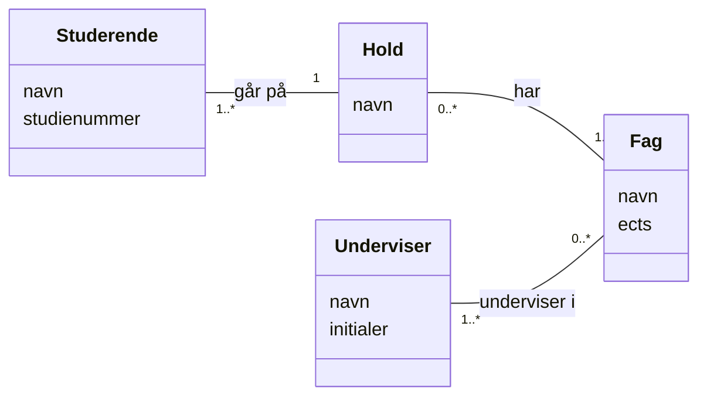
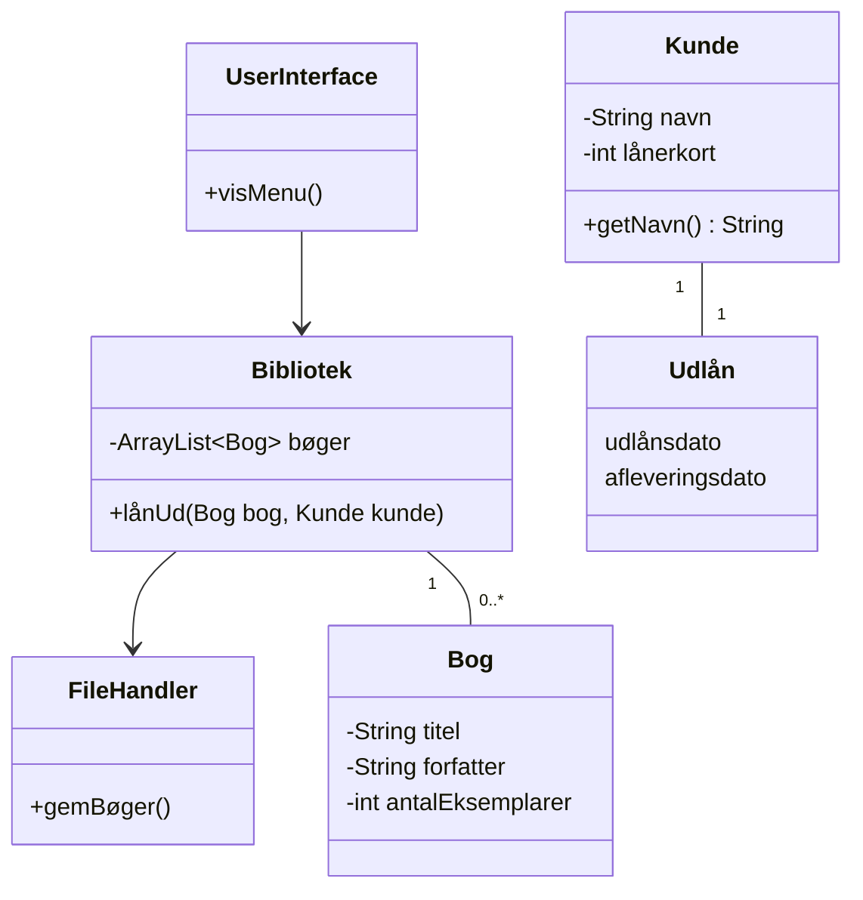

# Opgaver – Domænemodel

Arbejd **to og to**. Tegn på papir eller tavle først, det er hurtigst, når man skal prøve sig frem.
Vil I tegne rent bagefter, kan I bruge [draw.io](https://app.diagrams.net/) eller Mermaid, som på
[dagens side](README.md#sådan-arbejder-i-med-modellen-i-gruppen).

Husk reglerne for en domænemodel:

* begreber, attributter, relationer med navn og multipliciteter
* **ingen** metoder, **ingen** datatyper, **ingen** tekniske klasser
* kundens egne ord, og det samme ord om den samme ting

Der er [vejledende løsninger](loesninger.md). Tegn selv først. Det er tegningen og snakken om den,
der er øvelsen, ikke facit.

---

## Opgave 1 – Læs en model

Her er en domænemodel af en uddannelse:

Skriv hver relation som **to sætninger**, én i hver retning, der begge starter med "én". Fx:
*"Én studerende går på ét hold."*

Svar derefter på:

1. Kan et hold være tomt ifølge modellen?
2. Kan en studerende gå på to hold?
3. Kan der findes et fag, som ingen underviser?
4. Kan der findes en underviser, der ikke underviser i noget?
5. Er du enig i alle multipliciteterne? Hvis ikke, hvilken ville du ændre, og hvorfor?

## Opgave 2 – Sæt multipliciteter på

Sæt multiplicitet på **begge** ender af hver relation. Skriv, hvad du har antaget, når det ikke er
indlysende.

| Begreb A | Relation | Begreb B |
|---|---|---|
| Bil | har | Hjul |
| Person | ejer | Bil |
| Film | er instrueret af | Instruktør |
| Ordre | indeholder | Ordrelinje |
| Land | har som hovedstad | By |
| Fodboldkamp | spilles mellem | Hold |
| Bog | er skrevet af | Forfatter |
| Lejlighed | ligger i | Opgang |

Sammenlign med et andet par. Hvor er I uenige? Er uenigheden et spørgsmål om, **hvilket domæne**
I forestiller jer (en bilforhandler eller et bilværksted)?

## Opgave 3 – Navneordsanalyse

> *Skolen har mange studerende, som er fordelt på klasser. Hver studerende går i én klasse. Hver
> klasse har et skema med lektioner i forskellige fag, og lektionerne foregår i forskellige
> lokaler. Et lokale har et nummer og et antal pladser. Skolen har flere lærere, som hver underviser
> flere klasser. En lektion har en dato og et tidspunkt og undervises af én lærer.*

1. Skriv alle navneord i teksten ned.
2. Del dem i tre bunker: **begreber**, **attributter** og **udelades**. Skriv kort, hvorfor for
   hvert ord i den sidste bunke.
3. Skriv relationerne op som *begreb – udsagnsord – begreb*.
4. Tegn domænemodellen med multipliciteter.

## Opgave 4 – FooBar

> *FooBar er en bar, der sælger specialøl fra fad. Baren har syv tappehaner, men mange flere slags
> øl på lager.*
>
> *Der er som regel tre bartendere på arbejde ad gangen, og de betjener kunderne, der står i kø ved
> baren. Hver kunde laver en bestilling, og den bartender, der tager imod bestillingen, sørger for
> at servere alle øllene og tage imod betaling.*
>
> *Fordi de syv tappehaner er forskellige, kan det blive nødvendigt for én bartender at vente på, at
> en anden er færdig, før kundens øl kan blive tappet – og hvis en fustage løber tør, skal
> bartenderen ud på lageret og finde en anden, mens kunden venter.*

1. Lav navneordsanalysen, og find begreberne.
2. Tegn klasserne og relationerne. Sæt multipliciteter på til sidst.
3. Diskutér: Er *øl* en slags øl (fx "Pale Ale fra bryggeri X") eller et fysisk glas øl? Hvad er
   forskellen på en *ølsort*, en *fustage* og en *tappehane*? Hvordan hænger de sammen?
4. Hvilke attributter kan I finde i teksten? Hvilke ville I spørge kunden om?

## Opgave 5 – Find fejlene

En gruppe har lavet denne "domænemodel" af et bibliotek ud fra teksten:

> *Biblioteket låner bøger ud. En bog har en titel og en forfatter, og biblioteket kan have flere
> eksemplarer af den samme bog. En låner har et navn og et lånerkort. En låner kan låne op til 10
> eksemplarer ad gangen. Et udlån har en udlånsdato og en afleveringsdato.*

1. Find **mindst seks** ting, der er forkerte eller mangler i forhold til reglerne for en
   domænemodel og i forhold til teksten.
2. Tegn en rettet domænemodel.
3. Hvad er forskellen på en **bog** og et **eksemplar**? Hvilken af dem låner man?

## Opgave 6 – Take away

Tænk på det sted, hvor du plejer at bestille take away.

> *Man kan bestille retter fra menuen, og til nogle retter kan man vælge tilbehør, fx ekstra ost
> eller fuldkornsbund på en pizza. Man kan bestille via telefon, hjemmeside eller app. Man kan
> enten selv hente maden eller få den bragt ud af et bud. Man betaler enten online, når man
> bestiller, eller med kort eller kontant, når man henter.*

1. Lav domænemodellen.
2. Hvordan tegner I *"telefon, hjemmeside eller app"*? Som begreber eller som en attribut? Begrund.
3. Hvordan tegner I udbringning? Hvad ved man om en udbringning, som man ikke ved om en afhentning?
4. Sammenlign med et andet par: hvad har de gjort anderledes, og hvorfor?

## Opgave 7 – Fra domænemodel til design

Tag jeres domænemodel af FooBar (opgave 4). Forestil jer, at baren vil have et program, hvor
bartenderen kan registrere en bestilling og se, hvor meget kunden skal betale.

1. Hvilke begreber bliver til klasser i programmet?
2. Hvilke bliver til en **enum** eller en **attribut** i stedet?
3. Hvilke begreber har programmet slet ikke brug for (endnu)?
4. Hvilke klasser skal programmet have, som **ikke** er i domænemodellen?
5. Skitsér et designklassediagram med engelske klassenavne, attributter med datatyper og de
   vigtigste metoder. Hvor hører metoden, der beregner prisen for en bestilling, hjemme? (Tænk på
   **Information Expert** fra Adventure.)

---

## Udfordring 1 – Biografen

> *Biografen har tre sale. Hver sal har et antal rækker, og hver række har et antal sæder. En film
> vises ved mange forestillinger, og en forestilling viser én film i én sal på et bestemt tidspunkt.
> En kunde kan reservere et eller flere sæder til en forestilling. En reservation har et
> reservationsnummer og skal hentes senest 30 minutter før forestillingen.*

1. Tegn domænemodellen.
2. Hvordan sikrer modellen, at et sæde ikke reserveres to gange til **den samme** forestilling,
   men godt kan reserveres til **forskellige** forestillinger? Kan multipliciteter alene sige det?
3. Er *række* et begreb eller en attribut ved *sæde*? Argumentér for begge.

## Udfordring 2 – Et kendt domæne

Tag et domæne, du kender godt fra dit eget liv: dit studiejob, en musikfestival, en spilleliste i
en musiktjeneste, et brætspil. Skriv selv en kort kundetekst på 5–8 linjer, byt tekst med et
andet par, og lav domænemodel af hinandens tekster. Stemmer modellen med det, forfatteren mente?
Hvis ikke, var fejlen i modellen eller i teksten?
