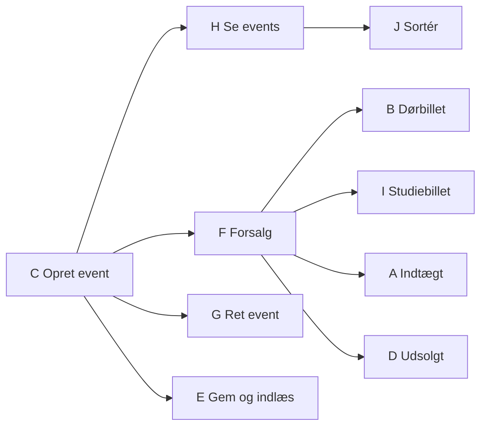

# Vejledende løsninger – User stories og product backlog

Løsninger til [opgaverne](opgaver.md). User stories kan skrives på mange gode måder, så brug
løsningerne til at sammenligne, ikke som facit. Det vigtige er, at jeres stories har **én bruger,
én ting og en værdi**, og at acceptkriterierne er **konkrete nok til at kunne afprøves**.

---

## Opgave 1 – Hvad er der galt?

| # | Hvad er galt | Omskrevet eller flyttet |
|---|---|---|
| 1 | Brugeren er *udvikleren*, og den beskriver en løsning (en klasse). Ingen værdi for kunden (**V**, **N**). | Ikke en user story. `Event`-klassen er en **opgave** under fx *"Som programchef vil jeg kunne oprette et event, så vi kan sælge billetter til det."* |
| 2 | "Administrere" kan betyde alt. Alt for stor (**S**) og kan ikke estimeres (**E**). | Del op: *sælge en dørbillet*, *sælge en forsalgsbillet*, *se solgte billetter til et event*, ... |
| 3 | Ingen bruger, ingen handling. Kan ikke testes (**T**). | Ikke en user story. Et **ikke-funktionelt krav**. Gør det målbart, fx *"et salg kan klares med højst 4 indtastninger"*, og læg det i Definition of Done eller som acceptkriterium på salgs-storyen. |
| 4 | Hvilken bruger? Hvilken liste? Hvorfor? | *Som programchef vil jeg kunne se en liste over kommende events med dato og sal, så jeg kan se, hvad der er planlagt.* |
| 5 | To stories i én ("og"). Den ene kan blive færdig uden den anden (**S**, **I**). | Del i to: *oprette et event* og *se indtægt pr. event*. |
| 6 | Beskriver brugerfladen, ikke behovet (**N**). "Så jeg kan vælge" er ikke en værdi. | Ikke en user story. Menuen er en løsning. Skriv i stedet de stories, menuen skal give adgang til. |
| 7 | Mangler *så*-delen. Uden den ved man ikke, hvorfor det er vigtigt. | *Som programchef vil jeg kunne oprette et event med navn, dato og sal, så vi kan begynde at sælge billetter til det.* |
| 8 | En teknisk beslutning, ikke et ønske fra en bruger. | Selve kravet (intet må gå tabt) er en user story; *hvordan* (CSV med semikolon) er et designvalg, som I tager, når I koder. |

---

## Opgave 2 – Skriv user stories

Et bud (12 stories):

**Programchef**

1. Som programchef vil jeg kunne oprette et event med navn, dato og sal, så vi kan sælge billetter
   til det.
2. Som programchef vil jeg kunne se en liste over kommende events, så jeg kan se, hvad der er
   planlagt.
3. Som programchef vil jeg kunne se, hvor mange billetter der er solgt til hvert event, så jeg kan
   se, hvad der sælger.
4. Som programchef vil jeg kunne se, hvor meget hvert event har indbragt, så jeg kan se, hvilke
   events der kan betale sig.
5. Som programchef vil jeg, at mine events stadig er der, når programmet har været lukket, så jeg
   ikke skal taste dem igen.

**Billetsælger**

6. Som billetsælger vil jeg kunne se prisen på en billet, før jeg sælger den, så jeg kan sige den
   til kunden.
7. Som billetsælger vil jeg kunne sælge en dørbillet på dagen, så kunder uden forsalg kan komme ind.
8. Som billetsælger vil jeg kunne sælge en forsalgsbillet, så kunden kan sikre sig en plads.
9. Som billetsælger vil jeg kunne sælge en studiebillet med studiekort-id, så studerende kan få
   rabat, og id'et kan tjekkes ved indgangen.
10. Som billetsælger vil jeg have besked, når et event er udsolgt, så jeg ikke sælger flere
    billetter, end der er pladser.
11. Som billetsælger vil jeg, at de solgte billetter stadig er registreret efter en genstart, så
    ingen kunder mister deres billet.
12. Som billetsælger vil jeg kunne se, hvor mange pladser der er tilbage til et event, så jeg kan
    svare kunden.

**Regler, der ikke er stories:** *"10 dage eller mere før giver 20 % rabat"* og *"ikke flere
billetter end pladser"* er regler. De hører til i acceptkriterierne på 6–10. *"Intet må gå tabt"*
er her skrevet som to stories (5 og 11), én for hver bruger, der mærker det. Man kunne også skrive
det i Definition of Done.

Story 12 står ikke direkte i teksten. Den er et godt eksempel på noget, man ville **spørge kunden**
om (Conversation).

---

## Opgave 3 – Find grænserne

**1. Grænserne:**

* **Dagen for eventet** (0 dage før): dørbilletter kan kun sælges her.
* **10 dage før**: 10 dage eller mere giver rabat, 9 dage giver ikke.
* **Efter eventet** (mindre end 0 dage): der kan ikke sælges billetter.

**2. Acceptkriterier** (event torsdag 10-12-2026):

| # | Givet / når | Så |
|---|---|---|
| 1 | dørbillet købt 10-12-2026 (på dagen) | 150 kr. |
| 2 | dørbillet købt 09-12-2026 (dagen før) | afvises: "Dørbilletter sælges kun på dagen" |
| 3 | forsalg købt 01-12-2026 (9 dage før) | 120 kr. |
| 4 | forsalg købt 30-11-2026 (10 dage før) | 96 kr. |
| 5 | studiebillet købt 01-12-2026 (9 dage før) | 90 kr. |
| 6 | studiebillet købt 30-11-2026 (10 dage før) | 72 kr. |
| 7 | forsalg købt 10-12-2026 (på dagen) | 120 kr. |
| 8 | forsalg købt 11-12-2026 (dagen efter) | afvises: "Eventet har allerede været afholdt" |

Skrevet ud, fx:

> **Givet** et event torsdag 10-12-2026, **når** billetsælgeren beregner prisen på en
> forsalgsbillet købt mandag 30-11-2026, **så** er prisen 96 kr.

**3.** Otte kriterier. Kriterium 7 kan diskuteres: det tester, at *forsalg* stadig kan købes på
dagen, hvilket teksten ikke siger direkte. Det er et spørgsmål til kunden. Resten dækker hver sin
side af en grænse og bør blive.

**4.** 90 kr. minus 20 % = **72 kr.** (og 120 kr. minus 20 % = 96 kr.). Havde rabatten givet øre,
fx 15 % af 90 kr. = 76,50 kr., skal I **spørge kunden**, om der rundes op, ned eller regnes med
øre, og skrive svaret i acceptkriteriet. Ellers vælger programmøren tilfældigt, og det bliver ikke
nødvendigvis det, kunden ville.

---

## Opgave 4 – Det, der går galt

> **Givet** at der ikke findes et event med nummer 99, **når** billetsælgeren vil sælge en billet
> til event 99, **så** vises "Eventet findes ikke", og der sælges ingen billet.

> **Givet** et event i en sal med 200 pladser, hvor der er solgt 200 billetter, **når**
> billetsælgeren vil sælge én til, **så** vises "Eventet er udsolgt", og der sælges ingen billet.

> **Givet** et event torsdag 10-12-2026, **når** billetsælgeren vil sælge en dørbillet onsdag
> 09-12-2026, **så** vises "Dørbilletter sælges kun på dagen", og der sælges ingen billet.

> **Givet** et event torsdag 10-12-2026, **når** billetsælgeren vil sælge en billet fredag
> 11-12-2026, **så** vises "Eventet har allerede været afholdt", og der sælges ingen billet.

> **Givet** at billetsælgeren vælger studiebillet, **når** studiekort-id'et efterlades tomt, **så**
> bliver hun spurgt igen, og billetten sælges ikke uden id.

> **Givet** at billetsælgeren skal vælge et event, **når** hun taster "abc", **så** får hun besked
> om, at det skal være et tal, og bliver spurgt igen. Programmet går ikke ned.

Læg mærke til **"og der sælges ingen billet"**. Det er halvdelen af kriteriet: at der ikke sker
noget forkert. Og læg mærke til, at 199 solgte billetter stadig skal kunne blive til 200 – det er
grænsen på den anden side, og den hører til den "glade" story.

---

## Opgave 5 – Del en epic op

**1–2.** Delt efter **regler** og efter **det enkle først / fejl bagefter**:

1. *Som billetsælger vil jeg kunne sælge en forsalgsbillet til fuld pris, så kunden kan sikre sig
   en plads.* (det enkleste, én pris)
2. *... sælge en forsalgsbillet med rabat, når den købes 10 dage eller mere før, så tidlige kunder
   belønnes.* (reglen om rabat)
3. *... sælge en dørbillet på dagen, så kunder uden forsalg kan komme ind.*
4. *... sælge en studiebillet med studiekort-id, så studerende kan få rabat.*
5. *... få besked, når eventet er udsolgt, så jeg ikke sælger flere billetter end pladser.* (fejl
   bagefter)

Efter story 1 kan billetsælgeren allerede sælge billetter. Hver ny story gør salget mere komplet.

**3.** *"Lav UI"*, *"Lav Ticket-klassen"* og *"Gem billetter i fil"* er delt efter **lag i
programmet**. Ingen af dem giver billetsælgeren noget alene, og bliver kun to af tre færdige i
sprinten, kan hun stadig ikke sælge en billet. De tre ting er **opgaver** og hører hjemme som
tjekliste **under** hver user story.

**4.** Tjekliste til story 2:

```markdown
- [ ] Rabatreglen i Event.calculatePrice
- [ ] Unit tests: 9 og 10 dage før, forsalg og studie
- [ ] Vis prisen i UserInterface, før salget bekræftes
- [ ] Opdatér klassediagrammet, hvis der kom nye metoder
```

---

## Opgave 6 – INVEST-tjek

| # | Fejler på | Hvorfor / rettet |
|---|---|---|
| a | – | God. Én bruger, én ting, værdi, testbar. |
| b | **N** | Den bestemmer løsningen (`PrintStream`, filnavn). Skriv: *... så de solgte billetter stadig er registreret efter en genstart.* Hvordan, afgør I i designet. |
| c | **T**, **E** | "Professionelt" kan ikke afprøves. Spørg kunden, hvad de mener, og lav konkrete krav, fx "alle beløb vises med kr." eller "alle datoer vises som dd-mm-åååå". |
| d | – | God. (Den afhænger af, at der findes events, men det er i orden.) |
| e | **S**, **E** | En epic. Og det meste er slet ikke noget, programmet skal kunne ifølge teksten. Del op, og spørg kunden, hvad de faktisk har brug for. |

---

## Opgave 7 – Prioritér en backlog

**1. En mulig rækkefølge:**

| Plads | Id | Begrundelse |
|---|---|---|
| 1 | C Opret event | Alt andet afhænger af, at der findes events. |
| 2 | H Se kommende events | Lille, og den gør det muligt at se, at C virker. |
| 3 | E Gem og indlæs | Billig nu, hvor der er få klasser. Dyr at bygge ind til sidst. |
| 4 | F Forsalg med og uden rabat | Kernen i billetsalget, og den med de fleste regler. |
| 5 | B Dørbillet | Lille, når F er lavet. |
| 6 | I Studiebillet | Lille, når F er lavet. |
| 7 | A Indtægt pr. event | Programchefens overblik. Kræver salg. |
| 8 | D Afvis ved udsolgt | Vigtig regel, men salget virker uden. |
| 9 | J Sortér efter dato | Rart, lille. |
| 10 | G Ret et event | Mest besværlig og mindst nødvendig. |

**2. Afhængigheder:**



(B og I kan godt laves uden F, men så laver man prisberegningen tre gange. Det er derfor, F står
før.)

**3.** C + H + E + F + B + I + A = 1 + ½ + 1 + 1 + ½ + ½ + ½ = **5 dage**. Der er lidt luft til D,
men det er klogt at have luft i første sprint, fordi estimaterne altid er for lave.

**Sprintmål:** *"Programchefen kan oprette og se events, billetsælgeren kan sælge alle tre slags
billetter til den rigtige pris, og alt bliver gemt."*

---

## Opgave 8 – Planning poker

Ingen løsning. Det typiske resultat er, at uenighederne skyldes, at nogen har tænkt på noget, andre
ikke har: fejltilfælde, gem i fil, tests. Skriv det, I opdager, ind i acceptkriterierne eller
opgave-tjeklisten.

---

## Udfordring 1 – Studentercaféen

Fem mulige epics med eksempler på stories:

| Epic | User stories (eksempler) |
|---|---|
| **Menu** | Som kunde vil jeg se dagens menu, så jeg ved, hvad der er. · Som kunde vil jeg se ugens menu, så jeg kan planlægge. · Som personale vil jeg lægge ugens menu ind, så kunderne kan se den. |
| **Forudbestilling** | Som kunde vil jeg bestille til et bestemt tidspunkt, så maden er klar. · Som kunde vil jeg se min bestilling, så jeg ved, at den er modtaget. · Som kunde vil jeg afbestille, så maden ikke bliver spildt. |
| **Personalets overblik** | Som personale vil jeg se dagens forudbestillinger sorteret efter tidspunkt, så vi kan nå det. · Som personale vil jeg markere en bestilling som hentet, så vi kan se, hvad der mangler. · Som personale vil jeg se, hvad der ikke er hentet ved lukketid. |
| **Tilbud** | Som kunde vil jeg se dagens tilbud, så jeg kan spare penge. · Som personale vil jeg oprette et tilbud med start- og slutdato. · Som kunde vil jeg få besked om nye tilbud. |
| **Loyalitetspoint** | Som kunde vil jeg optjene point, når jeg køber, så det kan betale sig at komme igen. · Som kunde vil jeg se mine point. · Som kunde vil jeg bruge point til en gratis kaffe. |

**De tre første:** *se dagens menu*, *lægge menuen ind* og *forudbestille*. Uden menu kan man ikke
bestille, og forudbestilling er det, der adskiller appen fra en opslagstavle. Tilbud og point
kommer bagefter.

---

## Udfordring 2 – Fra acceptkriterium til test

| Acceptkriterium | Testnavn | Assert |
|---|---|---|
| 1 | `doorTicketOnTheDayCosts150` | `assertEquals(150, concert.calculatePrice(TicketType.DOOR, LocalDate.of(2026, 12, 10)))` |
| 2 | `doorTicketBeforeTheDayIsRejected` | `assertThrows(IllegalArgumentException.class, () -> concert.calculatePrice(TicketType.DOOR, LocalDate.of(2026, 12, 9)))` |
| 3 | `presaleNineDaysBeforeHasNoDiscount` | `assertEquals(120, concert.calculatePrice(TicketType.PRESALE, LocalDate.of(2026, 12, 1)))` |
| 4 | `presaleTenDaysBeforeHasDiscount` | `assertEquals(96, concert.calculatePrice(TicketType.PRESALE, LocalDate.of(2026, 11, 30)))` |
| ... | ... | ... |

Hvis metoden selv kaldte `LocalDate.now()`, ville testen give et andet resultat afhængigt af,
**hvilken dag den blev kørt**. En test, der er grøn i dag, bliver rød i morgen, uden at nogen har
rørt koden. Med datoen som parameter bestemmer testen selv "i dag". Det samme tip står i
[Delfinens krav](../../projekter/delfinen/readme.md#ikke-funktionelle-krav) om kontingentet.
Testene er skrevet helt ud på [siden for 23-11](../../48/01_man_2026-11-23/README.md).
