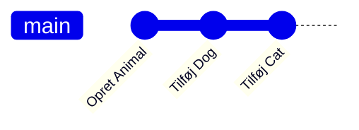
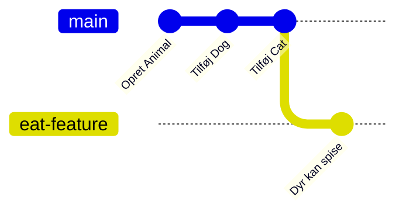
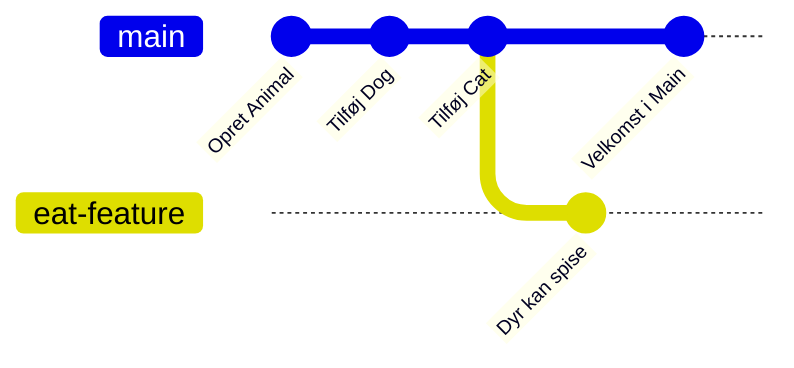
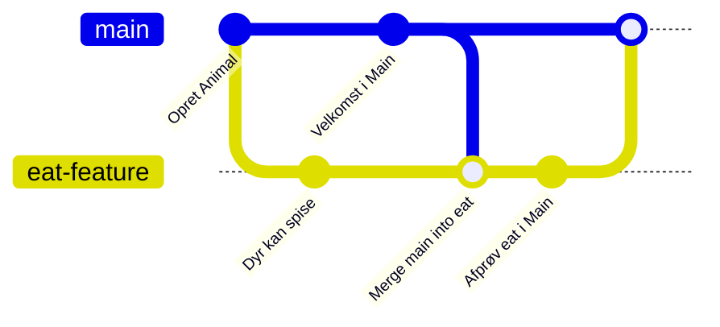
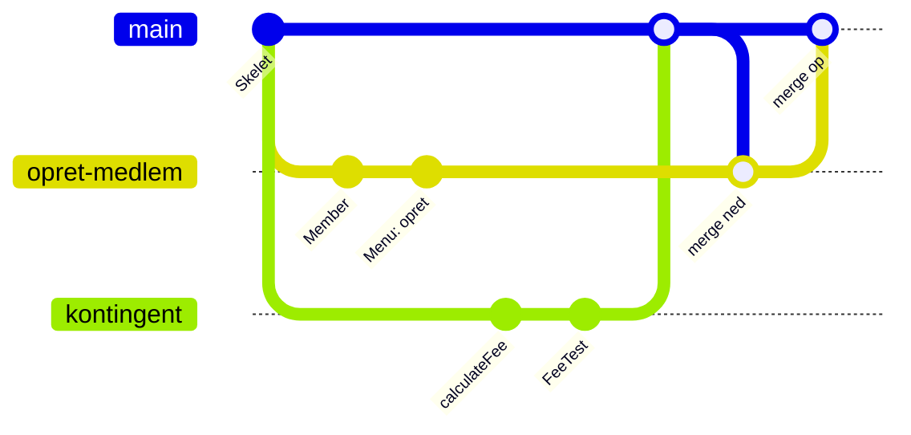

# Git branching

## Beskrivelse

I Filmsamling arbejdede I alle direkte på `main`. Det gik, fordi I holdt jer til fem regler: pull
først, én fil én person, små commits, push ofte, og push aldrig kode, der ikke kompilerer.

I Delfinen er I **fire** personer i **én** kodebase i tre uger, og reglerne bliver svære at holde.
Den, der er halvvejs med kontingentberegningen, kan ikke pushe, for koden kompilerer ikke endnu.
Men lader hun være med at pushe i to dage, får hun en kæmpe merge-konflikt bagefter.

Løsningen er **branches**. En branch er en **sidevej**, hvor du kan arbejde på én user story i
fred, committe og pushe lige så tit, du vil, uden at `main` bliver rørt. Først når storyen virker,
fletter du den ind i `main`.

I dag lærer I at lave branches, skifte mellem dem, merge dem, løse konflikter og slette dem, både i
terminalen og i IntelliJ. Og I lærer den arbejdsgang, I skal bruge i Delfinen fra i dag:
**én branch pr. user story, og `main` kan altid køre.**

Grundbegreberne og en nødhjælp, når noget går galt, står i
[Git i IntelliJ](../../00_vejledninger/git/README.md).

## Læringsmål

Når du har arbejdet med dagens materiale, skal du kunne:

* forklare, hvad en **branch** er, og hvorfor man bruger dem, når flere arbejder i samme kodebase
* **oprette** en branch, **skifte** mellem branches og **committe** på en branch
* forklare, hvad der sker med filerne, når du skifter branch, og hvorfor du skal committe først
* **merge** en branch ind i en anden og forklare forskellen på en **fast-forward** og en
  **merge-commit**
* bruge arbejdsgangen **"merge ned, merge op"**, så `main` altid kan køre
* **pushe** en branch til GitHub og **hente** en branch, som en anden har pushet
* **løse en merge-konflikt**, der opstår mellem to branches
* håndtere et **afvist push**
* **slette** en branch lokalt og på GitHub
* gøre alt ovenstående både i **terminalen** og i **IntelliJ**

## Se disse videoer før undervisningen:

* [Git & GitHub Tutorial for Beginners #8 – Branches](https://www.youtube.com/watch?v=QV0kVNvkMxc)
  (Net Ninja)
* [Git & GitHub Tutorial for Beginners #9 – Merging Branches (& conflicts)](https://www.youtube.com/watch?v=XX-Kct0PfFc)
  (Net Ninja)

Videoerne er lavet, før Git fik kommandoen `git switch`. De bruger `git checkout` og `git checkout
-b` og kalder hovedbranchen `master`. Det virker stadig, men i dag bruger vi `git switch` og `main`
(se [tabellen nedenfor](#kommandoerne-samlet)).

## Læs nedenstående før undervisningen

* [Git Branching – Branches in a Nutshell](https://git-scm.com/book/en/v2/Git-Branching-Branches-in-a-Nutshell)
  (Pro Git, kapitel 3.1) – den bedste forklaring på, hvad en branch egentlig er. Tegningerne er
  værd at bruge tid på.
* [Manage Git branches](https://www.jetbrains.com/help/idea/manage-branches.html) (JetBrains) –
  skim den, så du ved, hvor tingene er i IntelliJ.

Og genopfrisk, hvad I lærte om Git [21-09](../../39/01_man_2026-09-21/README.md) (hvor I også
prøvede en branch kort, i opgave 9) og om
merge-konflikter og afviste push i [GitHub i grupper 19-10](../../43/01_man_2026-10-19/README.md).
Det meste af det, I lærte dér, gælder også for branches.

---

### Hvad er en branch?

Hver gang du committer, laver Git et **øjebliksbillede** af projektet, og det peger tilbage på den
forrige commit. Indtil nu har historikken været en lige linje:



En **branch** er bare et **navn, der peger på en commit**. `main` er en branch: den peger på den
nyeste commit på hovedvejen. Når du laver en ny branch, laver Git et nyt navn, der peger på den
**samme** commit. Der kopieres ingen filer.

Når du så committer på den nye branch, flytter **kun den** sig. `main` bliver stående:



Og hvis en anden i mellemtiden har sat noget ind i `main`, går historikken i to retninger:



Git holder også styr på, **hvilken branch du står på**. Det kaldes `HEAD`. Når du committer, er
det den branch, `HEAD` peger på, der rykker frem.

> **Hvorfor er det smart?** Fordi `main` ikke bliver rørt, mens du arbejder. Resten af gruppen
> kan pulle `main` og få et program, der virker, selvom din halve kontingentberegning ligger og
> ikke kompilerer på din branch.

---

### Opret og skift branch

Tjek først, hvilken branch du står på:

```bash
git branch
```

```text
* main
```

Stjernen viser, hvor du står. Lav en ny branch **og skift til den** med én kommando:

```bash
git switch -c eat-feature
```

```text
Switched to a new branch 'eat-feature'
```

(`-c` betyder *create*.) Skift mellem eksisterende branches med `git switch` uden `-c`:

```bash
git switch main
git switch eat-feature
```

**I IntelliJ** står navnet på den branch, du står på, øverst i vinduet, i **VCS-widget'en** (i
titellinjen, ved siden af projektnavnet). Klik på den:

* **New Branch...** laver en ny branch fra den, du står på. Lad **Checkout branch** være valgt, så
  du også skifter til den.
* Klik på en branch under **Local** og vælg **Checkout** for at skifte til den.

> **Står der `master` i stedet for `main`?** Nogle computere laver `master` som første branch.
> Omdøb den, før du deler projektet: `git branch -m main`. Og sæt `git config --global
> init.defaultBranch main`, så nye projekter får `main` fra starten.

#### Hvad sker der med filerne, når jeg skifter?

Git **skifter filerne ud** i projektmappen, så de passer til den branch, du skifter til. Har du
lavet en metode på `eat-feature` og skifter til `main`, er metoden **væk** fra filen. Den er ikke
slettet: den ligger på `eat-feature`, og den kommer igen, når du skifter tilbage. Det er ret
overraskende første gang, så I prøver det i [opgave 3](opgaver.md#opgave-3--hvor-blev-koden-af).

Men **ændringer, du ikke har committet**, hører ikke til nogen branch endnu. Git lader dem blive i
filerne, når du skifter, hvis det kan lade sig gøre. Så tager du din halve kode med over på `main`,
og `main` kompilerer pludselig ikke på din computer. Kan det ikke lade sig gøre, nægter Git at
skifte:

```text
error: Your local changes to the following files would be overwritten by checkout:
	src/Dog.java
Please commit your changes or stash them before you switch branches.
Aborting
```

> **Regel: commit, før du skifter branch.** Det gør ikke noget, at koden ikke er færdig. Det er
> jo din egen branch. IntelliJ tilbyder at gemme ændringerne midlertidigt for dig (**Smart
> Checkout**), men så er det svært at se, hvor de blev af. Commit er enklere.

---

### Merge: at flette en branch ind

Når arbejdet på en branch er færdigt, skal det ind i `main`. Det hedder at **merge**. Du står på
den branch, der skal **modtage** ændringerne, og beder Git om at hente dem fra den anden:

```bash
git switch main
git merge eat-feature
```

Der kan ske to ting.

**Fast-forward.** Hvis `main` ikke har fået nye commits, siden `eat-feature` blev lavet, er der
intet at flette. Git rykker bare `main` frem til samme commit som `eat-feature`:

```text
Updating 10ccd51..bfbe9cc
Fast-forward
 src/Animal.java | 2 ++
 ...
```

**Merge-commit.** Hvis begge branches har fået nye commits, laver Git en ny commit, der har **to
forældre** og samler dem:



Tegningen viser også den sidste merge ind i `main` som en prik. Her er det i virkeligheden en
fast-forward, fordi `eat-feature` allerede har alt fra `main`: `main` rykker bare frem.

Rører de to branches ved **forskellige** steder i koden, klarer Git det selv. Har de ændret **de
samme linjer**, bliver det en **merge-konflikt**, og så skal et menneske bestemme (se nedenfor).

> **Brug `--no-edit` i terminalen**, som I gjorde med `git commit` 19-10. Laver `git merge` en
> merge-commit, åbner Git ellers en editor til commit-beskeden, i Git Bash tit Vim (skriv `:wq` og
> tryk <kbd>Enter</kbd> for at komme ud). Med `git merge main --no-edit` bruger Git
> standardbeskeden *Merge branch 'main' into ...*.

**I IntelliJ:** Stå på den branch, der skal modtage (**Checkout**). Klik på VCS-widget'en, vælg
den **anden** branch, og vælg **Merge '<den anden>' into '<din>'**.

---

### Merge ned, merge op

Det er den arbejdsgang, der står i
[Scrum i Delfinen](../../projekter/delfinen/scrum.md#git-i-sprinten). Når din user story virker:

1. **Merge ned:** merge `main` **ind i din branch**. Så får du alt det, de andre har lavet, mens du
   arbejdede. Er der konflikter, løser du dem **på din branch**.
2. **Test:** kør programmet og testene på din branch. Nu tester du din kode **sammen med** de
   andres.
3. **Merge op:** skift til `main`, og merge din branch ind. Det bliver en fast-forward, fordi din
   branch allerede har alt fra `main`.
4. **Push** `main` med det samme.

Hvorfor ikke bare merge direkte ind i `main`? Fordi så bliver konflikterne løst **på `main`**, og
hvis det går galt, er det `main`, der ikke virker, og det rammer alle fire. Med "merge ned, merge
op" er det dig, der løser konflikterne, på **din** branch, og `main` får kun kode, der er testet
sammen med resten.

---

### Branches og GitHub

Branches bliver **ikke** pushet automatisk. Første gang du pusher en ny branch, skal du sige, hvor
den skal hen:

```bash
git push -u origin eat-feature
```

`-u` forbinder din lokale branch med den på GitHub, så det bagefter er nok at skrive `git push`,
når du står på branchen. Det er det samme, som I gjorde med `main` 21-09. **I IntelliJ** er det
bare **Push** (<kbd>Ctrl</kbd>+<kbd>Shift</kbd>+<kbd>K</kbd>, Mac <kbd>Cmd</kbd>+<kbd>Shift</kbd>+<kbd>K</kbd>):
dialogen viser, at branchen er ny, og sætter forbindelsen op.

**Skal jeg pushe min branch?** Ja, gør det i hvert fald, når du går hjem. Så er dit arbejde
gemt på GitHub, hvis din computer går i stykker, og de andre kan se, hvor langt du er.

**Hent en branch, som en anden har pushet.** Andres branches kommer heller ikke automatisk. Hent
først oplysningerne fra GitHub, og skift så til branchen:

```bash
git fetch
git branch -a
git switch bird
```

```text
branch 'bird' set up to track 'origin/bird'.
Switched to a new branch 'bird'
```

`git branch -a` viser også branches på GitHub (de hedder `remotes/origin/...`). `git switch bird`
laver en lokal `bird`, der er forbundet til `origin/bird`.

**I IntelliJ:** klik på VCS-widget'en og klik på **Fetch**-ikonet øverst i den. Vælg branchen under
**Remote**, og vælg **Checkout**.

På GitHub kan I se alle branches i branch-menuen over fillisten (den, hvor der står `main`).

---

### Merge-konflikter mellem branches

En konflikt opstår, når to branches har ændret **de samme linjer**, præcis som da I pullede 19-10.
Med "merge ned, merge op" opdager du den, når du merger `main` ned i din branch:

```text
Auto-merging src/Main.java
CONFLICT (content): Merge conflict in src/Main.java
Automatic merge failed; fix conflicts and then commit the result.
```

I filen har Git sat begge udgaver ind med markeringer:

```text
<<<<<<< HEAD
        Animal[] animals = {new Dog("Fido"), new Cat("Misser"), new Fish("Nemo")};
=======
        Animal[] animals = {new Dog("Fido"), new Cat("Misser"), new Bird("Pippi")};
>>>>>>> main
```

* Mellem `<<<<<<< HEAD` og `=======` står **din** udgave (den branch, du står på).
* Mellem `=======` og `>>>>>>> main` står den udgave, du merger **ind**, her fra `main`.

Du skal lave den linje, der er **rigtig**. Tit er det hverken den ene eller den anden, men
**begge dele**. Her skal både fisken og fuglen med:

```java
        Animal[] animals = {new Dog("Fido"), new Cat("Misser"), new Bird("Pippi"), new Fish("Nemo")};
```

Slet markeringerne, **kør programmet og testene**, og afslut mergen:

```bash
git add src/Main.java
git commit --no-edit
```

**I IntelliJ** kommer der et **Conflicts**-vindue, som I kender fra 19-10. **Accept Yours** og
**Accept Theirs** gælder hele filen, så vælg i stedet at løse konflikten selv: knappen hedder
**Merge...** eller, i nyere versioner, **Resolve Manually**. Så får du tre kolonner: din udgave til
venstre, resultatet i midten og den anden udgave til højre. Byg den rigtige udgave i midten, og
klik **Apply** (i nyere versioner **Apply Changes**).

> **Fortryd en merge, der gik galt:** `git merge --abort` sætter alt tilbage, som det var før
> mergen. I IntelliJ: **Abort** i VCS-widget'en.

---

### Når push bliver afvist

Du har merget din branch ind i `main`, men da du pusher, har en anden nået at pushe til `main`
før dig:

```text
 ! [rejected]        main -> main (fetch first)
error: failed to push some refs to '...'
hint: Updates were rejected because the remote contains work that you do
hint: not have locally. ...
```

Ingen panik. Hent de andres ændringer, test, og push igen:

```bash
git pull --no-edit
# kør programmet og testene
git push
```

`git pull` laver en merge-commit, hvis både du og GitHub har nye commits, og uden `--no-edit` åbner
Git en editor til beskeden (se ovenfor). Men på nogle computere
nægter nyere Git at gøre det uden at få at vide hvordan:

```text
fatal: Need to specify how to reconcile divergent branches.
```

Det lærte I 19-10: sig det én gang for alle, så er det klaret (det svarer til at vælge **Merge**,
når IntelliJ spørger):

```bash
git config --global pull.rebase false
```

> Man kan undgå det meste af det ved at **pulle `main` lige før "merge op"**, som står i
> tjeklisten nedenfor.

---

### Slet en branch

Når din branch er merget ind i `main`, har du ikke brug for den mere. Slet den, så listen ikke
bliver fyldt med gamle branches:

```bash
git branch -d eat-feature
```

```text
Deleted branch eat-feature (was bfbe9cc).
```

Git sletter kun med `-d`, hvis branchen er **merget**. Er den ikke det, får du:

```text
error: the branch 'jump-feature' is not fully merged
hint: If you are sure you want to delete it, run 'git branch -D jump-feature'
```

Det er en sikkerhed. Vil du virkelig smide arbejdet væk (fx et eksperiment, der ikke blev til
noget), så brug `-D`.

Har du pushet branchen, skal den også slettes på GitHub:

```bash
git push origin --delete eat-feature
```

De andre i gruppen rydder op i deres liste over GitHub-branches med `git fetch --prune`.

**I IntelliJ:** højreklik på branchen i VCS-widget'en (du må ikke stå på den) og vælg **Delete**.
Var den forbundet til en branch på GitHub, tilbyder IntelliJ bagefter at slette den også.

---

### Arbejdsgangen i Delfinen

Fra i dag arbejder I sådan:

**Én branch pr. user story.** Giv den et kort navn, der siger hvad, med små bogstaver og
bindestreger, uden mellemrum og æ, ø, å: `opret-medlem`, `kontingent`, `restanceliste`.



#### Tjeklisten

**1. Start på en user story**

```bash
git switch main
git pull
git switch -c opret-medlem
```

Flyt kortet til *I gang* på boardet, og sæt dig selv på.

**2. Arbejd**

Commit ofte med beskeder, der siger hvad (*"Beregn kontingent for passive medlemmer"*). Push
branchen mindst hver gang, du går hjem (`git push -u origin opret-medlem` første gang, derefter
`git push`).

**3. Merge ned, når storyen virker**

```bash
git switch main
git pull
git switch opret-medlem
git merge main --no-edit
```

Løs eventuelle konflikter. **Kør programmet og alle tests**, også når der ikke var konflikter: Git
kender ikke Java, og to ændringer, der hver især virker, kan tilsammen give kode, der ikke
kompilerer (se *Ingen konflikt – men koden virker ikke* fra
[19-10](../../43/01_man_2026-10-19/README.md#ingen-konflikt--men-koden-virker-ikke)). Ret, hvad der
er gået i stykker, og commit.

**4. Merge op og push**

```bash
git switch main
git merge opret-medlem
git push
```

Bliver push afvist: `git pull --no-edit`, kør programmet og testene, `git push`.

**5. Ryd op**

```bash
git branch -d opret-medlem
git push origin --delete opret-medlem
```

Flyt kortet til *Færdig*, hvis storyen opfylder hele
[Definition of Done](../../projekter/delfinen/scrum.md#definition-of-done).

> **Merge ofte.** En branch, der har levet i en uge, giver store konflikter. En branch pr. user
> story, der lever i en til to dage, giver små. Og lav hellere storyen mindre end at lade
> branchen leve længere.

#### Hvad hvis ...

| Situation | Gør sådan |
|---|---|
| Jeg har brug for noget, en anden lige har merget til `main` | Merge `main` ned i din branch (trin 3), så har du det. Det må du gøre så tit, du vil |
| To personer skal arbejde på den samme story | Arbejd på den samme branch. Pull, før I begynder, og push, når I stopper, præcis som I gjorde på `main` i Filmsamling |
| Jeg har committet på `main` ved en fejl (og ikke pushet) | `git switch -c min-story` laver en branch, der har committen. Spørg så underviseren, hvordan `main` sættes tilbage, før du gør mere |
| En konflikt, jeg ikke forstår | `git merge --abort`, og få den, der skrev den anden kode, til at sidde med |

---

### Pull requests (kort)

På GitHub kan man også merge en branch ved at lave en **pull request**: man pusher sin branch og
beder om, at den bliver merget ind i `main`. En anden i gruppen kan så se ændringerne igennem, før
de bliver merget. Det er sådan, de fleste firmaer arbejder.

Det er ikke et krav i Delfinen, og "merge ned, merge op" i IntelliJ eller terminalen er nok. Vil I
prøve det, er der en [udfordring](opgaver.md#udfordring-2--pull-request-på-github) i dagens
opgaver.

---

### Kommandoerne samlet

| Hvad | Terminal | IntelliJ (VCS-widget'en øverst) |
|---|---|---|
| Hvor står jeg? | `git branch` | Navnet i widget'en |
| Ny branch og skift til den | `git switch -c navn` | **New Branch...** |
| Skift branch | `git switch navn` | Vælg branchen → **Checkout** |
| Se historikken som graf | `git log --oneline --graph --all` | **Git**-vinduet (<kbd>Alt</kbd>+<kbd>9</kbd>, Mac <kbd>Cmd</kbd>+<kbd>9</kbd>), fanen **Log** |
| Merge `main` ind i den, jeg står på | `git merge main --no-edit` | Vælg `main` → **Merge 'main' into '...'** |
| Push en ny branch | `git push -u origin navn` | **Push** (<kbd>Ctrl</kbd>+<kbd>Shift</kbd>+<kbd>K</kbd>) |
| Se andres branches | `git fetch` og `git branch -a` | **Fetch** i widget'en, se under **Remote** |
| Hent en andens branch | `git switch navn` | Vælg den under **Remote** → **Checkout** |
| Afbryd en merge | `git merge --abort` | **Abort** i widget'en |
| Slet en merget branch | `git branch -d navn` | Vælg den → **Delete** |
| Slet branchen på GitHub | `git push origin --delete navn` | Linket i beskeden efter **Delete** |
| Ryd op i GitHub-branches | `git fetch --prune` | – |

I gamle vejledninger og videoer står der `git checkout navn` i stedet for `git switch navn`, og
`git checkout -b navn` i stedet for `git switch -c navn`. Det gør det samme.

---

## Det vigtigste at tage med

* en **branch** er et navn, der peger på en commit; en ny branch kopierer ingen filer
* du arbejder på din egen branch, og **`main` bliver ikke rørt**, før du merger
* **commit, før du skifter branch**
* **fast-forward** = der var intet at flette; **merge-commit** = to historikker blev samlet
* **merge ned** (`main` ind i din branch), **test**, **merge op** (din branch ind i `main`),
  **push**
* konflikter løses på **din** branch: find den rigtige udgave, slet markeringerne, **kør og test**
* afvist push: `git pull --no-edit`, test, `git push`
* **én branch pr. user story**, kort levetid, slet den, når den er merget

## Aktiviteter i undervisningen

### 1. Øvelser i en øvelses-repo

Arbejd med [opgaverne](opgaver.md). **Del 1** laver I hver for sig (ca. en time). **Del 2** laver
I sammen i jeres Delfinen-gruppe, i et **øvelsesprojekt**, ikke i Delfinen-repoet. Så gør det ikke
noget, hvis noget går galt. Der er [løsninger](loesninger.md) med det output, I skal forvente.

### 2. Delfinen: første branch

Når I har været igennem del 2:

1. Alle kører `git config --global pull.rebase false`.
2. Skriv arbejdsgangen (tjeklisten ovenfor, i kort form) ind i jeres Team Canvas eller i repoets
   `README.md`, så I kan finde den.
3. Hver person eller hvert par laver en branch til den user story, de starter på, og går i gang.
4. Prøv hele turen med den **første** story, der bliver færdig: merge ned, test, merge op, push,
   ryd op. Gør det sammen, mens de andre kigger med.
