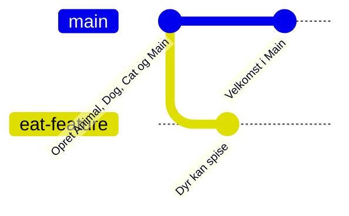

# Løsninger – Git branching

Her er det, I skal forvente at se i hver [opgave](opgaver.md). Outputtet er fra en rigtig kørsel
af opgaverne, med beskederne, som en nyere Git skriver dem. Jeres **commit-id'er** (de syv tegn, fx
`c542afb`) bliver nogle andre, og nogle beskeder kan se lidt anderledes ud i en anden version af Git. Det vigtige er **formen** på
historikken og **ordene** i beskederne: *Switched to*, *Fast-forward*, *CONFLICT*, *rejected*.

---

# Del 1 – Alene

## Opgave 1 – Øvelsesprojektet

```text
$ git branch
* master
$ git branch -m main
$ git branch
* main
$ git log --oneline
840a44d Opret Animal, Dog, Cat og Main
```

Står der `main` fra starten, er din Git sat op til det, og du skal ikke omdøbe. Omdøbningen skal
ske, **før** projektet deles på GitHub.

`Main` skriver:

```text
Fido siger Vov
Misser siger Mjav
```

## Opgave 2 – Din første branch

```text
$ git switch -c eat-feature
Switched to a new branch 'eat-feature'
$ git commit -m "Dyr kan spise"
[eat-feature c542afb] Dyr kan spise
 3 files changed, 12 insertions(+)
$ git branch
* eat-feature
  main
$ git log --oneline --graph --all
* c542afb Dyr kan spise
* 840a44d Opret Animal, Dog, Cat og Main
```

Du står på `eat-feature` (stjernen). `main` har **1** commit, `eat-feature` har **2**: den fælles
første commit og `Dyr kan spise`. Historikken er stadig en lige linje, fordi `main` ikke har
flyttet sig. `main` peger bare på den nederste commit.

I IntelliJ står der nu `eat-feature` i VCS-widget'en øverst.

## Opgave 3 – Hvor blev koden af?

På `main` er `eat` **væk** fra `Animal.java`, og `Main` kører fint (uden `eat`). Skifter du tilbage
til `eat-feature`, er metoden der igen.

**Forklaring:** Når du skifter branch, skifter Git filerne i projektmappen ud, så de passer med den
commit, branchen peger på. `eat` blev committet på `eat-feature`, så den findes kun dér. Intet er
slettet. Det ligger i historikken, og Git henter det frem, når du skifter tilbage.

IntelliJ opdager, at filerne er ændret, og viser den nye udgave med det samme.

## Opgave 4 – main flytter sig

```text
$ git log --oneline --graph --all
* 10ccd51 Velkomst i Main
| * c542afb Dyr kan spise
|/
* 840a44d Opret Animal, Dog, Cat og Main
```

Historikken **deler sig** efter den første commit: `eat-feature` er gået én vej, `main` en anden.
Tegnet som i README'en:



## Opgave 5 – Merge ned, merge op

**Merge ned** giver en merge-commit, fordi begge branches har nye commits:

```text
$ git switch eat-feature
Switched to branch 'eat-feature'
$ git merge main --no-edit
Merge made by the 'ort' strategy.
 src/Main.java | 1 +
 1 file changed, 1 insertion(+)
```

(*'ort'* er navnet på den måde, Git fletter på. Står der *'recursive'*, er det bare en ældre Git.)

Ja, velkomsten står nu også i `Main` på `eat-feature`. Efter trin 4 skriver `Main`:

```text
Velkommen til dyrehaven
Fido siger Vov
Fido spiser fisk: true
Misser siger Mjav
Misser spiser fisk: true
```

**Merge op** bliver en fast-forward:

```text
$ git switch main
Switched to branch 'main'
$ git merge eat-feature
Updating 10ccd51..bfbe9cc
Fast-forward
 src/Animal.java | 2 ++
 src/Cat.java    | 5 +++++
 src/Dog.java    | 5 +++++
 src/Main.java   | 1 +
 4 files changed, 13 insertions(+)
```

**Hvorfor fast-forward?** Fordi `eat-feature` allerede indeholder alt fra `main` (det fik den ved
merge ned). Der er intet at flette, så Git rykker bare `main` frem til samme commit som
`eat-feature`. Det er hele pointen med "merge ned, merge op": den svære merge sker på din branch,
og merge op kan ikke gå galt.

```text
$ git log --oneline --graph --all
* bfbe9cc Afprøv eat i Main
*   b4a79f9 Merge branch 'main' into eat-feature
|\
| * 10ccd51 Velkomst i Main
* | c542afb Dyr kan spise
|/
* 840a44d Opret Animal, Dog, Cat og Main
$ git branch -d eat-feature
Deleted branch eat-feature (was bfbe9cc).
```

Merge-commit'en er `b4a79f9`, den med to streger ind.

## Opgave 6 – Glemt at committe

**3.** Ja, skiftet lykkes, og Git skriver, at `Animal.java` er ændret:

```text
$ git switch main
M	src/Animal.java
Switched to branch 'main'
```

**4.** `git status` viser ` M src/Animal.java`. Den ucommittede ændring er **fulgt med** over på
`main`, og derfor kompilerer `main` ikke:

```text
src/Cat.java:1: error: Cat is not abstract and does not override abstract method jump(double) in Animal
```

Ændringen hørte ikke til nogen branch endnu, fordi den ikke var committet. `Animal.java` var ens på
de to branches, så Git kunne lade den blive i filen. (Havde filen været forskellig på de to
branches, havde Git nægtet at skifte: *"Your local changes ... would be overwritten by checkout"*.)

**5.** Efter commit på `jump-feature` er `main` ren igen, og `Main` kører. Det er derfor, reglen er:
**commit, før du skifter branch**.

**6.**

```text
$ git branch -d jump-feature
error: the branch 'jump-feature' is not fully merged
hint: If you are sure you want to delete it, run 'git branch -D jump-feature'
$ git branch -D jump-feature
Deleted branch jump-feature (was 283124c).
```

Git beskytter dig mod at smide commits væk, der ikke er merget nogen steder. `-D` betyder "jeg
ved det, slet den alligevel".

---

# Del 2 – Sammen

## Opgave 7 – Fælles repo

Alle ser den samme historik som A havde efter del 1, også merge-commit'en `Merge branch 'main' into
eat-feature`. Historikken følger med, når man kloner. Branchen `eat-feature` gør ikke, fordi den
blev slettet (og aldrig pushet).

## Opgave 8 – Push en branch, hent en branch

```text
$ git push -u origin bird
 * [new branch]      bird -> bird
branch 'bird' set up to track 'origin/bird'.
```

På GitHub er der nu **2** branches: `main` og `bird`.

Hos B, **før** `git fetch`:

```text
$ git branch -a
* main
  remotes/origin/HEAD -> origin/main
  remotes/origin/main
```

B kan **ikke** se `bird`, fordi B's Git ikke har spurgt GitHub siden klonen. **Efter** `git fetch`:

```text
$ git fetch
 * [new branch]      bird       -> origin/bird
$ git branch -a
* main
  remotes/origin/HEAD -> origin/main
  remotes/origin/bird
  remotes/origin/main
$ git switch bird
branch 'bird' set up to track 'origin/bird'.
Switched to a new branch 'bird'
```

`Main` på `bird` skriver også `Pippi siger Pip` og `Pippi spiser fisk: false`.

## Opgave 9 – Konflikt mellem to branches

`Fish`:

```java
public class Fish extends Animal {

    public Fish(String name) {
        super(name);
    }

    @Override
    public String makeSound() {
        return "Blub";
    }

    @Override
    public boolean eat(String food) {
        return food.equals("plankton");
    }
}
```

**A's tur** går glat. Merge ned siger `Already up to date.` (ingen har ændret `main`), og merge op
er en fast-forward.

**B's tur:** `git pull` på `main` henter A's fugl, og merge ned i `fish` giver en konflikt:

```text
$ git merge main --no-edit
Auto-merging src/Main.java
CONFLICT (content): Merge conflict in src/Main.java
Automatic merge failed; fix conflicts and then commit the result.
```

`Main.java` ser sådan ud:

```text
<<<<<<< HEAD
        Animal[] animals = {new Dog("Fido"), new Cat("Misser"), new Fish("Nemo")};
=======
        Animal[] animals = {new Dog("Fido"), new Cat("Misser"), new Bird("Pippi")};
>>>>>>> main
```

og `git status` siger:

```text
You have unmerged paths.
  (fix conflicts and run "git commit")
  (use "git merge --abort" to abort the merge)

Changes to be committed:
	new file:   src/Bird.java

Unmerged paths:
  (use "git add <file>..." to mark resolution)
	both modified:   src/Main.java
```

Læg mærke til, at `Bird.java` **ikke** er i konflikt. Den er ny og kom bare med. Kun den ene linje
i `Main.java`, som begge har ændret, skal et menneske tage stilling til.

**Løsningen** er **begge** dyr, ikke det ene eller det andet:

```java
        Animal[] animals = {new Dog("Fido"), new Cat("Misser"), new Bird("Pippi"), new Fish("Nemo")};
```

I IntelliJ er det hverken **Accept Yours** eller **Accept Theirs**, men **Merge...** (i nyere
versioner **Resolve Manually**), hvor du tager fra begge sider. `Main` skriver nu alle fire dyr, og mergen afsluttes:

```text
$ git add src/Main.java
$ git commit --no-edit
[fish f2261c9] Merge branch 'main' into fish
```

Merge op er igen en fast-forward, og push går igennem. B's historik:

```text
*   f2261c9 Merge branch 'main' into fish
|\
| * d03793b Tilføj Bird
* | a2d6af8 Tilføj Fish
|/
* bfbe9cc Afprøv eat i Main
...
```

## Opgave 10 – Afvist push

B's push bliver afvist:

```text
$ git push
 ! [rejected]        main -> main (fetch first)
error: failed to push some refs to '...'
hint: Updates were rejected because the remote contains work that you do
hint: not have locally. ...
```

Løsningen:

```text
$ git pull --no-edit
Merge made by the 'ort' strategy.
 src/Cat.java | 2 +-
 1 file changed, 1 insertion(+), 1 deletion(-)
$ git push
   4f4e271..bba7e50  main -> main
```

`Main` skriver `Fido siger Vuf` og `Misser siger Miav`. Historikken:

```text
*   bba7e50 Merge branch 'main' of https://github.com/.../branch-oevelse
|\
| * 4f4e271 Katten siger miav
* | bec825c Hunden siger vuf
|/
*   f2261c9 Merge branch 'main' into fish
```

Havde B **ikke** kørt `git config --global pull.rebase false` i opgave 7, kunne `git pull` have
svaret *"fatal: Need to specify how to reconcile divergent branches."* (I IntelliJ spørger den i
stedet, om du vil **Merge** eller **Rebase**. Vælg **Merge**.)

**6.** B sprang over at **pulle `main` før merge op** (trin 3 i tjeklisten). Det gik godt, fordi
A og B havde ændret **forskellige filer**, så `git pull` kunne flette uden konflikt. Havde de
ændret samme linje, ville konflikten være opstået **på `main`**, og det er netop det, "merge ned,
merge op" skal undgå.

## Opgave 11 – Ryd op

```text
$ git branch -d bird cat-sound
Deleted branch bird (was d03793b).
Deleted branch cat-sound (was 4f4e271).
$ git push origin --delete bird
 - [deleted]         bird
```

Hos de andre forsvinder `remotes/origin/bird` først efter:

```text
$ git fetch --prune
 - [deleted]         (none)     -> origin/bird
```

Men deres **lokale** `bird` (hvis de lavede en i opgave 8) forsvinder ikke af sig selv. Den skal
slettes med `git branch -d bird`.

Prøver du at slette en branch på GitHub, som aldrig er blevet pushet (fx `fish`), svarer Git:

```text
error: unable to delete 'fish': remote ref does not exist
```

Det er ufarligt. Der var bare ikke noget at slette.

## Opgave 12 – Hele arbejdsgangen

Løsningerne på de fire stories:

```java
// animal-count: efter arrayet
        System.out.println("Der er " + animals.length + " dyr");
```

```java
// fish-eaters: til sidst i main
        System.out.print("Spiser fisk:");
        for (Animal animal : animals) {
            if (animal.eat("fisk")) {
                System.out.print(" " + animal.getName());
            }
        }
        System.out.println();
```

`horse` er som `Bird` med `"Vrinsk"` og `"hø"`. `age` får en attribut og en getter i `Animal`, og
**alle** konstruktører får en ekstra parameter:

```java
    private String name;
    private int age;

    public Animal(String name, int age) {
        this.name = name;
        this.age = age;
    }

    public int getAge() {
        return age;
    }
```

```java
    public Dog(String name, int age) {
        super(name, age);
    }
```

Da vi prøvede i rækkefølgen `animal-count`, `fish-eaters`, `horse`, `age`, skete der dette:

1. `animal-count`: ingen konflikt (første).
2. `fish-eaters`: ingen konflikt. De to ændrede forskellige steder i `Main`.
3. `horse`: **konflikt** i `Main`, selvom `horse` og `animal-count` ikke har ændret den **samme**
   linje. `animal-count` satte en linje ind lige **under** arrayet, og `horse` ændrede arrayet. Git
   regner ændringer i linjer, der **støder op til hinanden**, som en konflikt. Løsningen er begge
   dele: arrayet med hesten og tællelinjen under det.
4. `age`: **konflikt** i arrayet i `Main`, fordi både `horse` og `age` har ændret den linje. Og
   endnu vigtigere: da konflikten var løst, **kompilerede programmet ikke**:

```text
src/Horse.java:4: error: constructor Animal in class Animal cannot be applied to given types;
        super(name);
        ^
  required: String,int
  found:    String
```

`Horse.java` var ny fra `horse`, og den kendte ikke til alderen. Der var ingen konflikt i
`Horse.java`, for `age` havde slet ikke rørt den fil. Men sammen virker de ikke. Det er derfor, der
står **kør programmet og testene** efter merge ned: **En merge uden konflikter er ikke det samme
som en merge, der virker.**

Den rigtige løsning gav `Horse` en alder også: konstruktøren i `Horse.java` fik `int age` og
`super(name, age)` som de andre dyr, og hesten fik en alder i arrayet:

```java
        Animal[] animals = {new Dog("Fido", 3), new Cat("Misser", 7), new Bird("Pippi", 1), new Fish("Nemo", 2), new Horse("Blakken", 12)};
```

```text
Velkommen til dyrehaven
Der er 5 dyr
Fido (3 år) siger Vuf
...
Blakken (12 år) siger Vrinsk
Blakken spiser fisk: false
Spiser fisk: Fido Misser
```

**Hvordan kunne man have undgået det?** `age` ændrer noget, som **alle** dyr afhænger af. Den slags
ændringer skal merges **tidligt** og siges højt ved stand-up, så de andre kan merge `main` ned med
det samme. Og det er et godt eksempel på, hvorfor det betaler sig at blive enige om de fælles
klasser (i Delfinen fx `Member`) i starten.

---

## Udfordring 1 – Stash

```text
$ git switch main
error: Your local changes to the following files would be overwritten by checkout:
	src/Dog.java
Please commit your changes or stash them before you switch branches.
Aborting
$ git stash
Saved working directory and index state WIP on stash-test: ...
```

Efter `git stash` siger `git status`, at der ikke er noget at committe. Ændringen ligger i en
**stash**, et midlertidigt gemmested uden for branchen. `git stash pop` lægger den tilbage og
fjerner den fra listen (`Dropped refs/stash@{0} ...`).

**Hvorfor hellere committe?** En stash er usynlig: den står ikke i historikken, den bliver ikke
pushet, og det er let at glemme, at den findes, eller at poppe den på den forkerte branch. En
commit på din egen branch er gemt, kan ses af alle og kan pushes.

## Udfordring 2 – Pull request på GitHub

Efter **Confirm merge** har `main` på GitHub en merge-commit med beskeden *Merge pull request #1
from .../snake*. GitHub laver altid en merge-commit ved **Merge pull request**, også når det kunne
have været en fast-forward.

**Fordele:** en anden ser koden, før den kommer ind i `main`; diskussionen gemmes ved ændringerne;
man kan se på GitHub, hvad der er på vej ind. **Ulemper:** det tager længere tid, fordi man skal
vente på den anden, og man skal stadig selv sørge for at teste (GitHub kører ikke jeres tests,
medmindre man sætter det op). Og hvis `main` har flyttet sig, skal man stadig merge `main` ned i
branchen først, hvis der er konflikter.

## Udfordring 3 – Kun IntelliJ

Ingen løsning. I **Log**-fanen ses merge-commit'en som et punkt med to streger ind, og efter en
fast-forward står `main` og `eat-feature` som to mærker på den **samme** commit, indtil branchen
slettes.
