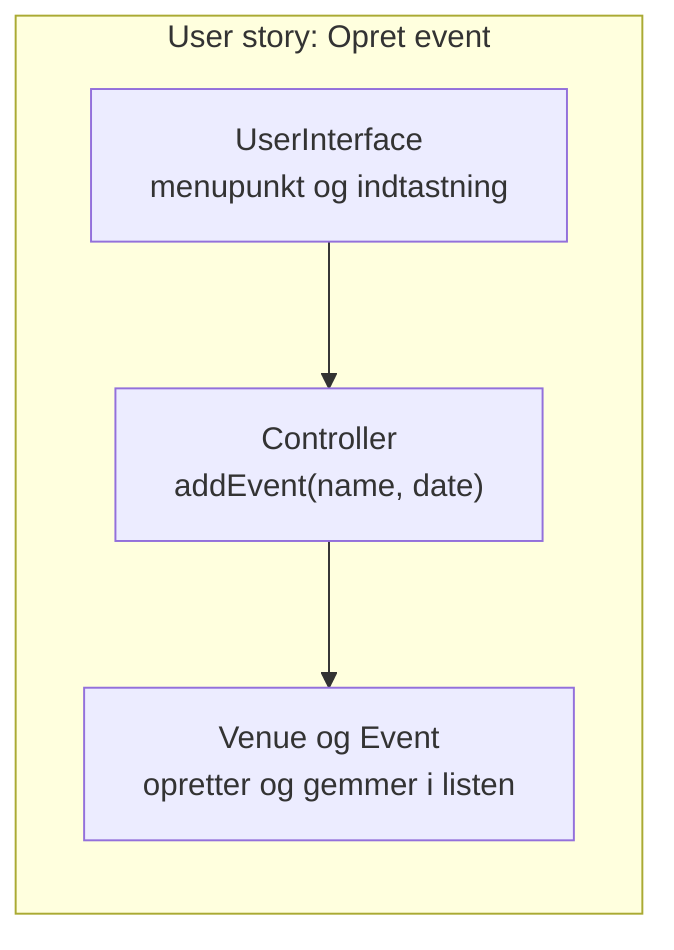

# Projektarbejde, sprint 1: stand-up og den første skive

## Beskrivelse

I dag er den første hele arbejdsdag i sprint 1, og den første dag, hvor I arbejder i **branches**.
Dagens undervisning er afsat til [Delfinen](../../projekter/delfinen/readme.md).

Dagens tema er at **komme godt fra start**:

* **Daily stand-up** hver morgen, så alle ved, hvad de andre laver.
* **Skelettet først**: en `Main`, en menu og de aftalte packages på `main`, så alle har noget at
  bygge videre på.
* **Den første lodrette skive**: én user story, der virker hele vejen fra menuen til
  domæneklasserne, før I bygger bredt.

## Læringsmål

Når du har arbejdet med dagens materiale, skal du kunne:

* holde en **daily stand-up** på 10–15 minutter med de tre spørgsmål
* forklare, hvad en **lodret skive** er, og hvorfor den første user story skal gå hele vejen
  igennem programmet
* forklare, hvorfor et **skelet** på `main` gør det lettere for fire personer at arbejde samtidig
* bruge arbejdsgangen med **én branch pr. user story** i jeres eget projekt

## Se disse videoer før undervisningen:

Ingen video i dag.

## Læs nedenstående før undervisningen

* [Scrum i Delfinen → Daily stand-up](../../projekter/delfinen/scrum.md#daily-stand-up--hver-projektdag)
* [Tjeklisten fra i går](../04_tor_2026-11-19/README.md#tjeklisten) om branches

---

### Daily stand-up

Hver projektdag starter med en **stand-up**: 10–15 minutter, **stående foran boardet**. Hver
svarer på tre spørgsmål:

1. Hvad lavede jeg siden sidst?
2. Hvad laver jeg nu?
3. Er der noget, der forhindrer mig?

Et godt svar er **konkret** og peger på et kort på boardet:

| Mindre godt | Godt |
|---|---|
| *"Jeg arbejdede på noget kode."* | *"Jeg lavede `Member` med navn og fødselsdato på branchen `opret-medlem`. Den er ikke merget endnu."* |
| *"Det går fint."* | *"I dag laver jeg menupunktet til at oprette et medlem. Jeg regner med at merge efter frokost."* |
| *"Nej."* | *"Jeg ved ikke, hvordan vi gemmer discipliner i filen. Kan vi tage det efter stand-up?"* |

Stand-up er **ikke** et møde, hvor problemer bliver løst. Kræver noget en længere snak, så sig
*"lad os tage det bagefter"*, og tag det med dem, det angår.

Scrum Master sørger for, at mødet bliver holdt, at det ikke løber løbsk, og at forhindringerne
bliver fulgt op. Er nogen hjemme, skriver de deres tre svar i gruppens chat.

> **Hvorfor stående?** Så det bliver kort. Og **foran boardet**, så I kan pege på kortene og flytte
> dem med det samme. Et board, der ikke passer med virkeligheden, er værre end intet board.

---

### Skelettet først

Hvis fire personer hver starter på deres egen user story fra et tomt projekt, laver de alle fire
en `Main`, en menu og en `Controller`. Så får I fire udgaver af det samme og store konflikter.

Lav derfor et **skelet** først, på `main`: den struktur, alle bygger videre på, men uden
funktionalitet. Det var sidste punkt på [onsdagens side](../03_ons_2026-11-18/README.md#gør-projektet-klar-til-i-morgen). Er det ikke gjort, så gør det **først**,
**én** person, og merge det, før de andre laver deres branches.

Et skelet til Kulturhuset fra 16–17-11 kunne se sådan ud:

```java
import controller.Controller;
import ui.UserInterface;

public class Main {

    public static void main(String[] args) {
        UserInterface ui = new UserInterface(new Controller());
        ui.start();
    }
}
```

```java
    public void start() {
        boolean running = true;
        while (running) {
            System.out.println();
            System.out.println("1. Opret event");
            System.out.println("2. Vis events");
            System.out.println("3. Sælg billet");
            System.out.println("0. Afslut");

            int choice = readInt("Vælg: ");
            switch (choice) {
                case 1 -> createEvent();
                case 2 -> showEvents();
                case 3 -> System.out.println("Kommer i en senere user story.");
                case 0 -> running = false;
                default -> System.out.println("Vælg et tal fra menuen.");
            }
        }
    }
```

Menupunkterne står der allerede, også dem, der ikke er lavet. Den, der laver *Sælg billet*, skal
kun rette **én linje** i `switch`'en og tilføje **én** metode. Så bliver konflikterne i menuen
små, og de er lette at løse, når de kommer.

> I Delfinen er der tre brugere. Aftal i gruppen, om I vil have **én menu** med alt, eller en
> **startmenu**, hvor man vælger formand, kasserer eller træner, med en undermenu til hver. Det
> sidste giver færre konflikter, fordi hver undermenu kan ligge i sin egen metode.

---

### Den første lodrette skive

Det er fristende at bygge programmet **lag for lag**: først alle domæneklasser, så filhåndteringen,
og til sidst brugerfladen. Problemet er, at intet virker, før det sidste lag er færdigt, og at man
først opdager, at lagene ikke passer sammen, når det er for sent.

Byg i stedet **én user story hele vejen igennem**, fra menuen til domænet og tilbage. Det kaldes en
**lodret skive** (*vertical slice*):



Når den første skive virker, ved I, at **strukturen holder**: at `UserInterface` kan tale med
`Controller`, at `Controller` kan tale med domænet, og at `Main` starter det hele. Hver ny user
story er så en ny skive ved siden af, og programmet kan køres og vises frem efter hver eneste.

**Et godt valg til den første skive i Delfinen** er *opret medlem* sammen med *se listen over
medlemmer*. Så kan I se, at oprettelsen virker. Kontingent, restance og træner bygger alle videre
på medlemmerne.

**Og hold UI og logik adskilt fra starten.** Kun `UserInterface` må have `Scanner(System.in)` og
`System.out`. Domæneklasserne **returnerer** data og får **parametre**, som I lærte i Adventure.
Det er et krav i Delfinen, og det er langt lettere at gøre rigtigt fra begyndelsen end at rydde op
bagefter.

---

### Når I sidder fast

1. **Prøv selv i 15 minutter.** Brug debuggeren, læs fejlbeskeden, søg i dagens og tidligere
   sider.
2. **Spørg i gruppen.** Tit har en anden haft det samme problem. Og det er det, stand-up'ens
   tredje spørgsmål er til.
3. **Spørg underviseren.** Forklar kort, **hvad du forventede**, **hvad der skete**, og **hvad du
   har prøvet**. Hav koden åben og fejlbeskeden klar.

Er det Git, der driller: lav ikke flere forsøg i blinde. Kør `git status` og `git log --oneline
--graph --all`, og vis dem til den, du spørger. Der er næsten altid en vej tilbage, så længe
tingene er committet.

---

## Det vigtigste at tage med

* **stand-up** hver morgen: tre spørgsmål, stående foran boardet, konkrete svar, ingen
  problemløsning
* **skelettet først**, på `main`, lavet af én: packages, `Main`, menu med alle punkter
* byg **én user story hele vejen igennem**, før I bygger bredt
* **én branch pr. user story**, merge ned, test, merge op, push
* kun `UserInterface` læser fra tastaturet og skriver i konsollen
* spørg efter 15 minutter, og fortæl, hvad du forventede, hvad der skete, og hvad du har prøvet

## Aktiviteter i undervisningen

### 1. Stand-up (15 min)

Første rigtige stand-up. Scrum Master starter. Flyt kortene, mens I taler.

### 2. Skelettet (hvis det ikke er lavet)

Én person laver skelettet på `main` og pusher. De andre puller og kører det, før de laver deres
branches. Imens kan de andre læse jeres user stories igennem og skrive tests til dem på papir.

### 3. Første skive og de første stories

Alle arbejder i **branches**, én pr. user story, som I fordelte ved sprint planning.

### Tjekliste, før I går hjem

- [ ] Alt, der virker, er merget til `main`, og `main` kan køre.
- [ ] Alt, der ikke er færdigt, er committet og **pushet** på sin branch.
- [ ] Boardet passer: kortene står i den rigtige kolonne, og hvert kort i *I gang* har en person på.
- [ ] Er der kommet nye beslutninger om casen, står de i `docs/user-stories.md`.
