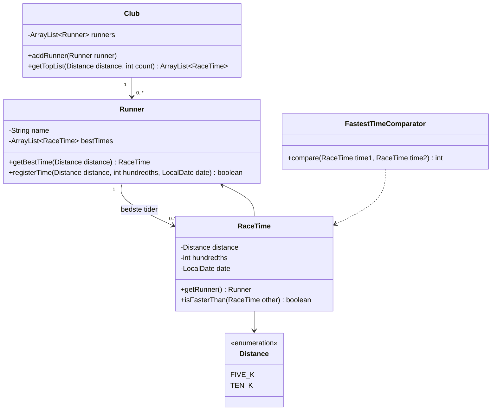

# Delfinen – sprint 2: top 5 og sortering

## Beskrivelse

Projektdag i sprint 2. Dagens kvalitetstema er **top 5** – trænerens oversigt over de hurtigste
svømmere i hver disciplin ([F13](../../projekter/delfinen/readme.md#funktionelle-krav)).

Top 5 ser ud som én linje i en menu, men den samler næsten alt fra semestret: en liste af objekter,
filtrering, en `Comparator`, en kopi af listen, der kan sorteres uden at ødelægge originalen, og en
grænse på fem, der ikke må gå galt, når der kun er tre. Derfor er den også et godt sted at skrive
**unit tests**.

Vi viser teknikken på et **andet** eksempel – en løbeklub – så I selv skal oversætte den til
Delfinen, præcis som med [domænemodellen](../../projekter/delfinen/kom-i-gang.md#metoden-i-fire-trin--vist-på-et-andet-eksempel).

## Læringsmål

Når du har arbejdet med dagens materiale, skal du kunne:

* dele en top-liste op i tre trin: **filtrér, sortér, tag de første**
* skrive en `Comparator`, der sorterer efter en tid, hurtigste først
* sortere en **kopi** af en liste, så originalen beholder sin rækkefølge
* tage de første *n* elementer uden at få en exception, når der er færre end *n*
* forklare, hvorfor en tid skal gemmes som et tal og ikke som tekst
* skrive unit tests af en top-liste, der også dækker de "kedelige" tilfælde

## Se disse videoer før undervisningen:

Ingen ny video. Sortering med `Comparable` og `Comparator` lærte I i
[Filmsamling del 9](../../projekter/filmsamling/del-9-sortering.md) – læs afsnittet
[Interfaces](../../projekter/filmsamling/del-9-sortering.md#interfaces) igen, hvis det er et stykke
tid siden. Har du brug for mere om interfaces generelt, så se
[interfaces](https://www.youtube.com/watch?v=xTtL8E4LzTQ&list=PLEeqf0uSZqXsz7oU2U-VAxhQZ021PRVnd&t=8h1m30s)
(til: 08:07:44) fra kursusrækken.

## Læs nedenstående før undervisningen

---

### Eksemplet: løbeklubben

Løbeklubben registrerer hver løbers **bedste tid** på to distancer, 5 km og 10 km. Træneren vil
se de tre hurtigste på en distance.



`RaceTime` kender sin `Runner`. Det er det, der gør, at top-listen kan vise **navnet** ved siden af
tiden.

> Løbeklubben er ikke Delfinen. I Delfinen er der fire discipliner, junior og senior, og kun
> konkurrencesvømmere kommer med. Men trinene er de samme.

---

### Trin 1: tider er tal

En tid som `21:20.10` ser ud som tekst, men den skal gemmes som et **tal**. Ellers bliver
sorteringen forkert:

```java
System.out.println("10:02.00".compareTo("9:59.00"));   // -8: "10:02.00" kommer FØR "9:59.00"
```

Tekst sammenlignes **tegn for tegn**, og `'1'` kommer før `'9'`. Så en løber på 10 minutter ville
stå foran en på 9 minutter. Derfor gemmer vi tiden som et helt antal **hundrededele sekund**, som
[tippet i projektbeskrivelsen](../../projekter/delfinen/readme.md#funktionelle-krav) foreslår:
`21:20.10` bliver til `128010`. Tal kan sammenlignes, og de kan gemmes i en fil uden
afrundingsfejl.

Omregningen til tekst sker først, når tiden skal **vises**:

```java
public class TimeFormat {

    // 6532 -> "1:05.32"
    public static String format(int hundredths) {
        int minutes = hundredths / 6000;
        int seconds = (hundredths / 100) % 60;
        int rest = hundredths % 100;
        return String.format("%d:%02d.%02d", minutes, seconds, rest);
    }
}
```

`%02d` betyder "et heltal med mindst to cifre, fyldt op med 0 foran" – så 5 sekunder bliver til
`05`. Klassen hører hjemme i brugerfladen: det er et spørgsmål om **visning**.

---

### Trin 2: bedste tid pr. løber

Hver løber har højst **én** bedste tid pr. distance. Kommer der en ny tid, erstatter den kun den
gamle, hvis den er hurtigere:

```java
// Returnerer true, hvis tiden blev ny bedste tid
public boolean registerTime(Distance distance, int hundredths, LocalDate date) {
    RaceTime newTime = new RaceTime(this, distance, hundredths, date);
    RaceTime oldBest = getBestTime(distance);

    if (oldBest == null) {
        bestTimes.add(newTime);
        return true;
    }
    if (newTime.isFasterThan(oldBest)) {
        bestTimes.remove(oldBest);
        bestTimes.add(newTime);
        return true;
    }
    return false;
}
```

Metoden **returnerer** `true` eller `false` – den skriver ikke selv noget. Så kan brugerfladen sige
*"Ny bedste tid!"* eller *"Den gamle tid var bedre – den beholdes"*, som F10 kræver.

At hver løber kun har én bedste tid, gør også, at hver løber kun kan stå **én gang** på listen.

---

### Trin 3: comparatoren

```java
import java.util.Comparator;

public class FastestTimeComparator implements Comparator<RaceTime> {

    @Override
    public int compare(RaceTime time1, RaceTime time2) {
        return Integer.compare(time1.getHundredths(), time2.getHundredths());
    }
}
```

Lavest tid først – og det er netop den hurtigste. `Integer.compare` returnerer et negativt tal, 0
eller et positivt tal, som `compare` skal. Se
[Comparator-klasserne](../../projekter/filmsamling/del-9-sortering.md#comparator-klasserne) i
Filmsamling.

---

### Trin 4: filtrér, sortér, tag de første

```java
public ArrayList<RaceTime> getTopList(Distance distance, int count) {

    // 1. Filtrér: kun løbere, der har en tid på distancen – én tid pr. løber
    ArrayList<RaceTime> candidates = new ArrayList<>();
    for (Runner runner : runners) {
        RaceTime best = runner.getBestTime(distance);
        if (best != null) {
            candidates.add(best);
        }
    }

    // 2. Sortér: hurtigste først
    candidates.sort(new FastestTimeComparator());

    // 3. Tag de første – men aldrig flere, end der er
    int size = Math.min(count, candidates.size());
    return new ArrayList<>(candidates.subList(0, size));
}
```

Tre ting at lægge mærke til:

* **Vi sorterer en ny liste**, `candidates`, ikke `runners`. Den rækkefølge, løberne står i i
  klubben, er uændret – og det er den, der bliver gemt i filen.
* **`Math.min(count, candidates.size())`**. Uden den kaster `subList(0, 5)` en
  `IndexOutOfBoundsException`, når kun tre løbere har en tid. Projektbeskrivelsen siger: *"Har
  færre end fem svømmere en tid, vises dem, der har."*
* **`new ArrayList<>(... subList(...))`**. `subList` giver et *vindue* ind i den gamle liste, ikke
  en ny liste. Pakker vi det ind i `new ArrayList<>(...)`, får den, der kalder metoden, sin egen
  liste.

Metoden ligger i `Club`, fordi det er `Club`, der kender alle løberne (**Information Expert**).
Brugerfladen kalder den og viser resultatet:

```text
1. Bo  20:55.99  2026-11-14
2. Anna  21:20.10  2026-11-20
3. Dina  23:20.75  2026-10-30
```

---

### Fra løbeklub til Delfinen

I Delfinen skal filtreringen i trin 1 gøre mere. Skriv jeres egne betingelser op, før I koder:

| Løbeklubben | Delfinen |
|---|---|
| alle løbere | kun **konkurrencesvømmere** |
| har en tid på distancen | er **aktiv i disciplinen** og har en **træningstid** i den |
| én liste | **to** lister: juniorer og seniorer – på hvilken dato? |
| top 3 | top 5 |

Junior eller senior regnes ud fra fødselsdatoen på en bestemt dag – den samme tanke som ved
kontingentet. Skal metoden tage datoen som parameter, så den kan testes?

---

### Test top-listen

En top-liste har mange "kedelige" tilfælde, og det er præcis dem, der går galt. Test i hvert fald:

| Tilfælde | Forventet |
|---|---|
| tre løbere i tilfældig rækkefølge | hurtigste først |
| syv løbere, top 5 | præcis fem |
| to løbere, top 5 | to – ingen exception |
| en løber uden tid på distancen | ikke med |
| en løber med flere tider | kun med én gang, med den bedste |
| ingen løbere | en tom liste |

To af testene fra løbeklubben:

```java
@Test
void topListShowsAllWhenFewerThanCount() {
    runnerWithTime("One", 120000);
    runnerWithTime("Two", 121000);

    assertEquals(2, club.getTopList(Distance.FIVE_K, 5).size());
}

@Test
void runnerIsOnlyOnTheListOnce() {
    Runner runner = runnerWithTime("Anna", 130000);
    runner.registerTime(Distance.FIVE_K, 125000, DATE);   // ny bedste tid
    runner.registerTime(Distance.FIVE_K, 140000, DATE);   // dårligere – beholdes ikke

    ArrayList<RaceTime> top = club.getTopList(Distance.FIVE_K, 5);

    assertEquals(1, top.size());
    assertEquals(125000, top.get(0).getHundredths());
}
```

`runnerWithTime` er en lille hjælpemetode i testklassen, der opretter en løber med én tid og
lægger den i klubben. `club` og `DATE` er attributter i testklassen – `club` oprettes på ny før
hver test i en `@BeforeEach`-metode, og `DATE` er en fast dato. Hjælpemetoder gør testene kortere og
lettere at læse.

Test også `TimeFormat.format`: `6532` skal give `"1:05.32"`, og `5999` skal give `"0:59.99"`.

---

### Tjekliste for dagen

- [ ] Tider gemmes som tal – og vises som `m:ss.hh`
- [ ] En ny tid bliver kun ny bedste tid, hvis den er hurtigere – og træneren får besked
- [ ] En tid i en disciplin, svømmeren ikke er aktiv i, bliver afvist
- [ ] Top 5 findes med en `Comparator` og sorterer en **kopi**
- [ ] Top 5 virker med færre end fem svømmere – og med ingen
- [ ] Juniorer og seniorer vises hver for sig
- [ ] Der er unit tests af top-listen, og de er grønne
- [ ] Alt er merget til `main`

---

## Det vigtigste at tage med

* en top-liste er tre trin: **filtrér, sortér, tag de første**
* gem tider som **tal** (hundrededele) – tekst sorterer forkert
* sortér en **kopi** af listen, så originalens rækkefølge ikke ændres
* `Math.min(count, list.size())` – så går det ikke galt, når der er færre end fem
* hver svømmer står højst **én gang** – med sin bedste tid
* test de kedelige tilfælde: færre end fem, ingen tider, flere tider pr. person

## Aktiviteter i undervisningen

### 1. Daily stand-up

Foran boardet. Hvem arbejder på træner-delen i dag?

### 2. Top 5 i Delfinen

Udfyld tabellen [Fra løbeklub til Delfinen](#fra-løbeklub-til-delfinen) i gruppen, før I koder.
Skriv testene – gerne først.

### 3. Sprint 2

Arbejd videre på sprint backloggen. Gå [tjeklisten](#tjekliste-for-dagen) igennem sidst på dagen,
og merge til `main`.
