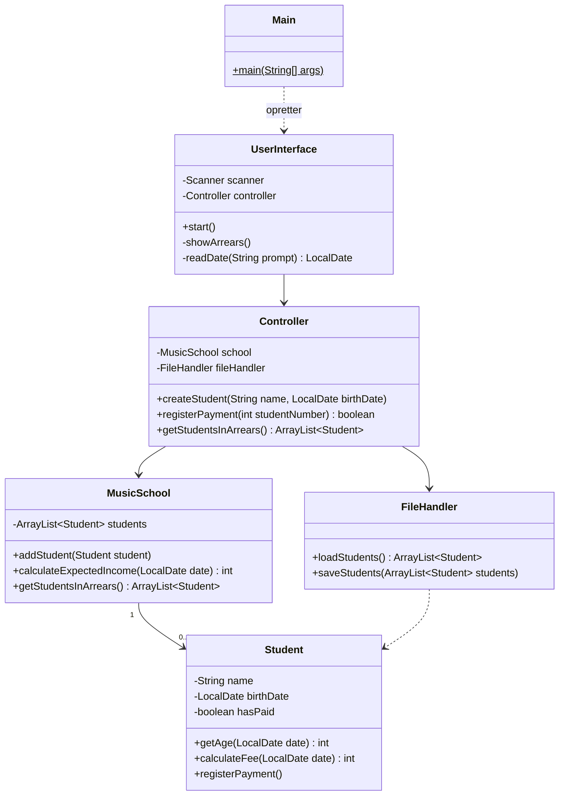

# Delfinen – sprint 2: dokumentation, README og eksempeldata

## Beskrivelse

Sidste projektdag før afleveringsdagen. I morgen kl. 23:59 er der deadline, og i morgen skal gå med
at rette fejl og aflevere – ikke med at bygge nyt.

> **I dag er sidste dag med nye features.** Har I aftalt et stoppunkt ved sprint planning, så hold
> det. Har I ikke, så aftal det nu – fx i dag kl. 15. Derefter retter I kun fejl.

Dagens kvalitetstema er alt det **rundt om koden**, som afleveringen kræver: domænemodel, user
stories, designklassediagram, `README.md` og eksempeldata. Det er det første, en anden ser, når de
åbner jeres repo – underviserne, gruppen, der reviewer jer 11-12, og jer selv, når I læser op til
eksamen.

## Læringsmål

Når du har arbejdet med dagens materiale, skal du kunne:

* forklare forskellen på en domænemodel og et designklassediagram
* tegne et designklassediagram, der passer med den færdige kode
* holde `docs/user-stories.md` opdateret, så det kan ses, hvad der er færdigt
* skrive en `README.md`, der gør det muligt for en fremmed at starte programmet
* lave eksempeldata, der dækker alle slags medlemmer og gør programmet muligt at afprøve med det
  samme

## Se disse videoer før undervisningen:

Ingen video i dag. Læs i stedet:

* [Dokumentation](../../projekter/delfinen/readme.md#dokumentation) og
  [Det skal ligge i repoet](../../projekter/delfinen/readme.md#det-skal-ligge-i-repoet) i
  projektbeskrivelsen
* [Domænemodel eller klassediagram?](../../projekter/delfinen/kom-i-gang.md#domænemodel-eller-klassediagram)
  i Kom i gang

## Læs nedenstående før undervisningen

---

### Tre dokumenter i docs/

| Dokument | Beskriver | Hvornår er det færdigt? |
|---|---|---|
| **Domænemodel** | klubben, med klubbens ord | Når den passer med casen – og med det, I har lært undervejs |
| **User stories** | hvad programmet skal kunne, og hvad det kan | Når hver story er markeret som færdig eller ikke færdig |
| **Designklassediagram** | jeres program, med klassenavnene fra koden | Når det passer med koden på `main` ved afleveringen |

#### Domænemodellen

Første udgave er fra 16-11. Siden har I lært mere om klubben. Kig den igennem én gang til:

* Mangler der et begreb, I har brugt i koden, og som **findes i klubben** (fx *stævne* eller
  *træningsresultat*)?
* Står der noget, der viste sig at være noget andet (fx *alder*, der blev til *fødselsdato*)?
* Er der stadig **ingen** metoder, datatyper og tekniske klasser? Domænemodellen beskriver
  klubben, ikke programmet.

#### Designklassediagrammet

Det er det dokument, der oftest mangler eller er forkert. Det skal vise **jeres program**, som det
er på `main`: klasser med de vigtigste attributter og metoder, arv, relationer og multipliciteter –
også de tekniske klasser som `UserInterface`, `Controller` og `FileHandler`.

Et eksempel for musikskolen fra i fredags ([04-12](../../49/05_fre_2026-12-04/README.md)) – ikke
for Delfinen:



Læg mærke til:

* **Metoderne er med – men ikke alle.** Getters og setters kan udelades, hvis diagrammet ellers
  bliver uoverskueligt. Metoder, der fortæller, hvad klassen **kan**, skal med.
* **Multipliciteter** står på associationerne: én skole har nul eller flere elever.
* **Arv** tegnes med en åben trekant mod superklassen (i Mermaid `Animal <|-- Dog`), og enums
  med `<<enumeration>>`.
* Skriv det selv i Mermaid eller et tegneværktøj – og **tjek det mod koden**. Stemmer navnene?
  Er der kommet klasser til siden sidst?

Mermaid-syntaksen står i [Mermaids dokumentation](https://mermaid.js.org/syntax/classDiagram.html),
og GitHub viser diagrammet direkte i en `.md`-fil
([Creating diagrams](https://docs.github.com/en/get-started/writing-on-github/working-with-advanced-formatting/creating-diagrams)).

#### user-stories.md

Afleveringen kræver, at man kan se, **hvilke user stories der er færdige, og hvilke der ikke nåede
med**. En enkel form:

```markdown
# User stories

## Formanden

### US1 – Opret medlem ✅ færdig
Som formand vil jeg kunne oprette et nyt medlem, så klubben har styr på, hvem der er medlem.

- Givet ... når ... så ...
- Givet ... når ... så ...

Krav: F1, F3

## Udvidelser

### US14 – Søg på navn ❌ ikke nået
...
```

Skriv også jeres **egne beslutninger** ind ved den story, de hører til – det, I besluttede, fordi
casen ikke var præcis nok. Det er dem, I skal kunne forklare til peer review og eksamen.

---

### README.md

`README.md` i roden er forsiden af jeres repo. Kravene står i
[Det skal ligge i repoet](../../projekter/delfinen/readme.md#det-skal-ligge-i-repoet). Et forslag
til opbygning:

```markdown
# Delfinen – gruppe ...

Administrativt system til Svømmeklubben Delfinen: medlemmer, kontingent og svømmeresultater.

## Gruppen

| Fornavn | GitHub |
|---|---|
| ... | ... |

Board: <link til GitHub Projects eller Trello>

## Sådan starter du programmet

1. Klon repoet, og åbn det i IntelliJ.
2. Kør `Main` (ligger i ...).
3. Eksempeldata ligger i `...` og bliver indlæst automatisk.

## Krav

| Krav | Status |
|---|---|
| F1 Opret medlem | ✅ |
| ... | |
| U6 Søg på navn | ❌ ikke lavet |

## Dokumentation

- [Domænemodel](docs/...)
- [User stories](docs/user-stories.md)
- [Designklassediagram](docs/...)
```

Kun **fornavn** og GitHub-brugernavn – repoet er offentligt. Se GitHubs
[About READMEs](https://docs.github.com/en/repositories/managing-your-repositorys-settings-and-features/customizing-your-repository/about-readmes).

> **Test jeres README.** Bed en fra en anden gruppe om at følge punkt 1–3 – uden at I hjælper.
> Kan de starte programmet og se medlemmer? Så virker den.

---

### Eksempeldata: mindst 10 medlemmer

Kravet er *"mindst 10 medlemmer af alle slags, heraf konkurrencesvømmere med tider, så man kan
afprøve programmet med det samme"*. Ti medlemmer, der alle er aktive seniorer, er ikke "alle slags".
Tjek, at jeres data dækker:

| Skal findes | Så man kan afprøve |
|---|---|
| passivt medlem | takst 500 kr. |
| aktiv junior | takst 1000 kr., juniorholdet |
| aktiv senior under 60 | takst 1600 kr. |
| aktiv senior på 60 eller derover | takst 1200 kr. |
| passivt medlem over 60 | at rabatten **ikke** gælder passive |
| motionist | at motionister ikke er på holdene |
| konkurrencesvømmere – både junior og senior | holdoversigten og top 5 |
| flere end fem svømmere med tid i samme disciplin og aldersgruppe | at top 5 skærer ved fem |
| en svømmer med stævneresultater | trænerens visning af én svømmer |
| medlemmer, der har betalt – og nogle, der ikke har | restancelisten |

Det bliver let mere end 10 – og det er fint.

> **Pas på med datoerne.** Et medlem, der er 17 i dag, kan være 18 til eksamen. Det er ikke en
> fejl – men vær forberedt på, at holdoversigten og kontingentet ser anderledes ud om en måned.

---

### Tjekliste for dagen

- [ ] Stoppunkt for nye features er aftalt – og holdt
- [ ] Domænemodellen er gennemgået og rettet
- [ ] `docs/user-stories.md` viser, hvad der er færdigt, og hvad der ikke er
- [ ] Designklassediagrammet findes og passer med koden på `main`
- [ ] `README.md` har gruppen, link til boardet, hvordan man starter programmet og status på kravene
- [ ] En fra en anden gruppe har startet programmet ud fra jeres README
- [ ] Eksempeldata dækker alle slags medlemmer – mindst 10
- [ ] ITF-diasshowet er så godt som færdigt
- [ ] Alt er merget til `main`, og alle tests er grønne

---

## Det vigtigste at tage med

* i dag er **sidste dag med nye features** – i morgen retter I fejl og afleverer
* **domænemodellen** beskriver klubben; **designklassediagrammet** beskriver jeres kode – og skal
  passe med den
* `user-stories.md` viser, hvad der er **færdigt**, og hvad der **ikke** er
* `README.md` skal gøre det muligt for en fremmed at starte programmet – test det på en fremmed
* eksempeldata skal dække **alle slags** medlemmer, ikke bare være ti af samme slags

## Aktiviteter i undervisningen

### 1. Daily stand-up og stoppunkt

Foran boardet. Hvad mangler for at nå sprintmålet? Aftal, hvornår I stopper med nye features.

### 2. Dokumentationen

Del de tre dokumenter, `README.md` og eksempeldata mellem jer – men lad en **anden** end den, der
skrev det, læse det igennem bagefter.

### 3. Byt README med en anden gruppe

Følg hinandens `README.md` fra et frisk klon. Sig til, hvis noget ikke virker.

### 4. Sprint 2

Gør færdigt, ret fejl, merge til `main`. Gå [tjeklisten](#tjekliste-for-dagen) igennem, før I går
hjem.
