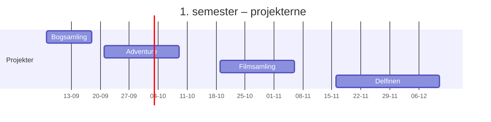

# Eksamenssnak og semesterafrunding

## Beskrivelse

Semestret er ved at slutte, og eksamen nærmer sig. Dagen har to dele:

1. **Eksamenssnak** – hvad eksamen går ud på, hvad I skal kunne, og hvordan I forbereder jer i
   juleferien.
2. **Semesterafrunding** – et kig tilbage på fire projekter og fire måneder: hvad kan I nu, som I
   ikke kunne i august?

> **Det, der gælder, er studieordningen og fagbeskrivelsen.** Denne side samler det, vi ved, og
> peger på, hvor det står. Det, der ikke står her, **gennemgår underviserne i dag**. Skriv det ned –
> og spørg, hvis noget er uklart. Det er bedre at spørge i dag end at gætte til eksamen.

## Læringsmål

Når du har arbejdet med dagens materiale, skal du kunne:

* forklare, hvordan første semesters eksamen er skruet sammen, og hvor reglerne står
* vide, hvad der skal til for at blive indstillet til eksamen
* lægge en realistisk plan for din forberedelse i juleferien
* vurdere, hvilke emner du kan, og hvilke du skal arbejde med
* sætte ord på, hvad du har lært i semestret – og hvad du vil gøre anderledes næste semester

## Se disse videoer før undervisningen:

Ingen video i dag. Tag din liste fra [prøveeksamen](../01_man_2026-12-14/README.md#bagefter) med –
over de emner, du kan, og dem, du skal øve.

## Læs nedenstående før undervisningen

---

### Eksamen: det, vi ved

| | | Kilde |
|---|---|---|
| **Prøven** | 1. delprøve af førsteårseksamen: **Programmering** | [studieordningen](https://www.ek.dk/media/ph5mwsit/datamatiker-ek-2026-guldbergsgade.pdf), afsnit 5 |
| **Form** | **individuel, mundtlig** eksamen | [fagbeskrivelsen](https://katalog.kea.dk/course/3050191/2026-2027) |
| **Varighed** | **20 minutter inkl. votering** | fagbeskrivelsen |
| **Indhold** | *"baseret på spørgsmål i læringsmålene"* | fagbeskrivelsen |
| **Bedømmelse** | **7-trinsskalaen**, **ekstern censur** | fagbeskrivelsen |
| **Vægt** | **25 %** af den samlede førsteårskarakter | fagbeskrivelsen |
| **Tid og sted** | offentliggøres i **Wiseflow** | [EK's eksamensregler](https://mit.ek.dk/studiehaandbog/eksamensregler) |

Resten af førsteårseksamen – 2. delprøve – ligger efter 2. semester og er en projekteksamen. Den
kommer I til at høre om næste semester.

### Eksamen: det, underviserne gennemgår i dag

Skriv svarene ned, når de kommer:

- [ ] Hvordan ser et eksamensspørgsmål ud – og hvordan bliver de 20 minutter brugt?
- [ ] Hvilke **emner** kan spørgsmålene handle om?
- [ ] Hvilke **hjælpemidler** er tilladt – herunder AI-værktøjer? Må man have noget klar i IntelliJ
      på forhånd?
- [ ] Indgår jeres **projekter** på nogen måde?
- [ ] Hvad skal man have med – og hvornår skal man møde op?
- [ ] Hvem kan man spørge, hvis der er noget, man er i tvivl om efter i dag?

> **Hvad var anderledes på et tidligere hold?** På [prøveeksamen-siden](../01_man_2026-12-14/README.md#til-inspiration-sådan-var-eksamen-i-2024)
> står, hvordan eksamen foregik i 2024. Det er inspiration til at øve sig – ikke reglerne for
> 2026.

### Indstilling til eksamen

For at blive indstillet til eksamen skal I have opfyldt semestrets **bundne forudsætninger** –
bl.a. de tre obligatoriske projekter [Adventure](../../projekter/adventure/readme.md),
[Filmsamling](../../projekter/filmsamling/readme.md) og [Delfinen](../../projekter/delfinen/readme.md).
Se [Afleveringer og deadlines](../../README.md#afleveringer-og-deadlines).

Studieordningen (afsnit 5.2) siger det ligeud: har man ikke opfyldt forudsætningerne, kan man ikke
deltage i eksamen – og man **bruger et eksamensforsøg**. Er du i tvivl om, hvorvidt alt er i orden,
så **spørg i dag**.

### Hvis noget går galt

* **Du bliver syg på eksamensdagen:** Hvad du skal gøre – og hvornår – står under *Sygemelding til
  eksamen* i [EK's eksamensregler](https://mit.ek.dk/studiehaandbog/eksamensregler). Der er en frist
  **samme dag**, så læs det, før du får brug for det.
* **Du består ikke:** Du bliver automatisk tilmeldt den næste reeksamen. Du har flere forsøg – se
  [Eksamen](https://mit.ek.dk/studiehaandbog/eksamen) på mit.ek.dk.
* **Du har brug for særlige prøvevilkår** (fx ekstra tid): Det skal søges i god tid. Se
  [Eksamen](https://mit.ek.dk/studiehaandbog/eksamen).

---

### Semestrets programmeringsemner

Det her er de emner, vi har arbejdet med – og hvor du finder dem igen. Hvilke af dem eksamen
lægger vægt på, gennemgår underviserne.

| Emne | Hvor |
|---|---|
| Variabler, datatyper og operatorer | [26-08](../../35/03_ons_2026-08-26/README.md), [27-08](../../35/04_tor_2026-08-27/README.md) |
| Input og output: `Scanner`, `print` | [28-08](../../35/05_fre_2026-08-28/README.md) |
| Løkker: `while`, `for`, for-each | [31-08](../../36/01_man_2026-08-31/README.md), [01-09](../../36/02_tir_2026-09-01/README.md) |
| Arrays | [02-09](../../36/03_ons_2026-09-02/README.md) |
| Strings | [04-09](../../36/05_fre_2026-09-04/README.md) |
| Klasser, objekter og konstruktører | [07-09](../../37/01_man_2026-09-07/README.md), [08-09](../../37/02_tir_2026-09-08/README.md) |
| `enum` og `switch` | [09-09](../../37/03_ons_2026-09-09/README.md) |
| Metoder, parametre og returværdier | [10-09](../../37/04_tor_2026-09-10/README.md), [11-09](../../37/05_fre_2026-09-11/README.md) |
| Objekter i objekter | [15-09](../../38/02_tir_2026-09-15/README.md) |
| `ArrayList` – søgning og redigering | [16-09](../../38/03_ons_2026-09-16/README.md), [18-09](../../38/05_fre_2026-09-18/README.md) |
| Arv: `extends`, `super`, `@Override` | [30-09](../../40/03_ons_2026-09-30/README.md), [Adventure del 3](../../projekter/adventure/del-3-food.md) |
| Polymorfi | [02-10](../../40/05_fre_2026-10-02/README.md) |
| Abstrakte klasser | [05-10](../../41/01_man_2026-10-05/README.md), [Adventure del 4](../../projekter/adventure/del-4-weapons.md) |
| Unit test med JUnit | [Filmsamling del 5](../../projekter/filmsamling/del-5-test.md) |
| `LocalDate` | [Filmsamling del 5½](../../projekter/filmsamling/del-5-datoer.md) |
| Exceptions | [Filmsamling del 6](../../projekter/filmsamling/del-6-exceptions.md) |
| Filer | [Filmsamling del 7](../../projekter/filmsamling/del-7-filer.md) |
| Packages | [Filmsamling del 8](../../projekter/filmsamling/del-8-refaktorering.md) |
| Interfaces og sortering: `Comparable`, `Comparator` | [Filmsamling del 9](../../projekter/filmsamling/del-9-sortering.md) |

Øvelser til det hele: [repetitionsdagen 09-12](../../50/03_ons_2026-12-09/opgaver.md),
[eksamensspørgsmål pr. emne](../01_man_2026-12-14/opgaver.md) og
[prøveopgaverne](../02_tir_2026-12-15/opgaver.md) – alle med løsninger.

---

### Forberedelse i juleferien

Et forslag. Tilpas det til din egen liste – og til eksamensdatoen, når du kender den.

| Hvornår | Hvad |
|---|---|
| **Nu** | Lav din liste: hvert emne i tabellen ovenfor får *ja*, *lidt* eller *nej*. |
| **Første uge** | Hold fri. Det er en del af planen. |
| **Resten af ferien** | **Én opgave om dagen**, 20–30 minutter. Tag emnerne med *nej* først, så *lidt*. Forklar løsningen højt bagefter. |
| **Sidste uge før eksamen** | Øv hele forløbet med en studiekammerat: træk en opgave, løs den på tid, tænk højt, få feedback – som [15-12](../02_tir_2026-12-15/README.md#øv-en-hel-prøve-i-par). |
| **Dagen før** | Tjek computeren: IntelliJ starter, et tomt projekt kan køre, opladeren er pakket. Læs ikke nyt stof. Sov. |

Tre ting, der virker bedre end at læse:

* **Skriv koden selv.** At læse en løsning og tænke *"ja, den forstår jeg"* er ikke det samme som
  at kunne skrive den. Luk løsningen, og skriv den fra bunden.
* **Forklar højt.** For en studiekammerat, et familiemedlem eller en gummiand. Det, du ikke kan
  forklare, kan du ikke endnu.
* **Lidt hver dag** er bedre end meget én dag. 20 minutter hver dag i to uger slår en weekend med
  otte timer.

---

### Semesterafrunding

I august skrev I jeres første `System.out.println`. Siden har I:

* bygget et spil med rum, ting, våben og fjender – med arv og polymorfi
* bygget et CRUD-program i en gruppe, med tests, exceptions, filer og sortering
* fået en kunde med et problem og bygget en løsning til den – fire personer i én kodebase, i
  sprints, med branches

#### Refleksion

Skriv svarene til dig selv – 5–10 linjer i alt. Gem dem; de er gode at læse igen, når 2. semester
starter.

1. Hvad kan du nu, som du **ikke** kunne i august? Vær konkret.
2. Hvilket af de fire projekter lærte du **mest** af? Hvorfor?
3. Hvilket begreb var **sværest** at forstå – og hvad fik det til at falde på plads?
4. Hvordan har du arbejdet i grupperne? Hvad gjorde **du**, der hjalp gruppen – og hvad kunne du
   have gjort bedre?
5. Hvordan har du arbejdet **mellem** undervisningsdagene? Hvad virkede, og hvad vil du ændre?
6. Hvad vil du gøre **anderledes** næste semester?

Tal derefter kort om svarene i jeres studiegruppe eller projektgruppe. Er der noget, I vil gøre
anderledes som gruppe?

---

## Det vigtigste at tage med

* eksamen er **individuel og mundtlig** i **programmering**, 20 minutter inkl. votering, med
  ekstern censur – det står i fagbeskrivelsen
* **studieordningen og fagbeskrivelsen** er det, der gælder; resten gennemgår underviserne i dag –
  skriv det ned
* uden de tre obligatoriske projekter ingen indstilling – og man bruger et eksamensforsøg
* tid og sted står i **Wiseflow**; læs reglerne om sygemelding, **før** du får brug for dem
* forbered dig ved at **skrive kode** og **forklare højt** – lidt hver dag
* tag fri i ferien – det er en del af planen

## Aktiviteter i undervisningen

### 1. Eksamenssnak

Underviserne gennemgår eksamen. Udfyld [listen](#eksamen-det-underviserne-gennemgår-i-dag)
undervejs, og stil de spørgsmål, du har.

### 2. Din plan

Tag din liste fra prøveeksamen frem, og giv hvert [emne](#semestrets-programmeringsemner) *ja*,
*lidt* eller *nej*. Lav din [plan for juleferien](#forberedelse-i-juleferien).

### 3. Refleksion

Skriv svarene på [refleksionsspørgsmålene](#refleksion) hver for sig, og tal dem derefter igennem i
gruppen.

### 4. Afslutning

God jul – og held og lykke med forberedelsen.
