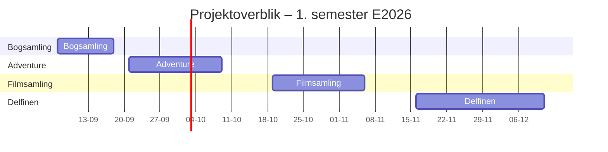

# Lektionsplan

<table>
<thead>
<tr>
  <th>Uge</th>
  <th>Dag</th>
  <th>Emner</th>
  <th>Underviser</th>
  <th>Bemærkninger</th>
</tr>
</thead>
<tbody>

<tr><td colspan="5"><strong>Introduktion til programmering</strong></td></tr>
<tr>
  <td>35</td>
  <td><a href="35/01_man_2026-08-24/README.md">Mandag 24-08-2026</a></td>
  <td>Introdag 1, studiegrupper</td>
  <td>MANY</td>
  <td></td>
</tr>
<tr>
  <td></td>
  <td><a href="35/02_tir_2026-08-25/README.md">Tirsdag 25-08-2026</a></td>
  <td>Introdag 2, install. og Java i notepad</td>
  <td>TOG</td>
  <td></td>
</tr>
<tr>
  <td></td>
  <td><a href="35/03_ons_2026-08-26/README.md">Onsdag 26-08-2026</a></td>
  <td>Studieliv kommer forbi. Variable, datatyper og aritmetiske operatorer</td>
  <td>MANY/MICA</td>
  <td></td>
</tr>
<tr>
  <td></td>
  <td><a href="35/04_tor_2026-08-27/README.md">Torsdag 27-08-2026</a></td>
  <td>Logiske operatorer. Betingelser og beslutninger</td>
  <td>TOG</td>
  <td></td>
</tr>
<tr>
  <td></td>
  <td><a href="35/05_fre_2026-08-28/README.md">Fredag 28-08-2026</a></td>
  <td>I/O: Scanner, print, Git bruger</td>
  <td>MICA</td>
  <td></td>
</tr>
<tr>
  <td>36</td>
  <td><a href="36/01_man_2026-08-31/README.md">Mandag 31-08-2026</a></td>
  <td>While-loops</td>
  <td>MANY</td>
  <td></td>
</tr>
<tr>
  <td></td>
  <td><a href="36/02_tir_2026-09-01/README.md">Tirsdag 01-09-2026</a></td>
  <td>For-loops og while-loops</td>
  <td>TOG</td>
  <td></td>
</tr>
<tr>
  <td></td>
  <td><a href="36/03_ons_2026-09-02/README.md">Onsdag 02-09-2026</a></td>
  <td>Arrays</td>
  <td>MANY/MICA</td>
  <td></td>
</tr>
<tr>
  <td></td>
  <td><a href="36/04_tor_2026-09-03/README.md">Torsdag 03-09-2026</a></td>
  <td>ITF</td>
  <td></td>
  <td></td>
</tr>
<tr>
  <td></td>
  <td><a href="36/05_fre_2026-09-04/README.md">Fredag 04-09-2026</a></td>
  <td>Loops og Strings, Repetition og opsamling på forløb</td>
  <td>TOG</td>
  <td></td>
</tr>
<tr><td colspan="5"><strong>Projekt: </strong><a href="projekter/bogsamling/readme.md">Bogsamling</a></td></tr>
<tr><td colspan="5"><strong>Klasser og objekter</strong></td></tr>
<tr>
  <td>37</td>
  <td><a href="37/01_man_2026-09-07/README.md">Mandag 07-09-2026</a></td>
  <td>Objekter og klasser</td>
  <td>MANY</td>
  <td></td>
</tr>
<tr>
  <td></td>
  <td><a href="37/02_tir_2026-09-08/README.md">Tirsdag 08-09-2026</a></td>
  <td>Objekter og klasser</td>
  <td>MANY</td>
  <td></td>
</tr>
<tr>
  <td></td>
  <td><a href="37/03_ons_2026-09-09/README.md">Onsdag 09-09-2026</a></td>
  <td>Enum, switch</td>
  <td>MANY/MICA</td>
  <td></td>
</tr>
<tr>
  <td></td>
  <td><a href="37/04_tor_2026-09-10/README.md">Torsdag 10-09-2026</a></td>
  <td>Metoder</td>
  <td>TOG</td>
  <td></td>
</tr>
<tr>
  <td></td>
  <td><a href="37/05_fre_2026-09-11/README.md">Fredag 11-09-2026</a></td>
  <td>Metoder</td>
  <td>MICA</td>
  <td></td>
</tr>
<tr>
  <td>38</td>
  <td><a href="38/01_man_2026-09-14/README.md">Mandag 14-09-2026</a></td>
  <td>Design: Aktivitetsdiagram, debugger</td>
  <td>TOG</td>
  <td>MICA er på eftermiddag</td>
</tr>
<tr>
  <td></td>
  <td><a href="38/02_tir_2026-09-15/README.md">Tirsdag 15-09-2026</a></td>
  <td>Objekter i objekter, klassediagrammer</td>
  <td>TOG</td>
  <td></td>
</tr>
<tr>
  <td></td>
  <td><a href="38/03_ons_2026-09-16/README.md">Onsdag 16-09-2026</a></td>
  <td>ArrayList</td>
  <td>MANY/MICA</td>
  <td></td>
</tr>
<tr>
  <td></td>
  <td><a href="38/04_tor_2026-09-17/README.md">Torsdag 17-09-2026</a></td>
  <td>ITF</td>
  <td></td>
  <td></td>
</tr>
<tr>
  <td></td>
  <td><a href="38/05_fre_2026-09-18/README.md">Fredag 18-09-2026</a></td>
  <td>ArrayList - søgning og redigering</td>
  <td>MICA</td>
  <td></td>
</tr>
<tr><td colspan="5"><strong>Projekt: </strong><a href="projekter/adventure/readme.md">Adventure-spil</a></td></tr>
<tr><td colspan="5"><strong>Objekt-referencer, git, SOLID, arv og polymorfi</strong></td></tr>
<tr>
  <td>39</td>
  <td><a href="39/01_man_2026-09-21/README.md">Mandag 21-09-2026</a></td>
  <td>Introduktion til git og GitHub</td>
  <td>MICA</td>
  <td>Besøg fra studievejledning</td>
</tr>
<tr>
  <td></td>
  <td><a href="39/02_tir_2026-09-22/README.md">Tirsdag 22-09-2026</a></td>
  <td>Design: User stories, Controller, Ansvar og afhængigheder, Coupling og Cohesion</td>
  <td>MICA</td>
  <td></td>
</tr>
<tr>
  <td></td>
  <td><a href="39/03_ons_2026-09-23/README.md">Onsdag 23-09-2026</a></td>
  <td>Adventure del 1 - intro</td>
  <td>MICA/TOG</td>
  <td></td>
</tr>
<tr>
  <td></td>
  <td><a href="39/04_tor_2026-09-24/README.md">Torsdag 24-09-2026</a></td>
  <td>Adventure del 1 - vejledning</td>
  <td>MANY</td>
  <td></td>
</tr>
<tr>
  <td></td>
  <td><a href="39/05_fre_2026-09-25/README.md">Fredag 25-09-2026</a></td>
  <td>Adventure del 1 - refactor</td>
  <td>TOG</td>
  <td></td>
</tr>
<tr>
  <td>40</td>
  <td><a href="40/01_man_2026-09-28/README.md">Mandag 28-09-2026</a></td>
  <td>Adventure del 2</td>
  <td>MANY</td>
  <td></td>
</tr>
<tr>
  <td></td>
  <td><a href="40/02_tir_2026-09-29/README.md">Tirsdag 29-09-2026</a></td>
  <td>Adventure del 2 - review, refaktorering</td>
  <td>MANY</td>
  <td></td>
</tr>
<tr>
  <td></td>
  <td><a href="40/03_ons_2026-09-30/README.md">Onsdag 30-09-2026</a></td>
  <td>Adventure del 3 - arv</td>
  <td>TOG/MICA</td>
  <td></td>
</tr>
<tr>
  <td></td>
  <td><a href="40/04_tor_2026-10-01/README.md">Torsdag 01-10-2026</a></td>
  <td>ITF</td>
  <td></td>
  <td></td>
</tr>
<tr>
  <td></td>
  <td><a href="40/05_fre_2026-10-02/README.md">Fredag 02-10-2026</a></td>
  <td>Polymorfi</td>
  <td>MICA</td>
  <td></td>
</tr>
<tr>
  <td>41</td>
  <td><a href="41/01_man_2026-10-05/README.md">Mandag 05-10-2026</a></td>
  <td>Adventure del 4 - abstrakte klasser</td>
  <td>TOG</td>
  <td></td>
</tr>
<tr>
  <td></td>
  <td><a href="41/02_tir_2026-10-06/README.md">Tirsdag 06-10-2026</a></td>
  <td>Adventure del 5</td>
  <td>TOG</td>
  <td></td>
</tr>
<tr>
  <td></td>
  <td><a href="41/03_ons_2026-10-07/README.md">Onsdag 07-10-2026</a></td>
  <td>UDVIKLINGSDAG DIGITAL (ingen undervisning)</td>
  <td></td>
  <td></td>
</tr>
<tr>
  <td></td>
  <td><a href="41/04_tor_2026-10-08/README.md">Torsdag 08-10-2026</a></td>
  <td>Arbejde med Adventure-projekt</td>
  <td>MANY</td>
  <td></td>
</tr>
<tr>
  <td></td>
  <td><a href="41/05_fre_2026-10-09/README.md">Fredag 09-10-2026</a></td>
  <td>Præsentation af færdige projekter</td>
  <td>MANY</td>
  <td></td>
</tr>
<tr><td colspan="5"><strong>Efterårsferie</strong></td></tr>
<tr>
  <td>42</td>
  <td></td>
  <td>Undervisningsfri</td>
  <td></td>
  <td></td>
</tr>
<tr><td colspan="5"><strong>Projekt: </strong>Filmsamling</td></tr>
<tr><td colspan="5"><strong>CRUD,  test, FURPS, filer og sortering</strong></td></tr>
<tr>
  <td>43</td>
  <td><a href="43/01_man_2026-10-19/README.md">Mandag 19-10-2026</a></td>
  <td>GitHub i grupper</td>
  <td>TOG</td>
  <td></td>
</tr>
<tr>
  <td></td>
  <td><a href="43/02_tir_2026-10-20/README.md">Tirsdag 20-10-2026</a></td>
  <td>Projektopstart, delopgave 1-4, user stories, CRUD</td>
  <td>TOG</td>
  <td></td>
</tr>
<tr>
  <td></td>
  <td><a href="43/03_ons_2026-10-21/README.md">Onsdag 21-10-2026</a></td>
  <td>Test</td>
  <td>TOG/MICA</td>
  <td></td>
</tr>
<tr>
  <td></td>
  <td><a href="43/04_tor_2026-10-22/README.md">Torsdag 22-10-2026</a></td>
  <td>Delfi-evaluering med de studerende</td>
  <td>MANY</td>
  <td></td>
</tr>
<tr>
  <td></td>
  <td><a href="43/05_fre_2026-10-23/README.md">Fredag 23-10-2026</a></td>
  <td>Test (delopgave 5)</td>
  <td>MICA</td>
  <td></td>
</tr>
<tr>
  <td>44</td>
  <td><a href="44/01_man_2026-10-26/README.md">Mandag 26-10-2026</a></td>
  <td>FURPS, Datoer (LocalDate) + kode og design review</td>
  <td>MANY</td>
  <td></td>
</tr>
<tr>
  <td></td>
  <td><a href="44/02_tir_2026-10-27/README.md">Tirsdag 27-10-2026</a></td>
  <td>Exceptions (delopgave 6)</td>
  <td>MANY</td>
  <td></td>
</tr>
<tr>
  <td></td>
  <td><a href="44/03_ons_2026-10-28/README.md">Onsdag 28-10-2026</a></td>
  <td>Exceptions</td>
  <td>MICA/MANY</td>
  <td></td>
</tr>
<tr>
  <td></td>
  <td><a href="44/04_tor_2026-10-29/README.md">Torsdag 29-10-2026</a></td>
  <td>ITF</td>
  <td></td>
  <td></td>
</tr>
<tr>
  <td></td>
  <td><a href="44/05_fre_2026-10-30/README.md">Fredag 30-10-2026</a></td>
  <td>Filer</td>
  <td>TOG</td>
  <td></td>
</tr>
<tr>
  <td>45</td>
  <td><a href="45/01_man_2026-11-02/README.md">Mandag 02-11-2026</a></td>
  <td>Kode review og refactorering</td>
  <td>MICA</td>
  <td></td>
</tr>
<tr>
  <td></td>
  <td><a href="45/02_tir_2026-11-03/README.md">Tirsdag 03-11-2026</a></td>
  <td>Sortering (interfaces)</td>
  <td>MICA</td>
  <td></td>
</tr>
<tr>
  <td></td>
  <td><a href="45/03_ons_2026-11-04/README.md">Onsdag 04-11-2026</a></td>
  <td>Projektvejledning</td>
  <td>MICA/MANY</td>
  <td>Online</td>
</tr>
<tr>
  <td></td>
  <td><a href="45/04_tor_2026-11-05/README.md">Torsdag 05-11-2026</a></td>
  <td>Forberedelse af code review</td>
  <td></td>
  <td>Deadline for filmsamling</td>
</tr>
<tr>
  <td></td>
  <td><a href="45/05_fre_2026-11-06/README.md">Fredag 06-11-2026</a></td>
  <td>Kode review af færdige projekter</td>
  <td>MANY</td>
  <td></td>
</tr>
<tr><td colspan="5"><strong>Repetition og evaluering</strong></td></tr>
<tr>
  <td>46</td>
  <td><a href="46/01_man_2026-11-09/README.md">Mandag 09-11-2026</a></td>
  <td>Repetition</td>
  <td>TOG</td>
  <td></td>
</tr>
<tr>
  <td></td>
  <td><a href="46/02_tir_2026-11-10/README.md">Tirsdag 10-11-2026</a></td>
  <td>Repetition</td>
  <td>TOG</td>
  <td></td>
</tr>
<tr>
  <td></td>
  <td><a href="46/03_ons_2026-11-11/README.md">Onsdag 11-11-2026</a></td>
  <td>Repetition</td>
  <td>MICA/TOG</td>
  <td></td>
</tr>
<tr>
  <td></td>
  <td><a href="46/04_tor_2026-11-12/README.md">Torsdag 12-11-2026</a></td>
  <td>ITF</td>
  <td></td>
  <td></td>
</tr>
<tr>
  <td></td>
  <td><a href="46/05_fre_2026-11-13/README.md">Fredag 13-11-2026</a></td>
  <td>Evaluering</td>
  <td>MANY</td>
  <td></td>
</tr>

<tr><td colspan="5"><strong>Projekt: </strong>Delfinen</td></tr>
<tr><td colspan="5"><strong>Git branching, Domænemodel, Scrum</strong></td></tr>
<tr>
  <td>47</td>
  <td><a href="47/01_man_2026-11-16/README.md">Mandag 16-11-2026</a></td>
  <td>Projektopstart, Domænemodel</td>
  <td>MICA</td>
  <td></td>
</tr>
<tr>
  <td></td>
  <td><a href="47/02_tir_2026-11-17/README.md">Tirsdag 17-11-2026</a></td>
  <td>Projektets krav (user stories)</td>
  <td>MANY</td>
  <td></td>
</tr>
<tr>
  <td></td>
  <td><a href="47/03_ons_2026-11-18/README.md">Onsdag 18-11-2026</a></td>
  <td>Sprint planning, checkin</td>
  <td>MANY/TOG</td>
  <td>Underviser online, I er i lokalet</td>
</tr>
<tr>
  <td></td>
  <td><a href="47/04_tor_2026-11-19/README.md">Torsdag 19-11-2026</a></td>
  <td>Git branching</td>
  <td>TOG</td>
  <td></td>
</tr>
<tr>
  <td></td>
  <td><a href="47/05_fre_2026-11-20/README.md">Fredag 20-11-2026</a></td>
  <td>Projektarbejde 1. sprint</td>
  <td>MANY</td>
  <td></td>
</tr>
<tr>
  <td>48</td>
  <td><a href="48/01_man_2026-11-23/README.md">Mandag 23-11-2026</a></td>
  <td>Projektarbejde 1. sprint</td>
  <td>MICA</td>
  <td></td>
</tr>
<tr>
  <td></td>
  <td><a href="48/02_tir_2026-11-24/README.md">Tirsdag 24-11-2026</a></td>
  <td>Projektarbejde 1. sprint</td>
  <td>TOG</td>
  <td></td>
</tr>
<tr>
  <td></td>
  <td><a href="48/03_ons_2026-11-25/README.md">Onsdag 25-11-2026</a></td>
  <td>Projektarbejde 1. sprint, checkin</td>
  <td>TOG/MANY</td>
  <td>Underviser online, I er i lokalet</td>
</tr>
<tr>
  <td></td>
  <td><a href="48/04_tor_2026-11-26/README.md">Torsdag 26-11-2026</a></td>
  <td>ITF</td>
  <td></td>
  <td></td>
</tr>
<tr>
  <td></td>
  <td><a href="48/05_fre_2026-11-27/README.md">Fredag 27-11-2026</a></td>
  <td>Projektarbejde 1. sprint</td>
  <td>TOG</td>
  <td></td>
</tr>
<tr>
  <td>49</td>
  <td><a href="49/01_man_2026-11-30/README.md">Mandag 30-11-2026</a></td>
  <td>Kode review</td>
  <td>MICA</td>
  <td></td>
</tr>
<tr>
  <td></td>
  <td><a href="49/02_tir_2026-12-01/README.md">Tirsdag 01-12-2026</a></td>
  <td>Retrospektive, planning sprint 2</td>
  <td>MICA</td>
  <td></td>
</tr>
<tr>
  <td></td>
  <td><a href="49/03_ons_2026-12-02/README.md">Onsdag 02-12-2026</a></td>
  <td>Projektarbejde 2. sprint, checkin</td>
  <td>TOG/MANY</td>
  <td>Underviser online, I er i lokalet</td>
</tr>
<tr>
  <td></td>
  <td><a href="49/04_tor_2026-12-03/README.md">Torsdag 03-12-2026</a></td>
  <td>Projektarbejde 2. sprint</td>
  <td>TOG</td>
  <td></td>
</tr>
<tr>
  <td></td>
  <td><a href="49/05_fre_2026-12-04/README.md">Fredag 04-12-2026</a></td>
  <td>Projektarbejde 2. sprint</td>
  <td>MANY/MICA</td>
  <td></td>
</tr>
<tr><td colspan="5"><strong>Projektreviews og repetition</strong></td></tr>
<tr>
  <td>50</td>
  <td><a href="50/01_man_2026-12-07/README.md">Mandag 07-12-2026</a></td>
  <td>Projektarbejde 2. sprint</td>
  <td>MANY</td>
  <td></td>
</tr>
<tr>
  <td></td>
  <td><a href="50/02_tir_2026-12-08/README.md">Tirsdag 08-12-2026</a></td>
  <td>Projektarbejde 2. sprint, deadline for projekt</td>
  <td>MANY</td>
  <td></td>
</tr>
<tr>
  <td></td>
  <td><a href="50/03_ons_2026-12-09/README.md">Onsdag 09-12-2026</a></td>
  <td>Åben (repetition?)</td>
  <td>MANY/MICA</td>
  <td></td>
</tr>
<tr>
  <td></td>
  <td><a href="50/04_tor_2026-12-10/README.md">Torsdag 10-12-2026</a></td>
  <td>ITF</td>
  <td></td>
  <td></td>
</tr>
<tr>
  <td></td>
  <td><a href="50/05_fre_2026-12-11/README.md">Fredag 11-12-2026</a></td>
  <td>Peer review, vejleder-feedback OBLIGATORISK</td>
  <td>TOG</td>
  <td></td>
</tr>
<tr><td colspan="5"><strong>Prøveeksamen</strong></td></tr>
<tr>
  <td>51</td>
  <td><a href="51/01_man_2026-12-14/README.md">Mandag 14-12-2026</a></td>
  <td>Prøveeksamen</td>
  <td>MICA</td>
  <td></td>
</tr>
<tr>
  <td></td>
  <td><a href="51/02_tir_2026-12-15/README.md">Tirsdag 15-12-2026</a></td>
  <td>Prøveeksamen</td>
  <td>TOG/MANY</td>
  <td></td>
</tr>
<tr>
  <td></td>
  <td><a href="51/03_ons_2026-12-16/README.md">Onsdag 16-12-2026</a></td>
  <td>Eksamenssnak og semesterafrunding</td>
  <td>TOG/MANY</td>
  <td></td>
</tr>
<tr>
  <td></td>
  <td><a href="51/04_tor_2026-12-17/README.md">Torsdag 17-12-2026</a></td>
  <td></td>
  <td></td>
  <td></td>
</tr>
<tr>
  <td></td>
  <td><a href="51/05_fre_2026-12-18/README.md">Fredag 18-12-2026</a></td>
  <td></td>
  <td></td>
  <td></td>
</tr>
<tr>
  <td>52</td>
  <td><a href="52/01_man_2026-12-21/README.md">Mandag 21-12-2026</a></td>
  <td></td>
  <td></td>
  <td></td>
</tr>
<tr>
  <td></td>
  <td><a href="52/02_tir_2026-12-22/README.md">Tirsdag 22-12-2026</a></td>
  <td></td>
  <td></td>
  <td></td>
</tr>
<tr>
  <td></td>
  <td><a href="52/03_ons_2026-12-23/README.md">Onsdag 23-12-2026</a></td>
  <td></td>
  <td></td>
  <td></td>
</tr>
<tr>
  <td></td>
  <td><a href="52/04_tor_2026-12-24/README.md">Torsdag 24-12-2026</a></td>
  <td></td>
  <td></td>
  <td></td>
</tr>
<tr>
  <td></td>
  <td><a href="52/05_fre_2026-12-25/README.md">Fredag 25-12-2026</a></td>
  <td></td>
  <td></td>
  <td></td>
</tr>

</tbody>
</table>

# Projekter

| Projekt | Periode | Obligatorisk |
|---|---|---|
| [Bogsamling](projekter/bogsamling/readme.md) | uge 37–38 | |
| [Adventure](projekter/adventure/readme.md) | uge 39–41 | **X** |
| Filmsamling | uge 43–45 | **X** |
| Delfinen | uge 47–50 | **X** |

Billeder i repoet er krediteret i [BILLEDER.md](BILLEDER.md).

## Vejledninger

Se [00_vejledninger](00_vejledninger/README.md) – bl.a.
[Organisering i IntelliJ](00_vejledninger/intellij_organisering.md), som gælder for alle dagens
opgaver i uge 35–38, og [Lav dit eget tekstspil](00_vejledninger/tekstspil/README.md) – et frivilligt
projekt, hvor du bygger et spil, holdet kan spille over netværket.

## Afleveringer og deadlines

Alle afleveringer sker i **itslearning**. Ved kodeafleveringer **fra Adventure og frem** afleverer I **linket til
jeres GitHub-repository** – til repositoriet som et hele, ikke til den enkelte fil eller mappe. Husk at
gøre linket klikbart.

### [Bogsamling](projekter/bogsamling/readme.md)

| Del | Undervisning | Deadline |
|---|---|---|
| Hele projektet | uge 37–38 | **fre 18-09-2026** |

Bogsamling er ikke en bunden forudsætning. Koden afleveres som tekst, kopieret fra IntelliJ.

### [Adventure](projekter/adventure/readme.md)

Alle fem dele er én samlet **bunden forudsætning**.
[Del 5](projekter/adventure/del-5-enemies.md) afleveres **individuelt**, og der afleveres desuden
en pdf med dokumentation.

| Del | Undervisning | Deadline |
|---|---|---|
| Intro + [del 1](projekter/adventure/del-1-rooms.md) | ons 23-09-2026 | **fre 25-09-2026 kl. 23:59** |
| [Del 1 refactor](projekter/adventure/del-1-refactor.md) + pdf med klassediagram | fre 25-09-2026 | inden del 2 (man 28-09-2026) |
| [Del 2](projekter/adventure/del-2-items.md) | man 28-09 + tir 29-09 | **tir 29-09-2026 kl. 23:59** |
| [Del 3](projekter/adventure/del-3-food.md) | ons 30-09-2026 | **tor 01-10-2026 kl. 23:59** |
| [Del 4](projekter/adventure/del-4-weapons.md) | man 05-10-2026 | **man 05-10-2026 kl. 23:59** |
| [Del 5](projekter/adventure/del-5-enemies.md) | tir 06-10-2026 | **tor 08-10-2026 kl. 23:59** |
| Præsentation af færdige projekter | fre 09-10-2026 | – |

### Filmsamling

| Del | Undervisning | Deadline |
|---|---|---|
| Hele projektet | uge 43–45 | **tor 05-11-2026** |

### Delfinen

| Del | Undervisning | Deadline |
|---|---|---|
| Hele projektet | uge 47–50 | **tir 08-12-2026** |

Delfinen er eksamensprojektet.
