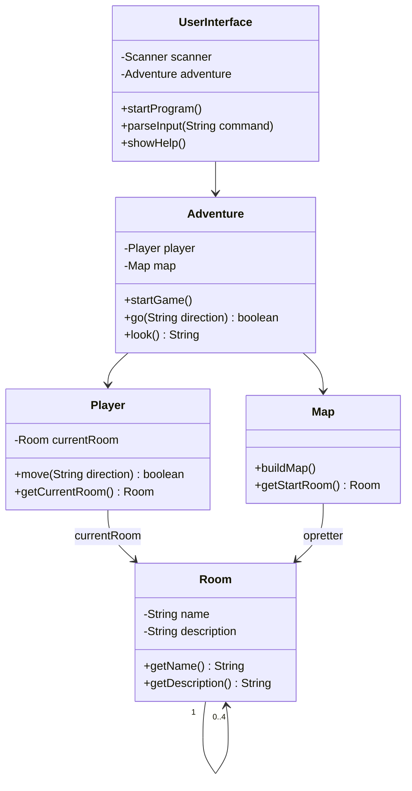

# Adventure del 1 – refactor

> Del af det samlede [Adventure-projekt](readme.md). Laves når [del 1](del-1-rooms.md) virker –
> og **inden** I begynder på [del 2](del-2-items.md).

## Beskrivelse

I har fået koden til Adventure del 1 til at virke. Men før I kan begynde at tænke på del 2, skal
der ryddes op.

Koden skal **refaktoreres** – altså funktionalitet skal flyttes, uden ellers at ændres – og der
skal benyttes nogle gode design-principper, så det bliver nemmere at arbejde med koden fremover.

Det betyder, at der skal laves nogle flere **klasser**: én til brugerfladen (`UserInterface`), én
der er controller (`Adventure`), én der er creator og bygger kortet (`Map`), og én der er spilleren
(`Player`) – og eventuelt endnu flere, hvis Single Responsibility Principle kræver det.

### Hvorfor nu?

Fordi **teknisk gæld** vokser eksponentielt:


Refaktoreret kode holder omkostningen ved en ændring nogenlunde konstant gennem hele projektet.
Urefaktoreret kode gør den til sidst uoverkommelig. Vi har fire faser tilbage i dette projekt, så
det betaler sig med det samme.

## Læringsmål

Når du er færdig med denne del, skal du kunne:

* forklare **Single Responsibility Principle** og anvende det på din egen kode
* genkende og placere rollerne **Controller** og **Creator** (GRASP)
* forklare hvad **coupling** (kobling) er, og hvorfor lav kobling er et mål
* tegne et **klassediagram** over dit eget program
* refaktorere kode uden at ændre dens opførsel

---

## Krav

### Controller (Adventure)

`Adventure`-klassen skal være **controller**, altså den klasse der styrer hele programmets flow,
og som koordinerer samarbejdet mellem objekterne i programmet.

`Adventure` bliver "single point of entry" for `UserInterface` og kommer til at styre spillet.

### Single Responsibility Principle (UserInterface og Adventure)

Der skal være **én klasse til at håndtere al user-interface** – det er den eneste klasse, der må
have metoder til udskrift og indlæsning. Alle andre klassers metoder returnerer data eller
modtager parametre.

`Adventure`-klassen kører selve **spillet** – den håndterer det, der rent faktisk sker i spillet.
Når brugerfladen har fortolket, hvad brugeren har indtastet, så er det `Adventure`, der sørger for
at sende det videre.

### Creator (Map)

Der skal være **én klasse (`Map`)**, der opretter rummene og kæder dem sammen – altså bygger hele
spillets map. Den klasse **kaldes af controlleren, inden spillet går i gang**.

> **Creator-princippet:** Hvem har ansvaret for at skabe et nyt objekt? Normalt vil "container"-klassen
> få tildelt ansvaret for at oprette de "indeholdte" objekter. Men at konfigurere kortet ved opstart
> er en specialopgave, og vi skal passe på med at overbebyrde `Adventure` med for mange forskellige
> typer opgaver. Ifølge problemdomænet er en ny klasse `Map` et oplagt bud.

> Java har selv en `Map` i `java.util`. Det giver ingen problemer, så længe I ikke importerer den –
> hvis IntelliJ foreslår `import java.util.Map;`, så sig nej. Vil I undgå forvekslingen helt, kan
> klassen hedde fx `GameMap` eller `World`.

### Adventure vs Player

`Adventure`-klassen styrer selve spillet, men det bør ikke være dens opgave at holde styr på, hvor
"spilleren" er – det må "spilleren" selv gøre.

Så I skal have en spiller-klasse (`Player`) og hermed et spiller-objekt, der kender spillerens
position på spillepladen (hvilket rum spilleren er i). Det er også det objekt, der bør håndtere at
flytte "sig selv" rundt og tjekke, om en ønsket retning overhovedet er mulig.

> **Information Expert:** `Adventure` kunne godt bede `Player` om at returnere `currentRoom` og selv
> foretage flytningen – men det strider mod Information Expert-princippet, der siger, at ansvaret skal
> ligge hos den klasse, der har data (her: `Player`, som kender `currentRoom`). Det ville også give en
> kæde som `player.getCurrentRoom().getNorth()` i `Adventure` – netop det, Law of Demeter advarer imod:
> tal kun med dine nærmeste, ikke med deres bekendte.

Sådan kan `Player.move()` for eksempel se ud:

```java
public boolean move(String direction) {

    Room desiredRoom = switch (direction) {
        case "north" -> currentRoom.getNorth();
        case "south" -> currentRoom.getSouth();
        case "east"  -> currentRoom.getEast();
        case "west"  -> currentRoom.getWest();
        default -> null;
    };

    if (desiredRoom != null) {
        currentRoom = desiredRoom;
        return true;
    }
    else {
        return false;
    }
}
```

Bemærk at `Player` kun kender de fulde retninger. Hvis jeres brugerflade også accepterer `n`, `e`,
`s`, `w`, er det `UserInterface`, der oversætter `n` til `north`, *før* den sender det videre –
`Player` skal ikke vide, hvordan brugeren har stavet.

### Navngivning

Brug gode, sigende navne til klasserne – ord som `Controller` og `Creator` er alt for generiske.
Brug nogle navne, der relaterer til jeres Adventure-spil, og som mere fortæller den, der læser
koden, **hvad den pågældende klasse gør**, end hvilken software-designmæssig rolle den påtager sig.

### Klassediagram

For at få overblik over jeres nye programdesign skal I lave et **komplet klassediagram**.

> Det skal **tegnes** på computer – tegnes, **IKKE** autogenereret fra IntelliJ.

Sådan så resultatet ud, da forløbet sidst blev kørt (billedet er forenklet – mermaid-udgaven
nedenfor er komplet):


Og som mermaid, hvis I vil have en udgave, I kan rette i:



### Repository

Fortsæt med at kode i **det samme repository**. Sid sammen og lav ændringerne – det er altid en
dårlig idé at dele den slags oprydning op mellem sig!

---

## Om coupling

Et godt design er:

* let at forstå
* let at teste
* let at vedligeholde

Det opnås bl.a. med **lav kobling** (low coupling) og **høj samhørighed** (high cohesion).

En klasse skal være så uafhængig som muligt, og kun associeres med de få klasser, der er
nødvendige for, at den kan opfylde sit ansvarsområde.

**Høj kobling** – svær at forstå og vedligeholde: alle klasser kender alle.


**Lav kobling** – hver klasse kender kun dem, den har brug for.


### Diskutér i gruppen

Hvordan har I anvendt følgende principper i jeres Adventure?

* Single Responsibility
* Creator
* Controller
* Information Expert
* Law of Demeter
* Lav kobling

> Ved at anvende principperne bliver koden også nemmere at afprøve. Husk at prøve det, der *ikke*
> må virke – f.eks. `go north`, hvor der ingen dør er.

---

## Aflevering

**Hvordan:** Refactor-delen afleveres sammen med del 1 i afleveringsopgaven *Adventure del 1* i
itslearning: linket til repositoriet og en **pdf med klassediagrammet**. **Gruppeaflevering:** én i gruppen afleverer i itslearning på hele gruppens vegne. Tjek, at alle i gruppen er med i gruppen i itslearning, før I afleverer.

**Hvornår:** I dag, **fredag 25-09-2026 kl. 23:59** – se
[deadlines i projektoversigten](../../README.md#afleveringer-og-deadlines).

**Feedback:** Der gives ingen feedback på denne del af opgaven.

---

**Læs mere:** [Refactoring: clean your code](https://refactoring.guru/refactoring) (refactoring.guru)

**Næste:** [Del 2 – Items](del-2-items.md)
