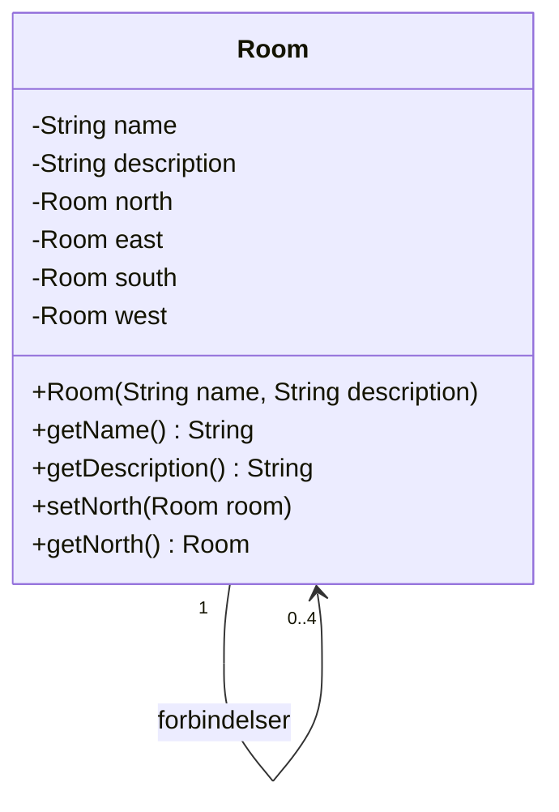

# Adventure del 1 – Rooms

> **Bunden forudsætning.** Del af det samlede [Adventure-projekt](readme.md).

## Beskrivelse

Der skal laves et adventurespil, hvor spilleren kan bevæge sig fra rum til rum ved at skrive
`go north`, `go east`, `go south` eller `go west` i konsollen. Spillet består således af nogle
forbundne rum, alle med op til fire døre. Når en spiller er gået `east` for at gå ind i et rum,
kan hun altid gå `west` for at komme tilbage igen.

Når spilleren er kommet ind i et nyt rum, skal programmet udskrive, hvilket rum man nu befinder
sig i, sammen med en lidt længere beskrivelse af omgivelserne. Det skal **ikke** udskrive, hvilke
retninger man kan bevæge sig i.

Hvis spilleren skriver `go north`, men der ikke er noget rum i den retning – altså ingen dør –
skal programmet skrive `You cannot go that way` og forblive i det samme rum.

## Læringsmål

Når du er færdig med denne del, skal du kunne:

* forklare hvad en **objektreference** er, og hvordan et objekt kan pege på et andet objekt
* bruge `null` til at udtrykke "der er ikke noget objekt her"
* opbygge en datastruktur udelukkende af objekter, der refererer til hinanden
* adskille brugerflade fra spillogik
* fortolke tekstinput fra brugeren og omsætte det til handlinger

---

## Krav

### Spillet

Spillet skal opbygges af **9 rum**, forbundet som vist på [kortet](readme.md#kortet):


Spilleren starter altid i **rum 1**, øverst til venstre.

Bemærk at det er en "slags" labyrint, hvor det midterste rum (rum 5) er lidt sværere at komme
til, og kun har én indgang – så måske er det rum noget særligt!

Rummene behøver ikke være faktiske "rum" i en bygning, men kan være grotter i en mine, eller
områder i en skov, en borg, en rumstation, en fremmed planet – det er helt op til jer. Gør det
spændende for spilleren at udforske jeres rum!

### Brugerfladen

Brugerfladen skal være **på engelsk** – både kommandoer og beskrivelser af rum.

Man skal kunne skrive `go north`, `go east`, `go south` og `go west` for at navigere rundt. Du må
gerne forbedre brugerfladen, så man også kan nøjes med at skrive `north`, `east`, `south`,
`west`, eller måske ligefrem blot `n`, `e`, `s`, `w` – evt. kombineret med `go` – men den fulde
version skal altid være mulig.

Hvis man kan flytte sig i den ønskede retning, udskrives navn og beskrivelse for det nye rum, man
er i. Hvis det ikke er muligt at flytte sig, får man beskeden `You cannot go that way` og
forbliver, hvor man var.

Man skal derudover kunne skrive disse kommandoer:

| Kommando | Betydning |
|---|---|
| `exit` | Afbryd spillet helt, og afslut programmet |
| `help` | Få en instruktion og oversigt over mulige kommandoer |
| `look` | Få gentaget beskrivelsen af det rum, man er i |

Eksempel på en spilsession:

```text
You are in Room 1
A room with no distinct features, except two doors.

> go east
You are in Room 2
Water drips from the ceiling somewhere in the dark.

> go north
You cannot go that way

> look
You are in Room 2
Water drips from the ceiling somewhere in the dark.

> exit
Goodbye!
```

### Koden

Foruden `Main`-klassen med `main`-metoden, der starter det hele, skal du have mindst to klasser:

* **`Adventure`** – som indeholder spillet
* **`Room`** – som er et rum med et *navn*, en *beskrivelse* og *fire forbindelser* til andre rum

Hvis du allerede nu kan overskue at opdele yderligere, så put al brugerflade i en
**`UserInterface`**-klasse, men selve spillet (altså det at flytte sig fra rum til rum) er i
`Adventure`. Hvis du hellere vil putte det hele i `Adventure`, så gør blot det til at starte med,
men vær forberedt på, at det skal splittes op senere.

#### Room

`Room` skal kende til sine naboer mod nord, syd, øst og vest og har derfor fire attributter af
typen `Room` til at håndtere forbindelser til de fire andre rum: `north`, `east`, `south` og
`west`.

**Hvis der ikke er noget rum i den pågældende retning, har attributten værdien `null`.**



(`setEast`/`getEast`, `setSouth`/`getSouth` og `setWest`/`getWest` er udeladt i diagrammet for at
spare plads – de skal selvfølgelig også være der.)

#### Kortet bygges i Adventure

Det er **`Adventure`**-klassen, der skal bygge "kortet" ved at oprette og forbinde de ni
room-objekter. Det gøres ved, at `Adventure`-klassen opretter rum-objekterne og for hvert rum
angiver (setter) rummets naboer mod nord, syd, øst og vest – hvis de har naboer i de enkelte
retninger.

> **Der skal ikke oprettes arrays eller andre datastrukturer med "kortet".**
> Kortet *er* rummene, der peger på hinanden.

Hvert room-objekt har attributten `name` – det er en god idé at bruge samme værdi til denne
attribut som navnet på variablen, du opretter rummet med i `Adventure`-klassen. Det vil gøre det
langt lettere at debugge koden!

```java
Room room1 = new Room("Room 1", "A room with no distinct features, except two doors.");
```

#### Ansvar

Al input/output og kommunikation med brugeren skal foregå via `UserInterface`, hvis du har denne
klasse – ellers i `Adventure`-objektet.

`Adventure`-objektet holder hele tiden styr på, hvilket rum spilleren befinder sig i – f.eks. med
en variabel: `currentRoom`.

---

## Anbefalet procedure

Det er et gruppe/par-projekt, og her i første omgang er det vigtigt at arbejde ekstremt tæt
sammen, så **sid to personer ved én computer og skriv programmet sammen!** Brug evt. *Code With
Me*-funktionen i IntelliJ, hvis hele studiegruppen arbejder sammen.

1. **Start med at lave brugerfladen – helt uden rum.** Bare tag imod input og fortolk det, så
   programmet for eksempel udskriver `going north`, når brugeren har skrevet en af kommandoerne
   for at `go north`, og `looking around`, når brugeren har skrevet `look`, og så fremdeles.

2. **Lav derefter `Room`-klassen**, og opret et enkelt room-objekt i `Adventure`. Lad det være
   `currentRoom`, som spilleren befinder sig i. Udskriv navn og beskrivelse, når spilleren
   skriver `look`.

3. **Opret de otte andre room-objekter**, med navne og beskrivelser, og forbind dem.

   > Husk at når `room1` skal være forbundet til `room2` mod east, så skal `room2` tilsvarende
   > være forbundet til `room1` mod west! Igen: husk at koden til at oprette disse forbindelser
   > skal ligge i `Adventure`-objektet.

4. **Lav koden til at navigere rundt imellem rum.** Tænk på det som at `currentRoom` er der, hvor
   spilleren p.t. befinder sig. Når der bliver skrevet `go north`, så beder spilleren om at blive
   flyttet til det room, der er north for `currentRoom` – og hvis det room findes, så er alt godt,
   og `currentRoom` er nu det nye requested room. Men hvis der ikke var noget room, skal spilleren
   have `You cannot go that way`-beskeden.

---

## Frivillige udvidelser

Skulle nogle af jer blive meget hurtigt færdige med grundelementerne, så opfordres I selvfølgelig
først og fremmest til at **hjælpe og støtte jeres studiekammerater**, både i studiegruppen og
udover!

Men skulle I have lyst til at udvide programmet yderligere, så er her nogle forslag, der
forhåbentlig kan inspirere kode-kreativiteten uden at komme i konflikt med de kommende påkrævede
udvidelser. De er nævnt i tilfældig rækkefølge – udvælg dem, der er mest spændende. Ingen af dem
kræver, at de andre er lavet.

### Automatisk forbindelse frem og tilbage

Når man forbinder ét rum til et andet, bør det automatisk lave forbindelsen den anden vej også –
så `room1.setEast(room2)` bør automatisk, behind the scenes, kalde `room2.setWest(room1)` og vice
versa. **Men pas på at koden ikke kommer ind i en uendelig løkke!**

### Been there, done that

Sørg for, at den lange beskrivelse på et `Room` kun bliver udskrevet, hvis man som spiller ikke
har besøgt det før. Lad rummet huske, om det er blevet besøgt, og skriv så en kort eller lang
beskrivelse ud alt efter resultatet.

### "There are doors to the East and South"

Husk de retninger, spilleren har afprøvet i hvert rum, og hvis alle fire retninger er afprøvet, så
udskriv i hvilke retninger der er åbninger, når brugeren skriver `look`. Men altså kun EFTER de er
afprøvet!

### Locked doors

Tilføj en lås på udvalgte forbindelser – eventuelt kun den ene vej. Så koden f.eks. kan skrive
`room1.lockEast()` eller `room1.unlockEast()` for at tilføje en lås på forbindelsen mod øst.

Hvis brugeren prøver `go east`, får hun beskeden `the door is locked` og kan så skrive `unlock`
(der kræves ingen nøgle i denne udgave) for at låse forbindelsen op. `unlock`-kommandoen må kun
virke umiddelbart efter, at man har fået besked om, at en forbindelse er låst, og kun på den ene
forbindelse! Det er ikke muligt for brugeren at låse forbindelser igen.

### "Darkness, imprisoning me!"

Tilføj en mulighed for, at rum kan være i mørke. Hvis der er mørkt i et rum, gives én
description; hvis der er lyst, gives en anden. Hvis der er mørkt, kan man kun gå tilbage i den
retning, man kom fra – alle andre retninger vil give svar om, at det ikke er muligt at gå i den
retning.

Brugeren kan skrive `turn on light` og `turn off light` for at tænde/slukke lyset i de rum, der
tillader det. Lyset forbliver tændt eller slukket, efter brugeren har forladt rummet.

### The magic word is xyzzy

Tilføj en teleport, så brugeren kan skrive `xyzzy` for at hoppe direkte fra ét rum til et andet.

Første gang man skriver `xyzzy`, hopper brugeren tilbage til `room1`, men husker, hvor man stod,
da man skrev det. Næste gang hopper brugeren til det sted, man stod sidste gang, man skrev
`xyzzy`, og så fremdeles – hver gang man skriver ordet, hopper man til det sted, man stod sidst,
man skrev det.

### Grafik og lyd

I er også velkomne til at gøre lidt ekstra ud af brugerfladen, tilføje farver og symboler, måske
endda noget ANSI Art for virkelig at give den der old-school fornemmelse. I kan også
eksperimentere med at få Java til at spille lyde eller små mp3-sekvenser. Måske endda kædet
sammen med forskellige rum, så hvert rum har sine egne lydeffekter!

> Bare sørg for, at den konkrete kode bliver holdt adskilt fra `Room`-klassen, så den ikke
> indeholder en masse informationer om grafik og lyde for udvalgte rum.

---

## Aflevering

Hele Adventure-projektet er én **bunden forudsætning** – det vil sige, at du **skal** aflevere
alle dele af projektet for at blive indstillet til eksamen.

**Hvordan:** Opret ét GitHub-repository og sørg for, at al source-koden er committed og pushed før
deadline. Aflever linket til repositoriet – ikke til den enkelte fil eller mappe, men til
repositoriet som et hele – i afleveringsopgaven *Adventure del 1* i itslearning.

**Gruppeaflevering:** én i gruppen afleverer i itslearning på hele gruppens vegne. Tjek, at alle i gruppen er med i gruppen i itslearning, før I afleverer.

**Hvornår:** Se [deadlines i projektoversigten](../../README.md#afleveringer-og-deadlines).

**Feedback:** Fredag 25-09, i undervisningen, kigger vi på hinandens løsninger og diskuterer, hvordan
koden kan forbedres og forenkles – derfor skal en fungerende version være pushet, inden I møder op.

---

**Næste:** [Del 1 – refactor](del-1-refactor.md)
