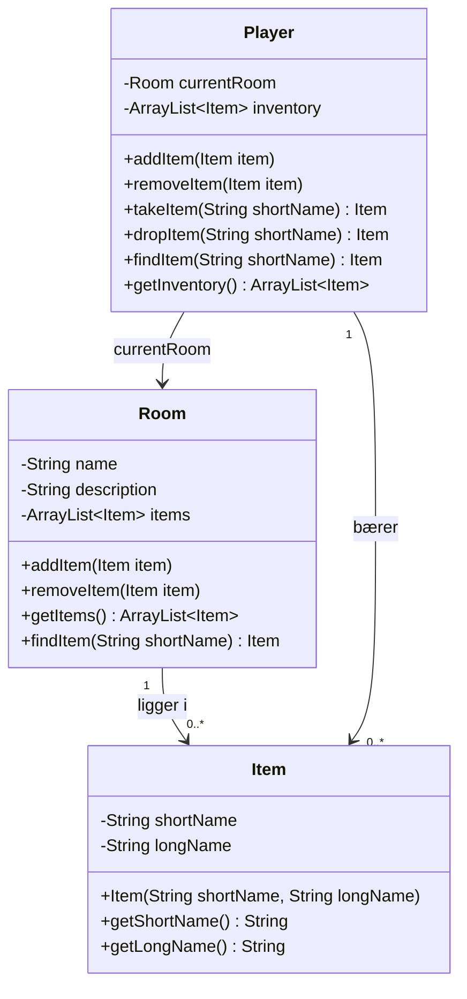

# Adventure del 2 – Items

> **Bunden forudsætning.** Del af det samlede [Adventure-projekt](readme.md).

## Beskrivelse

I skal arbejde videre på adventure-spillet. Hvor version 1 udelukkende var, at spilleren kunne gå
rundt og udforske rummene, skal det nu også være muligt at **samle ting op og efterlade dem igen**.

Start med samme kort som i version 1 – og når I så har fået det til at fungere med, at man kan
samle items op og efterlade dem igen, må I hjertens gerne lave nye og mere interessante rum
forbundet på spændende måder!

## Læringsmål

Når du er færdig med denne del, skal du kunne:

* bruge `ArrayList` til at holde en samling af objekter, der ændrer sig over tid
* tilføje og fjerne objekter fra en liste under kørsel
* skrive en **søgemetode**, der løber en liste igennem og finder et objekt ud fra en egenskab
* returnere `null` som "ikke fundet", og håndtere det hos kalderen
* flytte et objekt fra én samling til en anden

---

## Krav

### Spillet


Hvert rum i spillet skal have mulighed for at have nogle ting liggende i sig, og spilleren skal
kunne samle disse ting op individuelt, bære dem med sig, og eventuelt efterlade nogle af dem i
andre rum.

### Brugerfladen

Spillet skal udvides med tre kommandoer:

| Kommando | Betydning |
|---|---|
| `inventory` | Viser listen af de ting, spilleren p.t. bærer rundt på |
| `take <ting>` | Tager den nævnte ting fra rummet og overfører den til spilleren |
| `drop <ting>` | Tager den nævnte ting ud af spillerens inventory og efterlader den i det aktuelle rum |

Der må også gerne være forkortede udgaver af `inventory`, som for eksempel `inv` eller `invent`.

Hvis man skriver navnet på en ting, som ikke er i rummet eller i inventory, skal programmet skrive:

```text
There is nothing like ... to take around here
```

eller

```text
You don't have anything like ... in your inventory
```

hvor `...` er det navn, brugeren har skrevet.

Derudover skal brugerfladen udvides, så man sammen med beskrivelsen af et rum får **en liste over
de ting, der ligger i rummet**.

Eksempel på en spilsession:

```text
You are in Room 1
A room with no distinct features, except two doors.
Here you see: a shiny brass lamp, some gold coins

> take lamp
You have taken the shiny brass lamp

> inventory
You are carrying: a shiny brass lamp

> go east
You are in Room 2
Water drips from the ceiling somewhere in the dark.

> drop lamp
You have dropped the shiny brass lamp

> take sandwich
There is nothing like sandwich to take around here
```

Eksemplet viser den pæne udgave. I første omgang er det helt fint med én ting pr. linje og
`You have taken a shiny brass lamp` – se udvidelserne nederst.

Beskeder, der bruger tingens lange navn – som `You have taken the ...` her og senere
`You cannot eat the ...` – må gerne komme til at hedde `the a shiny brass lamp`. Det er helt i
orden. Vil I have pænere udskrifter, så se den frivillige udvidelse [Better grammar](#better-grammar).

### Koden

Det er **absolut nødvendigt**, at koden er delt op i flere objekter, som beskrevet i
[del 1 – refactor](del-1-refactor.md). Især er det nødvendigt med et `Player`-objekt, der kender
det aktuelle rum, spilleren befinder sig i.

#### Item

Lav en `Item`-klasse til de ting, der kan samles op. Ting skal have både et **langt** og et
**kort** navn, så en ting for eksempel kan være navngivet `a shiny brass lamp`, men brugeren kan
nøjes med at skrive `take lamp`.

Constructoren tager det korte navn først: `new Item("lamp", "a shiny brass lamp")`.

#### Lister af items

Både `Room` og `Player` skal have en `ArrayList` af `Item`-objekter, og metoder til at tilføje og
fjerne items, samt en metode til at få hele listen af items.

`Player` skal også have metoderne `takeItem` og `dropItem`, der henholdsvis flytter et item fra
det rum, player er i, til player-objektet selv – og omvendt.

`takeItem` og `dropItem` returnerer det `Item`, der blev flyttet – eller `null`, hvis der ikke var
noget med det navn. Så kan brugerfladen skrive tingens lange navn i beskeden.

At `UserInterface` får et `Item` tilbage for at skrive navnet, er en **afhængighed**, ikke en
association: brugerfladen gemmer ikke tingen i en attribut, så der skal ikke være nogen pil fra
`UserInterface` til `Item` i klassediagrammet.

#### findItem

I får også brug for en metode, `findItem`, der kan modtage et kort navn, som for eksempel `lamp`,
og iterere over en liste af `Item`-objekter og finde det objekt, der matcher navnet.

Sådan at brugeren kan indtaste `take lamp`, og programmet tager listen af items i det aktuelle
rum, bladrer igennem for at se, om et af dem passer med navnet `lamp`, og returnerer det
`Item`-objekt – eller `null`, hvis det ikke kunne findes.

Både `Room` (til `take`) og `Player` (til `drop`, søger i inventory) skal have sådan en metode –
løkken er den samme, kun listen er en anden.



---

## Anbefalet procedure

1. **Start med at lave `Item`-klassen**, og tilføj en liste til items til `Room`-klassen. Når I
   opretter og forbinder rummene, så opret også nogle items og læg dem i de forskellige rum.

2. **Udvid brugerfladen**, så den også udskriver listen af items, når den skriver beskrivelsen af
   et rum. Test det med rum, der både har 1, 2, 3 og 0 items i sig.

3. **Skriv koden til `take`-kommandoen**, og tjek at den kan finde det rette `Item`-objekt i
   rummet – når man skriver `take lamp`, så finder den objektet, så det kan fjernes fra
   ArrayListen. Test det ved at remove et objekt fra rummet, når brugeren skriver `take`. Gå ud af
   rummet og tilbage igen, og se at det ikke længere dukker op. Fjern testen igen, før I
   fortsætter.

   > **NB:** Det vil kræve en del arbejde at lave en metode, der kan finde et item-objekt i listen
   > ud fra sit navn – der er ikke en hurtig genvej til det, så tænk i loops, der søger …

4. **Tilføj en liste af items til `Player`-objektet** (altså spillerens inventory), og skriv
   `takeItem`-metoden, så den håndterer at tilføje items til den liste.

5. **Tilføj `inventory`-kommandoen**, så man kan se en liste over items, som player har samlet op.
   Tjek at nye ting, der bliver samlet op, bliver tilføjet – og forbliver i listen, når man går ind
   i et nyt rum.

6. **Gentag alt det foregående med `drop`-kommandoen**, så man nu også kan efterlade items.

7. **Test det** ved at gå ind i rum 1, `take` en ting, gå ind i rum 2, `drop` tingen der, gå
   tilbage til rum 1, se at tingen ikke er der, og gå ind i rum 2 og se, at den er der.

---

## Frivillige udvidelser

Der er ingen krav om udvidelser, men her er nogle forslag, der både kan være sjove og udfordrende,
når I først har fået spillet til at fungere.

> Husk at committe, før I kaster jer ud i en udvidelse. Forskellige personer i en gruppe kan
> sagtens arbejde på forskellige udvidelser samtidig – sørg blot for at koordinere, så I ikke får
> for mange merge-conflicts.

### Flere rum (og items)

Først og fremmest: Udvid spillet med flere rum, lav et mere spændende kort end 3×3 rum. Tag evt.
inspiration fra rigtige labyrinter, eksisterende text-adventures, virkelige lokationer, eller lav
et spil med lidt mere historie!

### Overload addItem, så den også konstruerer et item

Hvis I har en `addItem`-metode på `Room`, der modtager et `Item`-objekt, så overload den med en
metode, der modtager et kort og et langt navn og selv opretter et `Item`-objekt og tilføjer det til
listen – så sparer I en masse ekstra kode i den del, der opretter rooms og items.

### Opret automatisk short-name

`Item` skal have både et langt og et kort navn, for eksempel `a shiny brass lamp` og `lamp`. Lav
koden sådan, at man ofte kan nøjes med at give det lange navn, og `Item`-constructoren så selv
finder ud af, hvad det korte navn skal være.

### Weight and max-carry

Tilføj en vægt eller størrelse på items, og lav en begrænsning på, hvor meget spilleren kan bære –
så hvis man prøver at tilføje mere til sit inventory, bliver man opfordret til først at droppe
noget andet!

Det kunne for eksempel være, at en guldskat bestod af flere tunge ting, som kun én ad gangen kan
bæres tilbage til udgangen – eller det kunne være forskellige tunge våben, der tvinger spilleren
til at vælge et enkelt.

### Pænere udskrifter – kommaseparerede lister

Sandsynligvis viser I lister med ét item pr. linje, eller med komma mellem alle. Lav i stedet en
metode til at tage en liste og returnere en pæn kommasepareret streng, hvor der ikke er komma efter
det allersidste element, og der står `and` mellem de to sidste.

Det kræver en lidt fancy løkke og nogle length-beregninger, for metoden skal selvfølgelig også
virke, når der kun er ét eller to items i listen!

### Better grammar

Hvis I har brugt navne og beskrivelser som `a shiny brass lamp` og `some gold coins`, så vil det
være ret cool, hvis brugerfladen selv kan skifte til `the` – `You have taken the shiny brass lamp`
eller `You have dropped the gold coins` – som i eksemplet ovenfor, altså skifte mellem *indefinite*
og *definite article*.

Så prøv at tilføje ekstra metoder til `Item`, der kan give navnet helt uden article, og med enten
definite eller indefinite – gør den eventuelt så "klog", at den selv kan finde ud af, om det er
`a` eller `an`.

Byg intelligensen ind i `Item`, så brugerfladen blot kan bede om navnet i bestemt, ubestemt, kort,
lang osv. form. Vær kreativ – tænk på at spilleren skal have en god oplevelse, og spil-designeren
skal kunne slippe nemt igennem sit arbejde.

---

## Aflevering

Projektet er et gruppe-projekt for små grupper – 2 eller 3 personer. Alle dele af
Adventure-projektet er del af den samme **bundne forudsætning**, så der **skal** afleveres, for at
man kan indstilles til eksamen.

**Hvordan:** I har allerede et GitHub-repository til koden, så sørg blot for, at den nyeste
version er pushet, og gen-aflevér linket som svar på opgaven i itslearning. **Husk at gøre det
klikbart!**

**Hvornår:** Se [deadlines i projektoversigten](../../README.md#afleveringer-og-deadlines).

**Feedback:** Tirsdag 29-09 – samme dag som deadline – reviewer og refaktorerer vi del 2 i
undervisningen: vi kigger på hinandens løsninger, diskuterer eventuelt hvordan nogle af
udvidelserne kunne laves, og ser på design-principper til at forbedre den eksisterende kode.
Aflever derfor en fungerende version, *før* I begynder at rykke rundt i koden.

---

**Næste:** [Del 3 – Food](del-3-food.md)
