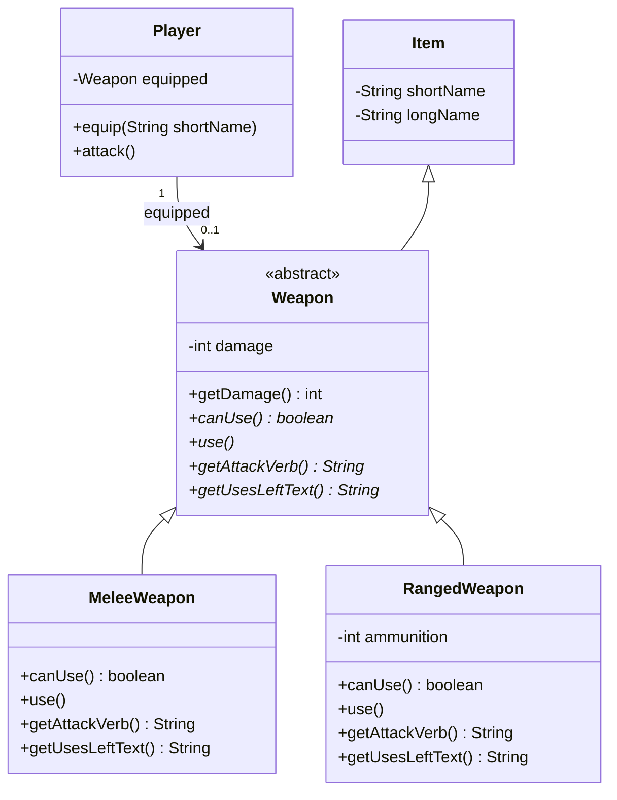

# Adventure del 4 – Weapons

> **Bunden forudsætning.** Del af det samlede [Adventure-projekt](readme.md).
>
> Det er her, **polymorfi** og **abstrakte klasser** kommer i spil for alvor.

## Beskrivelse

I skal arbejde videre på adventure-spillet. Spillet skal nu udvides med flere kommandoer, der giver
spilleren flere handlingsmuligheder, og et bredere udvalg af forskellige typer af våben.

## Læringsmål

Når du er færdig med denne del, skal du kunne:

* forklare hvad **polymorfi** er, og hvorfor det gør koden nemmere at udvide
* skrive en **abstrakt klasse**, der aldrig selv instantieres
* **override** en metode i en subklasse
* skrive kode, der kun kender superklassens type, men opfører sig forskelligt afhængigt af objektet
* forklare **hvorfor `instanceof` er et designproblem** her, og undgå det

---

## Krav

### Spillet

De ting, der ligger i rummene, skal enten blot være "ting", eller de skal være mad der kan spises,
eller **våben der kan bruges i angreb**.

Våben skal både kunne samles op og bæres rundt som alle items, men også **"equippes"** og være
klar til brug.

### Brugerfladen

Spillet skal udvides med to kommandoer:

| Kommando | Betydning |
|---|---|
| `equip <våben>` | Gør det valgte våben fra spillerens inventory til det aktuelle |
| `attack` | Bruger det equippede våben (i denne udgave mod den tomme luft) |

#### equip

Hvis man skriver `equip` efterfulgt af noget, man ikke har i inventory, melder programmet blot, at
man ikke har sådan et våben.

Men hvis man har en ting med det navn, som blot **ikke er et våben**, skal programmet melde, at det
ikke er et våben.

Så **kun** hvis man har tingen, **og** tingen er et våben, kan det rent faktisk equippes.

> Man kan altså **ikke** equippe noget, der ligger i rummet!

> Og hvis man `drop`'er det våben, man har equipped, har man ikke længere noget våben equipped.

#### attack

`attack` er i denne udgave en lidt "amputeret" kommando – da der ikke er nogen fjender endnu, vil
`attack` blot resultere i, at det våben, man har equipped, bliver brugt mod den tomme luft.

* Er det et **slagvåben**, sker der ikke noget med våbenet – men spilleren skal stadig have en
  besked, fx `You swing the rusty sword at the empty air.`
* Er det et **skydevåben**, bliver der affyret et skud – hvis der altså er ammunition i våbenet.
* Prøver man at angribe med et **tømt våben**, skal man have at vide, at det mislykkedes.
* Har man **ikke et våben equipped**, skal man også have at vide, at det mislykkedes.

#### inventory

Derudover skal `inventory`-kommandoen udvides, så den også angiver, hvilket våben man aktuelt har
equipped.

Eksempel:

```text
> inventory
You are carrying: a shiny brass lamp, a rusty sword, an old revolver

> equip lamp
The shiny brass lamp is not a weapon

> equip revolver
You have equipped the old revolver

> inventory
You are carrying: a shiny brass lamp, a rusty sword, an old revolver
Equipped: an old revolver

> attack
You fire the old revolver at the empty air. 5 shots left.
```

### Koden

I har forventeligt allerede implementeret `Food`, og `Weapon` følger meget samme mønster: den skal
**arve fra `Item`**, så våben kan samles op, efterlades og bæres rundt, uden at resten af koden skal
ændres det mindste.

I `Map`, hvor rum og items oprettes, opretter I også de `Weapon`-objekter, der skal ligge rundt
omkring i spillet, og tilføjer dem til rooms, som var de almindelige items.

#### Weapon

`Weapon` skal selv have to arvinger:

| | | |
|:--:|:--:|:--:|
|  |  |  |
| **RangedWeapon**<br/>begrænset ammunition | **RangedWeapon**<br/>tre kast, så er den tom | **MeleeWeapon**<br/>bruges igen og igen |

* **`RangedWeapon`** – har et begrænset antal brug, før det "løber tør" og bliver ubrugeligt. Et
  tomt våben forsvinder ikke – det ligger stadig i inventory, med 0 brug tilbage
* **`MeleeWeapon`** – kan normalt bruges et utal af gange



Ligesom `eat` skriver `equip` og `attack` ikke selv noget ud: de returnerer et udfald – fx en enum
som `EatResult` – og brugerfladen `switch`er på det og skriver beskeden.

#### Kun superklassen må kendes

Disse subklasser må **kun** bruges til at oprette våben i `Map` – alle andre steder må der kun
refereres til superklassen `Weapon`.

Altså: Når `Player` equipper et våben eller bruger det til `attack`, må koden kun tilgå metoder,
der er erklærede i `Weapon`-klassen.

Så hvis `RangedWeapon` skal kunne sige, om der er skud tilbage, er der nødt til at være en metode
i `Weapon` (`canUse()`), som **overrides** i både `MeleeWeapon` (altid `true`) og `RangedWeapon`
(`ammunition > 0`).

Det samme gælder beskeden ved `attack`: et sværd skal *svinges*, og en revolver skal *affyres* –
men brugerfladen må ikke spørge, hvilken slags våben den har fat i. Lad i stedet våbenet selv
levere teksten: `Weapon` får en abstrakt metode `getAttackVerb()`, som `MeleeWeapon` implementerer
med `return "swing";` og `RangedWeapon` med `return "fire";`.

Vil I vise antal skud tilbage (som i eksemplet), så gør det på samme måde med `getUsesLeftText()`:
`RangedWeapon` returnerer fx `"5 shots left."` ud fra sin `ammunition`, og `MeleeWeapon` returnerer
en tom streng `""`. Så kan brugerfladen skrive beskeden for alle slags våben på én gang:

```java
System.out.println("You " + weapon.getAttackVerb() + " " + weapon.getLongName()
        + " at the empty air. " + weapon.getUsesLeftText());
```

Og kommer der senere en tryllestav, skriver den bare sin egen tekst – brugerfladen skal ikke ændres.

> **Så altså: der må IKKE være noget kode, der tjekker typen af et weapon-objekt**, som f.eks.:
>
> ```java
> if (weapon instanceof RangedWeapon) { ... }   // ← NEJ
> ```
>
> Det er kun i `Map`, at der hentydes til de forskellige subklasser af `Weapon`.
>
> `instanceof Weapon` i `equip` er derimod i orden – det er samme princip som `instanceof Food` i
> `eat`: man spørger, om tingen overhovedet **er** et våben. Det forbudte er at tjekke, hvilken
> **slags** våben det er.

#### Weapon er abstrakt

`Weapon` selv skal til gengæld **aldrig instantieres**. Der må ikke stå `new Weapon()` et eneste
sted i koden – kun subklasserne kan oprettes som objekter.

---

## Anbefalet procedure

Efter hvert trin skal I selvfølgelig teste, at spillet stadig virker som forventet.

1. **Opret de tre `Weapon`-klasser**, og tilføj forskellige våben i rummene, som spilleren kan
   samle op, som var de helt almindelige items.

2. **Tilføj `equip`-kommandoen** – brug samme princip som ved `eat`.

3. **Lav `attack`-kommandoen** uden at tage en parameter, men så spilleren blot attacker det tomme
   rum og for eksempel affyrer et skud (hvis det er et `RangedWeapon`).

   Forvent i første omgang at spilleren ikke attack'er uden at have equipped et weapon, og ikke
   affyrer det flere gange, end der er ammunition til.

4. **Håndter hvad der skal ske i `attack`**, hvis player ikke har equipped et weapon.

5. **Håndter hvad der skal ske i `attack`**, når våbenet er løbet tør for ammunition.

---

## Aflevering

Denne del afleveres som de foregående: push til samme GitHub-repository, og gen-aflevér linket i
itslearning inden deadline. Det er ikke den endelige aflevering, men den er en del af den bundne
forudsætning – så aflevér, selv om I ikke er helt færdige.

**Hvordan:** Indsæt et link til jeres GitHub-repository.

**Hvornår:** Inden del 5 starter – se
[deadlines i projektoversigten](../../README.md#afleveringer-og-deadlines).

**Feedback:** Der er ikke planlagt nogen feedback på denne del – vi går direkte over i del 5!

---

## Øvelse til polymorfi

Til undervisningen hører denne øvelse, som træner polymorfi isoleret fra Adventure-projektet:

* **Polymorfi-øvelsen** – klasserne `Shape`, `Circle`, `Rectangle` og `Geometry`.
  Klon [Dat24v2_PolymorfiExercise](https://github.com/ETALATE/Dat24v2_PolymorfiExercise). Det meste
  af koden er fyldt ud i `Shape`, `Circle` og `Rectangle`, men `Geometry`-klassen, som holder på
  `main()`, er ufuldstændig – det er der, du kommer til at skrive mest.

---

**Næste:** [Del 5 – Enemies](del-5-enemies.md)
