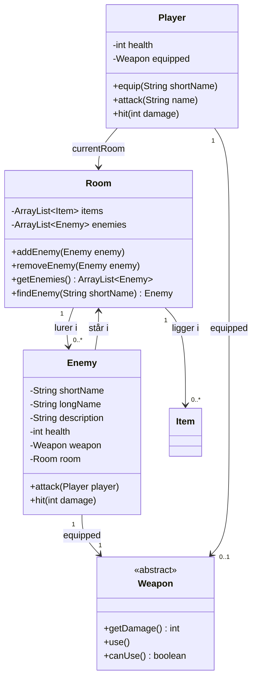

# Adventure del 5 – Enemies

> **Bunden forudsætning – og den endelige aflevering.**
> Del af det samlede [Adventure-projekt](readme.md).
>
> **Gruppeaflevering:** én i gruppen afleverer på hele gruppens vegne.

## Beskrivelse

I skal arbejde på afslutningen af adventure-spillet. Spilleren kan bevæge sig rundt, samle ting op
og efterlade dem igen; nogle ting er mad, der kan spises, og andre er våben, der (indtil videre)
kan bruges til at angribe den tomme luft.

Nu skal I udvide spillet, så der også er **fjender**, som man kan angribe med våbnene! Og som kan
angribe tilbage, så man mister health og må spise noget.

## Læringsmål

Når du er færdig med denne del, skal du kunne:

* designe et samspil mellem flere objekter, hvor hvert objekt har sit eget ansvar
* **tegne et aktivitetsdiagram** før du koder, og bruge det som designværktøj
* tegne et **klassediagram** med arveforhold, associationer og multiplicitet
* håndtere en handling med mange forskellige udfald uden at koden bliver uoverskuelig
* dokumentere et færdigt program

---

## Krav

### Dokumentation

Som noget nyt (i forhold til de tidligere dele) skal der også afleveres **dokumentation** til denne
afsluttende version. Dokumentationen skal indeholde:

* Et **klassediagram** over alle klasser i spillet, deres arveforhold og associationer
  (inkl. multiplicitet)
* Et **aktivitetsdiagram** over attack-sekvensen

Se afsnittet [Anbefalet procedure](#anbefalet-procedure) for, hvordan denne dokumentation kan skabes.

### Spillet


Der skal også være **fjender** i rummene. Fjenderne er ikke ting, der kan samles op og bæres med,
men de er heller ikke så levende, at de kan flytte sig fra rum til rum – de kan blot angribe eller
angribes.

Spilleren skal have en form for health, som kan øges ved at spise (sund) mad, og mindskes ved at
blive angrebet af fjender.

### Brugerfladen

Spillet skal ikke udvides med flere kommandoer, men `attack` skal ændres:

| Kommando | Betydning |
|---|---|
| `attack [fjende]` | Det aktuelle våben bliver brugt til et angreb på den nævnte fjende – eller, hvis der ikke angives et navn, på den første fjende i rummet |

`attack` er nu mere kompliceret end nogen anden kommando:

* Hvis der **ikke angives et navn**, angribes den første fjende i rummets liste (I kan selv vælge
  en anden regel – bare den er entydig).
* Hvis der **ikke er nogen fjender** i rummet, angribes den tomme luft.
* Hvis der angives et navn, som **ikke passer på en fjende i rummet**, skal spilleren have det at
  vide (som ved `take`) – der bliver ikke angrebet, og der bruges ikke et skud.
* Skydevåben har et begrænset antal skud i sig. Prøver man at angribe med et **tømt våben**, skal
  man have at vide, at det mislykkes.
* Har man **ikke et våben equipped**, skal man også få at vide, at det mislykkes.

I hvilken rækkefølge I tjekker tingene, er jeres eget designvalg – men et forkert navn må aldrig
koste et skud.

### Attack-sekvensen

Attack af fjender er endnu mere kompliceret – så her følger en detaljeret gennemgang af, hvad der
skal foregå:

1. **Først angribes fjenden** med det våben, som spilleren har equippet. Fjenden mister health
   svarende til den damage, våbenet giver – og våbenet bruges (et skud mindre).

2. **Hvis fjenden derved mister al sin health**, dør den og drop'er sit våben (som spilleren
   efterfølgende kan samle op), og forsvinder selv fra rummet – måske efterlader den et lig i form
   af et item, som spilleren også kan samle op. Så er sekvensen slut.

3. **Overlever fjenden, angriber den spilleren** – det sker med det samme, og spilleren kan ikke nå
   at flygte ud af rummet, selv ikke hvis der er angrebet med et langdistancevåben. Fjenden er også
   udstyret med et våben, og spilleren mister health svarende til den damage, dét våben giver.
   Fjendens våben bruges ligesom spillerens: et skydevåben koster et skud pr. modangreb, og er det
   tomt, angriber fjenden ikke – spilleren mister ingen health, men får at vide, at fjenden ikke
   kunne slå igen.

4. **Forudsat at spilleren stadig er i live**, er attack-sekvensen ovre – og spilleren kan vælge at
   gå ud af rummet, skifte våben, eller attack'e igen. Fjender angriber ikke uprovokeret (i hvert
   fald ikke i grundversionen).

5. **Hvis spilleren mister al sin health**, er spillet slut: spilleren får det at vide, og
   programmet afsluttes (som ved `exit`). Det gælder også, hvis man spiser sig ihjel i giftig mad.

> Dette er den **grundlæggende** attack-sekvens – I er velkomne til at gøre den mere avanceret :)


Fjender behøver ikke være trolde. De kan være vagtrobotter, sultne planter, en gnaven bibliotekar
eller noget helt fjerde – det afhænger af, hvilken verden I har bygget.

### Fjender i rumbeskrivelsen

Derudover skal brugerfladen udvides, så man sammen med beskrivelsen af et rum får en liste over
eventuelle fjender. Og når man træder ind i et nyt rum, skal man som minimum have at vide, **om**
der er fjender i rummet. Skriver man `look`, skal fjendernes **beskrivelse** også vises.

Eksempel:

```text
> go north
You are in Room 5
A small chamber, lit by something you cannot see.
Here you see: a golden crown
Beware! Here lurks: a cave troll
A huge, grey troll guards the chamber, gripping a heavy wooden club.

> attack troll
You hit the cave troll with the rusty sword for 12 damage.
The cave troll swings its club at you for 20 damage.

> health
health: 80 - you are in good health, but avoid fighting right now

> attack
You hit the cave troll with the rusty sword for 12 damage.
The cave troll dies, dropping its club.
```

> `troll` er det korte navn, `a cave troll` det lange – nøjagtig som `lamp` / `a shiny brass lamp`.

### Koden

**`Enemy` skal være en klasse helt for sig selv, og altså IKKE arve fra `Item`.**

`Room` skal have en **særskilt liste** til enemies, med sine egne add- og get-metoder.

#### Enemy

Enemy-objekter er ikke Items, men deres helt egne!

* En enemy skal have et **kort og et langt navn** (som `Item`), en **beskrivelse**, et
  **health-niveau** og et **enkelt weapon**.
* Til forskel fra player har en enemy altid sit eneste våben equipped, og kan ikke skifte mellem
  våben.
* En enemys våben er et almindeligt `Weapon`-objekt, som kan overtages af playeren, når enemyen er
  død, så det skal kunne droppes i rummet.
* `Enemy` **skal**, ligesom `Player`, have `attack`- og `hit`-metoder – for henholdsvis at angribe
  (`attack`) player med sit våben, og blive angrebet (`hit`) af players våben.
* `Enemy` skal **selv** opdage, om den er død, droppe sit weapon, og forsvinde fra rummets liste
  over enemies, samt eventuelt efterlade et item (sit lig).
* For at kunne gøre det, skal `Enemy` kende det rum, den står i – giv den en `Room`-attribut, der
  sættes i constructoren (ligesom `Player` har `currentRoom`).

> **Pas på to fælder:**
>
> * Finder I fjenden med en for-each-løkke over rummets liste af enemies og kalder `hit` inde i
>   løkken, så **stop løkken** (`return` eller `break`), så snart fjenden er ramt. En fjende, der dør,
>   fjerner sig selv fra netop den liste – og ændres listen, mens løkken stadig kører, crasher
>   programmet med en `ConcurrentModificationException`.
> * `Map` skal **både** give fjenden dens rum i constructoren **og** tilføje den til rummets liste
>   med `addEnemy`. Glemmer I det ene, forsvinder den døde fjende ikke fra rummet.



> **Bemærk:** Diagrammet viser ikke returtyper. Da al udskrift skal ske i `UserInterface`, skal
> `attack` og `hit` returnere noget, som fortæller, hvad der skete – fx en `enum` med udfaldene
> (`NO_WEAPON`, `WEAPON_EMPTY`, `NO_ENEMY`, `ENEMY_HIT`, `ENEMY_DIED`, …) eller en `int` med den
> damage, der blev givet. Det er en del af designet, I skal tage stilling til i aktivitetsdiagrammet.

---

## Anbefalet procedure

1. **Tjek, at `attack` fra [del 4](del-4-weapons.md) virker** – uden fjender, med og uden equipped
   våben, og med et tomt skydevåben. Det er udgangspunktet for resten.

2. **Tegn et aktivitetsdiagram** for, hvad der skal ske i attack-sekvensen.

   Tænk på, hvordan og hvornår der skal tjekkes, om player overhovedet har et våben equipped, om
   våbenet kan bruges, altså har skud tilbage (husk: **ingen test på om det er et `RangedWeapon`** –
   `Weapon`-objektet skal blot selv fortælle, om det stadig kan bruges).

   Tænk også på, hvilke beskeder der skal gives tilbage til spilleren:
   * om der overhovedet er et våben
   * om våbenet stadig er brugbart
   * om det var det sidste skud, der blev brugt
   * om man ramte en fjende eller det tomme rum
   * hvordan fjenden reagerer
   * hvad der sker, hvis fjenden dør
   * hvad der sker, hvis man selv bliver ramt
   * etc. etc.

   > **Der er meget at tage hensyn til – så tegn og diskutér FØR I koder!**
   > Aktivitetsdiagrammet må gerne tegnes på papir.

3. **Kod attack-sekvensen.**

---

## Frivillige forbedringer og udvidelser

Det er svært at tro, at der bliver tid til udvidelser, men skulle I få attack-sekvensen til at
fungere og sidde med god tid til overs, så er her nogle forslag. Rækkefølgen er vilkårlig, og ingen
af dem er afhængige af hinanden, så vælg frit imellem dem. Det er alt sammen blot ideer – vi har
ikke færdige løsninger til nogen af dem.

### NPC'er

Fjender kunne i princippet være ligesom `Player`, med mulighed for at gå rundt i de forskellige rum
– så lav f.eks. en `Character`-klasse, og lad både `Player` og `Enemy` nedarve fra den. `Enemy` er
så en *Non-Playable Character*, som kan meget af det samme: `equip`, `attack`, `hit`, `drop` etc.
kan være præcis de samme metoder som hos `Player`.

`Enemy` kan få en `go()`-metode, der selv vælger en tilfældig retning at gå i, og så skifte
`currentRoom` fuldstændig ligesom player. Den `go()`-metode kan være mere eller mindre intelligent,
og enten gå i en helt tilfældig retning, eller spørge `currentRoom` om hvilke retninger der er
mulige, og gå i en af dem – eller måske vælge at blive stående.

> Enemies kan dog kun bevæge sig, hvis spillet bliver turnbased!

### Turnbased

I stedet for at attack kun er én omgang, kunne spillet være mere tur-baseret, så hver gang player
enten har `go`, `attack`, `take` eller `eat` (evt. også andre kommandoer), kalder I en metode, der
registrerer, at der nu er gået en tur.

Det er vigtigt, at I ikke blot lader alle kommandoer resultere i, at der er gået en tur, men
specifikt kalder metoden – medmindre selvfølgelig at brugeren skal misse en tur, hvis hun staver
forkert.

Den metode skal derefter kalde en metode på alle fjender – eventuelt kun på fjenderne i samme rum
som player.

Hver fjende kan evt. holde styr på, om den er i attack- eller walk-mode, og så vælge enten at
`go()` som beskrevet ovenfor, eller attack'e player (eller det tomme rum, hvis playeren er væk).

Når player attack'er en enemy, går den automatisk i attack-mode, og bliver så ved med at angribe
hver tur, i stedet for kun at angribe hver gang player attack'er.

### Bedre bevidsthed om "andre" i rummet

Som det er beskrevet hidtil, er det kun player, der kan se enemies og begynde et attack – men I
kunne tilføje to metoder til room, fx `enterRoom` og `leaveRoom`, som så fortæller, hvilken
character (player eller enemy) der er gået ind i eller ud af rummet.

Det kan så bruges til, at fjender også kan se player, og måske begynde at angribe først.

### Flere typer fjender

Fjender er som udgangspunkt passive, men der kunne være forskellige typer: nogle venter på at
player angriber, nogle angriber selv, nogle besvarer kun et angreb, nogle angriber igen og igen,
nogle flygter, andre jagter player.

Lav en underklasse til hver type, og modificer `attack`- og `go`-metoderne efter behov.

### Loot

Hvis fjender og player arver fra den samme `Character`-klasse, så betyder det, at fjender kan bære
rundt på ting, som de så efterlader, når de dør – altså de kan droppe noget loot!

### Thief

En særlig fjende kunne være en tyv, der bevæger sig ekstra hurtigt (den kan kalde sin `go`-metode
flere gange for hver tur), og hvis den er i samme rum som player, kan den stjæle et item eller to
fra player og stikke af med det.

> Det kræver, at rummet er bevidst om, at player er i det, så tyven kan se player, og ikke kun
> omvendt!

---

## Aflevering

**Del 5 – den endelige aflevering – er en gruppeaflevering** i itslearning: én i gruppen afleverer
på hele gruppens vegne. Tjek, at alle i gruppen er med i gruppen i itslearning, før I afleverer.

> Alle i gruppen skal kunne stå inde for og forklare både koden og diagrammerne.

### Hvad

Der skal afleveres en **pdf** med følgende:

* **Forside**, der indeholder:
  * Navnet på spillet
  * Et fængende cover-billede til spillets æske
  * Link til GitHub-repository til koden – sørg for at linket både er klikbart og udskrevet, så det
    kan printes ud og tastes ind. (Det GitHub-repository må gerne være det, som I har arbejdet
    løbende med.)
  * Navne på samtlige gruppemedlemmer og deres GitHub-brugernavn
* **Klassediagram** over alle klasser, associationer (inkl. multiplicitet) og arveforhold
* **Aktivitetsdiagram** over attack-sekvensen

> Klassediagrammet **skal** være det gældende klassediagram for det færdige produkt.
> Aktivitetsdiagrammet er et designdokument og behøver ikke nødvendigvis afspejle eventuelle
> ændringer i koden.

UML-diagrammerne kan ligge i GitHub-repoet (i en `docs`-mappe).

### Hvordan

Upload pdf'en som besvarelse på opgaven i itslearning, og indsæt desuden linket til jeres
GitHub-repository som klikbar tekst i besvarelsen – som ved de tidligere dele.

### Hvornår

Se [deadlines i projektoversigten](../../README.md#afleveringer-og-deadlines).

### Feedback

**Studenterpræsentationer** af kode og diagrammer – datoen står i
[projektoversigten på forsiden](../../README.md#afleveringer-og-deadlines).

Hver gruppe skal give en kort demo af deres applikation og præsentere udvalgte dele af deres
Adventure-projekt for resten af holdet.

Hver gruppe har **10 minutter** til at:

* køre programmet (vis f.eks. en sjov feature) – brug maks. 2 minutter
* præsentere kode, f.eks. som I er særligt stolte over
* tage spørgsmål fra resten af holdet (maks. 4 minutter)

Lidt inspiration til, hvad I kan præsentere:

* Demo af programmet og evt. interessante features
* Gennemgå udvalgte kodedele, som løser et specifikt problem, f.eks. `eat`- eller `attack`-kommandoen
* Gennemgå særlige elementer, som er brugt i jeres løsning, f.eks. arv, polymorfi eller enum
* Beskrivelse af programmets overordnede design, f.eks. ansvarsfordelingen mellem klasserne
* Andet?

---

## Hjælp til aktivitetsdiagrammer

Et aktivitetsdiagram har disse elementer:

| Element | Form | Bemærk |
|---|---|---|
| Start / Initial | Udfyldt cirkel | |
| End / Final | Cirkel med ring om | |
| Action | Rektangel med **runde hjørner** | Skarpe hjørner betyder "objekt"! |
| Decision | Diamant | Betingelser skrives i `[kantede parenteser]` |
| Signal | "Flag" | Brugerinteraktioner |
| Timer | "Timeglas" | Fx "vent 2 minutter" |

Regler, der er værd at holde fast i:

* Sørg for at alle decisions kun har **to udfald**.
* Undlad at krydse linjerne – altså at resultatet af én decision både optræder i A- og B-forgreningen.
  (Tænk på at hvis det var if-sætninger, så kan du ikke få den samme kode til både at køre i en
  `else` og længere inde i en anden `if`-sætning.)
* Tegn diagrammet, så du har **færrest mulige gentagelser af actions** – hvis der er én "går
  udenfor"-action, så kan den måske bruges efter flere forskellige beslutninger?

**Læs mere:** [What is an Activity Diagram?](https://www.visual-paradigm.com/guide/uml-unified-modeling-language/what-is-activity-diagram/)
(Visual Paradigm)

### Øvelse

Er aktivitetsdiagrammer rustne, så tag
[katte-øvelsen fra 14-09](../../38/01_man_2026-09-14/opgaver.md) igen, før I tegner
attack-sekvensen – og sammenlign med jeres gamle tegning.

---

**Tilbage til:** [Adventure-projektet](readme.md)
