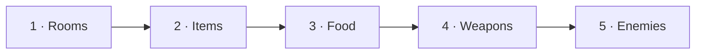
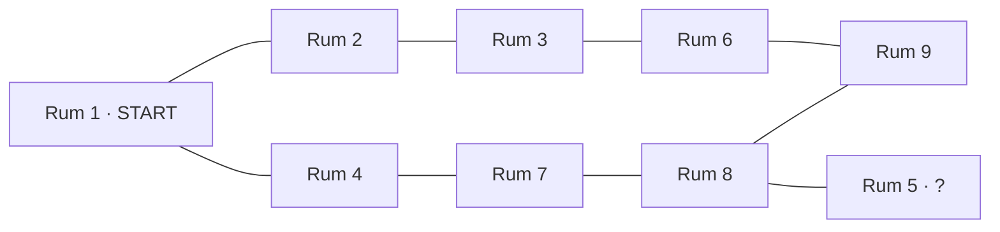

# Projekt: Adventure

> Et OOP-projekt i fem afsnit

## Let's code like it is 1977 …

Vi har kun en tekst-terminal. Uden farver, grafik, mus og musik forekommer det nærmest umuligt
at kode noget, der bare er minimalt underholdende.

Men i midten af 1970'erne lykkedes det alligevel Will Crowther at skabe et spil, der både
underholdt, inspirerede, og introducerede en masse mennesker til computerens fascinerende verden.

Spillet hed **Colossal Cave Adventure** og udkom fra 1977 og de næste mange år på stort set
samtlige platforme. Det var opbygget som en interaktiv historie – meget lig det man ville opleve
som deltager i en omgang Dungeons & Dragons, men med computeren som game master.


Læg mærke til, hvad der står på skærmen:

```text
There are some keys on the ground here.
There is a shiny brass lamp nearby.
There is food here.
There is a bottle of water here.
```

Nøgler, en lampe, mad, vand. Det er præcis de ting, I selv skal bygge – i
[del 2](del-2-items.md) og [del 3](del-3-food.md).


> Det oprindelige Adventure er et **stort** kort. Hvis du vil se hvor stort, så kig på
> [Mari Michaelis' kort over Colossal Cave Adventure](https://web.archive.org/web/2019/http://www.spitenet.com/cave/)
> (via Internet Archive – originalsiden findes ikke længere). Vi starter noget mere begrænset.
>
> Vil du prøve det oprindelige spil, ligger der versioner til download og online på
> [The Colossal Cave Adventure Page](https://rickadams.org/adventure/), og historien er beskrevet på
> [Wikipedia](https://en.wikipedia.org/wiki/Colossal_Cave_Adventure).

---

## De fem faser

Vi udvikler vores egen udgave i fem faser. Hver fase bygger oven på den forrige, i det samme
GitHub-repository.

| Fase | Emne | Beskrivelse | Det lærer du |
|---|---|---|---|
| **1** | [Rooms](del-1-rooms.md) | Navigation mellem virtuelle rum | Objekt-referencer |
| **1½** | [Refactor](del-1-refactor.md) | Oprydning før del 2 | SOLID, GRASP, klassediagram |
| **2** | [Items](del-2-items.md) | Ting man kan samle op og efterlade | `ArrayList`, søgning i lister |
| **3** | [Food](del-3-food.md) | Mad man kan spise, og health | Arv |
| **4** | [Weapons](del-4-weapons.md) | Våben man kan equippe og angribe med | Polymorfi, abstrakte klasser |
| **5** | [Enemies](del-5-enemies.md) | Fjender der slår igen | Samspil mellem objekter, dokumentation |



### Fase 1 – Rooms

Vi bygger det allermest grundlæggende i spillet – navigationen, hvor spilleren kan bevæge sig
rundt mellem virtuelle "rum". Hver gang man går `north`, `east`, `south` eller `west`, bevæger
man sig ind i et nyt rum.

En stor del af spillet er dets *map* over disse rum og deres forbindelser, og det er oplagt at se
hvert rum som et **objekt**, og forbindelserne som **objektreferencer**.

### Fase 2 – Items


Der skal ligge nogle ting rundt omkring i spillet, som man kan samle op og bære med sig – og
efterlade i andre rum. Det er endnu mere oplagt at se disse ting som objekter, og have lister,
hvor der dynamisk kan tilføjes og fjernes objekter.

*a shiny brass lamp*, *some gold coins*, *a rusty key* – det er helt op til jer, hvad der ligger
og flyder i jeres verden.

### Fase 3 – Food


Nogle af de ting, der ligger rundt omkring i rummene, skal have særlige egenskaber – der skal
være forskellige slags mad, som spilleren kan spise og få energi fra. Måske også mad, der kan
være giftig at spise!

Det kræver, at vi kan oprette Item-objekter med ekstra egenskaber, så vi skal lære om **arv**,
før vi kan komme dertil.

### Fase 4 – Weapons


Udover mad der kan spises, skal der også være forskellige slags våben, som spilleren kan samle
op. Nogle våben kan virke på afstand, nogle har begrænset antal "skud", andre virker kun tæt på,
men ubegrænset.

Det kræver, at vi har en **abstrakt** type "våben", som vi kan oprette specifikke undertyper af.

### Fase 5 – Enemies


Ting er jo ikke bare ting, og spilleren er ikke alene i verden. I femte fase tilføjer vi
forskellige typer fjender til spillet. Heldigvis har vi våben og health, så spilleren har en
chance for at overleve. Men det bestemmer kampsystemet!

---

## Kortet

Spillet skal opbygges af **9 rum**, forbundet som vist her:


Spilleren starter altid i **rum 1**, øverst til venstre.

Rummene ligger i et 3×3-gitter:

```text
     1 --- 2 --- 3
     |           |
     4     5     6
     |     |     |
     7 --- 8 --- 9
```

Alle ni døre, hver virker begge veje:

| Fra | Dør | Til |
|---|---|---|
| Rum 1 | east / west | Rum 2 |
| Rum 2 | east / west | Rum 3 |
| Rum 1 | south / north | Rum 4 |
| Rum 3 | south / north | Rum 6 |
| Rum 4 | south / north | Rum 7 |
| Rum 5 | south / north | Rum 8 |
| Rum 6 | south / north | Rum 9 |
| Rum 7 | east / west | Rum 8 |
| Rum 8 | east / west | Rum 9 |

Det samme som graf – hver kant er en dør:



Bemærk at det er en "slags" labyrint, hvor det midterste rum (**rum 5**) er lidt sværere at komme
til, og kun har **én indgang** – så måske er det rum noget særligt!


*Labyrinter er ikke en ny idé. Det her gulv lå i "Labyrintens hus" i Pompeji og er næsten
2000 år gammelt. I midten kæmper Theseus mod Minotauros — det oprindelige monster i det
oprindelige rum 5.*

Rummene behøver ikke være faktiske "rum" i en bygning, men kan være grotter i en mine, områder i
en skov, en borg, en rumstation, en fremmed planet – det er helt op til jer. **Gør det spændende
for spilleren at udforske jeres rum!**

Senere må I gerne udvide jeres kort med flere rum og mere spændende forbindelser.

---

## Praktiske oplysninger

### Obligatorisk opgave

Adventure-projektet er en **bunden forudsætning** – alle fem faser – så det **skal** afleveres.

Hvis det ikke afleveres, bliver man ikke indstillet til eksamen. Som med alt andet
eksamensrelateret har man selvfølgelig flere forsøg, skulle man for eksempel blive syg.

### Gruppeopgave

Opgaven laves i **små grupper på 2-3 personer**, svarende til en halv studiegruppe.

Der er ikke mange muligheder for at dele arbejdet op imellem sig, så alle i gruppen skal arbejde
tæt sammen om hele løsningen.

> Alle afleveringer – også [del 5](del-5-enemies.md), den endelige aflevering – er
> **gruppeafleveringer** i itslearning: én i gruppen afleverer på hele gruppens vegne. Alle i gruppen
> skal kunne stå inde for og forklare både koden og diagrammerne.

### GitHub

Opgaven afleveres på GitHub.

* Hver fase er blot **mere kode** (flere commits) på det **samme repository**.
* I alle faser er det meget væsentligt, at flere personer kan pushe til det samme repository.
* Vi snakker først om **branches** EFTER det her projekt er overstået.

### Brugerfladen er på engelsk

Både kommandoer og beskrivelser af rum skal være på engelsk.

---

## Kommandoer – samlet oversigt

Kommandoerne kommer løbende gennem de fem faser:

| Kommando | Fra del | Betydning |
|---|---|---|
| `go north` / `go east` / `go south` / `go west` | 1 | Bevæg dig i den retning |
| `look` | 1 | Gentag beskrivelsen af det rum, du er i |
| `help` | 1 | Instruktion og oversigt over mulige kommandoer |
| `exit` | 1 | Afbryd spillet og afslut programmet |
| `take <ting>` | 2 | Tag en ting fra rummet |
| `drop <ting>` | 2 | Efterlad en ting i rummet |
| `inventory` | 2 | Vis hvad du bærer rundt på |
| `eat <mad>` | 3 | Spis noget mad, og få health |
| `health` | 3 | Vis din aktuelle health |
| `equip <våben>` | 4 | Gør et våben fra dit inventory til det aktuelle |
| `attack [fjende]` | 4/5 | Angrib med det equippede våben |

Du må gerne forbedre brugerfladen, så man også kan nøjes med at skrive `north`, `east`, `south`,
`west`, eller måske ligefrem blot `n`, `e`, `s`, `w` – evt. kombineret med `go`. **Men den fulde
version skal altid være mulig.**

---

## Afleveringer og deadlines

Datoerne for alle fem dele står samlet i
[projektoversigten på forsiden](../../README.md#afleveringer-og-deadlines), sammen med semestrets
øvrige projekter.

Afleveringen sker i itslearning. Hver del har sin egen afleveringsopgave i itslearning, og det er
**gruppeafleveringer**: én i gruppen afleverer **linket til jeres GitHub-repository** på hele gruppens
vegne – til repositoriet som et hele, ikke til den enkelte fil eller mappe. Husk at gøre linket
klikbart, og tjek, at alle i gruppen er med i gruppen i itslearning.

Sammen med del 1 uploades desuden en **pdf med klassediagrammet** fra [del 1 – refactor](del-1-refactor.md),
og til [del 5](del-5-enemies.md) en **pdf med dokumentation**.

Fredag 09-10 laver grupperne **kode-review** af hinandens projekter efter
[review-skemaet](kode-review.md).

---

## Er I klar til et Adventure?

Gå blot i gang med [del 1 – Rooms](del-1-rooms.md).
