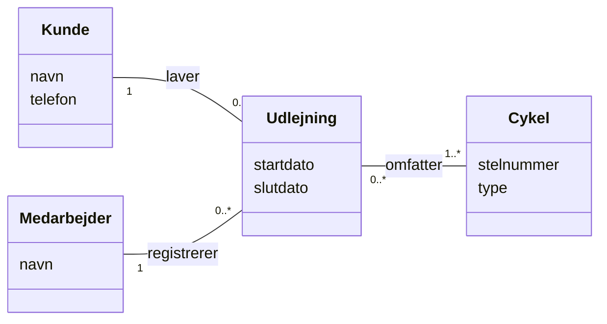

# Kom i gang med Delfinen

> De første to dage, mandag 16-11 og tirsdag 17-11. Del af [Delfinen-projektet](readme.md).

Onsdag 18-11 er der sprint planning og det første check-in med underviseren. Inden da skal fire
ting være på plads: **gruppen**, **repoet**, **domænemodellen** og **backloggen**. Den her side
tager dem i rækkefølge.

> **Ingen kode endnu.** Det er fristende at åbne IntelliJ og begynde på `Member`. Lad være. De to
> første dage handler om at forstå klubben og blive enige om, hvad I bygger. Det sparer jer for
> meget omskrivning senere.

---

## Mandag 16-11

### 1. Gruppen: Team Canvas

I skal arbejde tæt sammen i fire uger. Gør jer klart fra start, hvad I forventer af hinanden,
**før** det bliver et problem.

Brug [Team Canvas](https://theteamcanvas.com/) (se den
[korte introvideo](https://www.youtube.com/watch?v=EiAuIPCHNf0)). Udfyld den fulde udgave, ikke
"Lite". Brug især tid på:

* **Mål:** Hvad vil I have ud af projektet, som gruppe og hver for sig? Er målet at bestå, eller
  at lave udvidelser?
* **Regler og aktiviteter:** Hvornår mødes I, og hvornår holder I daily stand-up? Hvordan
  kommunikerer I uden for skolen? Hvad gør I, hvis nogen ikke dukker op eller ikke når sin del?
* **Styrker og svagheder:** Hvem er stærk i hvad, og hvem vil gerne blive bedre til hvad? Brug det
  til at fordele arbejdet, så alle lærer noget, ikke kun den, der kan det i forvejen.
* **Kodestil:** Engelske navne i koden, packages, hvordan I navngiver metoder (`show...`,
  `print...`?). Bliv enige nu, så koden ikke ser ud, som om fire forskellige har skrevet den.
* **Roller:** Hvem er Scrum Master i sprint 1? (Se [Scrum i Delfinen](scrum.md#roller).)

Læg det udfyldte canvas i `docs/` i repoet, som billede eller pdf. I skal bruge det igen til
retrospektivet 01-12.

### 2. Repoet

1. **Én** af jer opretter et **offentligt** repository på sin egen GitHub-konto (som i Adventure)
   og inviterer de tre andre som collaborators (**Settings → Collaborators**).
2. Opret IntelliJ-projektet, læg en `.gitignore` ind, så `out/` og IntelliJ's personlige filer ikke
   kommer med, og push.
3. **Alle fire** kloner repoet, laver en lille ændring (fx skriver sit fornavn og GitHub-brugernavn i
   `README.md` – kun fornavn, for repoet er offentligt),
   committer og pusher. Så ved I, at alle kan, og I har øvet jer i at løse den første
   merge-konflikt.
4. Sæt JUnit 5 op i projektet med det samme, som I gjorde i Filmsamling. Så er testene klar, når
   kontingentberegningen kommer.

Indtil 19-11 arbejder I direkte på `main`, som I er vant til. Fra 19-11 bruger I branches.

### 3. Boardet

Opret boardet nu, så I kan skrive user stories direkte ind i morgen. Se
[Scrum i Delfinen → Boardet](scrum.md#boardet).

### 4. Domænemodellen

Se afsnittet [Domænemodel](#domænemodel) nedenfor.

---

## Domænemodel

En **domænemodel** er et billede af de begreber, kunden arbejder med, og hvordan de hænger sammen.
Den handler om **den virkelige verden**, ikke om jeres program.

Den tegnes som et UML-klassediagram, men

* **uden metoder**
* med attributter, men **uden datatyper**
* med **relationer** og **multipliciteter** (hvor mange af det ene hører til ét af det andet)

Og I skal holde jer til det, der står i casen:

* Opfind ikke ting, der ikke findes i klubben (ingen `FileHandler`, ingen `Menu`).
* Brug kundens ord. Hedder det "restance" i casen, så hedder det det også i modellen.
* Brug det samme ord om den samme ting hele vejen igennem.

### Metoden i fire trin – vist på et andet eksempel

Vi viser metoden på en lille cykeludlejning, så I selv får lov at lave Delfinens model.

> *Byens Cykler udlejer cykler til turister. En kunde oplyser navn og telefonnummer og kan leje én
> eller flere cykler ad gangen. Hver udlejning har en startdato og en slutdato. Cyklerne har et
> stelnummer og er enten almindelige cykler eller elcykler. Det er en medarbejder i butikken, der
> registrerer udlejningen.*

**Trin 1 – Find begreberne.** Understreg navneordene. Kandidater: *cykeludlejning, cykel, turist,
kunde, navn, telefonnummer, udlejning, startdato, slutdato, stelnummer, elcykel, medarbejder,
butik.*

Ryd op: *turist* og *kunde* er den samme ting her, så vi vælger ét ord. *Navn, telefonnummer,
startdato* er ikke begreber, men **oplysninger om** et begreb. De bliver til attributter. *Butikken*
er der kun én af, og den fortæller os ikke noget nyt, så den udelader vi.

Tilbage er: **Kunde**, **Udlejning**, **Cykel** og **Medarbejder**.

**Trin 2 – Tilføj attributter.** Kunde: navn, telefon. Udlejning: startdato, slutdato. Cykel:
stelnummer, type (almindelig eller el). Medarbejder: navn.

**Trin 3 – Find relationerne.** Kig efter udsagnsord: en kunde *lejer*, en udlejning *omfatter*
cykler, en medarbejder *registrerer* en udlejning.

**Trin 4 – Sæt multipliciteter på.** Kig efter mængdeord: *"én eller flere cykler ad gangen"* giver
`1..*`. En kunde kan have lejet mange gange, eller aldrig endnu: `0..*`.

Læg mærke til, at der ingen metoder og ingen datatyper er. Og at det er fint at skrive på dansk: det
er kundens verden.

### Nu er det jeres tur: Delfinen

Tag [casen](readme.md#casen) og gå de fire trin igennem. Tegn først på papir eller tavle, alle fire
sammen. Spørgsmål, der hjælper:

* Hvilke **slags** medlemmer findes der? Hvad har alle medlemmer til fælles, og hvad har kun nogle
  af dem?
* Er *formand*, *kasserer* og *træner* en del af klubbens verden? Hvem hænger de sammen med?
* Hvad er forskellen på et **træningsresultat** og et **stævneresultat**? Hvad ved man om hvert?
* Hvor mange discipliner kan en svømmer være aktiv i? Hvor mange resultater kan en svømmer have?
* Er "junior" noget, man *er*, eller noget, der kan *regnes ud*? (Se
  [Reglerne gjort præcise](readme.md#reglerne-gjort-præcise).)

Når I er enige, tegner I modellen i et værktøj (fx draw.io eller Mermaid) og lægger den i `docs/`.
Den behøver ikke være perfekt. I retter den, når I bliver klogere, og det er meningen.

### Domænemodel eller klassediagram?

|  | Domænemodel | Designklassediagram |
|---|---|---|
| Beskriver | Klubben, som den er | Jeres program, som det er bygget |
| Hvornår | I starten, før koden | Til sidst, efter koden |
| Navne | Kundens ord, gerne dansk | Klassenavne fra koden, engelsk |
| Metoder og datatyper | Nej | Ja |
| Tekniske klasser (`UserInterface`, `FileHandler`, `Controller`) | Nej | Ja |

Domænemodellen er **udgangspunktet** for jeres klasser, ikke en tegning af dem. Nogle begreber bliver
til klasser, nogle bliver til en enum eller en attribut, og nogle klasser findes kun i programmet.

---

## Tirsdag 17-11: user stories

### 5. Skriv user stories

Gå casen igennem **én bruger ad gangen**: formanden, kassereren, træneren. Hvad har hver af dem
brug for? Skriv en user story for hvert behov, i formatet fra 22-09:

> **Som** formand **vil jeg** kunne oprette et nyt medlem, **så** klubben har styr på, hvem der er
> medlem.

Brug [kravene til programmet](readme.md#krav-til-programmet) som tjekliste: hvert krav F1–F14 skal
være dækket af mindst én user story. F14 (gem i fil) er ikke noget, en bruger beder om med de ord,
men det er et krav. Skriv den gerne som *"Som kasserer vil jeg, at betalingerne stadig er der,
når programmet har været lukket, så ..."*.

### 6. Skriv acceptkriterier

Hver user story får acceptkriterier i formatet **Givet – når – så**. Det er her, reglerne fra casen
kommer ind. Et acceptkriterium skal kunne afprøves med ja eller nej, og brug konkrete tal:

> **Givet** et aktivt medlem, der fylder 60 i dag, **når** kassereren ser kontingentet, **så**
> er det 1200 kr.

Tænk også på det, der kan gå galt: Hvad sker der, hvis medlemsnummeret ikke findes? Hvis datoen er
skrevet forkert?

### 7. Prioritér og estimér

Læg alle user stories på boardet i **Product Backlog**, med acceptkriterierne i beskrivelsen.
Sortér dem med den vigtigste øverst (se [Hvem prioriterer?](scrum.md#hvem-prioriterer)), og giv
dem en størrelse (se [Estimering](scrum.md#estimering)).

Skriv dem også i `docs/user-stories.md`. Den fil skal være opdateret ved afleveringen.

---

## Klar til onsdag 18-11?

- [ ] Team Canvas udfyldt og i `docs/`
- [ ] Repoet findes, er offentligt, og alle fire har pushet mindst én commit
- [ ] Boardet findes, er synligt for underviserne og linket fra repoet
- [ ] Første udgave af domænemodellen i `docs/`
- [ ] User stories med acceptkriterier i Product Backlog, prioriteret og estimeret
- [ ] Et forslag til sprintmål for sprint 1
- [ ] Jeres spørgsmål til casen, skrevet ned

Så er I klar til [sprint planning og check-in](scrum.md#check-in-med-underviseren--18-11-25-11-og-02-12).
