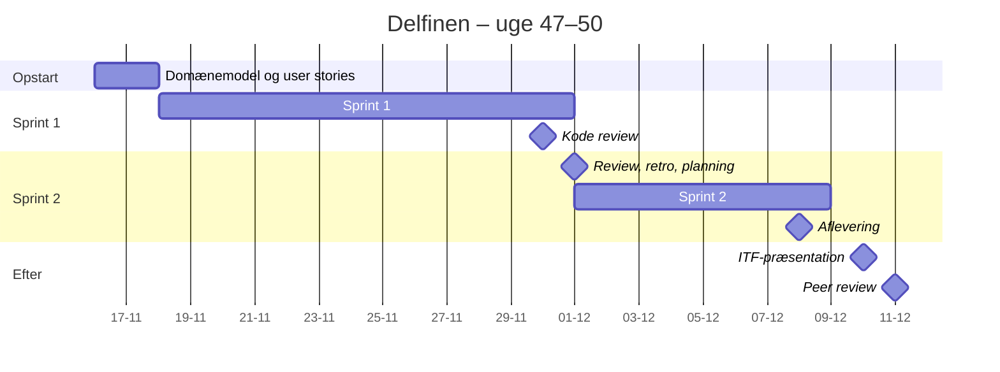

# Projekt: Delfinen

> Semestrets eksamensprojekt. Grupper på 4, to sprints, ét fælles GitHub-repository.

## Svømmeklubben Delfinen

Indtil nu har I fået opgaverne serveret i små bidder: *lav del 1, så del 2*. Sådan er det ikke i
virkeligheden. Her møder I en **kunde med et problem**, beskrevet med kundens egne ord. Det er jeres
opgave at finde ud af, hvad programmet skal kunne, dele arbejdet op, planlægge det og bygge det,
fire personer i samme kodebase.

Derfor handler projektet også om **domænemodel**, **user stories**, **Scrum** og **Git branching**.
Det er de værktøjer, der gør det muligt.

---

## Casen

*Sådan beskriver klubben selv sine behov. Læs teksten flere gange – det er her, I finder
begreberne til domænemodellen og kravene til jeres user stories.*

> Svømmeklubben Delfinen er en mindre klub, der er i vækst. Klubbens ledelse ønsker derfor udviklet
> et administrativt system til at styre medlemsoplysninger, kontingenter og svømmeresultater. Efter
> samtale med klubbens formand tegner der sig følgende billede af de arbejdsopgaver, systemet skal
> understøtte.
>
> Det er klubbens **formand**, der tager sig af nye medlemmer. Ved indmeldelse i klubben registreres
> diverse stamoplysninger om personen, herunder alder. Desuden registreres oplysninger om personens
> ønskede aktivitetsform, det vil sige aktivt eller passivt medlemskab, junior- eller seniorsvømmer,
> motionist eller konkurrencesvømmer.
>
> Klubbens **kasserer** tager sig af alt vedrørende kontingentbetaling. Kontingentets størrelse
> afhænger af flere forhold: For aktive medlemmer er kontingentet for ungdomssvømmere (under 18 år)
> 1000 kr. årligt og for seniorsvømmere (18 år og over) 1600 kr. årligt. For medlemmer over 60 år
> gives der 25 % rabat af seniortaksten. For passivt medlemskab er taksten 500 kr. årligt.
>
> Kassereren vil gerne kunne danne sig et overblik over, hvor meget klubben kan forvente at få
> indbetalt i kontingent i alt. Kassereren ønsker desuden, at systemet kan vise en oversigt over
> medlemmer, der er i restance.
>
> Konkurrencesvømmerne har tilknyttet en **træner**. Konkurrencesvømmerne er inddelt i to hold efter
> alder: ungdomsholdet er for svømmere under 18 år, seniorholdet for svømmere på 18 år og derover.
> Hver konkurrencesvømmer er desuden registreret med de svømmediscipliner, svømmeren er aktiv i.
>
> Inden for hver svømmedisciplin registreres den enkelte svømmers bedste træningsresultat og dato
> løbende. For de svømmere, der har deltaget i konkurrencer, registreres stævne, placering og tid.
> Det er på baggrund af svømmernes resultater, at træneren udtager svømmere til konkurrencer.
> Træneren ønsker derfor en oversigt, der kan vise klubbens **top 5**-svømmere inden for hver
> svømmedisciplin (butterfly, crawl, rygcrawl og brystsvømning), fordelt på junior- og
> seniorsvømmere.

### Reglerne gjort præcise

En kundes tekst er aldrig helt præcis. Nogle ting kan læses på flere måder, og i et rigtigt projekt
ville I spørge kunden. Her har vi besluttet følgende, så alle grupper bygger efter de samme regler:

| Spørgsmål | Afgørelse |
|---|---|
| Hvordan kender systemet alderen? | Der registreres en **fødselsdato**, ikke en alder. Alderen regnes ud i hele år på den dag, programmet bruger den. En alder, der er tastet ind, passer kun indtil næste fødselsdag. |
| Hvornår er man junior eller senior? | **Junior:** under 18 år. **Senior:** 18 år og derover. Man er senior fra og med sin 18-års fødselsdag. Casen siger både "junior" og "ungdom"; det er det samme. Junior/senior **beregnes** ud fra fødselsdatoen og tastes ikke ind. |
| Hvad betyder "over 60 år"? | Vi læser det som **60 år og derover**: rabatten gælder fra og med **60-års fødselsdagen** (alder ≥ 60). |
| Hvem får rabatten? | Kun **aktive seniorer**. De betaler 1600 kr. minus 25 % (400 kr.), altså **1200 kr.** |
| Hvad betaler passive medlemmer? | Altid **500 kr.**, uanset alder. |
| Motionist eller konkurrencesvømmer? | Gælder kun **aktive** medlemmer. Et passivt medlem er ingen af delene. |
| Hvornår er et medlem i restance? | Når årets kontingent **ikke er registreret som betalt**. Et nyt medlem står som ikke-betalt, indtil kassereren registrerer betalingen. |
| Hvad er "forventet indbetaling i alt"? | **Summen af alle medlemmers årlige kontingent**, både betalt og ikke-betalt. |
| Hvordan finder man et bestemt medlem? | Hvert medlem får et **unikt medlemsnummer**, som systemet selv tildeler. Nummeret bruges aldrig igen, heller ikke hvis medlemmet senere meldes ud. |
| Hvilke tider tæller i top 5? | Svømmerens **bedste træningstid** i disciplinen. Hver svømmer står højst én gang pr. liste. Hurtigste tid øverst. |
| Hvem kommer med i top 5? | Kun konkurrencesvømmere, der er aktive i disciplinen og har en registreret træningstid i den. Har færre end fem svømmere en tid, vises dem, der har. |
| Kan man registrere en tid (trænings- eller stævnetid) i en disciplin, svømmeren ikke er aktiv i? | Nej, det afviser programmet. |

> **Er I i tvivl om andet?** Så træffer I selv en rimelig beslutning, skriver den ned (fx i
> `docs/user-stories.md` ved den user story, det gælder) og tager den med til næste check-in.
> I skal kunne forklare, **hvad** I besluttede og **hvorfor**.

---

## Det lærer I

* at lave en **domænemodel** ud fra en tekst skrevet af en kunde
* at skrive **user stories med acceptkriterier** og prioritere dem i en backlog
* at arbejde i **sprints** efter Scrum, med board, stand-up, planning, review og retrospektiv
* at arbejde **fire personer i samme kodebase** med Git branches
* at samle alt fra semestret i ét program: klasser og arv, `ArrayList`, enum, `LocalDate`,
  exceptions, filer, sortering med `Comparator`, packages og unit test

---

## Krav til programmet

Kravene her er **minimumskravene**. I skriver selv jeres user stories ud fra casen og kravene
(se [Kom i gang](kom-i-gang.md)), og I må gerne dele et krav op i flere user stories.

### Funktionelle krav

Programmet har tre brugere: formanden, kassereren og træneren. Hvert krav skal kunne afprøves:
man kan gøre det i programmet og se, om resultatet er rigtigt.

**Formanden**

| Nr. | Krav |
|---|---|
| F1 | Formanden kan oprette et medlem med navn, fødselsdato og aktivitetsform: aktivt eller passivt medlemskab, og for aktive medlemmer motionist eller konkurrencesvømmer. |
| F2 | Når formanden opretter en konkurrencesvømmer, vælges én eller flere af de fire discipliner. Man kan ikke oprette en konkurrencesvømmer uden disciplin. |
| F3 | Systemet giver hvert nyt medlem et unikt medlemsnummer. |
| F4 | Formanden kan se en liste over alle medlemmer med medlemsnummer, navn, alder, junior/senior og aktivitetsform (passiv, motionist eller konkurrencesvømmer). |

**Kassereren**

| Nr. | Krav |
|---|---|
| F5 | Kassereren kan se hvert medlems årlige kontingent, beregnet efter reglerne ovenfor. |
| F6 | Kassereren kan se den forventede samlede kontingentindtægt. |
| F7 | Kassereren kan registrere, at et medlem har betalt årets kontingent. |
| F8 | Kassereren kan se en liste over medlemmer i restance med medlemsnummer, navn og det beløb, de skylder. |

**Træneren**

| Nr. | Krav |
|---|---|
| F9 | Træneren kan se juniorholdet og seniorholdet hver for sig: hvilke konkurrencesvømmere der er på holdet, og hvilke discipliner de er aktive i. |
| F10 | Træneren kan registrere en træningstid for en konkurrencesvømmer i en disciplin med dato. Er tiden bedre end svømmerens hidtil bedste i disciplinen, bliver den ny bedste tid. Ellers beholdes den gamle, og træneren får det at vide. |
| F11 | Træneren kan registrere et stævneresultat for en konkurrencesvømmer: stævnets navn, dato, disciplin, placering og tid. |
| F12 | Træneren kan se én konkurrencesvømmers resultater: bedste træningstid (med dato) i hver disciplin og alle stævneresultater. |
| F13 | Træneren kan vælge en disciplin og se top 5 for juniorer og top 5 for seniorer, med navn, tid og dato. |

**Alle**

| Nr. | Krav |
|---|---|
| F14 | Alle data (medlemmer, betalinger og resultater) gemmes i tekstfiler og indlæses, når programmet starter. Lukker man programmet og starter det igen, er intet gået tabt. |

Tider registreres med hundrededele sekund, fx 1:05.32. Hvordan tiden tastes ind og gemmes,
bestemmer I selv.

> **Tip:** En tid er lettest at sammenligne og gemme som et **helt tal**, fx antal hundrededele
> sekund (1:05.32 bliver til 6532). Så kan den sorteres uden afrundingsfejl.

### Ikke-funktionelle krav

| Krav | Hvad det betyder her |
|---|---|
| **Objektorienteret design** | Koden er delt i klasser med hvert sit ansvar (Single Responsibility, lav kobling, høj samhørighed). Beregninger ligger hos den klasse, der har data til dem (Information Expert). Ingen kopieret kode. |
| **Packages** | Relaterede klasser ligger i samme package, fx én til brugerfladen, én til domænet og én til filhåndtering. |
| **UI adskilt fra logik** | Kun brugerflade-klasserne læser fra tastaturet og skriver i konsollen (`new Scanner(System.in)` og `System.out`). Filhåndteringen må gerne bruge `Scanner` til at læse filer. |
| **Tekstbaseret brugerflade** | Menuer i konsollen. Brugerfladen må være på dansk. Koden (klasser, metoder, variabler) skrives på **engelsk**. |
| **Data i tekstfiler** | Fx CSV-filer, som I lærte i Filmsamling. Repoet indeholder **eksempeldata**: mindst 10 medlemmer af alle slags, heraf konkurrencesvømmere med tider, så man kan afprøve programmet med det samme. |
| **Unit test** | JUnit 5-tests af **mindst kontingentberegningen**: alle fire takster og grænserne ved 18 og 60 år. Gerne også top 5 og restancelisten. |
| **Robusthed** | Programmet må ikke gå ned på forkert input (bogstaver, hvor der skal stå et tal, en ugyldig dato, et medlemsnummer, der ikke findes). Mangler datafilen, starter programmet med en tom klub. |

> **Tip til test af kontingent:** Lad metoden tage datoen som parameter, fx
> `calculateFee(LocalDate date)`, i stedet for selv at kalde `LocalDate.now()`. Så kan jeres
> test sige *"på denne dato er medlemmet 17 år"*, og den bliver ikke rød, når tiden går.

### Udvidelser (frivillige)

Når minimumskravene virker og er testet, kan I tage fat på udvidelser. Skriv dem som user stories
på boardet, og tag dem i den rækkefølge, I selv prioriterer.

| Nr. | Udvidelse |
|---|---|
| U1 | Formanden kan rette et medlems oplysninger, fx skifte mellem aktiv og passiv, motionist og konkurrencesvømmer, eller ændre discipliner. |
| U2 | Formanden kan melde et medlem ud. |
| U3 | Kassereren kan starte et nyt kontingentår, så alle står som ikke-betalt igen. |
| U4 | Hvert hold har en træner, hvis navn vises på holdoversigten. |
| U5 | Top 5 regnes ud fra den bedste af både trænings- og stævnetider. |
| U6 | Formanden kan søge efter et medlem på navn. |
| U7 | Medlemslisten kan sorteres efter navn, alder eller medlemsnummer. |
| U8 | Brugeren vælger rolle ved opstart og ser kun sin egen menu. |
| U9 | Kassereren kan se, hvor meget der er indbetalt indtil nu, og hvor meget der mangler. |

> **Et færdigt program med F1–F14 og gode tests er bedre end et halvt program med alle udvidelser.**

---

## Krav til processen

I arbejder efter **Scrum** i to sprints. Hvordan, står i [Scrum i Delfinen](scrum.md). Kort
fortalt:

* **Board:** I styrer backloggen på et board. Vi anbefaler **GitHub Projects**, fordi det ligger
  lige ved jeres repo. Trello er også fint.
* **Backlog:** alle user stories med acceptkriterier, prioriteret af jer selv i fællesskab.
* **Sprints:** sprint 1 fra onsdag 18-11 til mandag 30-11, sprint 2 fra tirsdag 01-12 til
  aflevering tirsdag 08-12.
* **Møder:** daily stand-up på alle projektdage, sprint planning 18-11 og 01-12, sprint review og
  retrospektiv 01-12, check-in med underviseren 18-11, 25-11 og 02-12.
* **Scrum Master:** én i gruppen pr. sprint. I skifter mellem sprintene.
* **Git:** fra 19-11 arbejder I i branches og merger til `main`. `main` skal altid kunne køre.

Der er **ingen Product Owner udefra**. I prioriterer selv backloggen ud fra casen, og underviseren
er sparringspartner ved check-ins.

---

## Dokumentation

Dokumentationen ligger i en mappe `docs/` i jeres repo. Den skal være der ved afleveringen:

| Dokument | Indhold | Hvornår |
|---|---|---|
| **Domænemodel** | Begreberne i klubben og deres relationer, med multipliciteter. Uden metoder og datatyper. | Første udgave 16-11, rettes løbende |
| **User stories** | Alle user stories med acceptkriterier. Markér, hvilke der er færdige, og hvilke der ikke nåede med. | Første udgave 17-11, opdateres hver sprint |
| **Designklassediagram** | Klassediagram over det færdige program: klasser, vigtige attributter og metoder, arv og relationer. | Ved afleveringen |

Diagrammerne må være billeder (png/pdf) eller Mermaid i en Markdown-fil. Det vigtigste er, at de
kan læses direkte på GitHub.

> **Domænemodel eller klassediagram?** Domænemodellen beskriver **klubben**, med klubbens egne
> ord. Designklassediagrammet beskriver **jeres program**, med klassenavnene fra koden, også de
> tekniske som `FileHandler` og `UserInterface`. De ligner hinanden, men det er to forskellige
> ting. Se forskellen i [Kom i gang](kom-i-gang.md#domænemodel-eller-klassediagram).

---

## Praktiske oplysninger

### Obligatorisk eksamensprojekt

Delfinen er **semestrets eksamensprojekt**, og det er en **bunden forudsætning**: projektet skal
være afleveret, for at I kan blive indstillet til eksamen. Som med alt andet eksamensrelateret har
man flere forsøg, hvis man for eksempel bliver syg. Selve eksamen gennemgår vi onsdag 16-12.

### Grupper på 4

I arbejder i **grupper på 4**, og alle fire skal være **ligeligt inde over alle dele** af
projektet: kode, test, diagrammer og planlægning.

* **Alle fire committer.** Git-historikken viser, hvem der har lavet hvad. Parprogrammerer I, så
  skift til, hvem der committer.
* Ingen er "den, der laver diagrammer", og ingen er "den, der koder". Alle skal kunne forklare hele
  programmet.
* Går samarbejdet skævt, så sig det i gruppen først og ved check-in bagefter. Det er nemmere at
  løse i uge 47 end i uge 50.

### Hjælpemidler

Koden skal være jeres egen. Almindelig kodefuldførelse i IntelliJ må I gerne bruge, men
**AI-assistenter som GitHub Copilot må ikke bruges** til koden. Slå dem fra i IntelliJ, hvis de er
slået til. ITF-delen følger ITF's egne regler.

### GitHub

* **Ét fælles repository** pr. gruppe, på en af jeres egne GitHub-konti (som i Adventure). Én
  opretter det og inviterer de tre andre som collaborators.
* Repoet skal være **offentligt (public)**, så underviserne og den gruppe, der reviewer jer 11-12,
  kan klone det.
* En `.gitignore`, så `out/`, `.class`-filer og IntelliJ's personlige filer ikke kommer med.
* En `README.md` i roden af repoet (se [Aflevering](#aflevering)).

---

## Forløbet

| Uge | Dag | Hvad |
|---|---|---|
| 47 | [man 16-11](../../47/01_man_2026-11-16/README.md) | Projektopstart, grupper, domænemodel |
| | [tir 17-11](../../47/02_tir_2026-11-17/README.md) | Projektets krav: user stories |
| | [ons 18-11](../../47/03_ons_2026-11-18/README.md) | **Sprint planning 1** og check-in (underviser online, I er i lokalet) |
| | [tor 19-11](../../47/04_tor_2026-11-19/README.md) | Git branching |
| | [fre 20-11](../../47/05_fre_2026-11-20/README.md) | Sprint 1 |
| 48 | [man 23-11](../../48/01_man_2026-11-23/README.md) – [tir 24-11](../../48/02_tir_2026-11-24/README.md) | Sprint 1 |
| | [ons 25-11](../../48/03_ons_2026-11-25/README.md) | Sprint 1, **check-in** (underviser online, I er i lokalet) |
| | [tor 26-11](../../48/04_tor_2026-11-26/README.md) | ITF: projektvejledning |
| | [fre 27-11](../../48/05_fre_2026-11-27/README.md) | Sprint 1 |
| 49 | [man 30-11](../../49/01_man_2026-11-30/README.md) | **Kode review**, sidste dag i sprint 1 |
| | [tir 01-12](../../49/02_tir_2026-12-01/README.md) | **Sprint review, retrospektiv og sprint planning 2** |
| | [ons 02-12](../../49/03_ons_2026-12-02/README.md) | Sprint 2, **check-in** (underviser online, I er i lokalet) |
| | [tor 03-12](../../49/04_tor_2026-12-03/README.md) – [fre 04-12](../../49/05_fre_2026-12-04/README.md) | Sprint 2 |
| 50 | [man 07-12](../../50/01_man_2026-12-07/README.md) | Sprint 2 |
| | [tir 08-12](../../50/02_tir_2026-12-08/README.md) | Sprint 2. **Aflevering kl. 23:59** |
| | [ons 09-12](../../50/03_ons_2026-12-09/README.md) | Repetition |
| | [tor 10-12](../../50/04_tor_2026-12-10/README.md) | ITF: **I præsenterer jeres diasshow** for ITF-underviseren |
| | [fre 11-12](../../50/05_fre_2026-12-11/README.md) | **[Peer review](peer-review.md) og vejlederfeedback – obligatorisk** |
| 51 | [man 14-12](../../51/01_man_2026-12-14/README.md) – [tir 15-12](../../51/02_tir_2026-12-15/README.md) | Prøveeksamen |
| | [ons 16-12](../../51/03_ons_2026-12-16/README.md) | Eksamenssnak og semesterafrunding |



---

## IT- og Forretningsudvikling

Delfinen er et **fælles projekt med IT- og Forretningsudvikling (ITF)**. Ud over programmet
laver I **ét diasshow med jeres svar på ITF's opgaver** til projektet. I IT- og Forretningsudvikling
skal I lave:

- Interessentanalyse inkl. interessentmatrix, interessentanalysetabel, informationstabel (kommunikationsplan/håndteringsplan).
- Risikoanalyse, herunder udvidet risikotabel.

Laves i punktform i et diasshow (PowerPoint) som afleveres 8. december. Hver gruppe præsenterer deres diasshow den 10. december i IT- og Forretningsudvikling.

---

## Aflevering

**Hvad:** to ting i samme aflevering:

1. ét klikbart link til jeres gruppes **GitHub-repository**, til repoet som et hele, ikke til en
   fil eller mappe
2. **diasshowet med jeres svar på ITF's opgaver**, uploadet som fil (se [IT- og Forretningsudvikling](#it--og-forretningsudvikling))

**Hvor:** i itslearning → jeres klasserum (E26A eller E26B) → afleveringsopgaven
**"Delfinen – aflevering"**.

**Hvornår:** **tirsdag 08-12-2026 kl. 23:59.**

**Hvem:** det er en **gruppeaflevering**. "Delfinen – aflevering" er sat op som en gruppeopgave i
itslearning, og **én af jer afleverer link og diasshow på vegne af hele gruppen**. Før I
afleverer, skal I sikre jer, at **alle fire er med i jeres gruppe i itslearning**. Er nogen ikke
med, har de ikke afleveret. Alle fire står desuden i repoets `README.md` med fornavn og
GitHub-brugernavn.

**Obligatorisk:** ja. Uden aflevering ingen indstilling til eksamen.

### Tjek, før I afleverer

1. Åbn linket i et **privat browservindue** (hvor du ikke er logget ind på GitHub). Kan du se koden,
   er repoet offentligt. Får du "404", er det privat.
2. Klon repoet i en ny mappe og kør programmet derfra. Virker det kun på én af jeres computere, er
   der noget, der ikke er committet.
3. Kør alle tests. De skal være grønne.
4. Alt skal være merget til `main`. Vi ser på `main`, som den er ved deadline.

### Det skal ligge i repoet

```text
README.md              gruppens navn, medlemmer (kun fornavn + GitHub-brugernavn – repoet er
                       offentligt), link til boardet,
                       hvordan programmet startes, og hvilke krav (F1–F14, U1–U9) der er lavet
docs/
    domaenemodel        (png, pdf eller Mermaid i .md)
    user-stories.md     alle user stories med acceptkriterier; hvilke er færdige
    klassediagram       designklassediagram over det færdige program
src/                   koden, delt i packages
test/                  JUnit 5-tests (mindst kontingentberegningen)
*.csv (eller lign.)    eksempeldata med mindst 10 medlemmer, så programmet kan afprøves med det samme
```

Mappenavnene `src/` og `test/` er som i IntelliJ. Bruger I Maven, er det `src/main/java` og
`src/test/java`. Det vigtige er, at alt ligger i repoet.

Boardet skal kunne ses af underviserne. Gør det offentligt (se [Scrum i Delfinen](scrum.md#boardet)).

---

## Filerne i projektet

| Fil | Indhold |
|---|---|
| [Kom i gang](kom-i-gang.md) | Første skridt 16–17-11: Team Canvas, repo, board, domænemodel, user stories |
| [Scrum i Delfinen](scrum.md) | Board, backlog, estimering, sprintkalender, check-ins og retrospektiv |
| [Peer review](peer-review.md) | Fredag 11-12: peer review og vejlederfeedback (obligatorisk fremmøde), forberedelse med selvrefleksion |

Datoerne for alle semestrets projekter står også samlet i
[projektoversigten på forsiden](../../README.md#afleveringer-og-deadlines).

**God svømmetur – start med [Kom i gang](kom-i-gang.md).**
