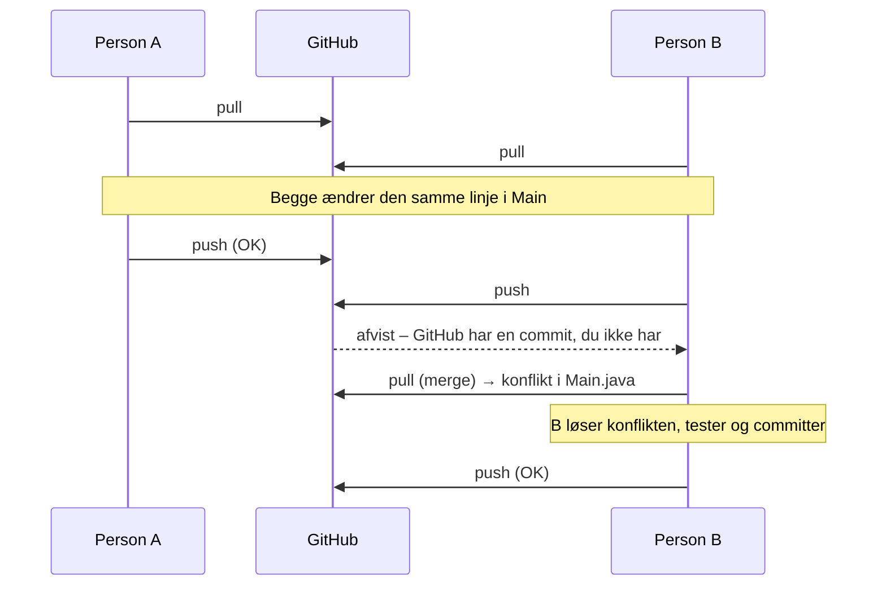

# Filmsamling del 0 – Fælles repository

> Del af det samlede [Filmsamling-projekt](readme.md). Laves **mandag 19-10** – se også
> [dagens side](../../43/01_man_2026-10-19/README.md).

## Beskrivelse

I Adventure delte I et repository, men arbejdede tæt sammen om hele løsningen – ofte ved én
computer. I filmsamlingen skal I **arbejde parallelt**: én skriver `Movie`, en anden
`UserInterface`, og alle pusher til det samme repository. Det kræver, at repositoriet er sat ordentligt op fra starten, og at alle har
prøvet, hvad der sker, når to personer har ændret den samme linje.

I dag laver I derfor ingen film endnu. I laver **fundamentet**: projektet, repositoriet, en
`README.md` med gruppen – og I laver med vilje en **merge-konflikt** og løser den.

## Læringsmål

Når du er færdig med denne del, skal du kunne:

* oprette et Maven-projekt i IntelliJ og dele det på GitHub
* give andre adgang til et repository som **collaborators**
* clone et repository, som en anden har oprettet
* forklare, hvorfor man skal **pulle**, før man begynder at arbejde
* forklare, hvad en **merge-konflikt** er, og hvorfor den opstår
* løse en merge-konflikt i IntelliJ og pushe resultatet

---

## Krav

Når I går hjem mandag, skal følgende være på plads:

1. Gruppen har **ét** repository på GitHub, fx `filmsamling`. Det er **public**.
2. Repositoriet indeholder et **Maven-projekt** med JDK 21 og IntelliJ's `.gitignore`. Der ligger
   ingen `target`-mappe og ingen `.class`-filer i GitHub.
3. Alle i gruppen er **collaborators** og har clonet repositoriet til deres egen computer.
4. Klassen `Main` ligger i `src/main/java` og udskriver `Velkommen til min filmsamling!`.
5. Der ligger en `README.md` i roden af repositoriet med **alle** gruppens medlemmer: fornavn
   og GitHub-brugernavn. Hvert medlem har selv skrevet og committet sin egen linje.
6. Historikken viser mindst én **merge-konflikt, der er løst** (en merge-commit).

Når alt virker, viser GitHub (fanen **Insights → Contributors**, eller listen over commits) en
commit fra hvert medlem.

### Hvorfor Maven?

I Adventure lavede I et almindeligt IntelliJ-projekt. Det går fint, så længe ingen skal bruge
biblioteker udefra. Men i [del 5](del-5-test.md) skal I bruge **JUnit** til at teste, og JUnit er
netop et bibliotek udefra.

I et Maven-projekt står den slags i filen `pom.xml`. Den ligger i repositoriet, så når ét
gruppemedlem tilføjer JUnit, får alle de andre det automatisk, næste gang de puller. I et
almindeligt IntelliJ-projekt skal hver person sætte det op på sin egen computer – og det går
næsten altid galt for mindst én.

---

## Anbefalet procedure

### 1. Én person opretter projektet

Vælg én i gruppen, der opretter projektet. De andre kigger med.

1. I IntelliJ: **File → New → Project**.
2. Navn: `filmsamling`. Language: **Java**. Build system: **Maven** (i stedet for **IntelliJ**,
   som I har valgt indtil nu). JDK: **21**.
3. Sæt flueben i **Create Git repository**.
4. **Fjern** fluebenet i **Add sample code** – ellers lægger IntelliJ `Main` i en package, vi ikke
   skal bruge.
5. Lad **Advanced Settings** (GroupId, ArtifactId) stå, som de er.
6. Klik **Create**, og vent, til IntelliJ er færdig med at indlæse projektet (statuslinjen nederst).

IntelliJ laver nu `pom.xml`, mapperne `src/main/java` og `src/test/java` og en `.gitignore`, der
sørger for, at `target`-mappen (hvor de kompilerede `.class`-filer havner) ikke kommer med i Git.

> **Det nye i et Maven-projekt** – resten er, som I kender det:
>
> | | Almindeligt IntelliJ-projekt | Maven-projekt |
> |---|---|---|
> | Programmets kode | `src` | `src/main/java` |
> | Testene (fra del 5) | – | `src/test/java` |
> | Kompilerede filer | `out` | `target` |
> | Biblioteker (fx JUnit) | sættes op på hver computer | står i `pom.xml` |
>
> `pom.xml` rører I ikke i dag – først i del 5, hvor der kommer fem linjer JUnit i. Mappen
> `src/main/resources` bruger vi ikke. I højre side af IntelliJ er der nu et **Maven**-vindue;
> det skal I først bruge i del 5.

Opret klassen `Main` direkte i `src/main/java` (højreklik på `java` → **New → Java Class**):

```java
public class Main {
    public static void main(String[] args) {
        System.out.println("Velkommen til min filmsamling!");
    }
}
```

Kør den, og tjek at den virker. Commit (<kbd>Ctrl</kbd>+<kbd>K</kbd>, på Mac
<kbd>Cmd</kbd>+<kbd>K</kbd>) med beskeden `Opret projekt`. Kig i commit-vinduet, før du trykker:
er der en `target`-mappe med? Så er noget galt – spørg, før du committer.

### 2. Del projektet på GitHub

1. **Git → GitHub → Share Project on GitHub**.
2. Repository-navn: `filmsamling`. Sørg for, at **Private** **ikke** er markeret – repositoriet skal være public.
3. Klik **Share**.

Åbn repositoriet på GitHub og tjek, at `pom.xml`, `.gitignore` og `src` ligger der.

### 3. Giv de andre adgang

På GitHub, i repositoriet: **Settings → Collaborators → Add people**. Tilføj hvert
gruppemedlem ud fra deres GitHub-brugernavn.

Hvert medlem får en invitation (på mail og under notifikationer på GitHub) og skal **acceptere
den**. Før det er sket, kan de clone, men ikke pushe.

> Se evt. GitHubs egen vejledning:
> [Inviting collaborators to a personal repository](https://docs.github.com/en/repositories/managing-your-repositorys-settings-and-features/repository-access-and-collaboration/inviting-collaborators-to-a-personal-repository).

### 4. Alle de andre cloner

1. I IntelliJ: **File → New → Project from Version Control**.
2. Indsæt repositoriets URL (den grønne **Code**-knap på GitHub) og klik **Clone**.
3. Svar **Trust Project**, hvis IntelliJ spørger, og vent, til IntelliJ er færdig med at indlæse
   Maven-projektet.
4. Kør `Main`.

### 5. Hver skriver sin egen linje i README.md

Ejeren opretter `README.md` i roden af projektet, committer og pusher:

```markdown
# Filmsamling

Et CRUD-program til en filmsamling – 1. semester, datamatiker, EK.

## Gruppen

| Fornavn | GitHub |
|---|---|
```

Derefter tilføjer **hver** i gruppen sin egen linje i tabellen – **én ad gangen**:

1. **Pull** (**Git → Pull**) – så har du de andres linjer.
2. Tilføj din linje, fx `| Kim | kim-codes |`.
3. Commit med beskeden `Tilføj Kim til README` og **push**.
4. Sig til den næste, at det er deres tur.

Når I er igennem, har alle en commit i historikken.

### 6. Lav en merge-konflikt med vilje

Nu gør I det, I ellers skal undgå: to personer ændrer **den samme linje** uden at pulle først.

1. Person A og person B puller begge, så de er helt opdateret.
2. **Begge** ændrer velkomstteksten i `Main` – til hver sin tekst, fx
   `Velkommen til Kims filmhylde!` og `Velkommen til Filmarkivet!`.
3. Begge committer. **Ingen puller.**
4. Person A pusher. Det går fint.
5. Person B pusher. Det bliver **afvist**: GitHub har en commit, som B ikke har. IntelliJ spørger,
   om B vil **Merge** eller **Rebase**. Vælg **Merge**.
6. Git kan ikke selv afgøre, hvilken af de to tekster der skal bruges, så der opstår en
   **konflikt**. IntelliJ viser et vindue med filen `Main.java`. Klik **Merge...**.
7. Nu ser B tre kolonner: sin egen version til venstre, resultatet i midten og den version, der
   lå på GitHub, til højre. Vælg den ene tekst – eller skriv en tredje, som I er enige om – i
   midten, og klik **Apply**.
8. Kør `Main` og tjek, at den kompilerer og virker. Som regel laver IntelliJ selv merge-commit'en,
   når alle konflikter er løst; ellers så commit (<kbd>Ctrl</kbd>+<kbd>K</kbd>). **Push**.

Byt roller, og gør det igen, så alle har prøvet at løse en konflikt.

> **En konflikt er ikke en fejl.** Git fortæller bare, at to personer har ændret det samme sted,
> og at et menneske må afgøre, hvad der er rigtigt. Det farlige er at løse den i blinde – så tjek
> **altid**, at programmet kompilerer og kører, før I pusher resultatet.
>
> Læs mere: [Resolve conflicts](https://www.jetbrains.com/help/idea/resolve-conflicts.html)
> (IntelliJ) og [Merge conflicts](https://docs.github.com/en/pull-requests/reference/merge-conflicts)
> (GitHub).

### Hvorfor opstod konflikten?



Havde B pullet **før** sin ændring, havde B set A's tekst og kunne have bygget videre på den. Det
er derfor, regel nummer ét i projektet er: **pull, før I begynder**. Se alle fem regler under
[Gruppearbejde og Git](readme.md#gruppearbejde-og-git).

---

## Frivillige udvidelser

* Skriv et par linjer i `README.md` om, hvad programmet skal kunne (læs [readme'en](readme.md)).
* Prøv at lave en konflikt i `README.md` i stedet for i Java-kode. Hvad er forskellen?
* Find jeres commits under **Insights → Network** på GitHub. Kan I se, hvor historikken deler sig
  og samles igen ved merge-commit'en?

---

**Næste:** [Del 1–4 – CRUD](del-1-4-crud.md)
