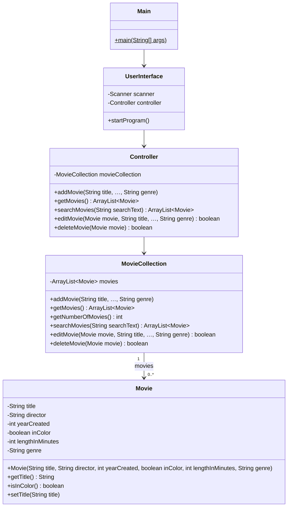

# Filmsamling del 1–4 – CRUD

> Del af det samlede [Filmsamling-projekt](readme.md). Starter **tirsdag 20-10** og **bør være
> færdig inden fredag 23-10**, hvor I skal teste koden.

## Beskrivelse

I dag bygger I selve filmsamlingen: et program, hvor man kan **oprette** film, **se** og **søge**
i dem, **rette** dem og **slette** dem. Det er fire delopgaver med i alt seks user stories:

| Del | User stories | CRUD |
|---|---|---|
| 1 | US1 opret en film, US2 menu | **C**reate |
| 2 | US3 vis alle film | **R**ead |
| 3 | US4 søg efter film | **R**ead |
| 4 | US5 redigér en film, US6 slet en film | **U**pdate, **D**elete |

Det lyder af meget til én dag – og det er det også. Men I kan det meste i forvejen: `ArrayList`
fra Bogsamling og opdelingen i `UserInterface`, controller og domæneklasser fra Adventure. Og I er
flere om det. Til gengæld skal I dele arbejdet op, så I ikke træder hinanden over tæerne i Git.
Derfor giver denne side jer klassediagrammet fra start: når alle kender metodernes navne og
parametre, kan I skrive hver jeres klasse på samme tid.

## Læringsmål

Når du er færdig med denne del, skal du kunne:

* forklare, hvad **CRUD** står for, og finde de fire operationer i et program
* læse en **user story** med acceptkriterier og omsætte den til kode
* give hver klasse ét ansvar: brugerflade, controller, samling og domæneobjekt
* skrive en **søgemetode**, der returnerer en liste med alle de objekter, der matcher
* redigere og fjerne objekter i en `ArrayList`
* dele arbejdet i en gruppe efter klasser, så I kan arbejde parallelt i samme repository

---

## User stories

### Del 1 – Opret

**US1 – Opret en film**

> Som filmentusiast vil jeg kunne tilføje en film til min filmsamling, så jeg har en liste over
> alle mine film.

En film har en **titel**, en **instruktør**, et **årstal**, en **længde i minutter** og en
**genre**, og den er enten **i farver** eller **sort-hvid**.

* **Givet** at jeg har valgt "Opret en film", **når** jeg har indtastet alle oplysninger, **så**
  er filmen lagt i samlingen, og programmet bekræfter det med filmens titel.

**US2 – Menu**

> Som filmentusiast vil jeg have en menu, så jeg kan vælge, hvad jeg vil gøre – og blive ved,
> indtil jeg selv vælger at stoppe.

* **Givet** at programmet er startet, **så** vises en menu med mindst "Opret en film" og "Afslut".
* **Givet** at jeg har udført et valg, **når** det er færdigt, **så** vises menuen igen.
* **Givet** at jeg skriver noget, der ikke er et menuvalg, **så** får jeg det at vide, og menuen
  vises igen – programmet går ikke ned.
* **Givet** at jeg vælger "Afslut", **så** stopper programmet med en afskedshilsen.

### Del 2 – Vis

**US3 – Vis alle film**

> Som filmentusiast vil jeg kunne se alle film i samlingen, så jeg får et overblik.

* **Givet** at samlingen indeholder film, **når** jeg vælger "Vis alle film", **så** vises alle
  oplysninger om hver film.
* Der må **ikke** stå computer-ord som `null`, `true` eller `false` i udskriften. En film er
  "farver" eller "sort-hvid" – ikke `true`.
* **Givet** at samlingen er tom, **så** får jeg en besked om det i stedet for ingenting.

### Del 3 – Søg

**US4 – Søg efter film**

> Som filmentusiast vil jeg kunne søge efter film på titel, så jeg hurtigt kan finde en bestemt
> film.

* Jeg kan søge på **en del af titlen**: søgningen `god` finder både *The Godfather* og *Godzilla*.
* Søgningen er **ligeglad med store og små bogstaver**: `GOD`, `god` og `God` giver det samme.
* **Givet** at flere film matcher, **så** vises **alle** de film, der matcher.
* **Givet** at ingen film matcher, **så** får jeg en besked om det.

### Del 4 – Redigér og slet

**US5 – Redigér en film**

> Som filmentusiast vil jeg kunne rette oplysningerne om en film, så samlingen altid passer med
> det, jeg ved.

* Jeg finder filmen ved at søge (som i US4). Matcher flere film, vælger jeg den rigtige ud fra et
  nummer.
* Jeg kan rette **alle** oplysninger, og jeg kan beholde en oplysning uden at skrive den igen.
* **Efter** redigeringen vises **alle** filmens oplysninger – også dem, jeg ikke har ændret.

**US6 – Slet en film**

> Som filmentusiast vil jeg kunne slette en film, så samlingen kun indeholder film, jeg stadig
> vil holde styr på.

* Jeg finder filmen på samme måde som i US5.
* Programmet spørger, om jeg er sikker, før filmen slettes.
* Bagefter er filmen væk fra samlingen.

---

## Krav til koden

### Klasserne



Diagrammet viser kun to af getterne og én af setterne på `Movie` – der skal være en getter og en
setter til **hver** attribut: `getDirector()`, `getYearCreated()`, `setGenre(...)` og så videre. Getteren til
en `boolean` hedder `isInColor()`, ligesom `isRead()` i Bogsamling.

Hvor der står `…`, er parametrene de samme seks som i `Movie`'s constructor, i samme rækkefølge:

```java
public void addMovie(String title, String director, int yearCreated, boolean inColor,
                     int lengthInMinutes, String genre)

public boolean editMovie(Movie movie, String title, String director, int yearCreated,
                         boolean inColor, int lengthInMinutes, String genre)
```

### Ansvar

| Klasse | Ansvar | Må **ikke** |
|---|---|---|
| `Main` | Opretter `UserInterface` og kalder `startProgram()` – intet andet | – |
| `UserInterface` | **Al** kommunikation med brugeren: menu, `Scanner`, `System.out` | holde på film eller ændre dem selv |
| `Controller` | Det eneste, `UserInterface` taler med. Sender videre til `MovieCollection` | udskrive eller læse input |
| `MovieCollection` | Ejer listen af film: opretter, finder, retter og fjerner | udskrive eller læse input |
| `Movie` | Én films oplysninger | udskrive eller læse input |

> **`System.out` og `Scanner` findes kun i `UserInterface`.** Alle andre klasser returnerer
> værdier – en `boolean`, en `Movie`, en `ArrayList<Movie>` – og så er det `UserInterface`, der
> afgør, hvad brugeren skal se. Det er samme regel som i Adventure.

Hvorfor en `Controller`, når den lige nu bare sender videre til `MovieCollection`? Fordi den
**får mere at lave**. I [del 7](del-7-filer.md) skal den også styre, hvornår samlingen gemmes i en
fil – og så er det rart, at `UserInterface` stadig kun kender én klasse. (Vil I hellere give den et
navn fra domænet, fx `MovieController`, er det også fint.)

### Movie

`Movie` minder om `Book` fra Bogsamling. Attributterne er `private`, constructoren sætter dem, og
der er gettere og settere:

```java
public class Movie {
    private String title;
    private String director;
    private int yearCreated;
    private boolean inColor;
    private int lengthInMinutes;
    private String genre;

    public Movie(String title, String director, int yearCreated, boolean inColor,
                 int lengthInMinutes, String genre) {
        this.title = title;
        this.director = director;
        this.yearCreated = yearCreated;
        this.inColor = inColor;
        this.lengthInMinutes = lengthInMinutes;
        this.genre = genre;
    }

    public boolean isInColor() {
        return inColor;
    }

    // ... resten af getterne og setterne
}
```

### MovieCollection

`MovieCollection` har en `ArrayList<Movie>`, der oprettes i constructoren – præcis som `Library`
i Bogsamling. Det er også `MovieCollection`, der **opretter** `Movie`-objekterne i `addMovie`
(den indeholder filmene, så den skaber dem – *Creator*-princippet fra Adventure).

`searchMovies` finder **alle** film, hvor søgeteksten indgår i titlen. I Bogsamling returnerede
`findBookByTitle` én bog eller `null`. Her returneres en **liste** – som kan være tom:

```java
// Finder alle film, hvor søgeteksten indgår i titlen – uanset store og små bogstaver
public ArrayList<Movie> searchMovies(String searchText) {
    ArrayList<Movie> matches = new ArrayList<>();
    String text = searchText.toLowerCase();
    for (Movie movie : movies) {
        if (movie.getTitle().toLowerCase().contains(text)) {
            matches.add(movie);
        }
    }
    return matches;
}
```

`contains` finder en tekst inde i en anden tekst. Ved at lave **begge** om til små bogstaver med
`toLowerCase()` bliver søgningen ligeglad med store og små bogstaver.

`editMovie` og `deleteMovie` får det `Movie`-objekt, der skal rettes eller slettes, og returnerer
`false`, hvis filmen slet ikke er i samlingen. `ArrayList` har selv metoderne til det:
`movies.contains(movie)` og `movies.remove(movie)` – og `remove` returnerer `true`, hvis den
fandt og fjernede objektet.

### UserInterface

Menuen kører i en løkke i `startProgram()`, indtil brugeren vælger at afslutte. Læs menuvalget
som **tekst** og brug en `switch` på teksten – så går programmet ikke ned, hvis brugeren skriver
`hej` i stedet for et tal:

```java
String choice = scanner.nextLine().trim();
switch (choice) {
    case "1" -> createMovie();
    case "2" -> showAllMovies();
    case "3" -> searchMovies();
    case "4" -> editMovie();
    case "5" -> deleteMovie();
    case "0" -> running = false;
    default -> System.out.println("Ukendt valg: " + choice);
}
```

Hvert menuvalg har sin egen `private` metode i `UserInterface`. Så bliver `startProgram()` kort og
læselig, og I kan fordele metoderne mellem jer.

> **Tip: læs alle linjer med `nextLine()`.** Blander man `nextInt()` og `nextLine()`, bliver
> linjeskiftet efter tallet liggende, og den næste `nextLine()` returnerer en tom tekst. Læs i
> stedet hele linjen og lav den om til et tal med `Integer.parseInt(...)`, som I kender fra
> kommandolinje-argumenterne i uge 35:
>
> ```java
> private int readInt(String prompt) {
>     System.out.print(prompt);
>     return Integer.parseInt(scanner.nextLine().trim());
> }
> ```
>
> Skriver brugeren `sytten`, går programmet ned med en `NumberFormatException`. Det er i orden
> **i dag** – det retter I i [del 6](del-6-exceptions.md).

**Redigér og slet** starter begge med at finde én bestemt film. Lav én metode til det, som begge
bruger: søg (med `controller.searchMovies`), vis resultaterne med et nummer foran, og lad brugeren
vælge et nummer. Husk, at listen tæller fra 0, men brugeren tæller fra 1.

Ved **redigering** er det rart, at man kan trykke Enter for at beholde den gamle værdi – så skal
man ikke skrive titlen igen for at rette genren.

### Eksempel på en kørsel

Jeres udskrifter må gerne se anderledes ud. Det vigtige er, at acceptkriterierne er opfyldt.

```text
Velkommen til min filmsamling!

1. Opret en film
2. Vis alle film
3. Søg efter film
4. Redigér en film
5. Slet en film
0. Afslut
Vælg: 1
Titel: Jaws
Instruktør: Steven Spielberg
Årstal: 1975
I farver (ja/nej): ja
Længde i minutter: 124
Genre: Thriller
Jaws er tilføjet til samlingen.

...

Vælg: 2

Jaws (1975)
  Instruktør: Steven Spielberg
  Genre: Thriller
  Længde: 124 minutter, farver

Psycho (1960)
  Instruktør: Alfred Hitchcock
  Genre: Horror
  Længde: 109 minutter, sort-hvid

...

Vælg: 3
Søg efter titel: ps
1 film matcher "ps":

Psycho (1960)
  Instruktør: Alfred Hitchcock
  Genre: Horror
  Længde: 109 minutter, sort-hvid
```

Og redigering og sletning – her med *The Godfather* og *Godzilla* i samlingen:

```text
Vælg: 4
Søg efter titel: god
1. The Godfather (1972)
2. Godzilla (1954)
Vælg nummer: 2
Tryk Enter for at beholde den nuværende værdi.
Titel [Godzilla]: Gojira
Instruktør [Ishirō Honda]:
Årstal [1954]:
I farver (ja/nej) [nej]:
Længde i minutter [96]:
Genre [Sci-fi]: Monster
Filmen er opdateret:

Gojira (1954)
  Instruktør: Ishirō Honda
  Genre: Monster
  Længde: 96 minutter, sort-hvid

...

Vælg: 5
Søg efter titel: god
1. The Godfather (1972)
Vælg nummer: 1
Vil du slette The Godfather? (ja/nej): nej
Intet er slettet.
```

---

## Anbefalet procedure

### 1. Sammen: skelettet (ca. 30 minutter)

Sæt jer sammen – ved én skærm – og gør følgende, **før** I deler jer:

1. Læs user stories og klassediagrammet igennem sammen.
2. Én person opretter de fire klasser med attributter og **tomme** metoder – præcis de navne og
   parametre, der står i diagrammet. Metoder, der skal returnere noget, returnerer `null`,
   `false` eller `0` for nu.
3. Tjek, at det kompilerer. Commit (`Skelet til klasserne`) og push. Alle puller.

Nu kan alle kalde alle metoder – de gør bare ikke noget endnu. Så kan I skrive hver jeres del
uden at vente på hinanden.

### 2. Hver for sig: én klasse pr. person

Et forslag til fordeling i en gruppe på tre (tilpas det til jeres gruppe):

| Person | Klasser | Starter med |
|---|---|---|
| A | `Movie` og `MovieCollection` | constructor, gettere og settere, `addMovie`, `getMovies` |
| B | `UserInterface` | menuen, "Opret en film" og "Vis alle film" |
| C | `Controller` og `Main` | Derefter: sæt jer sammen med B om søg, redigér og slet i `UserInterface` |

Er I to, tager den ene `Movie` og `MovieCollection`, den anden `UserInterface`, `Controller` og
`Main`.

> **Én fil – én person ad gangen.** Skal to personer arbejde i `UserInterface` samtidig, så gør
> det ved **én** computer. To personer i samme fil på hver sin computer giver konflikter.

### 3. Én user story ad gangen

Tag user stories i rækkefølge. For hver:

1. **Pull.**
2. Få den til at virke – test den ved at køre programmet og prøve **alle** acceptkriterierne,
   også dem, der handler om, at noget ikke findes.
3. **Commit** med user storyens nummer: `US3: vis alle film – besked hvis samlingen er tom`.
4. **Push.**

### 4. Ryd op, før I går videre

Når alle seks user stories virker: kig koden igennem sammen. Er der variable med dårlige navne?
Metoder, der er blevet for lange? Attributter, der er `public`? Står der `System.out` et andet
sted end i `UserInterface`? Ret det, test igen, commit og push.

---

## Frivillige udvidelser

Er I hurtigt færdige, så hjælp først de andre grupper. Ellers kan I vælge frit mellem disse:

### Søg på flere ting

Lad søgningen også finde film ud fra instruktør eller genre. Eller lav en separat søgning:
"Vis alle film af Alfred Hitchcock".

### Statistik

Tilføj et menuvalg, der viser antal film i samlingen, deres samlede længde i timer og minutter,
og hvor mange der er i farver.

### Ingen dubletter

Forhindr, at den samme film bliver oprettet to gange. Hvornår er to film "den samme"? Samme
titel? Samme titel **og** årstal? (Der findes to film, der hedder *Psycho* – fra 1960 og 1998.)

### Genre som enum

Genre er lige nu en `String`, så `Horror`, `horror` og `Gyser` er tre forskellige genrer. Lav en
`enum Genre` med faste værdier, og lad brugeren vælge genren fra en nummereret liste.

---

## Aflevering

Der er ingen særskilt aflevering af del 1–4 – kun den [endelige aflevering](readme.md#aflevering)
onsdag 04-11. Men husk at **pushe** alt, der virker: fredag 23-10 skriver I tests til koden, og det
kræver, at alle i gruppen har den.

---

**Næste:** [Del 5 – Test](del-5-test.md)
