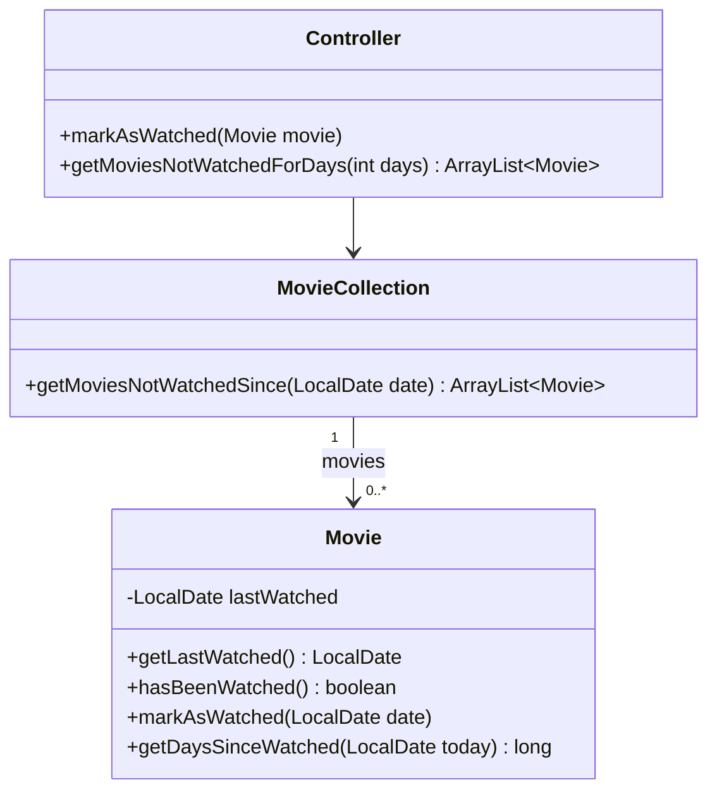

# Filmsamling del 5½ – Datoer og FURPS

> Del af det samlede [Filmsamling-projekt](readme.md). Laves **mandag 26-10** og **bør være
> færdig inden tirsdag 27-10**.

## Beskrivelse

Samlingen kan nu det hele – oprette, vise, søge, rette og slette. Men hvilke film har du **faktisk
set**? Og hvilke har stået på hylden i et år uden at blive rørt?

I dag får hver film en **dato**: hvornår du sidst så den. Det kræver, at I lærer Javas klasse til
datoer, `LocalDate`. Og så tager I et skridt tilbage og kigger på **kvaliteten** af jeres
program: ikke kun *hvad* det kan, men *hvor godt* det gør det. Til det bruger vi **FURPS**.

Delen har tre dele:

1. **FURPS** – en kvalitetsliste for jeres filmsamling i `docs/furps.md`.
2. **Datoer** – user stories US8 og US9 med `LocalDate`.
3. **Design-review** – gennemgå jeres egen kode efter en tjekliste, før vi bygger mere på.

## Læringsmål

Når du er færdig med denne del, skal du kunne:

* forklare de fem bogstaver i **FURPS** og give et eksempel på hvert fra dit eget program
* skelne mellem **funktionelle** krav (hvad programmet gør) og **kvalitetskrav** (hvor godt)
* oprette, sammenligne og formatere datoer med `LocalDate`
* regne antal dage mellem to datoer
* bruge `null` til at betyde "ingen dato endnu" og håndtere det
* skrive tests af kode med datoer, som ikke afhænger af, hvilken dag testen køres

---

## 1. FURPS

FURPS er en huskeregel for de slags krav, man kan stille til et program:

| | Engelsk | Spørgsmål | I filmsamlingen – eksempel |
|---|---|---|---|
| **F** | Functionality | *Hvad* kan programmet? | Man kan oprette, søge, rette og slette film (US1–US6) |
| **U** | Usability | Er det let at bruge? | Man kan trykke Enter for at beholde en værdi, når man redigerer |
| **R** | Reliability | Kan man stole på det? | Programmet går ikke ned, hvis man skriver bogstaver, hvor der skal stå et tal |
| **P** | Performance | Er det hurtigt og sparsomt nok? | Filen skrives kun, hvis der er ændringer |
| **S** | Supportability | Er det let at vedligeholde og ændre? | Al logik uden for `UserInterface` er dækket af unit tests |

User stories beskriver mest **F**. De fire andre er det, der adskiller et program, man gider
bruge – og gider arbejde videre på – fra et, der "bare virker". Flere af projektets kommende dele
handler netop om dem: [del 6](del-6-exceptions.md) om **R**, [del 7](del-7-filer.md) om **P**, og
[del 5](del-5-test.md) og [del 8](del-8-refaktorering.md) om **S**.

### Krav: docs/furps.md

Opret mappen `docs` i roden af repositoriet og filen `docs/furps.md`. Skriv **mindst ét konkret
krav pr. bogstav** til jeres filmsamling, og angiv for hvert krav, om det er opfyldt, og hvor:

```markdown
# FURPS – vores filmsamling

| | Krav | Opfyldt? | Hvor |
|---|---|---|---|
| F | Man kan søge på en del af en titel | Ja | US4, `MovieCollection.searchMovies` |
| R | Programmet går ikke ned ved bogstaver i årstal | Nej – del 6 | |
| ... | | | |
```

Et godt krav kan **afprøves**: "Programmet er brugervenligt" kan ikke afprøves. "Menuen viser
højst ti valg, og ukendte valg giver en besked" kan.

---

## 2. Datoer

### User stories

**US8 – Markér en film som set**

> Som filmentusiast vil jeg kunne markere, at jeg har set en film, så jeg kan huske, hvornår jeg
> sidst så den.

* **Givet** at jeg vælger "Markér en film som set" og vælger en film (som ved redigering), **så**
  gemmes dagens dato som den dato, jeg sidst så filmen.
* Når en film vises, står der, hvornår den sidst blev set, og hvor mange dage siden det er – fx
  `Sidst set: 26-10-2026 (for 0 dage siden)`.
* En film, jeg aldrig har set, viser `Sidst set: aldrig` – ikke `null`.

**US9 – Film, jeg ikke har set længe**

> Som filmentusiast vil jeg kunne finde de film, jeg ikke har set længe, så jeg har noget at
> vælge imellem, når jeg vil se en film i aften.

* Jeg angiver et antal dage, fx 365.
* **Så** vises alle film, jeg **aldrig** har set, og alle film, jeg sidst så for **mere end** det
  antal dage siden.
* En film, jeg så for præcis 365 dage siden, er **ikke** med, når jeg skriver 365.

### Det skal I bruge fra LocalDate

> `LocalDate` er en dato uden klokkeslæt – fx 26. oktober 2026. Den ligger i `java.time`, og den
> er **immutable**: metoder som `minusDays` ændrer ikke datoen, men returnerer en **ny** dato.
>
> ```java
> LocalDate today = LocalDate.now();                  // dagens dato
> LocalDate date = LocalDate.of(2026, 10, 26);        // en bestemt dato: år, måned, dag
> LocalDate yearAgo = today.minusDays(365);           // en ny dato, 365 dage tidligere
> boolean before = date.isBefore(today);              // også isAfter og isEqual
> long days = ChronoUnit.DAYS.between(date, today);   // antal dage fra date til today
>
> DateTimeFormatter formatter = DateTimeFormatter.ofPattern("dd-MM-yyyy");
> String text = date.format(formatter);               // "26-10-2026"
> ```
>
> Importer `java.time.LocalDate`, `java.time.temporal.ChronoUnit` og
> `java.time.format.DateTimeFormatter`. Se
> [LocalDate](https://docs.oracle.com/en/java/javase/21/docs/api/java.base/java/time/LocalDate.html)
> i Javas dokumentation. Bemærk `MM` med **store** bogstaver: `mm` betyder minutter.

### Krav til koden

`Movie` får en ny attribut, `lastWatched`, af typen `LocalDate`. Den er `null`, indtil filmen er
set første gang – og den skal **ikke** med i constructoren, for en ny film er aldrig set.



(Diagrammet viser kun det, der er **nyt** i dag.)

```java
private LocalDate lastWatched;   // null = filmen er aldrig set

public boolean hasBeenWatched() {
    return lastWatched != null;
}

public void markAsWatched(LocalDate date) {
    lastWatched = date;
}

// Antal dage fra lastWatched til today. Må kun kaldes, hvis hasBeenWatched() er true.
public long getDaysSinceWatched(LocalDate today) {
    return ChronoUnit.DAYS.between(lastWatched, today);
}
```

`getMoviesNotWatchedSince(LocalDate date)` i `MovieCollection` returnerer de film, der **aldrig**
er set, eller som sidst blev set **før** `date`. Rækkefølgen i betingelsen er vigtig:

```java
if (!movie.hasBeenWatched() || movie.getLastWatched().isBefore(date)) {
```

Er filmen aldrig set, er `getLastWatched()` `null`, og `null.isBefore(...)` ville give en
`NullPointerException`. Men `||` stopper, så snart venstre side er `true` – så højre side bliver
kun kørt for film, der **har** en dato.

`Controller` er stedet, hvor **dagens** dato kommer ind i billedet:

```java
public void markAsWatched(Movie movie) {
    movie.markAsWatched(LocalDate.now());
}

public ArrayList<Movie> getMoviesNotWatchedForDays(int days) {
    LocalDate limit = LocalDate.now().minusDays(days);
    return movieCollection.getMoviesNotWatchedSince(limit);
}
```

### Hvorfor får Movie datoen som parameter?

Metoderne i `Movie` og `MovieCollection` kalder **ikke** `LocalDate.now()` selv. De får datoen med som
parameter – `markAsWatched(LocalDate date)`, `getDaysSinceWatched(LocalDate today)`. Det er samme
idé som `isClassic(int currentYear)` i Bogsamling.

Grunden er **test**. En test af `getDaysSinceWatched` skal give det samme resultat, uanset om den
køres i dag eller om et år:

```java
@Test
void daysSinceWatchedCountsAcrossMonths() {
    // Arrange
    Movie movie = new Movie("Jaws", "Steven Spielberg", 1975, true, 124, "Thriller");
    movie.markAsWatched(LocalDate.of(2025, 9, 30));

    // Act
    long days = movie.getDaysSinceWatched(LocalDate.of(2025, 10, 26));

    // Assert
    assertEquals(26, days);
}
```

Havde metoden selv kaldt `LocalDate.now()`, ville det forventede antal dage ændre sig hver dag –
og testen ville blive rød i morgen.

> **Brug datoer i fortiden i jeres tests.** I [del 6](del-6-exceptions.md) indfører I en regel om,
> at man ikke kan have set en film i fremtiden – og så vil en test, der bruger en dato efter i dag,
> pludselig fejle.

### Krav til brugerfladen

* Menuvalg 6: **Markér en film som set i dag** – find filmen (genbrug metoden fra redigér og slet)
  og kald `controller.markAsWatched(movie)`.
* Menuvalg 7: **Find film, du ikke har set længe** – spørg om antal dage, og vis listen.
* Når en film vises, vises også `Sidst set: ...`. Formatér datoen som `dd-MM-yyyy` – ikke som
  `2026-10-26`, som er det, `LocalDate` giver af sig selv.

Eksempel (kørt 26-10-2026, med *Jaws* og *Psycho* i samlingen):

```text
Vælg: 6
Søg efter titel: jaws
1. Jaws (1975)
Vælg nummer: 1
Jaws er markeret som set 26-10-2026.

...

Vælg: 3
Søg efter titel: jaws
1 film matcher "jaws":

Jaws (1975)
  Instruktør: Steven Spielberg
  Genre: Thriller
  Længde: 124 minutter, farver
  Sidst set: 26-10-2026 (for 0 dage siden)

...

Vælg: 7
Hvor mange dage siden mindst? 30
Film, du ikke har set i 30 dage eller aldrig har set:
  Psycho – sidst set: aldrig
```

### Krav til testene

Tilføj mindst disse tests:

| Klasse | Test |
|---|---|
| `Movie` | en ny film er ikke set (`hasBeenWatched()` er `false`, `getLastWatched()` er `null`) |
| `Movie` | `markAsWatched` husker datoen |
| `Movie` | `getDaysSinceWatched` regner rigtigt hen over et månedsskifte |
| `MovieCollection` | film, der aldrig er set, er med i `getMoviesNotWatchedSince` |
| `MovieCollection` | en film set **før** datoen er med; en film set **på** datoen og en set **efter** er ikke |

Den sidste test er den vigtigste: grænsen (præcis på datoen) er der, hvor fejlene plejer at være.

---

## 3. Design-review af jeres egen kode

Før I bygger mere oven på koden, så gennemgå den sammen i gruppen – ved én skærm – efter denne
tjekliste. Ret det, I finder, og commit rettelserne hver for sig.

- [ ] `System.out` og `Scanner` findes **kun** i `UserInterface`.
- [ ] `UserInterface` kender kun `Controller` (og `Movie`, som den viser) – ikke `MovieCollection`.
- [ ] Alle attributter er `private`.
- [ ] Der er ingen metoder, der gør to ting – fx både søger og udskriver.
- [ ] Metoder og variable har navne, der siger, hvad de er – ingen `x`, `temp` eller `list2`.
- [ ] Koden er engelsk; udskrifterne er danske.
- [ ] Alle tests er grønne.
- [ ] Klassediagrammet passer med koden. Har I ikke et endnu, så tegn det nu i
      `docs/klassediagram.md` (Mermaid) eller i draw.io – det skal alligevel med i afleveringen.

Tjeklisten er et lille udsnit af [review-skemaet](kode-review.md), som I bruger for alvor mandag
02-11 og fredag 06-11.

---

## Anbefalet procedure

1. **FURPS sammen** (ca. 20 minutter): skriv `docs/furps.md`. Én skriver, alle byder ind. Commit
   og push.
2. **Del datoerne op:** én tager `Movie` og testene af den; én tager `MovieCollection`,
   `Controller` og deres tests; én tager `UserInterface` (er I to, deler I de to sidste). Start med `Movie` – de andre kan skrive
   metodernes skelet imens.
3. **Design-review sammen** til sidst – når datoerne virker, og testene er grønne.

---

## Frivillige udvidelser

* **Filmens alder:** vis, hvor gammel filmen er (`LocalDate.now().getYear()` minus årstallet).
* **Hvornår blev den tilføjet?** Giv hver film en `dateAdded`, der sættes, når filmen oprettes.
  Hvordan gør I det, så det stadig kan testes?
* **Ugedag:** vis `Sidst set: mandag 26-10-2026`. Se `getDayOfWeek()` – og find ud af, hvordan
  man får den på dansk.

---

**Næste:** [Del 6 – Robusthed](del-6-exceptions.md)
