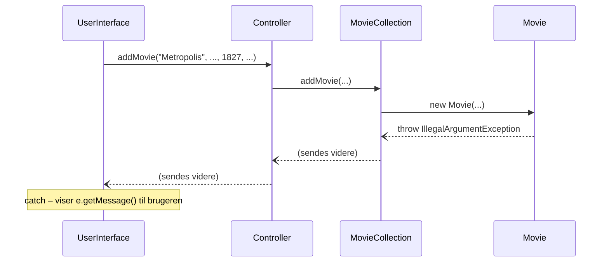

# Filmsamling del 6 – Robusthed

> Del af det samlede [Filmsamling-projekt](readme.md). Starter **tirsdag 27-10** (fang
> exceptions) og fortsætter **onsdag 28-10** (kast exceptions). **Bør være færdig inden fredag
> 30-10.**

## Beskrivelse

Prøv at starte jeres program og skrive `sytten`, når det spørger om årstal. Eller `7`, når der kun
er ét søgeresultat at vælge imellem. Programmet går ned med en lang, rød tekst – og alle filmene
er væk.

Det er **R**'et i FURPS fra [del 5½](del-5-datoer.md): *Reliability*. Et program, der går ned, når
brugeren kommer til at trykke forkert, kan man ikke stole på.

Delen har to halvdele:

* **Tirsdag – fang exceptions** (US10): programmet skal overleve **forkert input**. Når brugeren
  skriver noget forkert, får hun en forklaring og kan prøve igen.
* **Onsdag – kast exceptions** (US11 og US12): `Movie` skal selv **afvise ugyldige værdier** – et
  årstal fra før filmen blev opfundet, en længde på 0 minutter, en dato i fremtiden – så de
  aldrig kommer ind i samlingen.

## Læringsmål

Når du er færdig med denne del, skal du kunne:

* forklare, hvad en **exception** er, og hvad der sker, når ingen fanger den
* fange en exception med `try`/`catch` og lade programmet fortsætte
* skrive en løkke, der spørger igen, indtil brugeren har skrevet noget gyldigt
* skelne mellem at **tjekke først** (`if`) og at **fange bagefter** (`catch`) – og vælge det rigtige
* **kaste** en `IllegalArgumentException` med en forklarende besked
* teste, at en metode kaster en exception, med `assertThrows`

---

## Tirsdag 27-10: fang exceptions

### User story

**US10 – Robust input**

> Som filmentusiast vil jeg have, at programmet ikke går ned, når jeg kommer til at skrive
> forkert, så jeg ikke mister mit arbejde.

* **Givet** at programmet forventer et helt tal (årstal, længde, nummer), **når** jeg skriver noget
  andet, **så** får jeg at vide, at det ikke er et tal, og bliver spurgt igen.
* **Givet** at programmet spørger ja/nej, **når** jeg skriver noget andet end `ja`, `j`, `nej` eller
  `n`, **så** bliver jeg spurgt igen.
* **Givet** at jeg skal vælge en film fra en nummereret liste, **når** jeg skriver et nummer, der
  ikke er på listen, **så** bliver jeg spurgt igen. Skriver jeg `0`, fortryder jeg, og intet sker.
* **Givet** at jeg vil rette, slette eller markere en film, som ikke findes, **så** får jeg det at
  vide, og programmet går ikke ned.

### Find stederne, der kan gå ned

Start med at **finde** dem – før I retter noget. Gennemgå `UserInterface` sammen, og skriv en
liste over hver linje, der kan få programmet til at gå ned, og hvilken exception det giver:

| Linje (eksempel) | Hvad brugeren gør | Exception |
|---|---|---|
| `Integer.parseInt(scanner.nextLine())` | skriver `sytten` | `NumberFormatException` |
| `matches.get(number - 1)` | skriver `7`, når der er ét resultat | `IndexOutOfBoundsException` |
| `movie.getTitle()` på en film, der blev `null` | søger efter noget, der ikke findes | `NullPointerException` |

Prøv hvert punkt af i programmet, så I **ser** exceptionen. Læs den røde tekst: den fortæller
typen, beskeden og den linje i jeres kode, hvor det skete.

### Fang eller tjek?

Der er to måder at undgå, at programmet går ned:

* **Tjek først** med en `if`, når I *kan* se problemet på forhånd. Et nummer uden for listen kan I
  tjekke med `number < 0 || number > matches.size()`. En film, der er `null`, kan I tjekke med
  `movie == null`.
* **Fang bagefter** med `try`/`catch`, når I *ikke* kan se det på forhånd. Om teksten `sytten`
  kan laves om til et tal, finder I nemmest ud af ved at prøve – og fange
  `NumberFormatException`, hvis det mislykkes.

> **Tjek, hvis I kan. Fang, hvis I må.** En `catch` for `IndexOutOfBoundsException` eller
> `NullPointerException` skjuler næsten altid en fejl i koden, der burde være rettet med en `if`.

### Spørg igen, indtil svaret er gyldigt

Indlæsningen af et helt tal bliver til en løkke, der først slutter, når `parseInt` lykkes:

```java
// Spørger igen og igen, indtil brugeren skriver et helt tal.
// Løkken slutter, når return bliver ramt.
private int readInt(String prompt) {
    while (true) {
        System.out.print(prompt);
        String input = scanner.nextLine().trim();
        try {
            return Integer.parseInt(input);
        } catch (NumberFormatException e) {
            System.out.println("\"" + input + "\" er ikke et helt tal. Prøv igen.");
        }
    }
}
```

Går `parseInt` godt, returnerer metoden med det samme. Kaster den en `NumberFormatException`,
springer Java direkte til `catch`, skriver beskeden, og løkken tager en tur mere.

> Bruger I `nextInt()` i stedet for `nextLine()` og `parseInt`, hedder exceptionen
> `InputMismatchException` – og så skal I huske at læse den forkerte linje væk med
> `scanner.nextLine()` i `catch`, ellers prøver `nextInt()` den samme forkerte tekst igen og igen
> i en uendelig løkke.

Har I lavet `readInt` og de andre indlæsningsmetoder i del 1–4, skal de kun rettes **ét** sted.
Står `parseInt` spredt ud over hele `UserInterface`, er det nu, I samler det i én metode.

Valget fra en nummereret liste tjekkes med en `if` – ingen exception nødvendig:

```java
int number = readInt("Vælg nummer (0 = fortryd): ");
while (number < 0 || number > matches.size()) {
    System.out.println("Vælg et nummer mellem 1 og " + matches.size() + " – eller 0 for at fortryde.");
    number = readInt("Vælg nummer (0 = fortryd): ");
}
if (number == 0) {
    return null;
}
return matches.get(number - 1);
```

---

## Onsdag 28-10: kast exceptions

### User stories

**US11 – Kun gyldige film**

> Som filmentusiast vil jeg have, at programmet afviser oplysninger, der ikke kan passe, så min
> samling ikke fyldes med fejl.

* Titel, instruktør og genre må ikke være tomme.
* Årstallet skal være mellem **1888** (den ældste bevarede film,
  [Roundhay Garden Scene](https://en.wikipedia.org/wiki/Roundhay_Garden_Scene)) og **næste år**.
* Længden skal være mindst 1 minut.
* **Givet** at en oplysning er ugyldig, **når** jeg opretter eller redigerer en film, **så** får jeg
  at vide **hvad** der er galt, og filmen bliver **ikke** oprettet eller ændret – heller ikke
  delvist.

**US12 – Angiv datoen, jeg så filmen**

> Som filmentusiast vil jeg kunne skrive, hvilken dag jeg så en film, så jeg også kan registrere
> film, jeg så i sidste uge.

* Menuvalg 6 hedder nu **Markér en film som set**. Programmet spørger om datoen på formen
  `dd-mm-åååå`. Trykker jeg bare Enter, bruges dagens dato.
* **Givet** at jeg skriver noget, der ikke er en dato, **så** bliver jeg spurgt igen.
* **Givet** at datoen ligger i fremtiden, **så** får jeg det at vide, og filmen markeres ikke.

### Hvem skal afvise ugyldige værdier?

Man kunne tjekke årstallet i `UserInterface`. Men så gælder reglen kun, når brugeren taster – ikke
når en test, en anden klasse eller (i [del 7](del-7-filer.md)) en fil opretter en film. Reglen
hører til **filmen**: `Movie` er *Information Expert* for, hvad en gyldig film er.

Men `Movie` må ikke skrive til brugeren. Så hvordan siger den "nej"? Den **kaster en exception**:

```java
public void setYearCreated(int yearCreated) {
    int latestYear = LocalDate.now().getYear() + 1;
    if (yearCreated < FIRST_MOVIE_YEAR || yearCreated > latestYear) {
        throw new IllegalArgumentException(
                "Årstallet skal være mellem " + FIRST_MOVIE_YEAR + " og " + latestYear + ".");
    }
    this.yearCreated = yearCreated;
}
```

`throw` stopper metoden med det samme – `this.yearCreated` bliver aldrig sat. Exceptionen bevæger
sig op gennem kaldene (`Movie` → `MovieCollection` → `Controller`), indtil nogen fanger den. Det
gør `UserInterface`, som er den eneste, der må tale med brugeren:

```java
try {
    controller.addMovie(title, director, yearCreated, inColor, lengthInMinutes, genre);
    System.out.println(title + " er tilføjet til samlingen.");
} catch (IllegalArgumentException e) {
    System.out.println("Filmen blev ikke oprettet: " + e.getMessage());
}
```

`e.getMessage()` er den tekst, `Movie` gav med, da den kastede exceptionen. Så er det stadig
`Movie`, der ved, **hvad** der er galt, og `UserInterface`, der bestemmer, **hvordan** det vises.



### Krav til koden

* `FIRST_MOVIE_YEAR` er en konstant i `Movie`: `private static final int FIRST_MOVIE_YEAR = 1888;`
* **Alle** settere i `Movie`, der har en regel, kaster en `IllegalArgumentException` med en dansk
  besked, der forklarer, hvad der er galt.
* **Constructoren bruger setterne** i stedet for at sætte attributterne direkte. Så gælder de
  samme regler, uanset om filmen oprettes eller redigeres:

  ```java
  public Movie(String title, String director, int yearCreated, boolean inColor,
               int lengthInMinutes, String genre) {
      setTitle(title);
      setDirector(director);
      setYearCreated(yearCreated);
      setInColor(inColor);
      setLengthInMinutes(lengthInMinutes);
      setGenre(genre);
  }
  ```

* `markAsWatched(LocalDate date)` kaster en `IllegalArgumentException`, hvis datoen er efter i dag.

> **Men sagde vi ikke i del 5½, at `Movie` ikke selv kalder `LocalDate.now()`?** Reglerne "højst
> næste år" og "ikke i fremtiden" handler netop om *i dag*, så her gør `Movie` en undtagelse. Det
> kan stadig testes – bare ikke tæt på grænsen: test med et årstal **to** år ude i fremtiden og
> med datoer i fortiden, aldrig med i dag eller i morgen.
* `Controller.markAsWatched` får datoen som parameter: `markAsWatched(Movie movie, LocalDate date)`.
  Det er nu `UserInterface`, der vælger dagens dato, når brugeren trykker Enter.
* `UserInterface` fanger `IllegalArgumentException` ved oprettelse, redigering og markering som
  set, og viser beskeden.

### Redigering: alt eller intet

`editMovie` i `MovieCollection` kalder setterne én efter én. Hvad sker der, hvis titlen er fin,
men årstallet er ugyldigt? `setTitle` har allerede ændret titlen, når `setYearCreated` kaster
exceptionen. Filmen er **halvt redigeret** – og brugeren får at vide, at den ikke blev ændret.

Løsningen er at tjekke **alle** de nye værdier, før noget ændres. Den nemmeste måde er at oprette
en midlertidig film med de nye værdier – den kaster, hvis bare én af dem er ugyldig:

```java
if (!movies.contains(movie)) {
    return false;
}
// Tjek ALLE de nye værdier, før vi ændrer noget: en midlertidig film med de nye værdier
// kaster en exception, hvis bare én af dem er ugyldig. Så bliver filmen aldrig halvt ændret.
new Movie(title, director, yearCreated, inColor, lengthInMinutes, genre);

movie.setTitle(title);
// ... resten af setterne
```

### Datoer fra brugeren

`LocalDate.parse` laver en tekst om til en dato efter et mønster – og kaster en
`DateTimeParseException`, hvis teksten ikke passer:

```java
private LocalDate readDate(String prompt) {
    while (true) {
        System.out.print(prompt);
        String input = scanner.nextLine().trim();
        if (input.isEmpty()) {
            return LocalDate.now();
        }
        try {
            return LocalDate.parse(input, dateFormatter);
        } catch (DateTimeParseException e) {
            System.out.println("\"" + input + "\" er ikke en dato på formen dd-mm-åååå. Prøv igen.");
        }
    }
}
```

`dateFormatter` er den samme `DateTimeFormatter.ofPattern("dd-MM-yyyy")`, som I bruger til at vise
datoer. Importér `java.time.format.DateTimeParseException`.

### Test, at der bliver kastet

`assertThrows` tjekker, at en exception **bliver** kastet. Den skal have exceptionens type og den
kode, der skal køres:

```java
@Test
void yearBefore1888IsRejected() {
    assertThrows(IllegalArgumentException.class,
            () -> new Movie("Jaws", "Steven Spielberg", 1887, true, 124, "Thriller"));
}
```

`() -> ...` er en **lambda**: et stykke kode, man giver videre til en metode i stedet for at køre
det selv. Læs det som "den kode, der skal køres". `assertThrows` kører koden og tjekker, at den
kaster en `IllegalArgumentException`. Gør den ikke, er testen rød.

Test også **grænserne** – 1888 skal virke, 1887 skal ikke – og at en afvist redigering ikke ændrer
noget:

```java
@Test
void editWithInvalidValueChangesNothing() {
    // Arrange
    Movie casablanca = collection.searchMovies("Casablanca").get(0);

    // Act: ny titel er fin, men årstallet er ugyldigt
    assertThrows(IllegalArgumentException.class,
            () -> collection.editMovie(casablanca, "Casablanca 2", "Michael Curtiz", 1800, false,
                    102, "Drama"));

    // Assert: titlen er IKKE ændret – filmen er ikke blevet halvt redigeret
    assertEquals("Casablanca", casablanca.getTitle());
    assertEquals(1942, casablanca.getYearCreated());
}
```

Mindst disse tests skal med:

| Klasse | Test |
|---|---|
| `Movie` | tom titel afvises |
| `Movie` | årstal 1887 afvises, og 1888 accepteres |
| `Movie` | årstal to år ude i fremtiden afvises |
| `Movie` | længde 0 afvises |
| `Movie` | en ugyldig setter-værdi efterlader den gamle værdi uændret |
| `Movie` | `markAsWatched` med en dato i fremtiden afvises |
| `MovieCollection` | en redigering med en ugyldig værdi ændrer **ingenting** |

---

## Eksempel på en kørsel

```text
Vælg: 1
Titel: Jaws
Instruktør: Steven Spielberg
Årstal: sytten
"sytten" er ikke et helt tal. Prøv igen.
Årstal: 1975
I farver (ja/nej): måske
Svar ja eller nej.
I farver (ja/nej): j
Længde i minutter: 124
Genre: Thriller
Jaws er tilføjet til samlingen.

...

Vælg: 1
Titel: Metropolis
Instruktør: Fritz Lang
Årstal: 1827
I farver (ja/nej): nej
Længde i minutter: 153
Genre: Sci-fi
Filmen blev ikke oprettet: Årstallet skal være mellem 1888 og 2027.

...

Vælg: 6
Søg efter titel: jaws
1. Jaws (1975)
Vælg nummer (0 = fortryd): 7
Vælg et nummer mellem 1 og 1 – eller 0 for at fortryde.
Vælg nummer (0 = fortryd): 1
Hvornår så du den? (dd-mm-åååå, Enter = i dag): 31-13-2025
"31-13-2025" er ikke en dato på formen dd-mm-åååå. Prøv igen.
Hvornår så du den? (dd-mm-åååå, Enter = i dag): 01-10-2025
Jaws er markeret som set 01-10-2025.
```

---

## Anbefalet procedure

### Tirsdag

1. **Sammen:** lav listen over steder, der kan gå ned (se ovenfor), og prøv dem af.
2. **Én person** retter indlæsningsmetoderne (`readInt`, ja/nej, valg fra liste) i
   `UserInterface`. De andre tester imens programmet og prøver at få det til at gå ned – og siger
   til, når de finder noget nyt.
3. Commit: `US10: robust indlæsning af tal og ja/nej`.

### Onsdag

1. **Én person** laver reglerne i `Movie` og testene af dem – test for test.
2. **Én person** laver "alt eller intet" i `editMovie` og testen af det.
3. **Én person** laver `readDate`, `markAsWatched` med dato og fangsten af
   `IllegalArgumentException` i `UserInterface`.

Opdatér `docs/furps.md`: flyt R-kravene fra "Nej – del 6" til "Ja".

---

## Frivillige udvidelser

### Spørg igen ved ugyldige værdier

Lige nu skriver brugeren alle seks oplysninger, før hun får at vide, at årstallet var forkert – og
så må hun starte forfra. Lav det, så hver oplysning tjekkes, lige efter den er indtastet. Kan I
gøre det **uden** at skrive reglerne en gang til i `UserInterface`?

### Egen exception-type

Lav en `InvalidMovieException`, der arver fra `RuntimeException`, og kast den i stedet for
`IllegalArgumentException`. Hvad bliver bedre? Hvad bliver værre?

### 31-02-2026

Prøv at skrive `31-02-2026` som dato. Hvad sker der? Find ud af, hvorfor – og om man kan få
`DateTimeFormatter` til at afvise den (søg efter `ResolverStyle.STRICT`). Pas på: med `STRICT`
afvises **alle** datoer, hvis mønsteret bruger `yyyy` – brug `uuuu` i stedet. Find ud af hvorfor.

---

**Næste:** [Del 7 – Filer](del-7-filer.md)
