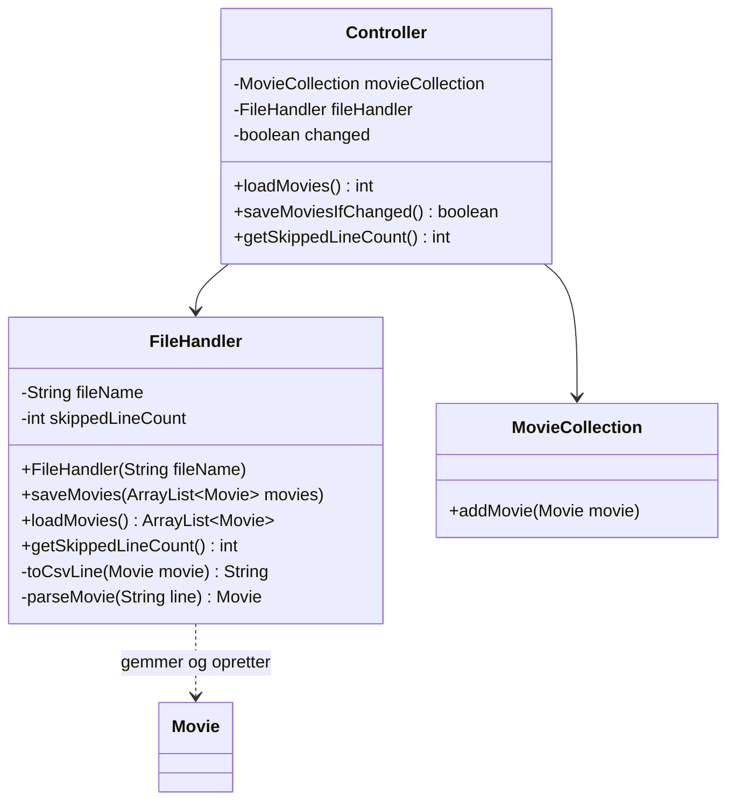

# Filmsamling del 7 – Gem og indlæs

> Del af det samlede [Filmsamling-projekt](readme.md). Laves **fredag 30-10** og **bør være
> færdig inden mandag 02-11**.

## Beskrivelse

Hver gang I lukker programmet, forsvinder alle filmene. Det har været irriterende i to uger, og nu
retter vi det: samlingen skal **gemmes i en fil**, når programmet slutter, og **indlæses igen**,
når det starter. Det kaldes at **persistere** data – at få dem til at overleve programmet.

Filen er en almindelig tekstfil i **CSV-format**: én film pr. linje, med felterne adskilt af et
tegn. Den kan åbnes og læses i IntelliJ og i enhver anden teksteditor.

Samtidig møder I en ny slags exception: en **checked exception**. Java vil ikke engang kompilere
koden, før I har taget stilling til, hvad der skal ske, hvis filen ikke findes.

## Læringsmål

Når du er færdig med denne del, skal du kunne:

* skrive tekst til en fil med `PrintStream` og læse den igen med `Scanner`
* forklare forskellen på en **checked** og en **unchecked** exception
* vælge mellem at fange en exception (`try`/`catch`) og sende den videre (`throws`)
* gemme objekter som linjer i en CSV-fil og lave linjerne om til objekter igen
* samle al filhåndtering i én klasse, så resten af programmet ikke ved, at der er en fil
* teste kode, der læser og skriver filer, uden at røre de rigtige data

---

## User stories

**US13 – Gem samlingen**

> Som filmentusiast vil jeg have, at min filmsamling bliver gemt, så jeg ikke skal taste den ind
> igen, hver gang jeg starter programmet.

* **Givet** at jeg afslutter programmet med menuvalg 0, **så** gemmes samlingen i filen
  `movies.csv`.
* **Givet** at programmet startes, og `movies.csv` findes, **så** indlæses filmene, og jeg får at
  vide, hvor mange der blev indlæst.
* **Alle** oplysninger overlever – også æ, ø og å i titlerne, og datoen for, hvornår jeg sidst så
  filmen.
* **Givet** at filen ikke findes (første gang programmet kører), **så** starter jeg med en tom
  samling – programmet går ikke ned.
* **Givet** at en linje i filen er ødelagt, **så** springes den over, jeg får en advarsel, og
  resten af filmene indlæses.

**US14 – Gem kun, når der er ændringer** *(technical story)*

> Som udvikler vil jeg kun skrive filen, når data er ændret, så programmet ikke laver unødigt
> arbejde.

* **Givet** at jeg hverken har oprettet, rettet, slettet eller markeret en film som set, **når**
  jeg afslutter, **så** bliver filen **ikke** skrevet, og jeg får at vide, at der ikke var noget at
  gemme.

Det er **P**'et i FURPS: *Performance*. For en lille samling betyder det ikke meget, men et program,
der skriver en stor fil igen og igen uden grund, er både langsomt og slider på disken.

---

## Det skal I bruge

> **Skriv til en fil:** lav en `PrintStream` med et `File`-objekt, og brug `println` – præcis som
> med `System.out`, som også er en `PrintStream`.
>
> ```java
> PrintStream output = new PrintStream(new File("movies.csv"));
> output.println("en linje");
> output.close();   // vigtigt: luk altid filen, når I er færdige med den
> ```
>
> **Læs fra en fil:** lav en `Scanner` med et `File`-objekt i stedet for `System.in`.
>
> ```java
> Scanner fileScanner = new Scanner(new File("movies.csv"));
> while (fileScanner.hasNextLine()) {
>     String line = fileScanner.nextLine();
>     // ...
> }
> fileScanner.close();
> ```
>
> Begge constructorer kan kaste en `FileNotFoundException` (fra `java.io`). Filen ligger i
> **projektets rodmappe** – den mappe, hvor `pom.xml` ligger – når I kører fra IntelliJ.
> Med JDK 21 skrives og læses filen som UTF-8, så æ, ø og å kommer sikkert igennem.

### Checked exceptions

Skriver I `new Scanner(new File("movies.csv"))` i en metode, siger IntelliJ med det samme
`Unhandled exception: java.io.FileNotFoundException` – og koden kompilerer ikke.

`FileNotFoundException` er en **checked exception**. Det er Javas måde at sige: *det her kan gå
galt, uanset hvor god din kode er* – filen kan være slettet, flyttet eller låst. Derfor **skal** I
tage stilling til den. Der er to muligheder:

| | Sådan | Betyder |
|---|---|---|
| **Fang den** | `try { ... } catch (FileNotFoundException e) { ... }` | "Jeg ved, hvad der skal ske" |
| **Send den videre** | `public ArrayList<Movie> loadMovies() throws FileNotFoundException` | "Den, der kalder mig, må bestemme" |

De exceptions, I mødte i [del 6](del-6-exceptions.md) – `NumberFormatException`,
`IllegalArgumentException` – er **unchecked**: compileren tvinger jer ikke til at fange dem, fordi
de som regel skyldes en fejl, der kan undgås.

**Hvem skal fange `FileNotFoundException`?** Det skal den, der ved, hvad brugeren skal have at
vide. Det er `UserInterface`. Derfor sender `FileHandler` og `Controller` den videre med `throws`,
og `UserInterface` fanger den.

---

## Filformatet

Hver film bliver én linje. Første linje er en **overskrift**, så man kan se, hvad felterne er:

```text
title;director;yearCreated;inColor;lengthInMinutes;genre;lastWatched
Jaws;Steven Spielberg;1975;true;124;Thriller;2025-10-30
Adams æbler;Anders Thomas Jensen;2005;true;94;Komedie;
```

* **Semikolon** i stedet for komma, fordi titler tit indeholder komma – *Crouching Tiger, Hidden
  Dragon*. Et komma inde i titlen ville blive læst som et nyt felt.
* **Datoen** gemmes, som `LocalDate` selv skriver den: `2025-10-30`. Det er et internationalt
  format (ISO 8601), som `LocalDate.parse(...)` kan læse uden en formatter. Formatet `dd-MM-yyyy`
  bruger I kun til brugeren.
* Et **tomt felt** til sidst betyder, at filmen aldrig er set.

At lave en linje om til felter gøres med `split`:

```java
String[] fields = line.split(";", -1);
```

> **Hvorfor `-1`?** Uden den smider `split` tomme felter i **slutningen** af linjen væk. Linjen for
> *Adams æbler* ville så kun give 6 felter i stedet for 7, og `fields[6]` ville give en
> `ArrayIndexOutOfBoundsException`. Med `-1` beholdes de tomme felter.

---

## Krav til koden

### FileHandler

Al filhåndtering samles i én ny klasse, `FileHandler`. Ingen andre klasser må vide, at der er en
fil – de får og giver bare en `ArrayList<Movie>`. Skifter I en dag filen ud med en database, er det
kun `FileHandler`, der skal ændres. (Det er Single Responsibility – og lav kobling.)



(Diagrammet viser kun det, der er **nyt** i dag. `loadMovies` og `saveMovies` kaster
`FileNotFoundException`, og det gør `Controller`'s `loadMovies` og `saveMoviesIfChanged` også.)

* `FileHandler` får **filnavnet i constructoren**. Programmet bruger `movies.csv` – `Controller`
  opretter `new FileHandler("movies.csv")` i sin constructor. Testene bruger deres egen fil. Så kan en test aldrig komme til at slette jeres rigtige samling.
* `saveMovies` skriver overskriften og én linje pr. film.
* `loadMovies` springer overskriften over, laver hver linje om til en `Movie` og returnerer listen.
  En linje, der ikke kan læses – forkert antal felter, et årstal, der ikke er et tal, en ugyldig
  film – springes over og tælles i `skippedLineCount`.

Sådan kan det se ud:

```java
public void saveMovies(ArrayList<Movie> movies) throws FileNotFoundException {
    PrintStream output = new PrintStream(new File(fileName));
    output.println(HEADER);
    for (Movie movie : movies) {
        output.println(toCsvLine(movie));
    }
    output.close();
}

private String toCsvLine(Movie movie) {
    String lastWatched = "";   // tomt felt = aldrig set
    if (movie.hasBeenWatched()) {
        lastWatched = movie.getLastWatched().toString();   // fx 2026-10-30
    }
    return movie.getTitle() + ";"
            + movie.getDirector() + ";"
            + movie.getYearCreated() + ";"
            + movie.isInColor() + ";"
            + movie.getLengthInMinutes() + ";"
            + movie.getGenre() + ";"
            + lastWatched;
}
```

`HEADER` er en konstant i `FileHandler` med overskriftslinjen. Den anden vej:

```java
// Returnerer null, hvis linjen ikke er en gyldig film
private Movie parseMovie(String line) {
    // -1 betyder: behold tomme felter i slutningen af linjen (lastWatched kan være tom)
    String[] fields = line.split(";", -1);
    if (fields.length != 7) {
        return null;
    }
    try {
        String title = fields[0];
        String director = fields[1];
        int yearCreated = Integer.parseInt(fields[2]);
        boolean inColor = Boolean.parseBoolean(fields[3]);
        int lengthInMinutes = Integer.parseInt(fields[4]);
        String genre = fields[5];

        Movie movie = new Movie(title, director, yearCreated, inColor, lengthInMinutes, genre);
        if (!fields[6].isEmpty()) {
            movie.markAsWatched(LocalDate.parse(fields[6]));
        }
        return movie;
    } catch (IllegalArgumentException e) {
        // Også NumberFormatException, som er en slags IllegalArgumentException
        return null;
    } catch (DateTimeParseException e) {
        return null;
    }
}
```

Bemærk, at `new Movie(...)` kaster `IllegalArgumentException`, hvis en værdi er ugyldig – de regler,
I lavede i del 6, beskytter nu også mod en fil, som nogen har rettet i hånden. `NumberFormatException`
arver fra `IllegalArgumentException`, så den første `catch` fanger begge.

### MovieCollection

Når filmene kommer fra filen, er de allerede oprettet. `MovieCollection` får derfor en ekstra
`addMovie`, der tager et færdigt `Movie`-objekt – et **overload** af den, I har:

```java
// Bruges, når filmene allerede er oprettet – fx når de indlæses fra en fil
public void addMovie(Movie movie) {
    movies.add(movie);
}
```

### Controller

`Controller` får nu det arbejde, vi lovede i del 1–4: den koordinerer `MovieCollection` og
`FileHandler`, og den holder styr på, om der er ændringer, der ikke er gemt:

```java
// Gemmer kun, hvis der er noget at gemme. Returnerer true, hvis filen blev skrevet.
public boolean saveMoviesIfChanged() throws FileNotFoundException {
    if (!changed) {
        return false;
    }
    fileHandler.saveMovies(movieCollection.getMovies());
    changed = false;
    return true;
}
```

`changed` sættes til `true` i `addMovie`, i `editMovie` og `deleteMovie` (kun hvis de returnerer
`true`) og i `markAsWatched`. Indlæsning fra filen er **ikke** en ændring.

`loadMovies()` henter listen fra `FileHandler`, lægger hver film i samlingen med den nye `addMovie`
og returnerer antallet.

### UserInterface

`UserInterface` kalder `controller.loadMovies()` i starten af `startProgram()` og
`controller.saveMoviesIfChanged()`, når løkken slutter – og fanger `FileNotFoundException` begge
steder:

```java
private void loadMovies() {
    try {
        int count = controller.loadMovies();
        System.out.println(count + " film er indlæst.");
        int skipped = controller.getSkippedLineCount();
        if (skipped > 0) {
            System.out.println("Advarsel: " + skipped + " linje(r) i filen kunne ikke læses og er sprunget over.");
        }
    } catch (FileNotFoundException e) {
        System.out.println("Der er ingen gemt filmsamling endnu – du starter med en tom samling.");
    }
}
```

> **Fang aldrig en exception med en tom `catch` eller bare `e.printStackTrace()`.** Så går
> programmet ikke ned, men brugeren får ikke at vide, at hendes film ikke blev gemt. Giv altid en
> besked, der siger, hvad der skete.

### .gitignore

Tilføj `movies.csv` og `test-movies.csv` til `.gitignore`. Datafilen er **jeres egen** samling på
**jeres egen** computer – committer I den, får I en merge-konflikt, hver gang to personer har kørt
programmet.

### Tests

Tilføj `FileHandlerTest`. Testene bruger deres egen fil og sletter den bagefter:

```java
// Testene bruger deres egen fil, så de aldrig rører ved den rigtige movies.csv
private static final String TEST_FILE = "test-movies.csv";

@AfterEach
void deleteTestFile() {
    new File(TEST_FILE).delete();
}
```

`@AfterEach` er det modsatte af `@BeforeEach`: metoden kører **efter** hver test – også når testen
fejler.

En testmetode, der kalder `saveMovies` eller `loadMovies`, skal selv tage stilling til
`FileNotFoundException`. I en test er det nemmest at sende den videre: `void savedMoviesCanBeLoadedAgain()
throws FileNotFoundException`. Bliver den kastet, er testen rød – og det er præcis det, vi vil.

Mindst disse tests:

| Test | Tjekker |
|---|---|
| Gem og indlæs igen | **Alle** felter på mindst to film kommer rigtigt tilbage – også en titel med æ, ø eller å, en film med dato og en film uden |
| Gem en tom liste | Indlæsning giver en tom liste |
| Indlæs en fil, der ikke findes | `assertThrows(FileNotFoundException.class, ...)` |
| Ødelagte linjer | En fil (skrevet af testen selv med `PrintStream`) med én god og to ødelagte linjer giver én film og `getSkippedLineCount()` er 2 |

---

## Eksempel på en kørsel

Første gang – der er ingen fil:

```text
Velkommen til min filmsamling!
Der er ingen gemt filmsamling endnu – du starter med en tom samling.

...  (to film oprettes, og Jaws markeres som set 30-10-2025)

Vælg: 0
Filmsamlingen er gemt.
Farvel!
```

`movies.csv` indeholder nu:

```text
title;director;yearCreated;inColor;lengthInMinutes;genre;lastWatched
Jaws;Steven Spielberg;1975;true;124;Thriller;2025-10-30
Adams æbler;Anders Thomas Jensen;2005;true;94;Komedie;
```

Næste gang:

```text
Velkommen til min filmsamling!
2 film er indlæst.

...

Vælg: 0
Ingen ændringer – intet at gemme.
Farvel!
```

---

## Anbefalet procedure

1. **Sammen:** læs formatet igennem og skriv en `movies.csv` med tre film i hånden i IntelliJ. Så
   har I noget at indlæse, før gem-delen virker.
2. **Én person:** `FileHandler.loadMovies` og `parseMovie` + testen med ødelagte linjer.
3. **Én person:** `FileHandler.saveMovies` og `toCsvLine` + testen "gem og indlæs igen".
4. **Én person:** `Controller` (`changed`, `loadMovies`, `saveMoviesIfChanged`), `addMovie(Movie)`
   i `MovieCollection` og `UserInterface`.
5. Prøv hele vejen rundt: start, opret, afslut, start igen. Er alt der? Åbn `movies.csv` i IntelliJ
   og se efter.

Opdatér `docs/furps.md` med US14 under **P**.

---

## Frivillige udvidelser

### Gem efter hver ændring

Lige nu mister brugeren alt, hvis programmet går ned eller computeren løber tør for strøm, før hun
vælger "Afslut". Gem i stedet efter hver ændring. Hvad betyder det for US14?

### Semikolon i titlen

Hvad sker der, hvis en titel indeholder et semikolon? Prøv det: opret filmen, afslut og start
igen. Find en løsning – fx at `Movie` afviser semikolon i tekstfelterne, eller at `FileHandler`
erstatter det med noget andet.

### Advarsel ved afslutning

Spørg brugeren, før programmet afslutter uden at gemme – fx hvis filen ikke kunne skrives.

### Importér en liste

Lav et menuvalg, der indlæser film fra en anden CSV-fil og **tilføjer** dem til samlingen.

---

**Næste:** [Del 8 – Code review og packages](del-8-refaktorering.md)
