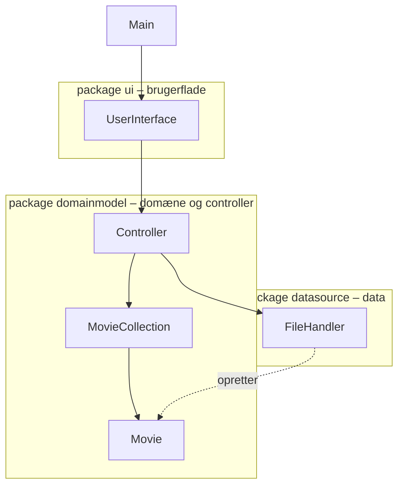

# Filmsamling del 8 – Code review og packages

> Del af det samlede [Filmsamling-projekt](readme.md). Laves **mandag 02-11** og **bør være
> færdig inden tirsdag 03-11**.

## Beskrivelse

Filmsamlingen har fået mange nye ting på to uger: tests, datoer, exceptions, filer. Hver del har
lagt et lag oven på det forrige, og nu er det tid til at rydde op, før den sidste del – og før en
anden gruppe skal læse jeres kode på fredag.

Dagen har to dele:

1. **Code review** – I bytter kode med en anden gruppe og gennemgår hinandens projekter efter
   [review-skemaet](kode-review.md). Så får I et par friske øjne på jeres kode, og I øver jer til
   det store review fredag 06-11.
2. **Refaktorering** – I retter det, reviewet fandt, og deler koden op i tre **packages**:
   brugerflade, domæne og data.

Husk, hvad refaktorering er (fra [Adventure del 1 – refactor](../adventure/del-1-refactor.md)):
at ændre kodens **struktur** uden at ændre, hvad den **gør**. Brugeren må ikke kunne se nogen
forskel. Og nu har I noget, I ikke havde i Adventure: **tests**, der fortæller jer med det samme,
hvis I kom til at ændre opførslen.

## Læringsmål

Når du er færdig med denne del, skal du kunne:

* gennemføre et code review efter et skema og give saglig, konkret feedback
* modtage feedback på din kode og omsætte den til rettelser
* forklare, hvad en **package** er, og hvorfor man deler et program i **lag**
* flytte klasser mellem packages i IntelliJ og rette `import` og synlighed
* bruge testene til at vise, at en refaktorering ikke har ændret programmets opførsel

---

## 1. Code review med en anden gruppe

Underviseren parrer grupperne. De to grupper sidder sammen – **hele gruppe mod hele gruppe** – og
reviewer hinandens kode på skift, præcis som fredag 06-11 (se
[review-skemaet](kode-review.md#fredag-06-11-reviewet)). I behøver ikke nå hele skemaet i dag. Tag
disse afsnit:

* **GitHub** (hele afsnittet)
* **Klasser** for `Movie` og `UserInterface`
* **Tests** (hele afsnittet)

Brug ca. 45 minutter pr. runde. Skriv jeres fund ned, og giv dem til den anden gruppe (se
[Aflevering af reviewet](kode-review.md#aflevering-af-reviewet)).

> **Et review handler om koden – ikke om personerne.** "Metoden `doStuff` siger ikke, hvad den
> gør" er brugbart. "I er dårlige til navne" er ikke. Og husk at sige det, der er godt – det er
> også feedback.

Når I har fået reviewet af jeres egen kode tilbage: læs det sammen, og lav en liste over det, I vil
rette. Ret det, **før** I flytter noget i packages – ellers bliver det svært at se, hvad der er
ændret hvorfor.

---

## 2. Packages

### User story

**US15 – Lag i koden** *(technical story)*

> Som udvikler vil jeg have koden delt i packages efter lag, så det er tydeligt, hvilke klasser der
> hører til brugerfladen, domænet og data – og så en ny udvikler hurtigt kan finde rundt.

* Klasserne ligger i tre packages: `ui`, `domainmodel` og `datasource`.
* Programmet opfører sig **nøjagtig** som før.
* Alle tests ligger i den package, der svarer til den klasse, de tester, og de er grønne.

### Hvad er en package?

En package er en **mappe med klasser**, der hører sammen. I har brugt dem hele semestret: én
package pr. undervisningsdag. Java selv er fuld af dem – `Scanner` ligger i `java.util`, `File` i
`java.io`, `LocalDate` i `java.time`.

I et program bruger man packages til at dele koden i **lag**, hvor hvert lag har sit ansvar:



| Package | Indeholder | Ved noget om |
|---|---|---|
| `ui` | `UserInterface` | tastatur og skærm |
| `domainmodel` | `Controller`, `MovieCollection`, `Movie` | film og reglerne for dem |
| `datasource` | `FileHandler` | filen |
| – | `Main` | ingenting – starter bare programmet |

Pilene går **nedad**: `ui` kender `domainmodel`, men `domainmodel` kender ikke `ui`. Ville I lave en
grafisk brugerflade i stedet for konsollen, skulle I kun udskifte `ui`. Ville I gemme i en database
i stedet for en fil, skulle I kun udskifte `datasource`. (`FileHandler` kender dog `Movie` – den
skal jo oprette film. Det er i orden på 1. semester.)

`Controller` ligger sammen med domæneklasserne i `domainmodel`. I større programmer får
controlleren ofte sit eget lag, men her er det nok med tre.

### Hvad ændrer sig i koden?

**Første linje i hver fil** fortæller, hvilken package klassen ligger i:

```java
package domainmodel;
```

**Klasser i andre packages skal importeres** – ligesom `java.util.ArrayList`:

```java
package ui;

import domainmodel.Controller;
import domainmodel.Movie;

import java.util.ArrayList;
import java.util.Scanner;
```

**Synlighed betyder noget nu.** En klasse, constructor eller metode **uden** `public` (og uden
`private`) kan kun ses **inde i sin egen package**. Så længe alt lå samme sted, var det ligegyldigt.
Nu giver det en kompileringsfejl, hvis `UserInterface` kalder en metode i `Controller`, der har
glemt sit `public`.

`Main` bliver liggende direkte i `src/main/java` – uden package – og importerer `UserInterface`:

```java
import ui.UserInterface;

public class Main {
    public static void main(String[] args) {
        UserInterface ui = new UserInterface();
        ui.startProgram();
    }
}
```

Testene skal ligge i en package med **samme navn** som den klasse, de tester:
`src/test/java/domainmodel/MovieCollectionTest.java` og
`src/test/java/datasource/FileHandlerTest.java`.

Sådan ser projektet ud bagefter:

```text
filmsamling/
├── pom.xml
├── README.md
├── docs/
│   ├── furps.md
│   └── klassediagram.md
└── src/
    ├── main/java/
    │   ├── Main.java
    │   ├── ui/
    │   │   └── UserInterface.java
    │   ├── domainmodel/
    │   │   ├── Controller.java
    │   │   ├── Movie.java
    │   │   └── MovieCollection.java
    │   └── datasource/
    │       └── FileHandler.java
    └── test/java/
        ├── domainmodel/
        │   ├── MovieCollectionTest.java
        │   └── MovieTest.java
        └── datasource/
            └── FileHandlerTest.java
```

---

## Anbefalet procedure

### Flyt klasser uden at få konflikter

At flytte klasser ændrer **alle** filer på én gang – første linje, imports, måske synlighed. Hvis
nogen i gruppen samtidig retter i `UserInterface`, får I en stor konflikt. Så gør det sådan:

1. **Alle** committer og pusher det, de har – også review-rettelserne.
2. **Én person** puller og laver flytningen. De andre **ændrer ingenting** imens – brug tiden til
   at læse op på [del 9](del-9-sortering.md), eller sid med ved skærmen.
3. Personen, der flytter, gør det med IntelliJ:
   * Højreklik på `src/main/java` → **New → Package** → `ui`. Gentag for `domainmodel` og
     `datasource`.
   * Træk hver klasse over i sin package i projektvinduet (eller markér den og tryk
     <kbd>F6</kbd> – **Refactor → Move**). IntelliJ retter selv `package`-linjen og alle `import`s.
     Se [Move refactorings](https://www.jetbrains.com/help/idea/move-refactorings.html).
   * Gør det samme med testene under `src/test/java`.
4. Ret de kompileringsfejl, der er tilbage – typisk en manglende `public`.
5. Kør **alle tests**. Kør programmet og prøv hvert menuvalg. Tjek, at `movies.csv` stadig
   indlæses.
6. Commit (`US15: klasserne delt i packages ui, domainmodel og datasource`) og push.
7. **Nu** puller alle de andre.

> Tests er jeres sikkerhedsnet her. Er de grønne før flytningen og grønne bagefter, har I ikke
> ødelagt logikken. Er én blevet rød, så find ud af hvorfor, **før** I committer.

### Opdatér dokumentationen

Ret `docs/klassediagram.md`, så det viser de tre packages. Er der ting fra reviewet, I ikke nåede
at rette, så skriv dem som en liste i `README.md` under en overskrift som "Kendte mangler".

---

## Frivillige udvidelser

* Kig på `import`-linjerne øverst i hver fil. Importerer en klasse i `domainmodel` noget fra `ui`?
  Så går en pil den forkerte vej – find ud af, hvordan I kan vende den.
* Læs om lag og om Law of Demeter igen i [Adventure-refactor](../adventure/del-1-refactor.md). Er
  der steder i `UserInterface`, der "rækker igennem" et objekt for at nå et andet?
* Læs [Refactoring: clean your code](https://refactoring.guru/refactoring) (refactoring.guru) og
  find et "code smell" i jeres egen kode.

---

**Næste:** [Del 9 – Sortering](del-9-sortering.md)
