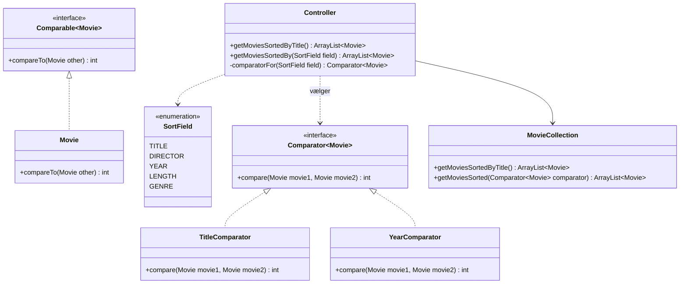

# Filmsamling del 9 – Sortering

> Del af det samlede [Filmsamling-projekt](readme.md). Laves **tirsdag 03-11** – den sidste del.
> Projektet afleveres **onsdag 04-11 kl. 23:59** – se [Aflevering](readme.md#aflevering).

## Beskrivelse

"Vis alle film" viser filmene i den rækkefølge, de blev oprettet. Med tyve film er det rodet – med
to hundrede er det ubrugeligt. Brugeren vil have dem i **alfabetisk orden**. Eller efter årstal.
Eller efter instruktør – og inden for hver instruktør efter årstal.

Java kan sortere en liste med én linje. Men Java ved ikke, hvad det vil sige, at én **film** kommer
før en anden. Det skal I fortælle den – og det gør man med et **interface**.

## Læringsmål

Når du er færdig med denne del, skal du kunne:

* forklare, hvad et **interface** er, og hvad `implements` betyder
* give en klasse en **naturlig rækkefølge** med `Comparable` og `compareTo`
* skrive en `Comparator` til en anden rækkefølge
* sortere en liste med `Collections.sort` og `list.sort(comparator)`
* *(ekstra)* sortere efter to egenskaber med `thenComparing`
* teste en comparator

---

## User stories

**US16 – Alfabetisk visning**

> Som filmentusiast vil jeg se mine film i alfabetisk orden, så jeg hurtigt kan finde en bestemt
> film i listen.

* **Når** jeg vælger "Vis alle film", **så** vises filmene sorteret efter titel – uanset store og
  små bogstaver.

**US17 – Vælg, hvad der sorteres efter**

> Som filmentusiast vil jeg selv kunne vælge, hvad filmene sorteres efter, så jeg kan se samlingen
> på den måde, der passer mig lige nu.

* Et nyt menuvalg, **Vis film sorteret efter ...**, lader mig vælge mellem titel, instruktør,
  årstal, længde og genre.
* Tekst sorteres alfabetisk, tal fra mindste til største.

US16 og US17 er kravene i dag. **US18** – at sortere efter to ting – er en frivillig
**ekstraopgave**, som står [sidst på siden](#ekstraopgave-to-sorteringer-us18).

---

## Interfaces

I [Adventure del 4](../adventure/del-4-weapons.md) lavede I en abstrakt klasse `Weapon` med
abstrakte metoder, som `MeleeWeapon` og `RangedWeapon` **skulle** implementere. `Player` kaldte
`use()` uden at vide, hvilken slags våben det var.

Et **interface** er samme idé, bare renere: en liste over metoder, som en klasse **lover** at have –
uden attributter og (næsten) uden kode. En klasse skriver `implements`, og så **skal** den have
metoderne. Til gengæld kan den bruges alle steder, hvor interfacet bruges.

Forskellen fra en abstrakt klasse (fra [05-10](../../41/01_man_2026-10-05/README.md)): en klasse kan
kun arve fra **én** klasse, men kan implementere **mange** interfaces. En abstrakt klasse siger "er
en slags"; et interface siger "kan noget". En `Movie` er ikke en slags "sammenlignelig" – men den
**kan** sammenlignes.

Java har to interfaces til sortering:

| | `Comparable<Movie>` | `Comparator<Movie>` |
|---|---|---|
| Ligger i | `java.lang` (skal ikke importeres) | `java.util` |
| Implementeres af | **`Movie` selv** | en **separat** klasse, fx `YearComparator` |
| Metode | `int compareTo(Movie other)` | `int compare(Movie movie1, Movie movie2)` |
| Giver | filmens **naturlige** rækkefølge – der er kun én | en **anden** rækkefølge – der kan være mange |
| Bruges med | `Collections.sort(list)` | `list.sort(comparator)` |

Begge metoder returnerer et **tal**:

* **negativt**, hvis den første skal stå **før** den anden
* **0**, hvis de er lige
* **positivt**, hvis den første skal stå **efter** den anden

Det er `sort`, der kalder jeres metode – mange gange, med forskellige par af film – og bruger
svarene til at bygge den sorterede liste. I skriver kun, hvordan **to** film sammenlignes.

Se [Comparable](https://docs.oracle.com/en/java/javase/21/docs/api/java.base/java/lang/Comparable.html)
og [Comparator](https://docs.oracle.com/en/java/javase/21/docs/api/java.base/java/util/Comparator.html)
i Javas dokumentation.

---

## Krav til koden



(Diagrammet viser kun det, der er **nyt** i dag. `DirectorComparator`, `LengthComparator` og
`GenreComparator` ligner `TitleComparator` og `YearComparator`. Den stiplede pil med den åbne
trekant betyder "implementerer".)

Alle de nye klasser ligger i `domainmodel`.

### Movie – den naturlige rækkefølge

```java
public class Movie implements Comparable<Movie> {

    // ... alt det, der var i forvejen

    // Filmens "naturlige" rækkefølge: alfabetisk efter titel, uanset store og små bogstaver.
    // Bruges af Collections.sort(...), når der ikke gives en Comparator med.
    @Override
    public int compareTo(Movie other) {
        return title.compareToIgnoreCase(other.title);
    }
}
```

`String` har selv `compareTo` og `compareToIgnoreCase`, der returnerer netop det negative, 0 eller
positive tal, vi skal bruge. Så vi sender bare spørgsmålet videre til titlerne.

> `other.title` virker, selv om `title` er `private`: `private` betyder "kun inde i klassen
> `Movie`" – ikke "kun inde i dette objekt".

### Comparator-klasserne

Én klasse pr. egenskab, hver i sin egen fil – `TitleComparator`, `DirectorComparator`,
`YearComparator`, `LengthComparator` og `GenreComparator`:

```java
package domainmodel;

import java.util.Comparator;

public class YearComparator implements Comparator<Movie> {

    @Override
    public int compare(Movie movie1, Movie movie2) {
        return Integer.compare(movie1.getYearCreated(), movie2.getYearCreated());
    }
}
```

`Integer.compare(a, b)` returnerer et negativt tal, 0 eller et positivt tal – præcis som
`compareTo`. (Man ser tit `return a - b;`, og det virker for årstal – men det kan give forkerte
resultater ved meget store tal. `Integer.compare` virker altid.)

De tre tekst-comparatorer bruger `compareToIgnoreCase` på den relevante getter.

### MovieCollection – sortér en kopi

```java
// Returnerer en sorteret KOPI – selve samlingen beholder sin rækkefølge
public ArrayList<Movie> getMoviesSortedByTitle() {
    ArrayList<Movie> sorted = new ArrayList<>(movies);
    Collections.sort(sorted);   // bruger Movie.compareTo
    return sorted;
}

public ArrayList<Movie> getMoviesSorted(Comparator<Movie> comparator) {
    ArrayList<Movie> sorted = new ArrayList<>(movies);
    sorted.sort(comparator);
    return sorted;
}
```

`new ArrayList<>(movies)` laver en ny liste med de **samme** film-objekter. Så kan vi sortere den,
uden at samlingens egen rækkefølge ændres – det er den, der gemmes i filen, og den, testene fra
del 5 regner med.

### Controller – vælg comparator

Brugeren vælger en egenskab. Den oversættes til en `Comparator` ét sted: i `Controller`.
Egenskaberne er en `enum`:

```java
// De egenskaber, man kan sortere filmene efter
public enum SortField {
    TITLE,
    DIRECTOR,
    YEAR,
    LENGTH,
    GENRE
}
```

```java
public ArrayList<Movie> getMoviesSortedBy(SortField field) {
    return movieCollection.getMoviesSorted(comparatorFor(field));
}

private Comparator<Movie> comparatorFor(SortField field) {
    return switch (field) {
        case TITLE -> new TitleComparator();
        case DIRECTOR -> new DirectorComparator();
        case YEAR -> new YearComparator();
        case LENGTH -> new LengthComparator();
        case GENRE -> new GenreComparator();
    };
}
```

Bemærk, at `comparatorFor` returnerer typen `Comparator<Movie>` – ikke `YearComparator`. Resten af
koden ved ikke, og behøver ikke vide, hvilken comparator den har fået. Det er polymorfi, præcis som
med `Weapon` i Adventure.

### UserInterface

* "Vis alle film" bruger `controller.getMoviesSortedByTitle()`.
* Menuvalg 8 lader brugeren vælge en egenskab. `SortField.values()` giver et array med alle
  enum-værdierne, så I kan lave den nummererede liste med en løkke – og `UserInterface` bestemmer
  selv, hvad de hedder på dansk.

```text
Vælg: 8
Sortér efter:
  1. titel
  2. instruktør
  3. årstal
  4. længde
  5. genre
Vælg: 3

Casablanca (1942)
  Instruktør: Michael Curtiz
  Genre: Drama
  Længde: 102 minutter, sort-hvid
  Sidst set: aldrig

Vertigo (1958)
  Instruktør: Alfred Hitchcock
  Genre: Thriller
  Længde: 128 minutter, farver
  Sidst set: aldrig

Psycho (1960)
  Instruktør: Alfred Hitchcock
  Genre: Horror
  Længde: 109 minutter, sort-hvid
  Sidst set: aldrig
```

---

## Tests

> **Test jeres egen kode – ikke Javas.** I skal ikke teste, at `Collections.sort` kan sortere; det
> har Java testet. I skal teste, at **jeres** comparatorer svarer rigtigt, og at **jeres** kode
> bruger dem rigtigt.

En comparator testes ved at give den to film og tjekke **fortegnet** på svaret – ikke det præcise
tal, som kan være hvad som helst negativt eller positivt:

```java
// casablanca (1942), psycho (1960) og jaws (1975) er Movie-attributter i testklassen
@Test
void yearComparatorSortsOldestFirst() {
    YearComparator comparator = new YearComparator();

    assertTrue(comparator.compare(casablanca, psycho) < 0);
    assertTrue(comparator.compare(jaws, psycho) > 0);
}
```

Sortering af en hel samling kan testes gennem `Controller` – her en `Controller`, hvor
`@BeforeEach` har tilføjet *Psycho*, *The Godfather*, *Casablanca*, *The Godfather Part II* og
*Vertigo*:

```java
@Test
void moviesSortedByYear() {
    ArrayList<Movie> sorted = controller.getMoviesSortedBy(SortField.YEAR);

    assertEquals(1942, sorted.get(0).getYearCreated());
    assertEquals(1974, sorted.get(4).getYearCreated());
}
```

`Controller` kan godt testes: den rører først filen, når `loadMovies` eller `saveMoviesIfChanged`
kaldes. Brug `controller.addMovie(...)` i `@BeforeEach`.

Mindst disse tests:

| Test | Tjekker |
|---|---|
| Hver af de fem comparatorer | at "før", "efter" (og for mindst én: "ens") giver det rigtige fortegn |
| `TitleComparator` | at store og små bogstaver er ligegyldige |
| `Movie.compareTo` | at den naturlige rækkefølge er efter titel |
| `getMoviesSortedByTitle` | at listen kommer i alfabetisk orden |
| sortering ændrer ikke samlingen | at `getMovies()` stadig har den oprindelige rækkefølge bagefter |
| `getMoviesSortedBy` | at listen kommer i rækkefølge efter den valgte egenskab, fx årstal |

---

## Anbefalet procedure

Comparatorerne ligger i hver sin fil, så de kan skrives **parallelt** uden konflikter:

1. **Én person:** `Comparable` i `Movie`, `getMoviesSortedByTitle` og US16 i `UserInterface`.
   Commit og push – så er "Vis alle film" sorteret.
2. **Én eller to personer:** de fem comparatorer og `ComparatorTest` – del dem imellem jer.
3. **Én person:** `SortField`, `getMoviesSorted` i `MovieCollection`, metoderne i `Controller` og
   menuvalg 8 (US17). Er der tid tilovers, så tag [ekstraopgaven](#ekstraopgave-to-sorteringer-us18).
4. **Sammen, til sidst:** kør alle tests og hele programmet igennem. Opdatér klassediagrammet og
   `README.md`. Tjek listen under [Aflevering](readme.md#aflevering).

---

## Ekstraopgave: to sorteringer (US18)

> **Ekstraopgave – ikke et krav.** Tag den, når US16 og US17 virker og er testet.

**US18 – Sortér efter to ting**

> Som filmentusiast vil jeg kunne sortere efter én ting og derefter en anden, fx instruktør og
> derefter årstal, så jeg kan se hver instruktørs film i rækkefølge.

* Efter det første valg kan jeg vælge et andet – eller "ingen".
* Film, der er **ens** på det første, sorteres efter det andet. Film, der er forskellige på det
  første, sorteres **kun** efter det første.

`Controller` får en ekstra `getMoviesSortedBy` med to parametre (et overload):

```java
// Sorterer efter primary – og efter secondary blandt film, der er ens på primary
public ArrayList<Movie> getMoviesSortedBy(SortField primary, SortField secondary) {
    Comparator<Movie> comparator = comparatorFor(primary).thenComparing(comparatorFor(secondary));
    return movieCollection.getMoviesSorted(comparator);
}
```

`thenComparing` er en metode, som alle `Comparator`-objekter har. Den laver en **ny** comparator,
der først spørger den første – og kun hvis den svarer 0 (ens), spørger den anden.

I menuvalg 8 spørger programmet så om en egenskab mere, hvor `0` betyder "ingen":

```text
Vælg: 8
Sortér først efter:
  1. titel
  2. instruktør
  3. årstal
  4. længde
  5. genre
Vælg: 2
Og derefter efter:
  1. titel
  2. instruktør
  3. årstal
  4. længde
  5. genre
  0. Ingen
Vælg: 3

Vertigo (1958)
  Instruktør: Alfred Hitchcock
  Genre: Thriller
  Længde: 128 minutter, farver
  Sidst set: aldrig

Psycho (1960)
  Instruktør: Alfred Hitchcock
  Genre: Horror
  Længde: 109 minutter, sort-hvid
  Sidst set: aldrig

Casablanca (1942)
  Instruktør: Michael Curtiz
  Genre: Drama
  Længde: 102 minutter, sort-hvid
  Sidst set: aldrig
```

Hitchcock før Curtiz (instruktør), og Hitchcocks to film med den ældste først (årstal). Bemærk,
at instruktøren sorteres på **hele navnet** som tekst – altså på fornavnet: *Alfred* Hitchcock før
*Michael* Curtiz.

Test det på en hel samling:

```java
@Test
void moviesSortedByDirectorAndThenYear() {
    ArrayList<Movie> sorted = controller.getMoviesSortedBy(SortField.DIRECTOR, SortField.YEAR);

    // Hitchcock (Vertigo 1958, Psycho 1960), Coppola (1972, 1974), Curtiz
    assertEquals("Vertigo", sorted.get(0).getTitle());
    assertEquals("Psycho", sorted.get(1).getTitle());
    assertEquals("The Godfather", sorted.get(2).getTitle());
    assertEquals("The Godfather Part II", sorted.get(3).getTitle());
    assertEquals("Casablanca", sorted.get(4).getTitle());
}
```

---

## Frivillige udvidelser

### Omvendt rækkefølge

Lad brugeren vælge **faldende** rækkefølge – nyeste film først. Alle `Comparator`-objekter har
metoden `reversed()`.

### Sortér efter "sidst set"

Lav en `LastWatchedComparator`. Hvad skal der ske med de film, der aldrig er set – og som har
`null` som dato? Skal de stå først eller sidst?

### Din egen thenComparing

Skriv en klasse `ThenComparator implements Comparator<Movie>`, der får to comparatorer i
constructoren og gør det samme som `thenComparing`. Så ved I præcis, hvad der sker indeni.

### Sorterede søgeresultater

Lad også søgeresultaterne blive vist i alfabetisk orden.

---

**Tilbage til:** [Filmsamling-projektet](readme.md) · **Derefter:** [Code review](kode-review.md)
